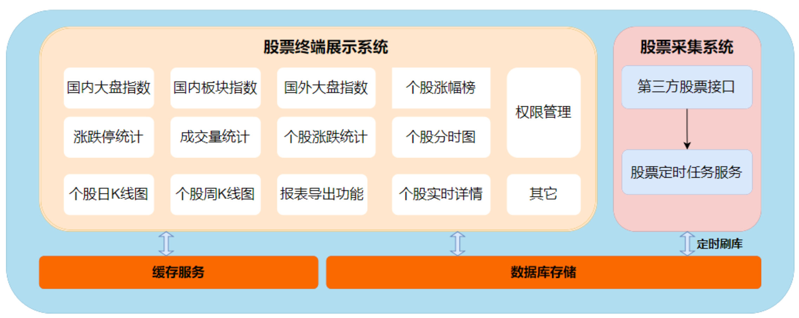
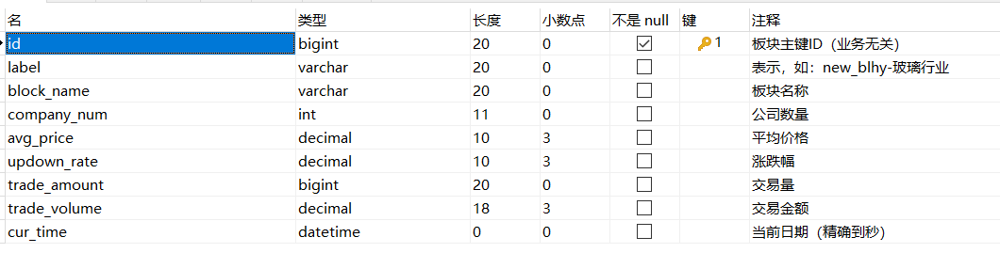

# 项目整体介绍

**项目描述**


**项目内容**

- 利用Spring Boot、Spring MVC、MyBatis、Swagger、hutool、RestTemplate等工具构建完整的基于控制层、服务层、持久层的三层业务模型
- 利用Java多线程并发分片获取采集个股流水数据提高数据采集效率，避免主线程占用问题
- 利用Rabbit MQ同步最新股票数据，避免每次数据交互都需要与MySQL交互，降低数据负载
- 利用ShardingSphere对股票数据按年份月份进行分库分表，以解决……
- 利用Redis、caffeinecache实现二层缓存机制
- 利用JWT实现安全的无状态登录，解决cookies-session登录机制……问题
- 利用spring security实现用户认证鉴权问题，解决
- 利用Spring cache实现……

**项目收获**


## 1. 项目介绍

### 项目概述

- 今日指数是基于股票实时交易产生的**数据分析产品**，旨在为特定用户和机构提供定制化的股票数据分析和展示服务;
- 项目的核心功能以数据分析和展示为主，功能涵盖了A股大盘实时指数展示、涨幅榜、个股涨跌、个股秒级行情、实时日K线行情等;


> 参考网站：
>
> http://q.10jqka.com.cn/(同花顺)
> https://xueqiu.com/(雪球)
> https://finance.sina.com.cn/stock/(新浪)
> http://quote.eastmoney.com/(东方财富)

## 2、项目架构

### 3.1 今日指数技术选型


- 前端技术

| 名称     | 技术                      | 场景                                          |
| -------- | ------------------------- | --------------------------------------------- |
| 基本骨架 | vue-cli+vue+element+axios | 前端核心技术架构                              |
| 报表     | echartsjs                 | 股票数据报表展示，比如折线图、柱状图、K线图等 |
| 前端支持 | node webpack              | 脚手架支持                                    |

- 后端技术栈

| 名称          | 技术                                                         | 场景                                       |
| ------------- | ------------------------------------------------------------ | ------------------------------------------ |
| 基础框架      | SpringBoot、Mybatis、SpringMVC                               | 项目基础骨架                               |
| 安全框架      | SpringSecurity+Jwt+Token                                     | 认证与授权                                 |
| 缓存          | Redis+SpringCache                                            | 数据缓存                                   |
| excel表格导出 | EasyExcel                                                    | 导出股票相关热点数据                       |
| 小组件        | Jode-Time 、hutool 、Guava 、HttpClient \| RestTemplate 、线程池 | 生产力工具                                 |
| 定时任务      | Xxljob                                                       | 定时采集股票数据                           |
| 分库分表      | Sharding-JDBC                                                | 股票数据分库分表方案落地                   |
| 前端资源部署  | Nginx+Linux                                                  | 前端静态资源部署;<br>代理访问后端功能接口; |

### 3.2 核心业务介绍



- 股票采集系统
  - 核心功能是周期性采集股票数据，并刷入数据库；
  - 借助xxljob提供完善的任务监控机制；
- 国内指数服务
  - 主要统计国内大盘实时数据信息；
- 板块分析服务
  - 主要统计国内各大行业板块行情数据信息；
- 涨幅榜展示功能
  - 根据个股涨幅排序，提供热点股票数据展示；
- 涨停跌停数展示功能
  - 统计股票涨停跌停的数量；
- 成交量对比展示功能
  - 综合对比真个股市成交量的变化趋势；
- 个股详情展示功能
  - 包含分时行情、日k线、周K线图、个股描述服务等
- 报表导出服务
  - 根据涨幅排序导出热点股票数据信息；
- 其它
  - 用户信息管理；
  - 角色管理；
  - 权限管理等


# 一、项目整体环境搭建

## 1. 数据库环境

- 大盘和板块相关表

  

  

- 个股相关表

  

- 权限相关表

  

- 日志表

  

> 注意事项
>
> 1）表与表之间的关系尽量通过业务逻辑维护，而不是通过使用数据库外键约束，原因如下：
>
> ​	1.性能问题：外键约束会使约束的表之间做级联检查，导致数据库性能降低；
>
> ​	2.并发问题：外键约束的表在事务中需要获取级联表的锁，才能进行写操作，这更容易造成死锁问题；（数据库自身存在死锁检查，当放生死锁时，会自动终端另一方的事务）
>
> ​	3.扩展性问题：数据分库分表时，加大了拆分的难度；
>
> 2）**docker容器中的数据库注意时区问题**；
>
> 启动并配置docker的mysql容器
>
> ```bash
> docker run -d \
>     --restart=always \
>     -p 3306:3306 \
>     --name mysql2 \
>     -v /tmp/mysql/data:/var/lib/mysql \
>     -e MYSQL_ROOT_PASSWORD=root \
>     -e TZ=Asia/Shanghai \
>     --network mynetwork \
>     mysql:latest \
>     --character-set-server=utf8mb4 \
>     --collation-server=utf8mb4_unicode_ci \
>     --default-time_zone='+8:00'
> 
> docker run -d \
>     --restart=always \
>     -p 3306:3306 \
>     --name mysql \
>     -v /tmp/mysql/data:/var/lib/mysql \
>     -e MYSQL_ROOT_PASSWORD=root \
>     -e TZ=Asia/Shanghai \
>     mysql:latest \
>     --character-set-server=utf8mb4 \
>     --collation-server=utf8mb4_unicode_ci \
>     --default-time_zone='+8:00'
> 
> ```
>
> 1. **`docker run`**：
>    - 启动一个新的 Docker 容器。
>
> 2. **`--restart=always`**：
>    - 该选项用于配置容器自动重启策略。`always` 表示无论容器是否崩溃、Docker 是否重启，容器都会自动重启，确保 MySQL 服务的高可用性。
>
> 3. **`-p 3306:3306`**：
>    - 将主机的 **3306** 端口映射到容器的 **3306** 端口，这是 MySQL 的默认端口。
>    - 主机可以通过访问 `localhost:3306` 来与容器中的 MySQL 数据库进行通信。
>
> 4. **`--name mysql`**：
>    - 设置容器的名称为 `mysql`，便于管理和操作容器。
>
> 5. **`-v /tmp/mysql/data:/var/lib/mysql`**：
>    - 将主机目录 `/tmp/mysql/data` 挂载到容器的 `/var/lib/mysql` 目录中。
>    - `/var/lib/mysql` 是 MySQL 的默认数据目录，这样 MySQL 的数据将持久化在主机上，即使容器重启或删除，数据仍然存在。
>
> 6. **`-e MYSQL_ROOT_PASSWORD=root`**：
>    - 通过环境变量 `MYSQL_ROOT_PASSWORD` 设置 MySQL 数据库的 root 用户密码为 `root`。
>
> 7. **`-e TZ=Asia/Shanghai`**：
>    - 设置容器的时区为 **Asia/Shanghai**，以确保 MySQL 的时间与中国上海的时区同步。
>
> 8. **`-d mysql:5.7.25`**：
>    - 以守护进程模式（后台）启动容器，使用 MySQL 的 `5.7.25` 版本镜像。
>
> 9. **`--character-set-server=utf8mb4`**：
>    - 配置 MySQL 使用 `utf8mb4` 作为服务器的默认字符集。
>    - `utf8mb4` 是 MySQL 支持的完整 UTF-8 字符集，支持存储 Emoji 等特殊字符。
>
> 10. **`--collation-server=utf8mb4_unicode_ci`**：
>     - 配置 MySQL 使用 `utf8mb4_unicode_ci` 作为服务器的默认排序规则，确保字符按照 Unicode 规则进行排序和比较。
>
> 11. **`--default-time_zone='+8:00'`**：
>     - 设置 MySQL 的默认时区为东八区（`+8:00`），与中国标准时间保持一致。
> 12. --network mynetwork \要放在容器参数前
>
> 该命令运行了一个 MySQL 5.7.25 容器，设置了字符集、时区、密码等配置，并通过主机与容器的数据目录绑定来实现数据持久化。容器将自动在系统重启时启动，并通过映射的端口允许外部访问。

配置好环境之后，由于我们暂时不太关系数据库中的信息，所以直接使用预先构建好的mysql脚本，初始化数据库中的数据。

## 2. 后端环境搭建

后端工程工程结构：

拥有两个主要功能：采集和展示，那其中两个有公共部分，也就是持久层部分和数据库的查询与写入，都使用到了与股票相关的实体对象。那么我们将其抽象出一个公共部分，作为一个模块。三个工程由一个父工程管理。


构建过程中的注意：

1. 更改maven的setting.xml
2. 更改字符编码UTF-8
3. 父工程不需要代码，删去src
4. lombok插件版本问题需要注意，如果没生效那么@Data注解将失效

### 父工程构建

首先构建父工程：

基于maven构建stock_parent 父工程：

父工程在 Maven 多模块项目中扮演着非常关键的角色，主要负责统一管理子模块的版本、依赖、构建配置和其他共享元素。以下是父工程的核心功能和组成部分的详细解释：

1. **聚合子模块**

父工程通过 `<modules>` 标签聚合了多个子模块。这使得整个项目可以作为一个单一的实体来构建和管理，而不是独立管理每个子模块。例如，当在父项目目录下执行 `mvn clean install` 命令时，Maven 会递归地在所有子模块上执行这些命令。

```xml
<modules>
    <module>stock_common</module>
    <module>stock_backend</module>
    <module>stock_job</module>
</modules>
```

2. **版本管理**

父工程通过 `<dependencyManagement>` 部分定义了项目中所有依赖的版本号。这样，子模块在声明依赖时不需要指定版本号，保证了整个项目依赖的一致性和可管理性。当需要更新依赖版本时，只需在父项目中修改，所有子模块将自动使用新的版本。

```xml
<dependencyManagement>
    <dependencies>
        <dependency>
            <groupId>org.springframework.boot</groupId>
            <artifactId>spring-boot-starter-parent</artifactId>
            <version>${spring-boot.version}</version>
            <type>pom</type>
            <scope>import</scope>
        </dependency>
        <!-- 其他依赖管理 -->
    </dependencies>
</dependencyManagement>
```

3. **插件管理**

与依赖管理类似，父工程还可以用 `<pluginManagement>` 来统一管理 Maven 插件的版本和配置。这确保了构建过程的一致性，避免了因插件配置不一致而导致的构建问题。

```xml
<pluginManagement>
    <plugins>
        <plugin>
            <groupId>org.springframework.boot</groupId>
            <artifactId>spring-boot-maven-plugin</artifactId>
            <version>${spring-boot.version}</version>
            <!-- 配置详情 -->
        </plugin>
        <!-- 其他插件管理 -->
    </plugins>
</pluginManagement>
```

4. **属性管理**

父工程通常还包括一系列 `<properties>`，这些属性定义了整个项目构建中使用的通用属性，如编码方式、Java 编译版本等。

```xml
<properties>
    <project.build.sourceEncoding>UTF-8</project.build.sourceEncoding>
    <maven.compiler.source>8</maven.compiler.source>
    <maven.compiler.target>8</maven.compiler.target>
    <!-- 其他属性 -->
</properties>
```

5. **统一构建配置**

父工程还可以定义统一的构建配置，如资源文件的处理、编译器配置等，这些都通过 `<build>` 标签进行设置。

```xml
<build>
    <!-- 其他构建相关配置 -->
</build>
```

使用父工程的好处

- **简化依赖管理**：通过在父工程中集中管理依赖，可以避免子模块间的版本冲突，易于依赖的升级和维护。
- **统一构建过程**：父工程提供了一个统一的构建配置，使得所有子模块能够以一致的方式进行构建。
- **提高可维护性**：父工程作为项目结构的核心，提高了整个项目的组织性和可维护性。

使用 Maven 的父工程结构，可以显著提升大型项目的管理效率和降低维护复杂度。

### Common工程构建

common工程主要负责抽象出采集端和展示端的公共功能部分，暂时来说就是对数据库的操作，即DAO层。那么其暂时目录如下：


主要有三个部分：

- mapper：定义DAO层向外提供的接口方法
  - 

- pojo.entity：和数据库中资源对应的类，需要有getter、setter，这里用注解@Date构建（插件：lombok）
- mapper的xml资源：对应mapper提供接口方法的具体sql实现
  - 

### Backend工程构建

backend工程是应用与用户交互的主要模块，其应该担任控制层和服务层（持久层由common担任）。控制层即处理来自用户的请求，找到对应处理请求的控制器，并与服务层配合。服务层处理具体的业务请求，调用DAO层。


具体到目录中：

- controller下对应控制器

- service下构建接口以及具体实现

- resources下的application.yml：配置文件

- VO：Value Object（值对象）

  - **值对象** 是用于表示某种数据的对象，通常用于展示层（View Layer），封装了与前端进行交互的数据结构。`VO` 是一种只携带数据的对象，主要用于传递数据。

  典型特点：

  - 不包含业务逻辑。
  - 一般用于表示层（比如前端 UI），以便将数据呈现给用户。
  - 可以是数据库查询结果的封装，也可以是经过业务逻辑处理后的数据。

  具体到该项目中，就是返回和请求的数据格式，比如说一些响应码，以及数据封装格式。

## 3. 前端环境搭建

前端开发环境主要注意几个点：

- npm的版本问题
- npm的镜像源问题

前端工程依赖安装与启动：

~~~shell
npm install # 若安装依赖过慢，可安装cnpm并下载安装依赖
~~~


~~~shell
npm run dev # 启动工程
~~~

浏览器跨域问题：

- 只要请求的协议、端口、ip域名不一致，浏览器就拒绝访问对应的资源；
- 浏览器的同源策略：访问安全问题；

在stock_front_admin\src\settings.js文件下配置跨域：

        proxy: {// 跨域请求配置
            "/api": {
                secure: false,// 关闭安全检测，默认请求 https
                //target: "http://192.168.188.131:8091",
                target: "http://localhost:8091",
                changeOrigin: true,
                // pathRewrite: {"^/api" : ""},
            }
        },

# 二、项目总体流程讲解

当请求发生时，Spring Boot 与 MyBatis 各个部分会紧密配合完成从请求到数据返回的整个过程。下面我会详细讲解每一层是如何协作的，并加入 **`sysUserMapper.xml`** 作为 MyBatis SQL 配置文件的一部分。

## 整体流程概述

当一个 HTTP 请求发送到 `UserController` 时，Spring Boot 处理这个请求，通过控制器层 (`UserController`) 传递请求到服务层 (`UserService`)，再由服务层调用数据访问层 (`SysUserMapper`)，最终查询数据库中的 `sys_user` 表。数据库查询结果会通过 MyBatis 自动映射为 `SysUser` 对象，并逐层返回，最终作为 JSON 响应返回给客户端。

## 详细的请求处理过程：

### 1. **客户端发起请求**

客户端向服务器发起 HTTP 请求，目标 URL 是 `/api/user/{userName}`，请求方法是 `GET`。例如，用户请求：

```http
GET /api/user/john
```

### 2. **控制器（UserController）处理请求**

当请求到达服务器时，Spring Boot 的 **DispatcherServlet** 会首先拦截请求，并根据请求的 URL 将其转发到对应的控制器方法中。

```java
@GetMapping(value = "/user/{userName}", produces = MediaType.APPLICATION_JSON_VALUE)
public SysUser getUserByUserName(@PathVariable("userName") String name) {
    return userService.getUserByUserName(name);
}
```

**`@GetMapping("/user/{userName}")`** 注解告诉 Spring 框架，该方法会处理类似 `/user/{userName}` 这样的 `GET` 请求，其中 `userName` 是动态路径变量。通过 `@PathVariable`，Spring 将 URL 中的 `userName` 提取并传递给控制器方法 `getUserByUserName()`。

- **输入**：用户请求 `/api/user/john`。
- **输出**：调用 `UserService` 获取指定用户名为 `john` 的用户信息。

### 3. **服务层（UserService 和 UserServiceImpl）调用业务逻辑**

控制器层通过依赖注入（`@Autowired`）调用服务层 `UserService`，然后调用它的实现类 `UserServiceImpl`。

```java
@Override
public SysUser getUserByUserName(String userName) {
    return sysUserMapper.findUserInfoByUserName(userName);
}
```

在 `UserServiceImpl` 中，服务层调用数据访问层的 `SysUserMapper`，执行与数据库的交互操作，获取用户数据。

- **输入**：传入的 `userName`（例如 `john`）。
- **输出**：从 `SysUserMapper` 返回一个 `SysUser` 对象。

### 4. **数据访问层（SysUserMapper）执行数据库查询**

`SysUserMapper` 是一个 MyBatis `Mapper` 接口，定义了数据库查询操作。它负责通过 `sysUserMapper.xml` 文件中的 SQL 语句与数据库交互，并返回结果。

```java
SysUser findUserInfoByUserName(@Param("userName") String userName);
```

`SysUserMapper` 的 `findUserInfoByUserName()` 方法通过 MyBatis 自动与数据库查询逻辑关联，MyBatis 会根据 `sysUserMapper.xml` 文件中的 SQL 语句来执行实际的查询操作。

### 5. **`sysUserMapper.xml`：MyBatis SQL 映射文件**

`sysUserMapper.xml` 是 MyBatis 的映射文件，它为 `SysUserMapper` 接口中的方法定义了具体的 SQL 查询语句。这个文件通常位于 `resources/mapper/` 目录下。

例如，`sysUserMapper.xml` 文件可能如下：

```xml
<?xml version="1.0" encoding="UTF-8" ?>
<!DOCTYPE mapper PUBLIC "-//mybatis.org//DTD Mapper 3.0//EN"
  "http://mybatis.org/dtd/mybatis-3-mapper.dtd">

<mapper namespace="com.async.stock.mapper.SysUserMapper">

    <!-- 查询用户信息 -->
    <select id="findUserInfoByUserName" parameterType="String" resultType="com.async.stock.pojo.entity.SysUser">
        SELECT id, username, password, phone, real_name AS realName, nick_name AS nickName, email,
               status, sex, deleted, create_id AS createId, update_id AS updateId, create_where AS createWhere,
               create_time AS createTime, update_time AS updateTime
        FROM sys_user
        WHERE username = #{userName}
    </select>

</mapper>
```

- **`<mapper namespace="com.async.stock.mapper.SysUserMapper">`**：指定这是与 `SysUserMapper` 接口相关联的 MyBatis 映射文件。
- **`<select>`**：定义 SQL 查询语句，用于从 `sys_user` 表中根据 `username` 查询用户信息。`id="findUserInfoByUserName"` 与 `SysUserMapper` 接口中的方法名一一对应。
- **`#{userName}`**：使用 MyBatis 的参数占位符，将 `userName` 参数绑定到 SQL 查询语句中。

### 6. **数据库查询结果映射为 `SysUser` 对象**

MyBatis 自动将查询结果映射为 `SysUser` 对象。根据 `sysUserMapper.xml` 中定义的 `resultType="com.async.stock.pojo.entity.SysUser"`，查询到的数据会映射到 `SysUser` 对象的字段中，如 `id`, `username`, `realName` 等。

- **输入**：执行 SQL 查询，返回用户数据（例如 `john` 的信息）。
- **输出**：将查询结果映射为 `SysUser` 对象。

### 7. **服务层和控制器层返回结果**

- `SysUserMapper` 将查询到的 `SysUser` 对象返回给 `UserServiceImpl`。
- `UserServiceImpl` 再将 `SysUser` 对象返回给 `UserController`。

### 8. **控制器返回 JSON 响应**

控制器接收到 `SysUser` 对象后，通过 `@RestController` 自动将该对象序列化为 JSON 格式，并返回给客户端。

- **最终结果**：客户端收到返回的 JSON 格式的用户信息：

```json
{
  "id": 1,
  "username": "john",
  "password": "hashed_password",
  "phone": "123456789",
  "realName": "John Doe",
  "nickName": "Johnny",
  "email": "john@example.com",
  "status": 1,
  "sex": 1,
  "deleted": 0,
  "createId": 10,
  "updateId": 12,
  "createWhere": 1,
  "createTime": "2024-01-01T12:00:00",
  "updateTime": "2024-01-10T15:30:00"
}
```

## 代码关系总结：

1. **Controller（控制器层）**：
   - 接收客户端请求。
   - 调用 `UserService` 获取用户信息。
   - 返回序列化后的 JSON 响应。

2. **Service（服务层）**：
   - 处理业务逻辑。
   - 调用 `SysUserMapper` 获取数据库中的用户数据。
   - 返回 `SysUser` 对象。

3. **Mapper（数据访问层）**：
   - 定义数据查询操作，直接与数据库表交互。
   - 通过 MyBatis 映射 SQL 语句到 Java 方法。

4. **`sysUserMapper.xml`（SQL 映射文件）**：
   - 定义具体的 SQL 查询语句，MyBatis 自动执行并将结果映射为 Java 对象。

5. **SysUser（实体类）**：
   - 承载数据库中的用户数据。
   - 作为服务层与控制器层之间传递的载体。
   - 最终被序列化为 JSON 格式返回给客户端。

## 流程总结：

1. **请求接收**：控制器接收到 `GET /user/{userName}` 请求。
2. **服务层调用**：控制器调用服务层 `UserService` 获取用户信息。
3. **数据查询**：服务层通过 MyBatis 的 `SysUserMapper` 调用数据库查询。
4. **SQL 执行**：MyBatis 通过 `sysUserMapper.xml` 中定义的 SQL 语句查询数据库。
5. **结果映射**：查询结果映射为 `SysUser` 实体类对象。
6. **返回结果**：控制器层将 `SysUser` 对象转换为 JSON 并返回给客户端。

整个系统通过 Spring Boot 和 MyBatis 实现了分层架构，各个部分各司其职，保持了良好的解耦性。

# 三、用户登录功能实现-01用户名-密码

同样，我们发送用户登录报文，需要先明确请求和响应报文应该具有的格式：

## 1. 访问接口定义

~~~json
请求接口：/api/login
请求方式：POST
请求数据示例：
   {
       username:'zhangsan',//用户名
       password:'666',//密码
       //code:'1234' //校验码
    }
响应数据：
    {
        "code": 1,//成功1 失败0
        "data": { //data为响应的具体数据，不同的接口，data数据格式可能会不同
                "id":"1237365636208922624",
                "username":"zhangsan",
                "nickName":"xiaozhang",
                "phone":"1886702304"
        }
    }
~~~

那么于是就要在后端项目中封装对应的请求和响应的vo值对象

com.async.stock.vo
                  ├── req  # 请求数据封装类
                  └── resp # 响应数据封装类


> vo对象直接在：**day01\资料\vo导入即可**；

~~~java
package com.async.stock.vo.req;

import lombok.Data;

/**
 * @author by itheima
 * @Date 2021/12/30
 * @Description 登录请求vo
 */
@Data
public class LoginReqVo {
    /**
     * 用户名
     */
    private String username;
    /**
     * 密码
     */
    private String password;
    /**
     * 验证码
     */
    //private String code;
}
~~~

登录响应vo工程导入：day01\资料\LoginRespVo.java

~~~java
package com.async.stock.vo.resp;

import lombok.AllArgsConstructor;
import lombok.Builder;
import lombok.Data;
import lombok.NoArgsConstructor;

/**
 * @author by async
 * @Date 2021/12/24
 * @Description 登录后响应前端的vo
 */
@Data
@NoArgsConstructor
@AllArgsConstructor
@Builder
public class LoginRespVo {
    /**
     * 用户ID
     * 将Long类型数字进行json格式转化时，转成String格式类型,避免精读丢失
     */
    @JsonSerialize(using = ToStringSerializer.class)
    /**
     * 电话
     */
    private String phone;
    /**
     * 用户名
     */
    private String username;
    /**
     * 昵称
     */
    private String nickName;

}
~~~

## 2. 密码加密匹配器

后端数据库中不能直接存储密码明文，而是要存储加密的密码。这里由一个密码加密和校验工具包实现。它的原理是每次加密生成一个随机的salt值，同明文一起加密（其实上是哈希）。然后再验证阶段，将密文中的salt和密码密文提取（所以应该是有单独哈希salt值，因为能提取出两部分）把待验证密码和salt加密（哈希），看是否与密文相同。

引入依赖资源：

~~~xml
<!--密码加密和校验工具包-->
<dependency>
    <groupId>org.springframework.security</groupId>
    <artifactId>spring-security-crypto</artifactId>
</dependency>
~~~

配置密码加密匹配bean：

~~~java
package com.async.stock.config;

import org.springframework.context.annotation.Bean;
import org.springframework.context.annotation.Configuration;
import org.springframework.security.crypto.bcrypt.BCryptPasswordEncoder;
import org.springframework.security.crypto.password.PasswordEncoder;

/**
 * @author by async
 * @Description 定义公共配置类
 */
@Configuration
public class CommonConfig {
    /**
     * 密码加密器
     * BCryptPasswordEncoder方法采用SHA-256对密码进行加密
     * @return
     */
    @Bean
    public PasswordEncoder passwordEncoder(){
        return new BCryptPasswordEncoder();
    }
}
~~~

密码加密测试：

~~~java
@SpringBootTest
public class TestAll {
    @Autowired
    private PasswordEncoder passwordEncoder;
        @Test
    public void testPwd(){
        String pwd="1234";
        //加密  $2a$10$WAWV.QEykot8sHQi6FqqDOAnevkluOZJqZJ5YPxSnVVWqvuhx88Ha
        String encode = passwordEncoder.encode(pwd);
        System.out.println(encode);
        /*
            matches()匹配明文密码和加密后密码是否匹配，如果匹配，返回true，否则false
            just test
         */
        boolean flag = passwordEncoder.matches(pwd, 				          "$2a$10$WAWV.QEykot8sHQi6FqqDOAnevkluOZJqZJ5YPxSnVVWqvuhx88Ha");
        System.out.println(flag);
    }
}    
~~~

## 3 登录接口

### 3.1 控制层

先写面向用户的控制层的对应控制器：

~~~java
package com.async.stock.controller;

import com.itheima.stock.service.UserService;
import com.itheima.stock.vo.req.LoginReqVo;
import com.itheima.stock.vo.resp.LoginRespVo;
import com.itheima.stock.vo.resp.R;
import org.springframework.beans.factory.annotation.Autowired;
import org.springframework.web.bind.annotation.*;

/**
 * @author by async
 * @Date 2021/12/29
 * @Description 定义用户访问层
 */
@RestController
@RequestMapping("/api")
public class UserController {

    @Autowired
    private UserService userService;

    /**
     * 用户登录功能实现
     * @param vo
     * @return
     */
    @PostMapping("/login")
    public R<LoginRespVo> login(@RequestBody LoginReqVo vo){
        R<LoginRespVo> r= this.userService.login(vo);
        return r;
    }
}
~~~

### 3.2 服务层

再写server层中的接口定义：

~~~java
package com.itheima.stock.service;

import com.itheima.stock.vo.req.LoginReqVo;
import com.itheima.stock.vo.resp.LoginRespVo;
import com.itheima.stock.vo.resp.R;

/**
 * @author by itheima
 * @Date 2021/12/30
 * @Description 用户服务
 */
public interface UserService {
    /**
     * 用户登录功能实现
     * @param vo
     * @return
     */
    R<LoginRespVo> login(LoginReqVo vo);
}
~~~

再写登录服务接口的具体实现：

~~~java
package com.async.stock.service.impl;

import com.google.common.base.Strings;
import com.itheima.stock.common.enums.ResponseCode;
import com.itheima.stock.mapper.SysUserMapper;
import com.itheima.stock.pojo.SysUser;
import com.itheima.stock.service.UserService;
import com.itheima.stock.vo.req.LoginReqVo;
import com.itheima.stock.vo.resp.LoginRespVo;
import com.itheima.stock.vo.resp.R;
import org.springframework.beans.BeanUtils;
import org.springframework.beans.factory.annotation.Autowired;
import org.springframework.security.crypto.password.PasswordEncoder;
import org.springframework.stereotype.Service;

/**
 * @author by async
 * @Date 2021/12/30
 * @Description 定义服务接口实现
 */
@Service("userService")
public class UserServiceImpl implements UserService {

    @Autowired
    private SysUserMapper sysUserMapper;

    @Autowired
    private PasswordEncoder passwordEncoder;

    @Override
    public R<LoginRespVo> login(LoginReqVo vo) {
        // 1. 检查请求对象是否为空，并且用户名和密码是否为空字符串
        //    如果有任何一项为空，则返回错误响应，提示数据错误
        if (vo == null || StringUtils.isBlank(vo.getUsername()) || StringUtils.isBlank(vo.getPassword())) {
            return R.error(ResponseCode.DATA_ERROR.getMessage());
        }

        // 2. 根据传入的用户名从数据库中查询用户信息
        //    如果找不到该用户名对应的用户信息，`user` 将为 null
        SysUser user = this.sysUserMapper.findByUserName(vo.getUsername());

        // 3. 判断查询到的用户信息是否为空，如果为空说明用户不存在，直接返回密码错误的提示
        //    如果用户存在，则继续使用 `passwordEncoder` 验证用户传入的明文密码与数据库中存储的加密密码是否匹配
        //    `passwordEncoder.matches` 方法会自动处理加密时使用的随机盐值
        if (user == null || !passwordEncoder.matches(vo.getPassword(), user.getPassword())) {
            return R.error(ResponseCode.SYSTEM_PASSWORD_ERROR.getMessage());
        }

        // 4. 如果用户名和密码验证通过，组装登录成功返回的数据
        LoginRespVo respVo = new LoginRespVo();

        // 5. 使用 `BeanUtils.copyProperties` 方法将 `SysUser` 对象中的属性值复制到 `LoginRespVo` 对象中
        //    注意：两个对象的属性名称和类型必须一致，否则属性值无法正确复制
        BeanUtils.copyProperties(user, respVo);

        // 6. 返回封装了 `LoginRespVo` 的成功响应
        return R.ok(respVo);
    }

}
~~~

### 3.3 DAO层-持久层

定义mapper方法

在stock_common工程中SysUserMapper下定义接口方法：

~~~java
    /**
     * 根据用户名查询用户信息
     * @param username
     * @return
     */
    SysUser findByUserName(@Param("username") String username);
~~~

绑定xml：

~~~xml
    <select id="findByUserName" resultMap="BaseResultMap">
        select <include refid="Base_Column_List"/> from sys_user where
        username=#{username}
    </select>
~~~

### 3.4 Postman测试


# 四、用户登录功能实现-02（验证码、Session）

## 1.1 原理知识： Session-Cookie

### 1. **传统 Session-Cookie 机制的基本概念**

在传统的 **Session-Cookie 机制** 中，**Session** 和 **Cookie** 扮演了不同的角色，它们相互配合实现了用户状态的管理。

#### 1.1 Cookie

**Cookie** 是由服务器生成，并保存在客户端（通常是浏览器）的一小段数据。主要用于在客户端和服务器之间存储少量的状态信息。Cookie 有以下几个特点：

- **作用范围**：存储在客户端的浏览器中，自动随请求发送给服务器。
- **生命周期**：可以设置 Cookie 的有效期。会话级 Cookie 在浏览器关闭时失效，而持久化 Cookie 会根据设置的过期时间决定有效期。
- **数据量限制**：每个 Cookie 的大小限制通常为 4KB。

#### 1.2 Session

**Session** 是一种服务器端的用户会话管理机制，用于存储与用户会话相关的信息。服务器在用户登录或第一次请求时生成一个唯一的 **SessionId**，用于标识用户的会话。Session 的特点：

- **作用范围**：存储在服务器端，由服务器管理。
- **生命周期**：Session 通常在用户会话结束（如浏览器关闭）或设定的过期时间到达时失效。
- **数据量限制**：Session 存储在服务器上，没有太严格的数据大小限制。

### 2. **Session-Cookie 机制的工作原理**

- **Cookie 负责存储会话标识符**：当用户第一次访问网站时，服务器生成一个唯一的 `SessionId`，并将该 `SessionId` 通过 HTTP 响应的 Cookie 传递给浏览器。浏览器将 `SessionId` 保存到客户端的 Cookie 中。
  
- **Session 负责存储会话数据**：服务器端为每个用户创建一个 Session，服务器将用户的相关信息（如登录状态、用户信息等）存储在该 Session 中，使用 `SessionId` 作为唯一标识符。

- **会话期间的数据传递**：
  - 之后每次用户请求时，浏览器会自动携带 Cookie 中的 `SessionId` 发送给服务器。
  - 服务器接收到 `SessionId` 后，可以在服务器的 Session 中找到该用户的会话数据，从而继续处理用户的请求。

### 3. **Session 和 Cookie 的区别**

| **区别点**     | **Session**                                               | **Cookie**                                                   |
| -------------- | --------------------------------------------------------- | ------------------------------------------------------------ |
| **存储位置**   | Session 存储在 **服务器端**。                             | Cookie 存储在 **客户端（浏览器）**。                         |
| **作用对象**   | 用于存储用户的 **会话数据**，通常是敏感信息，如用户状态。 | 用于存储 **小数据**，如会话标识符（`SessionId`）、偏好设置等。 |
| **生命周期**   | 由服务器端控制，通常在会话结束或达到超时时间时失效。      | 可以设置过期时间，持久化的 Cookie 可在浏览器关闭后继续有效。 |
| **安全性**     | 更加安全，因为数据存储在服务器端，不暴露给客户端。        | 安全性较低，所有数据存储在客户端，容易被用户篡改。           |
| **数据存储量** | 数据存储在服务器上，**不受浏览器限制**。                  | 受限于浏览器，通常每个 Cookie 限制在 **4KB** 大小以内。      |
| **使用场景**   | 适合存储敏感的、较大数据量的会话信息，如用户登录状态。    | 适合存储一些非敏感信息，如页面偏好设置或 SessionId。         |

### 4. **Session 和 Cookie 的配合**

- **Cookie 存储 `SessionId`**：Cookie 的主要作用是保存 `SessionId`，并在后续的请求中发送给服务器。它就像用户身份的凭证，告诉服务器这是谁的会话。
  
- **Session 存储会话数据**：服务器端的 Session 存储了与用户会话相关的所有数据，如登录状态、用户信息、购物车等，使用 `SessionId` 作为标识符来区分不同的会话。

### 5. **Session 和 Cookie 的配合流程**

1. **首次请求**：
   - 用户首次访问网站时，服务器生成一个 `SessionId`，并通过 Cookie 将其发送到客户端。
   - 同时，服务器在内部创建一个 Session，并将 `SessionId` 与会话数据关联。

2. **后续请求**：
   - 用户再次请求时，浏览器会自动携带 Cookie 中存储的 `SessionId`。
   - 服务器根据 `SessionId` 找到对应的 Session，读取会话数据，继续为用户提供服务。

单体架构基于session-cookie机制实现验证码流程：


### 6. **总结：Session 和 Cookie 的关系与区别**

- **Cookie** 是一种存储在客户端的小型数据，它负责在客户端和服务器之间传递会话标识符。
- **Session** 是存储在服务器端的，用于保存用户会话数据。通过 `SessionId` 标识不同的用户会话。
- **两者的配合**：Cookie 用于保存会话标识符 `SessionId`，Session 用于存储实际的会话数据。Session 依赖于 Cookie 中的 `SessionId` 来识别用户的会话。

在实际使用中，Session 更适合处理敏感数据，而 Cookie 适合处理轻量级的数据和传递 `SessionId` 这类非敏感信息。

## 1.2 原理知识：跨域和集群环境下存在的问题

在前后端分离架构中，传统的 **Session-Cookie 机制** 会面临一些新的问题，主要体现在 **跨域请求、集群环境下的 Session 共享** 和 **安全性问题**。下面详细解释这些问题及其对前后端分离架构的影响：

### 1. **跨域请求中的 Session-Cookie 问题**

#### 1.1 什么是跨域？

在前后端分离的架构中，前端应用和后端服务通常部署在不同的域名、端口或协议下，这就会引发 **跨域请求** 问题。例如：
- 前端在 `http://frontend.com`，后端在 `http://api.backend.com`。
- 用户在前端发起请求时，浏览器会判断这是跨域请求。

#### 1.2 跨域情况下 Cookie 的限制

**问题**：传统的 `Session-Cookie` 机制在跨域情况下表现不好，尤其是 **Cookie 的自动发送**。

- **SameSite 属性**：为了防止跨站请求伪造（CSRF）攻击，现代浏览器对 Cookie 的跨域行为进行了限制。默认情况下，Cookie 的 `SameSite` 属性是 `Lax` 或 `Strict`，这意味着：
  - `Strict`：完全禁止跨站点请求携带 Cookie。
  - `Lax`：只有在某些安全的 GET 请求中允许 Cookie 携带，而对于敏感操作（如 POST、PUT 请求）则禁止。
  
- **问题表现**：
  - 当前端与后端不在同一个域时（跨域），用户请求后端 API 时，浏览器可能不会自动发送 Cookie。
  - 由于 Cookie 中包含 `SessionId`，如果浏览器不发送 Cookie，那么后端就无法识别用户的 Session，导致会话失效，用户需要重新登录。

#### 1.3 跨域请求的解决方法

**解决方案**：
- **CORS**（跨域资源共享）：允许后端通过设置 CORS（Cross-Origin Resource Sharing）来解决跨域问题，后端需要明确配置允许的源、方法、头部以及是否允许携带 Cookie。
- **SessionId 放在请求头或 URL 中**：一种解决方法是通过将 `SessionId` 显式放入 HTTP 请求的自定义头部或 URL 参数中，而不是依赖浏览器自动携带的 Cookie。

### 2. **集群环境下的 Session 共享问题**

#### 2.1 单点 Session 问题

传统的 Session 是存储在服务器的内存中的，如果后端应用扩展为多个实例（如在不同的服务器节点上部署），Session 的存储会出现问题。这种情况被称为 **Session 单点问题**。

**问题表现**：
- 在负载均衡的场景下，用户每次请求可能会被路由到不同的服务器实例。
- 由于每个服务器实例的 Session 是存储在各自的内存中，某个实例上创建的 Session 在其他实例上是不可见的，导致用户状态丢失，强制用户重新登录。

#### 2.2 集群环境下的 Session 共享问题

**集群环境中，Session 的共享问题** 是指多个服务器节点需要共享同一个用户的 Session 数据，但因为 Session 存储在各自服务器的内存中，无法在不同节点间自动同步。

**解决方案**：
- **Session 复制**：服务器节点之间复制 Session 数据，但会增加网络和同步的开销，且不够高效。
- **Session 粘性（Sticky Session）**：通过负载均衡器确保同一个用户的请求始终路由到同一个服务器节点。但这种方法并不适用于动态扩容或节点故障的情况。
- **外部 Session 存储**：将 Session 存储移到 **外部存储**，如 Redis、数据库等，使得多个服务器节点可以共享 Session 数据。Redis 是目前常见的外部 Session 存储解决方案，具备高效的分布式数据存储能力。

### 3. **安全性问题**

#### 3.1 Cookie 安全问题

在前后端分离架构下，Cookie 存在以下潜在的安全问题：

- **Cookie 劫持**：因为 Cookie 是保存在客户端的，攻击者可以通过各种手段（如 XSS 攻击）窃取用户的 Cookie。
- **跨站脚本攻击（XSS）**：攻击者通过注入恶意脚本来窃取用户的 Cookie 或 Session 信息，从而获取用户的身份。
- **跨站请求伪造（CSRF）**：攻击者通过伪造用户的请求，利用用户的 SessionId 执行恶意操作。

**解决方案**：
- **HttpOnly 和 Secure 属性**：可以通过设置 Cookie 的 `HttpOnly` 属性来防止 JavaScript 访问 Cookie，从而减少 XSS 风险；通过设置 `Secure` 属性使 Cookie 只能通过 HTTPS 传输，防止网络中间人攻击。
- **SameSite 属性**：设置 Cookie 的 `SameSite` 属性，防止 CSRF 攻击。`SameSite=Strict` 可以防止跨站点请求携带 Cookie。
  
#### 3.2 Session 固定攻击（Session Fixation）

在前后端分离中，攻击者可能会通过特定的手段，强迫用户使用一个已知的 `SessionId`，从而实施攻击。这种攻击称为 **Session 固定攻击**。

**解决方案**：
- 在用户登录成功后，重新生成一个新的 `SessionId`，防止攻击者利用之前已知的 `SessionId`。

### 4. **Session 生命周期管理**

传统的 Session 通常具有一定的生命周期，比如 30 分钟过期。但在前后端分离架构中，前端应用可能会向多个不同的后端服务发送请求，导致 Session 生命周期的管理复杂化。

- **问题表现**：如果后端使用默认的 Session 机制，且每个后端服务的 Session 彼此独立管理，可能会出现一个服务的 Session 失效，而另一个服务的 Session 仍然有效的情况，导致用户体验不一致。

**解决方案**：
- 使用统一的 **Session 共享机制**，如 Redis 统一存储 Session，并设置全局的 Session 生命周期管理规则。
  
### 5. **总结：前后端分离下 Session-Cookie 机制存在的问题**

1. **跨域请求导致 Cookie 无法自动携带**：前后端分离时，由于浏览器的跨域安全限制，Session-Cookie 机制在不同域之间难以正常工作。
2. **Session 共享问题**：在集群环境中，每个服务器节点的 Session 无法共享，导致用户状态丢失，需要引入 Redis 或数据库等外部存储机制来解决。
3. **安全性问题**：需要额外注意 Cookie 的安全性，避免 CSRF、XSS、Session 固定攻击等常见的 Web 安全问题。
4. **生命周期管理问题**：前后端分离时，多个后端服务的 Session 生命周期需要统一管理，避免用户体验不一致。

为了适应前后端分离的架构，常见的解决方案包括引入 **Token（如 JWT）** 替代传统的 `SessionId`，或者使用 Redis 等外部存储来模拟传统的 `Session` 机制，从而更好地适应分布式和跨域场景。

## 1.3 原理知识：SessionID唯一性解决方案——雪花算法

```java
package com.itheima.stock.utils;

import java.lang.management.ManagementFactory;
import java.net.InetAddress;
import java.net.NetworkInterface;

/**
 * 分布式自增长ID实现，底层基于Twitter的Snowflake算法。
 * 64位ID的结构包括：
 * - 符号位(1位)：始终为0，表示正数。
 * - 时间戳(42位)：表示当前时间戳。
 * - 数据中心ID(5位)：表示不同的数据中心。
 * - 机器ID(5位)：表示同一数据中心内不同的机器。
 * - 序列号(12位)：表示同一毫秒内生成的序列号。
 * @author itheima
 */
public class IdWorker {
    // 时间起始标记点，作为基准，一般取系统的最近时间，作为生成ID的基准
    private final static long twepoch = 1288834974657L;
    
    // 机器ID位数，最大支持32台机器
    private final static long workerIdBits = 5L;
    
    // 数据中心ID位数，最大支持32个数据中心
    private final static long datacenterIdBits = 5L;
    
    // 机器ID最大值
    private final static long maxWorkerId = -1L ^ (-1L << workerIdBits);
    
    // 数据中心ID最大值
    private final static long maxDatacenterId = -1L ^ (-1L << datacenterIdBits);
    
    // 毫秒内自增位数，最大支持每毫秒4096个ID
    private final static long sequenceBits = 12L;
    
    // 机器ID向左移12位
    private final static long workerIdShift = sequenceBits;
    
    // 数据中心ID左移17位（5+12）
    private final static long datacenterIdShift = sequenceBits + workerIdBits;
    
    // 时间戳左移22位（5+5+12）
    private final static long timestampLeftShift = sequenceBits + workerIdBits + datacenterIdBits;

    // 序列号掩码，确保序列号在范围内循环
    private final static long sequenceMask = -1L ^ (-1L << sequenceBits);
    
    // 上次生成ID的时间戳
    private static long lastTimestamp = -1L;
    
    // 当前毫秒内的序列号
    private long sequence = 0L;
    
    // 机器ID
    private final long workerId;
    
    // 数据中心ID
    private final long datacenterId;

    /**
     * 构造函数：根据机器ID和数据中心ID创建实例
     */
    public IdWorker(){
        this.datacenterId = getDatacenterId(maxDatacenterId);
        this.workerId = getMaxWorkerId(datacenterId, maxWorkerId);
    }

    /**
     * 参数化构造函数：手动指定机器ID和数据中心ID
     * @param workerId 工作机器ID
     * @param datacenterId 数据中心ID
     */
    public IdWorker(long workerId, long datacenterId) {
        // 检查workerId是否超出最大范围
        if (workerId > maxWorkerId || workerId < 0) {
            throw new IllegalArgumentException(String.format("worker Id can't be greater than %d or less than 0", maxWorkerId));
        }
        // 检查datacenterId是否超出最大范围
        if (datacenterId > maxDatacenterId || datacenterId < 0) {
            throw new IllegalArgumentException(String.format("datacenter Id can't be greater than %d or less than 0", maxDatacenterId));
        }
        this.workerId = workerId;
        this.datacenterId = datacenterId;
    }

    /**
     * 获取下一个唯一ID，使用 synchronized 确保线程安全
     * @return 唯一ID
     */
    public synchronized long nextId() {
        long timestamp = timeGen();
        
        // 如果当前时间小于上次生成ID的时间，表示系统时钟回退，抛出异常
        if (timestamp < lastTimestamp) {
            throw new RuntimeException(String.format("Clock moved backwards. Refusing to generate id for %d milliseconds", lastTimestamp - timestamp));
        }

        // 如果在同一毫秒内，序列号自增
        if (lastTimestamp == timestamp) {
            sequence = (sequence + 1) & sequenceMask;
            
            // 序列号溢出，等待下一毫秒
            if (sequence == 0) {
                timestamp = tilNextMillis(lastTimestamp);
            }
        } else {
            // 如果是新的一毫秒，序列号归零
            sequence = 0L;
        }

        // 更新上次生成ID的时间戳
        lastTimestamp = timestamp;
        
        // 组合ID：时间戳、数据中心ID、机器ID和序列号
        long nextId = ((timestamp - twepoch) << timestampLeftShift)
                    | (datacenterId << datacenterIdShift)
                    | (workerId << workerIdShift)
                    | sequence;

        return nextId;
    }

    /**
     * 如果当前时间戳小于或等于上次生成的时间戳，等待到下一毫秒
     * @param lastTimestamp 上一次生成ID的时间戳
     * @return 下一毫秒的时间戳
     */
    private long tilNextMillis(final long lastTimestamp) {
        long timestamp = this.timeGen();
        while (timestamp <= lastTimestamp) {
            timestamp = this.timeGen();
        }
        return timestamp;
    }

    /**
     * 获取当前系统时间（毫秒）
     * @return 当前时间戳
     */
    private long timeGen() {
        return System.currentTimeMillis();
    }

    /**
     * 获取最大机器ID
     * 通过MAC地址和JVM PID来生成唯一的机器ID
     * @param datacenterId 数据中心ID
     * @param maxWorkerId 最大机器ID
     * @return 机器ID
     */
    protected static long getMaxWorkerId(long datacenterId, long maxWorkerId) {
        StringBuffer mpid = new StringBuffer();
        mpid.append(datacenterId);
        String name = ManagementFactory.getRuntimeMXBean().getName();
        if (!name.isEmpty()) {
            mpid.append(name.split("@")[0]);
        }
        return (mpid.toString().hashCode() & 0xffff) % (maxWorkerId + 1);
    }

    /**
     * 获取数据中心ID
     * 通过机器的MAC地址生成数据中心ID
     * @param maxDatacenterId 最大数据中心ID
     * @return 数据中心ID
     */
    protected static long getDatacenterId(long maxDatacenterId) {
        long id = 0L;
        try {
            InetAddress ip = InetAddress.getLocalHost();
            NetworkInterface network = NetworkInterface.getByInetAddress(ip);
            if (network == null) {
                id = 1L;
            } else {
                byte[] mac = network.getHardwareAddress();
                id = ((0x000000FF & (long) mac[mac.length - 1])
                    | (0x0000FF00 & (((long) mac[mac.length - 2]) << 8))) >> 6;
                id = id % (maxDatacenterId + 1);
            }
        } catch (Exception e) {
            System.out.println("getDatacenterId: " + e.getMessage());
        }
        return id;
    }
}
```

代码中的解释：

1. **生成的唯一ID结构**：
   - 通过 **符号位(1位) + 时间戳(42位) + 数据中心ID(5位) + 机器ID(5位) + 序列号(12位)** 组合生成 64 位唯一ID。
   - 时间戳确保有序性，数据中心ID和机器ID确保分布式下的唯一性，序列号确保同一毫秒内的不同ID。

2. **时间戳和序列号的处理**：
   - 如果两次生成ID的时间在同一毫秒内，序列号自增，最大支持每毫秒 4096 个不同的ID。
   - 如果超过4096个，则等待下一毫秒。

3. **生成机器ID和数据中心ID**：
   - 通过 MAC 地址和 JVM 的 PID 来生成唯一的机器ID和数据中心ID，避免同一局域网内机器ID的冲突。


这段 **雪花算法 (Snowflake)** 的实现中有几个值得注意的亮点和关键设计点，帮助确保在分布式环境下生成高效、全局唯一的 ID。以下是一些需要特别注意的关键点：

### 1. **基于时间戳生成唯一 ID**
   - 雪花算法的核心是使用 42 位的时间戳，确保生成的 ID 是有序的。时间戳部分以毫秒为单位，每秒可生成上百万个唯一的 ID。通过时间戳，可以使 ID 基本按生成顺序排列，具备时间顺序性。
   - 该算法确保了在同一时间段内，生成的 ID 是不同的，解决了分布式环境下多个节点同时生成 ID 可能导致冲突的问题。

   **亮点**：
   - **有序性**：基于时间戳生成的 ID 在时间上是递增的，有利于某些需要按顺序存储数据的场景（如数据库）。
   - **高性能**：每秒生成上百万个 ID，适合高并发场景。

### 2. **分布式的唯一性**
   - 雪花算法通过 **数据中心ID (datacenterId)** 和 **机器ID (workerId)** 的组合，确保在分布式系统的多个节点上生成的 ID 也是唯一的。
   - 数据中心 ID 和机器 ID 各占 5 位，总共支持 32 个数据中心和每个数据中心下的 32 台机器。这在中小型分布式系统中是足够的。

   **亮点**：
   - **分布式环境下的唯一性**：通过数据中心 ID 和机器 ID 的划分，即使在大规模分布式系统中，不同节点之间生成的 ID 也不会冲突。
   - **灵活扩展**：最大支持 32 个数据中心和每个数据中心 32 台机器，足够覆盖大多数分布式场景。

### 3. **毫秒内高并发支持**
   - 雪花算法在同一毫秒内生成多个 ID 时，通过 **序列号 (sequence)** 来确保唯一性。在同一毫秒内，最多可以生成 4096 个不同的 ID。
   - 如果当前毫秒内的序列号达到上限，系统会等待到下一毫秒，确保生成的 ID 不会重复。

   **亮点**：
   - **高并发支持**：同一毫秒内最多支持 4096 个并发请求生成不同 ID，足以满足大部分高并发场景。
   - **时间等待机制**：如果序列号超出范围，会等待下一毫秒继续生成 ID，避免冲突。

### 4. **时间回拨处理**
   - 在分布式系统中，系统时间可能会出现回拨现象（即当前时间小于上一次生成 ID 时的时间）。为了避免回拨导致生成的 ID 不合法，雪花算法做了专门的处理：当检测到时间回拨时，直接抛出异常，停止生成 ID。

   **亮点**：
   - **时间回拨安全性**：系统时间发生回拨时，系统会拒绝生成新的 ID，并抛出异常，避免生成重复的 ID。
   - **防止 ID 冲突**：时间回拨问题如果不处理，可能会导致生成的 ID 重复，影响系统的正常运行。通过这个设计，可以有效防止该问题。

### 5. **基于 MAC 地址和 JVM PID 生成的机器 ID**
   - 机器 ID 的生成是基于当前机器的 **MAC 地址** 和 JVM 的 **进程 ID**，这样可以确保即使是不同机器生成的机器 ID 也是唯一的。通过哈希值处理 MAC 地址和 PID，确保机器 ID 在集群中不会重复。

   **亮点**：
   - **唯一性保证**：通过 MAC 地址和 JVM 进程 ID 的组合生成机器 ID，确保同一个数据中心下不同机器的 ID 不会冲突。
   - **跨平台兼容性**：该算法可以运行在不同的平台上，确保每台机器生成唯一的机器 ID。

### 6. **线程安全性**
   - 由于 `nextId()` 方法使用了 `synchronized` 关键字，确保在多线程并发环境下，生成的 ID 仍然是唯一且正确的。每次生成 ID 的过程中，操作都被同步，防止线程间的竞争条件。

   **亮点**：
   - **线程安全**：多线程环境下，不同线程并发调用生成 ID 时，可以确保生成的 ID 是唯一且有序的。
   - **并发效率**：虽然使用了 `synchronized` 锁，但由于生成 ID 的逻辑非常轻量，因此性能仍然很高。

### 7. **快速时间计算**
   - 雪花算法的核心时间操作是基于 `System.currentTimeMillis()`，每次生成 ID 时都会获取当前的时间戳。这种操作非常轻量，因此即使在高并发场景下，时间获取和 ID 生成的性能仍然保持很高。

   **亮点**：
   - **快速时间计算**：使用轻量级的系统时间函数来获取当前时间，保证时间计算的高效性。
   - **低开销**：生成 ID 的时间复杂度非常低，每次生成 ID 都是快速、轻量的操作。

### 总结

雪花算法的设计非常精妙，能够解决分布式系统中的 **全局唯一 ID 生成问题**。其中一些亮点和需要注意的点包括：

1. **基于时间戳的有序性**，适合需要按照时间顺序生成数据 ID 的场景。
2. **分布式的唯一性**，通过数据中心 ID 和机器 ID，确保在分布式系统中的多个节点上生成的 ID 不会重复。
3. **支持毫秒级高并发**，同一毫秒内最多支持 4096 个 ID 生成请求，满足高并发业务需求。
4. **时间回拨的安全处理**，防止生成的 ID 因系统时间回拨而出现重复。
5. **基于 MAC 地址和 JVM PID 生成机器 ID**，保证不同机器生成的机器 ID 不冲突。
6. **线程安全的同步操作**，保证多线程环境下生成的 ID 唯一。

这些设计使得雪花算法成为分布式系统中生成唯一 ID 的高效、可靠解决方案，同时还具备良好的扩展性。

## 1.4 原理知识：JWT

是的，除了使用 Redis 存储 `SessionId` 外，还有一种非常流行且实用的方式是使用 **JWT (JSON Web Token)** 来管理用户的会话和身份验证。与传统的 `SessionId` 存储方式不同，JWT 是一种无状态的认证机制，能够在前后端分离的架构中很好地解决会话管理问题。

### 什么是 JWT？

**JWT** (JSON Web Token) 是一种开放标准（RFC 7519），用于在各方之间传递经过签名的 JSON 对象，以便于验证和安全信息交换。它的工作原理是通过服务器生成一个 **Token**，并将其返回给客户端。客户端在后续请求中携带这个 Token，服务器通过验证 Token 来识别用户的身份。

### JWT 的结构

JWT 通常由三个部分组成，使用 `.` 分隔：

```
Header.Payload.Signature
```

- **Header（头部）**：头部通常包括两部分：类型（JWT）和签名算法（如 HMAC SHA256 或 RSA）。
  ```json
  {
    "alg": "HS256",  // 算法类型
    "typ": "JWT"     // Token 类型
  }
  ```

- **Payload（负载）**：负载部分包含了 **声明（claims）**，即实际传递的数据。这些声明通常包括用户信息以及其他相关数据。常见的标准字段有：
  
  - `iss` (Issuer)：Token 的发行者
  - `sub` (Subject)：Token 面向的用户
  - `iat` (Issued At)：Token 的签发时间
  - `exp` (Expiration Time)：Token 的过期时间
  - 还可以自定义字段，如用户 ID、角色等信息：
  ```json
  {
    "sub": "1234567890",
    "name": "John Doe",
    "admin": true
  }
  ```
  
- **Signature（签名）**：签名部分用于确保 Token 的完整性和安全性，防止 Token 被篡改。签名的生成方式如下：
  
  ```
  HMACSHA256(
    base64UrlEncode(header) + "." + base64UrlEncode(payload),
    secret
  )
  ```
  
  签名使用指定的算法（如 HS256）和一个私钥对头部和负载进行哈希运算，生成签名。服务器可以使用这个签名来验证 Token 的合法性。

### JWT 的工作原理

JWT 是一种无状态的认证方式，通常的工作流程如下：

1. **用户登录**：用户在前端提交用户名和密码。
2. **服务器验证用户身份**：服务器验证用户名和密码是否正确。
3. **生成 JWT Token**：验证成功后，服务器生成一个 JWT，其中包含了用户的身份信息，并返回给前端。
4. **前端保存 Token**：前端通常会将 Token 保存在 **浏览器的 localStorage 或 sessionStorage** 中。
5. **前端每次请求时携带 Token**：前端在每次向后端发送请求时，将 Token 放在 **HTTP 请求头** 中，通常是 `Authorization` 头中，格式如下：
   
   ```
   Authorization: Bearer <token>
   ```
6. **服务器验证 Token**：服务器接收到请求后，通过解密和验证 Token 的签名来确认用户的身份。Token 中的用户信息如 `userId` 可以直接从 Token 的 `Payload` 中解析出来。
7. **继续处理请求**：如果 Token 合法且未过期，服务器会继续处理请求并返回数据。

### 使用 JWT 的好处

相比传统的 `Session-Cookie` 机制，JWT 具有以下优势：

#### 1. **无状态**

JWT 是无状态的，服务器不需要存储任何会话数据。Token 包含了所有验证所需的信息，服务器只需要验证 Token 的有效性即可。这样就解决了传统 `Session-Cookie` 机制下的 **Session 共享问题**，即使在分布式系统中，也无需担心不同服务器节点之间的 `Session` 同步问题。

#### 2. **跨域支持**

由于 JWT 不依赖 Cookie，可以通过 HTTP 请求头携带，因此在前后端分离架构中非常适合，能够避免 **跨域 Cookie 问题**。跨域请求可以通过设置 `Authorization` 头携带 Token，无需依赖浏览器的 Cookie 机制。

#### 3. **更高的安全性**

JWT 是经过签名的，服务器可以通过签名验证 Token 是否被篡改。如果使用 **非对称加密算法**（如 RSA），可以实现更加安全的 Token 验证，确保数据传输过程中的完整性。

#### 4. **Token 自带用户信息**

JWT 的 `Payload` 部分可以携带用户的身份信息（如用户 ID、权限等），这样服务器可以通过解码 Token，直接获取用户信息，而不需要额外的数据库查询。这种方式可以减轻服务器的压力，提高性能。

#### 5. **过期机制**

JWT 中的 `exp` 字段可以设置过期时间，当 Token 过期时，客户端需要重新获取一个新的 Token。通常的做法是：
- 在 Token 过期前，客户端通过调用刷新 Token 的 API 获取一个新的 Token。
- 一旦 Token 过期，客户端需要重新登录获取新的 Token。

### 使用 JWT 可能遇到的问题

尽管 JWT 有很多优势，但也存在一些需要注意的问题：

#### 1. **Token 体积较大**
由于 JWT 包含了用户信息和签名，它的体积通常要比传统的 `SessionId` 大很多。特别是当需要在 `Payload` 中存储较多信息时，Token 的大小会进一步增加。过大的 Token 可能会影响带宽和性能。

#### 2. **Token 的泄露风险**
JWT 一旦被泄露，攻击者就可以伪装成合法用户。因此，需要特别注意 Token 的安全存储和传输。常见的做法包括：
- **HTTPS 加密传输**：保证 Token 在传输过程中不被窃取。
- **HttpOnly 和 Secure**：如果将 Token 存储在 Cookie 中，可以设置 `HttpOnly` 和 `Secure` 属性，避免 XSS 攻击。
- **短有效期**：为了减少 Token 泄露后的影响，通常 Token 的有效期较短，配合刷新 Token 的机制使用。

#### 3. **无法手动使 Token 失效**
与 Session 不同，JWT 是无状态的，服务器不存储 Token。如果用户登出或者 Token 被滥用，服务器无法主动让 Token 失效。通常的解决办法是：
- 设置短期有效的 Token，并通过 **刷新 Token** 来延长登录状态。
- 对于需要强制失效的情况，可以维护一个 **黑名单**，将被吊销的 Token 记录在服务器中，每次验证时检查该 Token 是否在黑名单中。

### JWT 解决方案的适用场景

- **前后端分离的应用**：由于 Token 可以通过 HTTP 请求头传递，不依赖浏览器的 Cookie，因此特别适合前后端分离的架构。
- **移动端应用**：JWT 可以很方便地在移动端应用中使用，避免了传统的 Cookie 机制，能够跨平台传递 Token。
- **分布式系统**：由于 JWT 是无状态的，它不依赖于服务器存储会话数据，因此特别适合分布式系统，无需担心会话共享问题。

### 总结

**JWT (JSON Web Token)** 提供了一种灵活、安全、无状态的认证机制，特别适合 **前后端分离**、**移动端应用** 以及 **分布式系统** 的场景。相比传统的 Session-Cookie 机制，JWT 更加轻量、跨域支持更好、扩展性更强。同时，使用 JWT 时也需要注意 **Token 泄露** 和 **无法手动失效** 等安全问题，结合短期有效期和 HTTPS 等安全策略，可以构建更加安全和高效的认证系统。

## 1. 本方案Session跨域与集群解决方案：redis实现

我们可使用分布式缓存redis模拟session机制，实现验证码的生成和校验功能，核心流程如下：


> 注意事项：需要保证SessionId的唯一性，否则可能会出现用户输入了正确的校验码，但是依旧可能会校验失败的问题；

功能描述：验证码生成功能  

请求路径：/api/captcha
请求参数：无
请求方式：get
响应数据格式：

```json
{
    "code": 1,
    "data": {
        "imageData": "iVBORw0KGgoAAAANSUh...省略...AAAPoAAAAoCAYAAADX=", //base64格式图片
        "sessionId": "1479063316897845248" //保存在redis中验证码对应的key，模拟sessioinId
    }
}
```

> 说明：前端图片验证码以base64数据格式展示(**点击图片查看源码**)：
>
> 

### Redis方案

#### 1. 前后端分离状态识别问题

##### 1.1 前后端分离存在的问题

在单体架构中，验证码验证的流程通常基于 **Session-Cookie** 机制。这种架构下：

- 浏览器首次访问 `/api/captcha` 接口时，服务器生成 `SessionId`，并将验证码存储在 `Session` 中，同时将 `SessionId` 通过 Cookie 响应给客户端。
- 之后，浏览器在发起登录请求时，会携带 Cookie 中的 `SessionId`，服务器根据 `SessionId` 来检索相应的 `Session`，并从中取出验证码进行匹配。

**问题：**

在前后端分离的架构中，浏览器和服务器的交互可能会出现跨域问题，导致请求无法携带 Cookie，而 Session 机制依赖于 Cookie 传递 `SessionId`，因此会出现 **Session 失效** 的情况。

另外，在后端服务扩展为集群时，还需要解决 **Session 共享** 的问题，以避免用户每次访问不同的服务器时，无法访问到之前存储的 `Session` 数据。

##### 1.2 解决 Session 和 Cookie 失效问题

为了解决上述问题，我们可以采用以下方法：

1. **Cookie 失效问题**：
   - 服务器可以生成一个唯一的 `SessionId`，并将 `SessionId` 作为 Redis 的键，将验证码作为对应的值存储在 Redis 中（Redis 替代传统的 Session 机制）。
   - 后端通过响应将 `SessionId` 返回给前端，前端在后续请求中将 `SessionId` 作为参数传递。

2. **Session 过期失效问题**：
   - 借助 Redis 的过期失效机制，设置 `SessionId` 的过期时间，以模拟传统 `Session` 的过期行为。

#### 2. 验证码功能流程分析

我们可以使用 **Redis** 来模拟传统的 `Session` 机制，实现验证码的生成和校验。核心流程如下：

1. **首次访问** `/api/captcha` 接口：
   - 服务器生成一个唯一的 `SessionId` 和随机验证码。
   - 将 `SessionId` 作为键，验证码作为值存储在 Redis 中。
   - 服务器响应将 `SessionId` 返回给前端。

2. **前端携带 `SessionId` 进行验证码验证**：
   - 在登录时，前端发送请求携带 `SessionId` 和用户输入的验证码。
   - 服务器根据 `SessionId` 从 Redis 中查找存储的验证码。
   - 验证用户输入的验证码是否与存储的验证码匹配。

3. **Redis 过期机制**：
   - 设置 Redis 键值对的过期时间，以确保验证码在一段时间后自动失效，模拟 `Session` 的过期行为。

##### 注意事项：

- **确保 `SessionId` 的唯一性**：如果 `SessionId` 不唯一，可能会出现用户输入正确的验证码但校验失败的情况，因此每个 `SessionId` 必须唯一，以便精确匹配用户的验证码。

#### 3. 流程图解析

两张图展示了验证码登录功能的具体实现：

1. ****（基于 Redis 的模拟 Session 机制）：
   - 浏览器首次访问 `/api/captcha`，服务器生成 `SessionId` 并存储验证码在 Redis 中，返回 `SessionId` 给前端。
   - 登录时，浏览器发送带有 `SessionId` 的请求，服务器从 Redis 中检索验证码并验证。

这两种方式都有效实现了验证码的生成和校验，但在前后端分离架构下，第二种基于 Redis 的方案更适合，能够有效解决跨域和集群环境下的 `Session` 共享问题。


### Redis在docker部署问题

这个部分踩了很多坑，主要需要注意的就是redis在docker上的配置文件问题，并且需要赋予权限

步骤：

1. 下镜像
2. 配置文件
3. 启动
4. 需要注意要和mysql同一个网络
5. spring响应要配置文件

#### 1.配置文件redis.conf需要调整的点

- bind 127.0.0.1 # 这行要注释掉

- 解除本地连接限制 protected-mode no # 默认yes，如果设置为yes，则只允许在本机的回环连接，其他机器无法连接。
-  daemonize no # 默认no 为不守护进程模式，docker部署不需要改为yes，docker run -d本身就是后台启动，不然会冲突
- requirepass 123456 # 设置密码
- appendonly yes # 持久化

### 2.redis的docker启动命令

```
docker run -d \
​    -p 6379:6379 \
​    --name myredis \
​    -v /docker/redis/redis.conf:/etc/redis/redis.conf \
​    -v /docker/redis/data:/data \
​    --restart=always \ 
​    redis:6.2.5 \
​    redis-server /etc/redis/redis.conf 
```

### 3.spring配置文件

在stock_backend工程引入redis相关依赖：

~~~xml
<!--redis场景依赖-->
<dependency>
    <groupId>org.springframework.boot</groupId>
    <artifactId>spring-boot-starter-data-redis</artifactId>
</dependency>
<!-- redis创建连接池，默认不会创建连接池 -->
<dependency>
    <groupId>org.apache.commons</groupId>
    <artifactId>commons-pool2</artifactId>
</dependency>
~~~

定义application-cache.yml文件专门配置缓存信息：

~~~yaml
spring:
  # 配置缓存
  redis:
    host: 192.168.188.130
    port: 6379
    database: 0 #Redis数据库索引（默认为0）
    lettuce:
      pool:
        max-active: 8 # 连接池最大连接数（使用负值表示没有限制）
        max-wait: -1ms # 连接池最大阻塞等待时间（使用负值表示没有限制）
        max-idle: 8 # 连接池中的最大空闲连接
        min-idle: 1  # 连接池中的最小空闲连接
    timeout: PT10S # 连接超时时间
~~~

> 说明：由于application主配置文件在后续会写入很多其它配置信息，这会导致主配置臃肿难以维护，所以我们把不同的信息独立配置，这样就降低了维护成本；

在主配置文件中激活配置：

~~~yaml
spring.profiles.active=cache
~~~

自定义RedisTemplate序列化：

~~~java
@Configuration
public class RedisCacheConfig {
    /**
     * 配置redisTemplate bean，自定义数据的序列化的方式
     * @param redisConnectionFactory 连接redis的工厂，底层有场景依赖启动时，自动加载
     * @return
     */
    @Bean
    public RedisTemplate redisTemplate(@Autowired RedisConnectionFactory redisConnectionFactory){
        //1.构建RedisTemplate模板对象
        RedisTemplate<String, Object> template = new RedisTemplate<>();
        template.setConnectionFactory(redisConnectionFactory);
        //2.为不同的数据结构设置不同的序列化方案
        //设置key序列化方式
        template.setKeySerializer(new StringRedisSerializer());
        //设置value序列化方式
        template.setValueSerializer(new Jackson2JsonRedisSerializer<>(Object.class));
        //设置hash中field字段序列化方式
        template.setHashKeySerializer(new StringRedisSerializer());
        //设置hash中value的序列化方式
        template.setHashValueSerializer(new Jackson2JsonRedisSerializer<>(Object.class));
        //5.初始化参数设置
        template.afterPropertiesSet();
        return template;
    }
}
~~~

测试redis基础环境：

~~~java
package com.async.stock;

import org.junit.jupiter.api.Test;
import org.springframework.beans.factory.annotation.Autowired;
import org.springframework.boot.test.context.SpringBootTest;
import org.springframework.data.redis.core.RedisTemplate;

/**
 * @author by itheima
 * @Date 2021/12/30
 * @Description
 */
@SpringBootTest
public class TestRedis {

    @Autowired
    private RedisTemplate<String,String> redisTemplate;

    @Test
    public void test01(){
        //存入值
        redisTemplate.opsForValue().set("myname","zhangsan");
        //获取值
        String myname = redisTemplate.opsForValue().get("myname");
        System.out.println(myname);
    }   
}
~~~

效果：


## 2. session一致性算法：雪花算法

### 2.1 雪花算法介绍

- 后台生成SessionId需要保证全局唯一，我们可借鉴SnowFlake（雪花算法）来实现；

- 什么是雪花算法？

  - 雪花算法是Twitter公司内部为分布式环境下生成唯一ID的一种算法解决方案，底层会帮助我们生成一个64位(比特位)的long类型的Id；

    

### 2.2 导入雪花算法工具类

各种开发语言都有对雪花算法的实现，我们直接在stock_common工程中引入已写好的工具类即可：

~~~java
package com.async.stock.utils;

import java.lang.management.ManagementFactory;
import java.net.InetAddress;
import java.net.NetworkInterface;

/**
 * 分布式自增长ID实现，底层基于Twitter的Snowflake
 * 64位ID (42(时间戳)+5(机房ID)+5(机器ID)+12(序列号-同毫秒内重复累加))
 * @author itheima
 */
public class IdWorker {
    // 时间起始标记点，作为基准，一般取系统的最近时间（一旦确定不能变动）
    private final static long twepoch = 1288834974657L;
    // 机器标识位数
    private final static long workerIdBits = 5L;
    // 数据中心标识位数
    private final static long datacenterIdBits = 5L;
    // 机器ID最大值
    private final static long maxWorkerId = -1L ^ (-1L << workerIdBits);
    // 数据中心ID最大值
    private final static long maxDatacenterId = -1L ^ (-1L << datacenterIdBits);
    // 毫秒内自增位
    private final static long sequenceBits = 12L;
    // 机器ID偏左移12位
    private final static long workerIdShift = sequenceBits;
    // 数据中心ID左移17位
    private final static long datacenterIdShift = sequenceBits + workerIdBits;
    // 时间毫秒左移22位
    private final static long timestampLeftShift = sequenceBits + workerIdBits + datacenterIdBits;

    private final static long sequenceMask = -1L ^ (-1L << sequenceBits);
    /* 上次生产id时间戳 */
    private static long lastTimestamp = -1L;
    //同毫秒并发控制
    private long sequence = 0L;
	//机器ID
    private final long workerId;
    //机房ID
    private final long datacenterId;

    public IdWorker(){
        this.datacenterId = getDatacenterId(maxDatacenterId);
        this.workerId = getMaxWorkerId(datacenterId, maxWorkerId);
    }
    /**
     * @param workerId
     *            工作机器ID
     * @param datacenterId
     *            序列号
     */
    public IdWorker(long workerId, long datacenterId) {
        if (workerId > maxWorkerId || workerId < 0) {
            throw new IllegalArgumentException(String.format("worker Id can't be greater than %d or less than 0", maxWorkerId));
        }
        if (datacenterId > maxDatacenterId || datacenterId < 0) {
            throw new IllegalArgumentException(String.format("datacenter Id can't be greater than %d or less than 0", maxDatacenterId));
        }
        this.workerId = workerId;
        this.datacenterId = datacenterId;
    }
    /**
     * 获取下一个ID
     *
     * @return
     */
    public synchronized long nextId() {
        long timestamp = timeGen();
        if (timestamp < lastTimestamp) {
            throw new RuntimeException(String.format("Clock moved backwards.  Refusing to generate id for %d milliseconds", lastTimestamp - timestamp));
        }

        if (lastTimestamp == timestamp) {
            // 当前毫秒内，则+1
            sequence = (sequence + 1) & sequenceMask;
            if (sequence == 0) {
                // 当前毫秒内计数满了，则等待下一秒
                timestamp = tilNextMillis(lastTimestamp);
            }
        } else {
            sequence = 0L;
        }
        lastTimestamp = timestamp;
        // ID偏移组合生成最终的ID，并返回ID
        long nextId = ((timestamp - twepoch) << timestampLeftShift)
                | (datacenterId << datacenterIdShift)
                | (workerId << workerIdShift) | sequence;

        return nextId;
    }

    private long tilNextMillis(final long lastTimestamp) {
        long timestamp = this.timeGen();
        while (timestamp <= lastTimestamp) {
            timestamp = this.timeGen();
        }
        return timestamp;
    }

    private long timeGen() {
        return System.currentTimeMillis();
    }

    /**
     * <p>
     * 获取 maxWorkerId
     * </p>
     */
    protected static long getMaxWorkerId(long datacenterId, long maxWorkerId) {
        StringBuffer mpid = new StringBuffer();
        mpid.append(datacenterId);
        String name = ManagementFactory.getRuntimeMXBean().getName();
        if (!name.isEmpty()) {
            /*
             * GET jvmPid
             */
            mpid.append(name.split("@")[0]);
        }
        /*
         * MAC + PID 的 hashcode 获取16个低位
         */
        return (mpid.toString().hashCode() & 0xffff) % (maxWorkerId + 1);
    }

    /**
     * <p>
     * 数据标识id部分
     * </p>
     */
    protected static long getDatacenterId(long maxDatacenterId) {
        long id = 0L;
        try {
            InetAddress ip = InetAddress.getLocalHost();
            NetworkInterface network = NetworkInterface.getByInetAddress(ip);
            if (network == null) {
                id = 1L;
            } else {
                byte[] mac = network.getHardwareAddress();
                id = ((0x000000FF & (long) mac[mac.length - 1])
                        | (0x0000FF00 & (((long) mac[mac.length - 2]) << 8))) >> 6;
                id = id % (maxDatacenterId + 1);
            }
        } catch (Exception e) {
            System.out.println(" getDatacenterId: " + e.getMessage());
        }
        return id;
    }
}
~~~

效果：


在stock_backend工程配置ID生成器bean对象：

~~~java
package com.async.stock.config;

import com.itheima.stock.utils.IdWorker;
import org.springframework.context.annotation.Bean;
import org.springframework.context.annotation.Configuration;
import org.springframework.security.crypto.bcrypt.BCryptPasswordEncoder;
import org.springframework.security.crypto.password.PasswordEncoder;

/**
 * @author by itheima
 * @Date 2021/12/30
 * @Description 定义公共配置类
 */
@Configuration
public class CommonConfig {
    
    /**
     * 配置id生成器bean
     * @return
     */
    @Bean
    public IdWorker idWorker(){
        //基于运维人员对机房和机器的编号规划自行约定
        return new IdWorker(1l,2l);
    }
	......
}
~~~

## 3. 验证码功能实现

### 3.1 控制层

在UserController接口定义访问方法：

~~~java
    /**
     * 生成登录校验码的访问接口
     * @return
     */
    @GetMapping("/captcha")
    public R<Map> getCaptchaCode(){
        return userService.getCaptchaCode();
    }
~~~

### 3.2 服务层定义生成验证码服务

在UserService服务接口：

~~~java
    /**
     * 登录校验码生成服务方法
     * @return
     */
    R<Map> getCaptchaCode();
~~~

在stock_backend工程引入图片验证码生成工具包：

这个阿里镜像没有，需要自己本地安装maven依赖

~~~xml
<!--hutool万能工具包-->
<dependency>
  <groupId>cn.hutool</groupId>
  <artifactId>hutool-all</artifactId>
</dependency>
~~~

实现验证码功能：

~~~java
    @Autowired
    private RedisTemplate redisTemplate;
	/**
     * 分布式环境保证生成id唯一
     */
    @Autowired
    private IdWorker idWorker;  

    /**
     * 登录校验吗方法实现
     * @return
     */
    @Override
    public R<Map> getCaptchaCode() {
        //参数分别是宽、高、验证码长度、干扰线数量
        LineCaptcha captcha = CaptchaUtil.createLineCaptcha(250, 40, 4, 5);
        //设置背景颜色清灰
        captcha.setBackground(Color.lightGray);
        //自定义校验码生成方式
//        captcha.setGenerator(new CodeGenerator() {
//            @Override
//            public String generate() {
//                return RandomStringUtils.randomNumeric(4);
//            }
//            @Override
//            public boolean verify(String code, String userInputCode) {
//                return code.equalsIgnoreCase(userInputCode);
//            }
//        });
        //获取图片中的验证码，默认生成的校验码包含文字和数字，长度为4
        String checkCode = captcha.getCode();
        log.info("生成校验码:{}",checkCode);
        //生成sessionId
        String sessionId = String.valueOf(idWorker.nextId());
        //将sessionId和校验码保存在redis下，并设置缓存中数据存活时间一分钟
        redisTemplate.opsForValue().set(StockConstant.CHECK_PREFIX +sessionId,checkCode,1, TimeUnit.MINUTES);
        //组装响应数据
        HashMap<String, String> info = new HashMap<>();
        info.put("sessionId",sessionId);
        info.put("imageData",captcha.getImageBase64());//获取base64格式的图片数据
        //设置响应数据格式
        return R.ok(info);
    }
~~~

### 3.3 定义常量类

项目中一些业务经常会使用一些常量字段，开发者一般会将这些业务相关的常量信息封装到一个常量类中统一维护；

> 举例：在redis中为了方便维护用户登录校验码信息，我们可为key配置一个业务前缀，比如CK:12312323->6677,这样后期开发和运维人员就会很方便的查找出以CK开头的验证码信息了；

作为公共的常量信息类，我们就将它封装到stock_common工程下即可：

```java
package com.itheima.stock.constant;

/**
 * @author by itheima
 * @Description 常量类信息封装
 */
public class StockConstant {

    /**
     * 定义校验码的前缀
     */
    public static final String CHECK_PREFIX="CK:";

    /**
     * http请求头携带Token信息key
     */
    public static final String TOKEN_HEADER = "authorization";

    /**
     * 缓存股票相关信息的cacheNames命名前缀
     */
    public static final String STOCK="stock";
}
```

### 3.4 访问测试

postman:http://127.0.0.1:8091/api/captcha


页面效果：


## 4、完善验证码登录功能

把sessionID和验证码加入用户名密码的登录功能

### 4.1 完善登录请求VO

LoginReqVo添加rkey属性：

~~~java
package com.itheima.stock.vo.req;

import lombok.Data;

/**
 * @author by itheima
 * @Date 2021/12/30
 * @Description 登录请求vo
 */
@Data
public class LoginReqVo {
	//.....

    /**
     * 保存redis随机码的key，也就是sessionId
     */
    private String code; // 如果使用验证码登录，可以解开这个字段，用于接收验证码
    private String sessionId; //保存redis随机码的key，也就是sessionId
    //这个之后用得到，private String rkey; // 用于安全验证的随机密钥，比如用于防止重放攻击
}

~~~

### 4.2 完善登录验证码逻辑

添加校验码校验功能：

~~~java
    /**
     * 用户登录功能
     * @param reqVo
     * @return
     */
    /**
     * 用户登录功能
     * @param vo
     * @return
     */
    @Override
    public R<LoginRespVo> login(LoginReqVo vo) {
        //1.校验参数的合法性
        if (vo==null || StringUtils.isBlank(vo.getUsername()) || StringUtils.isBlank(vo.getPassword())) {
            return R.error(ResponseCode.DATA_ERROR);
        }
        //2.校验验证码和sessionId是否有效
        if (StringUtils.isBlank(vo.getCode()) || StringUtils.isBlank(vo.getSessionId())){
            return R.error(ResponseCode.DATA_ERROR);
        }
        //3.根据Rkey从redis中获取缓存的校验码
        String rCode= (String) redisTemplate.opsForValue().get(StockConstant.CHECK_PREFIX+vo.getSessionId());
        //判断获取的验证码是否存在，以及是否与输入的验证码相同
        if (StringUtils.isBlank(rCode) || ! rCode.equalsIgnoreCase(vo.getCode())) {
            //验证码输入有误
            return R.error(ResponseCode.CHECK_CODE_ERROR);
        }
        //4.根据账户名称去数据库查询获取用户信息
        SysUser dbUser = sysUserMapper.findByUserName(vo.getUsername());
        //5.判断数据库用户是否存在
        if (dbUser==null) {
            return R.error(ResponseCode.ACCOUNT_NOT_EXISTS);
        }
        //6.如果存在，则获取密文密码，然后传入的明文进行匹配,判断是否匹配成功
        if (!passwordEncoder.matches(vo.getPassword(),dbUser.getPassword())) {
            return R.error(ResponseCode.USERNAME_OR_PASSWORD_ERROR);
        }
//        测试
//        String pwd= vo.getPassword();
//        String encode = passwordEncoder.encode(pwd);

//        dbUser.getPassword()
//        if (!passwordEncoder.matches(vo.getPassword(),encode)) {
//            return R.error(ResponseCode.USERNAME_OR_PASSWORD_ERROR);
//        }
        //7.正常响应
        LoginRespVo respVo = new LoginRespVo();
        BeanUtils.copyProperties(dbUser,respVo);
        return R.ok(respVo);
    }
~~~

### 4.3 登录测试联调

页面登录效果：


# 五、接口文档管理工具

## 1. swagger

Swagger 是一个规范和完整的Web API框架，用于生成、描述、调用和可视化 RESTful 风格的 Web 服务。

功能主要包含以下几点:

A. 使得前后端分离开发更加方便，有利于团队协作;

B. 接口文档在线自动生成，降低后端开发人员编写接口文档的负担;

C. 接口功能测试;

使用Swagger只需要按照它的规范去定义接口及接口相关的信息，再通过Swagger衍生出来的一系列项目和工具，就可以做到生成各种格式的接口文档，以及在线接口调试页面等等;

### 1.0 项目集成swagger流程

 - 引入swagger依赖；
 - 定义swagger配置类；
   - swagger扫描管理的web资源路径；
   - 配置项目文档标题、描述、版本等信息、官网地址等信息；
 - 通过swagger注解给指定资源添加描述信息；
 - 项目启动，访问并测试在线资源；

### 1.1 swagger本地安装maven依赖问题

直接在一个文件夹里指定pom和jar

```sh
mvn install:install-file -Dfile=H:\Java\JAR\swagger-ui\springfox-swagger2-ui-3.0.0.jar -Dpackaging=jar -DpomFile=H:\Java\JAR\swagger-ui\pom.xml
```

### 1.2 swagger-ui.html 404问题

swagger3.0.0需要更新依赖项

```xml
        <dependency>
            <groupId>io.springfox</groupId>
            <artifactId>springfox-boot-starter</artifactId>
            <version>3.0.0</version>
        </dependency>
```

并且弃用了***@EnableSwagger2注解***

`@EnableSwagger2`

默认访问路径更改至：/swagger-ui/index.html

### 1.3 swagger配置

导入依赖：

```xml
        <!--引入swagger依赖-->
        <dependency>
            <groupId>io.springfox</groupId>
            <artifactId>springfox-swagger2</artifactId>
            <version>3.0.0</version>
        </dependency>
        <dependency>
            <groupId>io.springfox</groupId>
            <artifactId>springfox-boot-starter</artifactId>
            <version>3.0.0</version>
        </dependency>
```

在stock_backend工程config包定义swagger配置类：

```java
package com.async.stock.config;

//import com.github.xiaoymin.knife4j.spring.annotations.EnableKnife4j;
import com.github.xiaoymin.knife4j.spring.annotations.EnableKnife4j;
import org.springframework.context.annotation.Bean;
import org.springframework.context.annotation.Configuration;
import org.springframework.context.annotation.Import;
//import springfox.bean.validators.configuration.BeanValidatorPluginsConfiguration;
import springfox.bean.validators.configuration.BeanValidatorPluginsConfiguration;
import springfox.documentation.builders.ApiInfoBuilder;
import springfox.documentation.builders.PathSelectors;
import springfox.documentation.builders.RequestHandlerSelectors;
import springfox.documentation.service.ApiInfo;
import springfox.documentation.service.Contact;
import springfox.documentation.spi.DocumentationType;
import springfox.documentation.spring.web.plugins.Docket;
import springfox.documentation.swagger2.annotations.EnableSwagger2;
/**
 * @author : async
 * @date : 2024/9/25 11:27
 * @description : 定义swagger配置类
 */
@Configuration
@EnableKnife4j
@Import(BeanValidatorPluginsConfiguration.class)
public class SwaggerConfiguration {
    @Bean
    public Docket buildDocket() {
        //构建在线API概要对象
        return new Docket(DocumentationType.SWAGGER_2)
                .apiInfo(buildApiInfo())
                .select()
                // 要扫描的API(Controller)基础包
                .apis(RequestHandlerSelectors.basePackage("com.async.stock.controller"))
                .paths(PathSelectors.any())
                .build();
    }
    private ApiInfo buildApiInfo() {
        //网站联系方式
        Contact contact = new Contact("async","https://www.baidu.com/","jianbin.woo@gmail.com");
        return new ApiInfoBuilder()
                .title("今日指数-在线接口API文档")//文档标题
                .description("这是一个方便前后端开发人员快速了解开发接口需求的在线接口API文档")//文档描述信息
                .contact(contact)//站点联系人相关信息
                .version("1.0.0")//文档版本
                .build();
    }
}
```

其中需要注意更改的是扫描包路径：

                // 要扫描的API(Controller)基础包
                .apis(RequestHandlerSelectors.basePackage("com.async.stock.controller"))

这两个注解是下一个工具的：

`@EnableKnife4j`
`@Import(BeanValidatorPluginsConfiguration.class)`

### 1.4 swagger用法

- swagger相关注解介绍

  | 注解               | 位置                 | 说明                                                         |
  | ------------------ | -------------------- | ------------------------------------------------------------ |
  | @Api               | 类                   | 加载Controller类上,表示对类的说明                            |
  | @ApiModel          | 类(通常是实体类)     | 描述实体类的作用，通常表示接口接收参数的实体对象             |
  | @ApiModelProperty  | 属性                 | 描述实体类的属性，（用对象接收参数时，描述对象的一个字段）   |
  | @ApiOperation      | 方法                 | 说明方法的用途、作用                                         |
  | @ApiImplicitParams | 方法                 | 表示一组参数说明                                             |
  | @ApiImplicitParam  | 方法                 | 用在@ApiImplicitParams注解中，指定一个请求参数的各个方面的属性 |
  | @ApiParam          | 方法入参或者方法之上 | 单个参数的描述信息，描述form表单、url参数                    |

  @ApiImplicitParam注解详解：

  | 属性         | 取值   | 作用                                                |
  | ------------ | ------ | --------------------------------------------------- |
  | paramType    |        | 查询参数类型                                        |
  |              | path   | 以地址的形式（rest风格）提交数据                    |
  |              | query  | 直接跟参数完成自动映射赋值(/add/user?name=zhangsan) |
  |              | body   | 以流的形式提交 仅支持POST                           |
  |              | header | 参数在request headers 里边提交                      |
  |              | form   | 以form表单的形式提交 仅支持POST                     |
  | dataType     |        | 参数的数据类型 只作为标志说明，并没有实际验证       |
  |              | Long   |                                                     |
  |              | String |                                                     |
  | name         |        | 接收参数名(方法入参的名称)                          |
  | value        |        | 接收参数的意义描述（描述信息）                      |
  | required     |        | 参数是否必填                                        |
  |              | true   | 必填                                                |
  |              | false  | 非必填                                              |
  | defaultValue |        | 默认值                                              |

> 其它注解：
>
> @ApiResponse：HTTP响应其中1个描述  
>
> @ApiResponses：HTTP响应整体描述  
>
> @ApiIgnore：使用该注解忽略这个API  
>
> @ApiError ：发生错误返回的信息 

例子（具体见代码）：

```java
/**
 * 根据用户名查询用户信息
 * @param userName
 * @return
 */
@GetMapping("/{userName}")
@ApiOperation(value = "根据用户名查询用户信息",notes = "用户信息查询",response = SysUser.class)
@ApiImplicitParam(paramType = "path",name = "userName",value = "用户名",required = true)
public SysUser getUserByUserName(@PathVariable("userName") String userName){
    return userService.getUserByUserName(userName);
}
```

访问/swagger-ui/index.html效果如图所示，能够进行接口测试以及接口、对象信息查看等。


## 2. knife4j

knife4j是为Java MVC框架集成Swagger生成Api文档的增强解决方案,前身是swagger-bootstrap-ui,取名kni4j是希望它能像一把匕首一样小巧,轻量,并且功能强悍!

gitee地址：https://gitee.com/xiaoym/knife4j

官方文档：https://doc.xiaominfo.com/

效果演示：http://knife4j.xiaominfo.com/doc.html

**核心功能**

该UI增强包主要包括两大核心功能：文档说明 和 在线调试

- 文档说明：根据Swagger的规范说明，详细列出接口文档的说明，包括接口地址、类型、请求示例、请求参数、响应示例、响应参数、响应码等信息，使用swagger-bootstrap-ui能根据该文档说明，对该接口的使用情况一目了然。
- 在线调试：提供在线接口联调的强大功能，自动解析当前接口参数,同时包含表单验证，调用参数可返回接口响应内容、headers、Curl请求命令实例、响应时间、响应状态码等信息，帮助开发者在线调试，而不必通过其他测试工具测试接口是否正确,简介、强大。
- 个性化配置：通过个性化ui配置项，可自定义UI的相关显示信息
- 离线文档：根据标准规范，生成的在线markdown离线文档，开发者可以进行拷贝生成markdown接口文档，通过其他第三方markdown转换工具转换成html或pdf，这样也可以放弃swagger2markdown组件
- 接口排序：自1.8.5后，ui支持了接口排序功能，例如一个注册功能主要包含了多个步骤,可以根据swagger-bootstrap-ui提供的接口排序规则实现接口的排序，step化接口操作，方便其他开发者进行接口对接

### 1.1 swagger集成knife4j

- 导入依赖

```xml
<!--knife4j的依赖-->
<dependency>
    <groupId>com.github.xiaoymin</groupId>
    <artifactId>knife4j-spring-boot-starter</artifactId>
    <version>3.0.3</version>
</dependency>
<!--支持接口参数校验处理-->
<dependency>
    <groupId>org.springframework.boot</groupId>
    <artifactId>spring-boot-starter-validation</artifactId>
</dependency>
```

- 在swagger配置类添加knife4j配置：

~~~java
@Configuration
@EnableKnife4j
@Import(BeanValidatorPluginsConfiguration.class)
public class SwaggerConfiguration {
     //.....其它不变......
}
~~~

`@EnableKnife4j`  该注解是`knife4j`提供的增强注解,Ui提供了例如动态参数、参数过滤、接口排序等增强功能,如果你想使用这些增强功能就必须加该注解，否则可以不用加

### 1.2 访问在线文档

访问路径为：http://localhost:8091/doc.html


可以更加清晰地了解项目接口，以及进行接口测试、文档导出等功能。

## 3. Yapi

是一个团队协作的接口管理工具，利用mogodb持久化（可以docker部署）以达到团队成员共享文档，以及可以配合swagger做到动态同步更新。

Yapi 是高效、易用、功能强大的 api 管理平台，旨在为开发、产品、测试人员提供更优雅的接口管理服务。可以帮助开发者轻松创建、发布、维护 API，YApi 还为用户提供了优秀的交互体验，开发人员只需利用平台提供的接口数据写入工具以及简单的点击操作就可以实现接口的管理。

YApi让接口开发更简单高效，让接口的管理更具可读性、可维护性，让团队协作更合理。 


# 六、大盘模块——国内大盘指数功能

## 1. 请求响应格式分析及实体类封装

### 1.1国内大盘指数业务分析

#### 1.1.1 页面原型效果

查询A股大盘最新的数据：


> 国内大盘数据包含：大盘代码、大盘名称、开盘点、最新点、前收盘点、交易量、交易金额、涨跌值、涨幅、振幅、当前日期

#### 1.1.2 相关表结构分析

大盘指数包含国内和国外的大盘数据，目前我们先完成国内大盘信数据的展示功能；

国内股票大盘数据详情表设计如下：


> 注意事项：
>
> 数据库字段类型decimal—>java中的BigDecimal
>
> 数据库字段类型bigint—> java中的Long类型

#### 1.1.3 A股大盘指数接口说明

功能说明：

- 获取最新国内A股大盘信息（仅包含上证和深证大盘数据）;
- 查询时间点不在正常股票交易时间内，则显示最近时间点的交易信息;
  - 比如:当前查询时间点是周一上午8点整，因为当天尚未开盘，则显示上周五最新的数据，也就是收盘时数据；

请求路径：/api/quot/index/all
请求方式：GET
参数：无

响应数据格式：

```json
{
    "code": 1,
    "data": [
        {
            "code": "sh000001",//大盘编码
            "name": "上证指数",//指数名称
            "openPoint": 3267.81,//开盘点
            "curPoint": 3236.70,//当前点
            "preClosePoint": 3283.43,//前收盘点
            "tradeAmt": 160591,//交易量
            "tradeVol": 1741099,//交易金额
            "upDown": -46.73,//涨跌值
            "rose": -0.01.42,//涨幅
            "amplitude": 0.0164,//振幅
            "curTime": "2022-01-02 01:32"//当前时间
        },
      	{......}
    ]
}
```

> A股大盘开盘周期：周一至周五，每天上午9:30到11:30和下午13:00到15:00；

#### 1.1.4 响应结果实体类封装

我们约定从数据库查询的数据如果来自多张表或者单表的部分字段，则封装到domain实体类下；

domain、pojo、entity、vo类等实体类作为公共资源都维护在stock_common工程下；

```java
package com.async.stock.pojo.domain;

import com.fasterxml.jackson.annotation.JsonFormat;
import io.swagger.annotations.ApiModel;
import io.swagger.annotations.ApiModelProperty;
import lombok.Data;

import java.math.BigDecimal;
import java.util.Date;

/**
 * @author by async
 * @Date 2024/9/25
 * @Description 定义封装多内大盘数据的实体类
 */
@Data
@ApiModel(description = "大盘信息类")
public class InnerMarketDomain {
    /**
     * 大盘编码
     */
    @ApiModelProperty(value = "大盘编码")
    private String code;
    /**
     * 大盘名称
     */
    @ApiModelProperty(value = "大盘名称")
    private String name;
    /**
     * 开盘点
     */
    @ApiModelProperty(value = "开盘点")
    private BigDecimal openPoint;
    /**
     * 当前点
     */
    @ApiModelProperty(value = "当前点")
    private BigDecimal curPoint;
    /**
     * 前收盘点
     */
    @ApiModelProperty(value = "前收盘点")
    private BigDecimal preClosePoint;
    /**
     * 交易量
     */
    @ApiModelProperty(value = "交易量")
    private Long tradeAmt;
    /**
     * 交易金额
     */
    @ApiModelProperty(value = "交易金额")
    private Long tradeVol;
    /**
     * 涨跌值
     */
    @ApiModelProperty(value = "涨跌值")
    private BigDecimal upDown;
    /**
     * 涨幅
     */
    @ApiModelProperty(value = "涨幅")
    private BigDecimal rose;

    /**
     * 振幅
     */
    @ApiModelProperty(value = "振幅")
    private BigDecimal amplitude;
    /**
     * 当前时间
     */
    @ApiModelProperty(value = "当前时间")
    @JsonFormat(pattern = "yyyy-MM-dd HH:mm")
    private Date curTime;
}
```

### 1.2 国内大盘功能实现准备

#### 1.2.1 股票交易时间工具类封装

项目中经常需要查询股票最近的一次交易时间点，而大盘的开盘时间又分为不同的时间段，这给我们的逻辑判断增加了复杂度，而且项目中股票是每分钟采集一次，时间需要精确到分钟，综上，我们需要在stock_common工程下维护一个公共的时间工具类：

```java
package com.async.stock.utils;

import io.swagger.annotations.Api;
import io.swagger.annotations.ApiOperation;
import org.joda.time.DateTime;
import org.joda.time.format.DateTimeFormat;

/**
 * 使用Joda-Time库处理股票交易日期和时间的实用工具类。
 */
@Api(tags = "日期时间工具")
public class DateTimeUtil {

    @ApiOperation(value = "获取给定日期之前的最后一个有效交易日")
    public static DateTime getPreviousTradingDay(DateTime dateTime) {
        int weekNum = dateTime.dayOfWeek().get();
        DateTime preDateTime = null;
        if (weekNum == 1) {
            // 如果是周一，则T-1为周五
            preDateTime = dateTime.minusDays(3);
        } else if (weekNum == 7) {
            // 如果是周日，则T-1为周五
            preDateTime = dateTime.minusDays(2);
        } else {
            preDateTime = dateTime.minusDays(1);
        }
        return getDateTimeWithoutSecond(preDateTime);
    }

    @ApiOperation(value = "判断指定日期是否为工作日")
    public static boolean isWorkDay(DateTime dateTime) {
        int weekNum = dateTime.dayOfWeek().get();
        return weekNum >= 1 && weekNum <= 5;
    }

    @ApiOperation(value = "获取指定日期的前一天日期")
    public static DateTime getPreDateTime(DateTime dateTime) {
        return dateTime.minusDays(1);
    }

    @ApiOperation(value = "将日期对象转换为字符串")
    public static String parseToString(DateTime dateTime, String pattern) {
        return dateTime.toString(DateTimeFormat.forPattern(pattern));
    }

    @ApiOperation(value = "获取股票日期格式的字符串")
    public static String parseToString4Stock(DateTime dateTime) {
        return parseToString(dateTime, "yyyyMMddHHmmss");
    }

    @ApiOperation(value = "获取指定日期的收盘时间")
    public static DateTime getCloseDate(DateTime dateTime) {
        return dateTime.withHourOfDay(14).withMinuteOfHour(58).withSecondOfMinute(0).withMillisOfSecond(0);
    }

    @ApiOperation(value = "获取指定日期的开盘时间")
    public static DateTime getOpenDate(DateTime dateTime) {
        return dateTime.withHourOfDay(9).withMinuteOfHour(30).withSecondOfMinute(0).withMillisOfSecond(0);
    }

    @ApiOperation(value = "获取最接近的有效股票交易时间，精确到分钟")
    public static DateTime getLastDate4Stock(DateTime target) {
        if (isWorkDay(target)) {
            if (target.isBefore(getOpenDate(target))) {
                target = getCloseDate(getPreviousTradingDay(target));
            } else if (isMarketOffTime(target)) {
                target = target.withHourOfDay(11).withMinuteOfHour(28).withSecondOfMinute(0).withMillisOfSecond(0);
            } else if (target.isAfter(getCloseDate(target))) {
                target = getCloseDate(target);
            }
        } else {
            target = getCloseDate(getPreviousTradingDay(target));
        }
        return getDateTimeWithoutSecond(target);
    }

    @ApiOperation(value = "判断当前时间是否在股市午休时间内")
    public static boolean isMarketOffTime(DateTime target) {
        DateTime start = target.withHourOfDay(11).withMinuteOfHour(28).withSecondOfMinute(0).withMillisOfSecond(0);
        DateTime end = target.withHourOfDay(13).withMinuteOfHour(0).withSecondOfMinute(0).withMillisOfSecond(0);
        return target.isAfter(start) && target.isBefore(end);
    }

    @ApiOperation(value = "将日期的秒和毫秒数归零")
    public static DateTime getDateTimeWithoutSecond(DateTime dateTime) {
        return dateTime.withSecondOfMinute(0).withMillisOfSecond(0);
    }
}
```

#### 1.2.2 常量数据封装

股票常用的公共参数非常多，我们可以在stock_common下把他们封装到一个Value Object(vo)对象下，并通过Spring为调用方动态赋值；

本小节我们把股票大盘编码信息配置到StockInfoConfig实体类下：

```java
package com.async.stock.pojo.domain;

import io.swagger.annotations.ApiModel;
import io.swagger.annotations.ApiModelProperty;
import lombok.Data;
import org.springframework.boot.context.properties.ConfigurationProperties;
import org.springframework.stereotype.Component;

import java.util.List;

/**
 * 用于配置和存储股市信息的类，包括A股和外盘的ID集合。（application-stock.yml中的对象属性）
 */
//固定前缀
@ConfigurationProperties(prefix = "stock")
//@Component //直接加入IOC容器，但是不是每个工程都会用到，所以不太合适。
//所以选择在CommonConfig中开启对改对象的加载：@EnableConfigurationProperties(StockInfoConfig.class)
@Data
@ApiModel(description = "存储从配置文件加载的股市信息")
public class StockInfoConfig {
    @ApiModelProperty(value = "A股大盘的ID集合", notes = "存储所有A股市场的主要股票ID")
    private List<String> inner; // A股大盘ID集合

    @ApiModelProperty(value = "外盘ID集合", notes = "存储所有国外市场的主要股票ID")
    private List<String> outer; // 外盘ID集合
}
```

在调用方stock_backend工程下定义application-stock.yml文件，并配置A股大盘和外盘的编码数据：

```yaml
# 配置股票相关的参数
stock:
  inner: # A股
    - sh000001 # 上证ID
    - sz399001 #  深证ID
  outer: # 外盘
    - int_dji # 道琼斯
    - int_nasdaq # 纳斯达克
    - int_hangseng # 恒生
    - int_nikkei # 日经指数
    - b_FSSTI # 新加坡
```

同时在主配置文件application.yml中激活该配置：

```yaml
spring:
   profiles:
   		active: stock
```

> 说明：将股票相关的配置文件独立出来，方便后期维护，且避免产生臃肿的主配置文件；

在公共配置类中加载实体VO对象：

```java
@EnableConfigurationProperties(StockInfoConfig.class)
@Configuration
public class CommonConfig {
	//省略N行
}
```

## 2. 国内大盘指数SQL调优

### 原代码分析

原始的SQL查询是设计来获取上证指数（sh000001）和深证成指（sz399001）的最新交易数据。这里的关键点是它使用`LIMIT 2`来获取最新的两条记录。此查询的目的是在非交易时间显示最近的交易信息，这在市场闭市后依旧能提供最后的交易数据非常有用。

```sql
SELECT 
    smi.market_code AS code,
    smi.market_name AS name,
    smi.open_point AS openPoint,
    smi.cur_point AS curPoint,
    smi.pre_close_point AS preClosePoint,
    smi.trade_amount AS tradeAmt,
    smi.trade_volume AS tradeVol,
    smi.cur_point-smi.pre_close_point AS upDown,
    (smi.cur_point-smi.pre_close_point)/smi.pre_close_point AS rose,
    (smi.max_point-smi.min_point)/smi.pre_close_point AS amplitude,
    smi.cur_time AS curTime
FROM stock_market_index_info AS smi
WHERE smi.market_code IN ('sh000001','sz399001')
ORDER BY smi.cur_time DESC LIMIT 2;
```

#### 存在的问题
- **全表扫描**：如果表中包含大量数据，此查询可能非常低效，因为它需要扫描整个表来找到最新的两条记录。
- **数据冗余**：如果多次执行，每次都会处理大量重复数据。

### 改进后的代码

改进的查询通过具体化查询时间来优化性能，即直接指定查询的时间点（例如`'2021-12-28 09:31:00'`），这样可以极大地减少查询所涉及的数据量，提高查询效率。

```sql
SELECT 
    smi.market_code AS code,
    smi.market_name AS name,
    smi.open_point AS openPoint,
    smi.cur_point AS curPoint,
    smi.pre_close_point AS preClosePoint,
    smi.trade_amount AS tradeAmt,
    smi.trade_volume AS tradeVol,
    smi.cur_point-smi.pre_close_point AS upDown,
    (smi.cur_point-smi.pre_close_point)/smi.pre_close_point AS rose,
    (smi.max_point-smi.min_point)/smi.pre_close_point AS amplitude,
    smi.cur_time AS curTime
FROM stock_market_index_info AS smi
WHERE smi.market_code IN ('sh000001','sz399001')
AND smi.cur_time ='2021-12-28 09:31:00';
```

#### 改进的优点
- **性能提升**：通过减少查询范围（即通过时间过滤），可以更快地检索数据。
- **减少资源消耗**：限定时间可以减少数据库的工作负荷，因为它不必扫描整个表格。
- **准确性提高**：指定时间查询确保数据的准确性，避免因时间漂移引起的数据错误。

### 结论

改进的查询策略通过将查询焦点限定在具体时间点，有效地解决了全表扫描和数据处理效率低下的问题。这种方法尤其适合处理大量数据的情况，能够确保系统资源的合理使用并提高响应速度。在实际应用中，应根据实际业务需求和数据更新频率来适当调整查询策略。

## 3. 控制层

首先在controller上写相应的StockController：

```java
package com.async.stock.controller;

import cn.hutool.db.PageResult;
import com.async.stock.pojo.domain.InnerMarketDomain;
//import com.async.stock.pojo.domain.StockUpdownDomain;
import com.async.stock.service.StockService;
import com.async.stock.vo.resp.R;
import io.swagger.annotations.Api;
import io.swagger.annotations.ApiImplicitParam;
import io.swagger.annotations.ApiImplicitParams;
import io.swagger.annotations.ApiOperation;
import org.springframework.beans.factory.annotation.Autowired;
import org.springframework.web.bind.annotation.GetMapping;
import org.springframework.web.bind.annotation.RequestMapping;
import org.springframework.web.bind.annotation.RequestParam;
import org.springframework.web.bind.annotation.RestController;

import javax.servlet.http.HttpServletResponse;
import java.util.List;
import java.util.Map;

/**
 * @author : async
 * @date : 2024/9/25 17:28
 * @description : 定义关于股票数据查询的接口bean
 */
@RestController
@RequestMapping("/api/quot")
@Api(tags = "股票查询相关接口")
public class StockController {

    @Autowired
    private StockService stockService;

    /**
     * 查询最新的国内大盘信息
     *
     * @return
     */
    @ApiOperation("查询最新的国内大盘信息")
    @GetMapping("/index/all")
    public R<List<InnerMarketDomain>> getInnerIndexAll() {
        return stockService.getInnerIndexAll();
    }

}
```

其中：

```java
@Autowired
private StockService stockService;
```

尚未定义，所以接下来下服务层

## 4. 服务层

服务层先创建一个接口StockService：

```java
package com.async.stock.service;

import com.async.stock.pojo.domain.InnerMarketDomain;
import com.async.stock.vo.resp.R;

import javax.servlet.http.HttpServletResponse;
import java.util.List;
import java.util.Map;

/**
 * @author : async
 * @date : 2024/9/25 17:33
 * @description :
 */
public interface StockService {
    /**
     * 查询最新的国内大盘信息
     * @return
     */
    R<List<InnerMarketDomain>> getInnerIndexAll();

}
```

然后创建一个实例：

```java
package com.async.stock.service.impl;

//import com.alibaba.excel.EasyExcel;
import com.async.stock.mapper.StockMarketIndexInfoMapper;
import com.async.stock.mapper.StockRtInfoMapper;
import com.async.stock.pojo.domain.InnerMarketDomain;
import com.async.stock.pojo.domain.StockInfoConfig;
import com.async.stock.service.StockService;
import com.async.stock.utils.DateTimeUtil;
import com.async.stock.vo.resp.R;
import com.fasterxml.jackson.databind.ObjectMapper;
import com.github.pagehelper.PageHelper;
import com.github.pagehelper.PageInfo;
import lombok.extern.slf4j.Slf4j;
import org.joda.time.DateTime;
import org.joda.time.format.DateTimeFormat;
import org.springframework.beans.factory.annotation.Autowired;
import org.springframework.stereotype.Service;
import org.springframework.util.CollectionUtils;

import javax.servlet.http.HttpServletResponse;
import java.net.URLEncoder;
import java.util.Date;
import java.util.HashMap;
import java.util.List;
import java.util.Map;

/**
 * @author : asycn
 * @date : 2024/9/25 17:34
 * @description : 定义股票查询实现
 */
@Service
@Slf4j
public class StockServiceImpl implements StockService {
    
    //实体类
    @Autowired
    private StockInfoConfig stockInfoConfig;
    
    //Mapper
    @Autowired
    private StockMarketIndexInfoMapper stockMarketIndexInfoMapper;


    @Override
    public R<List<InnerMarketDomain>> getInnerIndexAll() {
        //1.获取国内A股大盘的id集合
        List<String> inners = stockInfoConfig.getInner();
        //2.获取最近股票交易日期
        Date lastDate = DateTimeUtil.getLastDate4Stock(DateTime.now()).toDate();
        //TODO mock测试数据，后期数据通过第三方接口动态获取实时数据 可删除
        lastDate=DateTime.parse("2022-01-02 09:32:00", DateTimeFormat.forPattern("yyyy-MM-dd HH:mm:ss")).toDate();
        //3.将获取的java Date传入接口
        List<InnerMarketDomain> list= stockMarketIndexInfoMapper.getMarketInfo(inners,lastDate);
        //4.返回查询结果
        return R.ok(list);
    }

}
```

目前以下mapper还未写：

```java
//Mapper
@Autowired
private StockMarketIndexInfoMapper stockMarketIndexInfoMapper;
```

## 5. 持久层

mapper下定义接口方法和xml：StockMarketIndexInfoMapper.java

```
/**
 * 根据大盘的id和时间查询大盘信息
 * @param marketIds 大盘id集合
 * @param timePoint 当前时间点（默认精确到分钟）
 * @return
 */
List<InnerMarketDomain> getMarketInfo(@Param("marketIds") List<String> marketIds, @Param("timePoint") Date timePoint);
```

根据sql语句编写相应xml，要理解如何将具体的 SQL 查询转化为带有动态元素的 MyBatis XML 查询。这里是两个 SQL 查询的对应转换和解释：

### 5.1 原始 SQL 查询
这个查询是用于获取特定时间点的国内大盘的数据信息。

```sql
SELECT 
    smi.market_code AS code,
    smi.market_name AS name,
    smi.open_point AS openPoint,
    smi.cur_point AS curPoint,
    smi.pre_close_point AS preClosePoint,
    smi.trade_amount AS tradeAmt,
    smi.trade_volume AS tradeVol,
    smi.cur_point-smi.pre_close_point AS upDown,
    (smi.cur_point-smi.pre_close_point)/smi.pre_close_point AS rose,
    (smi.max_point-smi.min_point)/smi.pre_close_point AS amplitude,
    smi.cur_time AS curTime
FROM stock_market_index_info AS smi
WHERE smi.market_code IN ('sh000001','sz399001')
AND smi.cur_time ='2021-12-28 09:31:00';
```

### 5.2 MyBatis XML 映射文件中的动态 SQL 版本
这个版本使用了 MyBatis 的 `<foreach>` 标签来动态构造 IN 子句，允许在运行时传入一个包含市场代码的集合。同时，使用 `${timePoint}` 来动态传入查询的具体时间点。

```xml
<!-- 查询指定市场代码和时间点的股票市场信息 -->
<select id="getMarketInfo" resultType="com.async.stock.pojo.domain.InnerMarketDomain">
    <!-- 选择所需的市场信息字段 -->
    select
    smi.market_code as code,            <!-- 市场代码 -->
    smi.market_name as name,            <!-- 市场名称 -->
    smi.open_point as openPoint,        <!-- 开盘点数 -->
    smi.cur_point as curPoint,          <!-- 当前点数 -->
    smi.pre_close_point as preClosePrice,<!-- 前一日收盘点数 -->
    smi.trade_amount as tradeAmt,       <!-- 交易金额 -->
    smi.trade_volume as tradeVol,       <!-- 交易量 -->
    smi.cur_point-smi.pre_close_point as upDown, <!-- 涨跌点数 -->
    (smi.cur_point-smi.pre_close_point)/smi.pre_close_point as rose, <!-- 涨跌幅 -->
    (smi.max_point-smi.min_point)/smi.pre_close_point as amplitude,  <!-- 振幅 -->
    smi.cur_time as curTime             <!-- 当前时间 -->
    from stock_market_index_info as smi    <!-- 来自股票市场指数信息表 -->
    where smi.market_code in
    <!-- 使用 foreach 循环来构造 IN 子句，动态包含多个市场代码 -->
    <foreach collection="marketIds" item="marketId" open="(" separator="," close=")">
        #{marketId}
    </foreach>
    and smi.cur_time=#{timePoint}          <!-- 并指定查询的具体时间点 -->
</select>
```

### 5.3 解释和步骤

1. **使用 `<select>` 标签定义查询**：
   - `id="getMarketInfo"` 是这个查询的唯一标识。
   - `resultType="com.async.stock.pojo.domain.InnerMarketDomain"` 指定了这个查询返回的结果将映射到哪个 Java 类型。

2. **选择语句中使用动态 SQL**：
   - `<foreach>` 标签用于动态构建 IN 子句，允许传入一个或多个市场代码。
   - `collection="marketIds"` 指定了要迭代的集合。
   - `item="marketId"` 为当前迭代项的别名。
   - `open="("`, `separator=","`, `close=")"` 定义了 IN 子句的开头、分隔符和结尾。

3. **动态数据绑定**：
   - `#{marketId}` 和 `#{timePoint}` 是参数占位符，它们在查询执行时将被实际的值替换。

通过这种方式，你可以在运行时传递参数（如市场代码列表和时间点），使得查询更加灵活和可配置。这在处理用户输入或根据不同条件构建复杂查询时非常有用。

## 6. 测试

接口测试

- postman:http://127.0.0.1:8091/api/quot/index/all


- 页面最终显示效果：


# 七、大盘模块——板块指数功能实现

## 1. 业务分析（请求、响应格式分析及实体类封装）

### 1.1 功能原型效果


### 1.2 板块表数据分析

 stock_block_rt_info板块表分析：



>  说明：板块表涵盖了业务所需的所有字段数据;

### 1.3 国内板块接口说明

需求说明: 查询沪深两市最新的板块行情数据，并按照交易金额降序排序展示前10条记录
请求URL: /api/quot/sector/all
请求方式: GET
请求参数: 无

接口响应数据格式：

~~~json
{
    "code": 1,
    "data": [
        {
            "companyNum": 247,//公司数量
            "tradeAmt": 5065110316,//交易量
            "code": "new_dzxx",//板块编码
            "avgPrice": 14.571,//平均价格
            "name": "电子信息",//板块名称
            "curDate": "2021-12-30 09:50:10",//当前日期
            "tradeVol": 60511659145,//交易总金额
            "updownRate": 0.196//涨幅
        },
		//省略.......   
    ]
}
~~~

### 1.4 查询实体封装

实体类StockBlockDomain维护到stock_common工程下：

~~~java
package com.async.stock.pojo.domain;

import com.fasterxml.jackson.annotation.JsonFormat;
import io.swagger.annotations.ApiModel;
import io.swagger.annotations.ApiModelProperty;
import lombok.AllArgsConstructor;
import lombok.Builder;
import lombok.Data;
import lombok.NoArgsConstructor;

import java.math.BigDecimal;
import java.util.Date;

/**
 * 股票板块 domain
 */
@Data
@NoArgsConstructor
@AllArgsConstructor
@Builder
@ApiModel(description = "股票板块信息") // Describes the model for Swagger UI
public class StockBlockDomain {
    /**
     * 公司数量
     */
    @ApiModelProperty(value = "公司数量", example = "100") // Describes the property for Swagger UI
    private Integer companyNum;

    /**
     * 交易量
     */
    @ApiModelProperty(value = "交易量", example = "1500")
    private Long tradeAmt;

    /**
     * 板块编码
     */
    @ApiModelProperty(value = "板块编码", example = "XJH123")
    private String code;

    /**
     * 平均价
     */
    @ApiModelProperty(value = "平均价格", example = "25.75")
    private BigDecimal avgPrice;

    /**
     * 板块名称
     */
    @ApiModelProperty(value = "板块名称", example = "科技板块")
    private String name;

    /**
     * 当前日期
     */
    @JsonFormat(pattern = "yyyy-MM-dd HH:mm")
    @ApiModelProperty(value = "当前日期", example = "2022-02-28 15:30")
    private Date curDate;

    /**
     * 交易金额
     */
    @ApiModelProperty(value = "交易金额", example = "100000.50")
    private BigDecimal tradeVol;

    /**
     * 涨跌率
     */
    @ApiModelProperty(value = "涨跌率", example = "0.05")
    private BigDecimal updownRate;
}

~~~

## 2. SQL调优

在这个例子中，我们有两种方案来实现查询最新板块数据信息的功能，但每个方案有其优缺点，特别是在性能和查询效率上。让我们分别讨论这两个方案：

### 方案 1：简单排序并取前 10 条记录

这个方案直接对`stock_block_rt_info`表进行排序并限制结果为前 10 条。这种方法简单直接，代码如下：

```sql
select
    sbr.company_num  as companyNum,
    sbr.trade_amount as tradeAmt,
    sbr.label        as code,
    sbr.avg_price    as avgPrice,
    sbr.block_name   as name,
    sbr.cur_time     as curDate,
    sbr.trade_volume as tradeVol,
    sbr.updown_rate  as updownRate
from stock_block_rt_info as sbr
order by sbr.cur_time desc, sbr.trade_volume desc
    limit 10
```

#### 弊端：
- **全表排序**：这个查询在没有特定条件限制下对整个表进行排序，这对性能是一个很大的挑战，特别是当表中的数据量很大时。
- **性能开销**：因为它需要在内存或磁盘上进行大量数据的排序操作，这会显著增加CPU和磁盘I/O的负载。

### 方案 2：推荐的优化查询

为了优化性能，第二个方案专注于查询最新交易时间的数据，并且只对这些数据进行排序和提取前 10 条记录。这种方法利用了业务逻辑的特性——即只关心最新的数据。代码如下：

```sql
select
    sbr.company_num  as companyNum,
    sbr.trade_amount as tradeAmt,
    sbr.label        as code,
    sbr.avg_price    as avgPrice,
    sbr.block_name   as name,
    sbr.cur_time     as curDate,
    sbr.trade_volume as tradeVol,
    sbr.updown_rate  as updownRate
from stock_block_rt_info as sbr
where sbr.cur_time='2021-12-21 14:30:00'
order by sbr.trade_volume desc
    limit 10
```

#### 优点：
- **降低性能开销**：通过直接过滤到一个具体的时间点，查询仅在一个小数据集上操作，从而显著降低了需要处理的数据量。
- **索引支持**：如果`cur_time`字段上有索引，这个查询可以快速执行，因为数据库能够迅速定位到具体时间点的数据，然后进行有限的排序操作。

#### 结论：

方案 2 明显更适合性能敏感的应用，特别是在数据集大和查询频繁的情况下。通过合理使用索引和限制查询的数据范围，可以显著提高查询效率和系统整体性能。这样的优化是数据库设计和应用开发中常见且有效的策略。

## 3. 控制层

controller：

```java
/**
 *需求说明: 获取沪深两市板块最新数据，以交易总金额降序查询，取前10条数据
 * @return
 */
@ApiOperation("获取沪深两市板块最新数据，以交易总金额降序查询，取前10条数据")
@GetMapping("/sector/all")
public R<List<StockBlockDomain>> sectorAll(){
    return stockService.sectorAllLimit();
}
```

此处stockService已有，但是未定义sectorAllLimit()方法

## 4. 服务层

服务层接口：

```java
/**
 * 需求说明: 获取沪深两市板块最新数据，以交易总金额降序查询，取前10条数据
 * @return
 */
R<List<StockBlockDomain>> sectorAllLimit();
```

服务层实例：

```java
@Autowired
private StockBlockRtInfoMapper stockBlockRtInfoMapper;
/**
 *需求说明: 沪深两市板块分时行情数据查询，以交易时间和交易总金额降序查询，取前10条数据
 * @return
 */
@Override
public R<List<StockBlockDomain>> sectorAllLimit() {

    //获取股票最新交易时间点
    Date lastDate = DateTimeUtil.getLastDate4Stock(DateTime.now()).toDate();
    //TODO mock数据,后续删除
    lastDate=DateTime.parse("2021-12-21 14:30:00", DateTimeFormat.forPattern("yyyy-MM-dd HH:mm:ss")).toDate();
    //1.调用mapper接口获取数据
    List<StockBlockDomain> infos=stockBlockRtInfoMapper.sectorAllLimit(lastDate);
    //2.组装数据
    if (CollectionUtils.isEmpty(infos)) {
        return R.error(ResponseCode.NO_RESPONSE_DATA.getMessage());
    }
    return R.ok(infos);
}
```

此时缺少相应mapper：

```java
//1.调用mapper接口获取数据
List<StockBlockDomain> infos=stockBlockRtInfoMapper.sectorAllLimit(lastDate);
```

## 5. 控制层

mapper接口方法：

~~~java
    /**
     * 沪深两市板块分时行情数据查询，以交易时间和交易总金额降序查询，取前10条数据
     * @param timePoint 指定时间点
     * @return
     */
    List<StockBlockDomain> sectorAllLimit(@Param("timePoint") Date timePoint);
~~~

定义mapper接口xml：

~~~xml
    <select id="sectorAllLimit" resultType="com.async.stock.pojo.domain.StockBlockDomain">
        select
            sbr.company_num  as companyNum,
            sbr.trade_amount as tradeAmt,
            sbr.label        as code,
            sbr.avg_price    as avgPrice,
            sbr.block_name   as name,
            sbr.cur_time     as curDate,
            sbr.trade_volume as tradeVol,
            sbr.updown_rate  as updownRate
        from stock_block_rt_info as sbr
        where sbr.cur_time=#{timePoint}
        order by sbr.trade_volume desc
            limit 10
    </select>
~~~

## 6. 测试

http://127.0.0.1:8091/api/quot/sector/all


前端页面：


# 八、股票涨幅模块

## 1. 涨幅表更多数据功能

### 1.1 业务分析

#### 原型效果


#### 功能分析

功能描述：分页查询最新股票交易时间点下沪深两市个股行情数据，并根据涨幅降序排序展示

服务路径：/api/quot/stock/all
服务方法：GET
请求参数：

| 参数说明 | 参数名称 | 是否必须 | 数据类型 | 备注       |
| :------- | -------- | -------- | -------- | ---------- |
| 当前页   | page     | false    | Integer  | 默认值：1  |
| 每页大小 | pageSize | false    | Integer  | 默认值：20 |

响应数据格式：

~~~json
{
    "code": 1,
    "data": {
        "totalRows": 46750,//总行数
        "totalPages": 4675,//总页数
        "pageNum": 2,//当前页
        "pageSize": 10,//每页大小
        "size": 10,//当前页大小
        "rows": [
            {
                "tradeAmt": 4594802,//交易量
                "preClosePrice": 18.78,//前收盘价
                "amplitude": 0.059638,//振幅
                "code": "000004",//股票编码
                "name": "国华网安",//股票名称
                "curDate": "2021-12-30 10:20",//当前日期
                "tradeVol": 4594802,//交易金额
                "increase": 0.039936,//涨跌
                "upDown": 0.75,//涨幅
                "tradePrice": 19.53//当前价格
            },
           //省略......
        ]
    }
}
~~~

> 说明：
>
> 1.利用已经配置好的PageHelper分页插件；
>
> 2.相关参数：
>
> ​	涨跌：当前价-前收盘价
> ​	涨幅：（当前价-前收盘价）/ 前收盘价 * 100%
> ​	振幅：（最高成交价-最低成交价）/ 前收盘价 * 100%

### 1.2 实体类封装

#### 响应实体类

在stock_common工程下封装查询行记录数据：StockBlockDomain

```java
package com.async.stock.pojo.domain;

import com.fasterxml.jackson.annotation.JsonFormat;
import io.swagger.annotations.ApiModel;
import io.swagger.annotations.ApiModelProperty;
import lombok.AllArgsConstructor;
import lombok.Builder;
import lombok.Data;
import lombok.NoArgsConstructor;

import java.math.BigDecimal;
import java.util.Date;

/**
 * 股票板块 domain
 */
@Data
@NoArgsConstructor
@AllArgsConstructor
@Builder
@ApiModel(description = "股票板块信息") // Describes the model for Swagger UI
public class StockBlockDomain {
    /**
     * 公司数量
     */
    @ApiModelProperty(value = "公司数量", example = "100") // Describes the property for Swagger UI
    private Integer companyNum;

    /**
     * 交易量
     */
    @ApiModelProperty(value = "交易量", example = "1500")
    private Long tradeAmt;

    /**
     * 板块编码
     */
    @ApiModelProperty(value = "板块编码", example = "XJH123")
    private String code;

    /**
     * 平均价
     */
    @ApiModelProperty(value = "平均价格", example = "25.75")
    private BigDecimal avgPrice;

    /**
     * 板块名称
     */
    @ApiModelProperty(value = "板块名称", example = "科技板块")
    private String name;

    /**
     * 当前日期
     */
    @JsonFormat(pattern = "yyyy-MM-dd HH:mm")
    @ApiModelProperty(value = "当前日期", example = "2022-02-28 15:30")
    private Date curDate;

    /**
     * 交易金额
     */
    @ApiModelProperty(value = "交易金额", example = "100000.50")
    private BigDecimal tradeVol;

    /**
     * 涨跌率
     */
    @ApiModelProperty(value = "涨跌率", example = "0.05")
    private BigDecimal updownRate;
}
```

#### 分页实体类

分页实体类是前端响应对象，我们维护到stock_backend工程下即可；

分页实体对象的数据来自分页PageInfo对象，所以我们在构造器中传入PageInfo直接转化即可：

~~~java
package com.itheima.stock.vo.resp;

import com.github.pagehelper.PageInfo;
import lombok.Data;
import java.io.Serializable;
import java.util.List;

/**
 * 分页工具类
 */
@Data
public class PageResult<T> implements Serializable {
    /**
     * 总记录数
     */
    private Long totalRows;

    /**
     * 总页数
     */
    private Integer totalPages;

    /**
     * 当前第几页
     */
    private Integer pageNum;
    /**
     * 每页记录数
     */
    private Integer pageSize;
    /**
     * 当前页记录数
     */
    private Integer size;
    /**
     * 结果集
     */
    private List<T> rows;

    /**
     * 分页数据组装
     * @param pageInfo
     * @return
     */
    public PageResult(PageInfo<T> pageInfo) {
        totalRows = pageInfo.getTotal();
        totalPages = pageInfo.getPages();
        pageNum = pageInfo.getPageNum();
        pageSize = pageInfo.getPageSize();
        size = pageInfo.getSize();
        rows = pageInfo.getList();
    }
}
~~~

> 分页实体类维护到stock_backend下vo/resp下即可；
>

### 1.3 控制层

服务层接口

```java
    /**
     * 分页查询股票最新数据，并按照涨幅排序查询
     * @param page
     * @param pageSize
     * @return
     */
@ApiOperation("分页降序查询最新的个股涨幅排数据")
@ApiImplicitParams({
        @ApiImplicitParam(name = "page", value = "当前页", required = false, dataType = "Integer", paramType = "query"),
        @ApiImplicitParam(name = "pageSize", value = "每页大小", required = false, dataType = "Integer", paramType = "query")
})
@GetMapping("/stock/all")
public R<PageResult<StockUpdownDomain>> getPageStockInfos(
        @RequestParam(value = "page", required = false, defaultValue = "1") Integer page,
        @RequestParam(value = "pageSize", required = false, defaultValue = "20") Integer pageSize) {
    return stockService.getPageStockInfos(page, pageSize);
}
```

此时`getPageStockInfos(page, pageSize)`尚未定义（服务层定义）

### 1.4 服务层

#### 服务层接口

```java
/**
 * 分页降序查询最新的个股涨幅排数据
 * @param page 当前页
 * @param pageSize 每页大小
 * @return
 */
R<PageResult<StockUpdownDomain>> getPageStockInfos(Integer page, Integer pageSize);
```

#### 服务层实现

```java
/**
 * 分页降序查询最新的个股涨幅排数据
 * @param page 当前页
 * @param pageSize 每页大小
 * @return
 */
@Override
public R<PageResult<StockUpdownDomain>> getPageStockInfos(Integer page, Integer pageSize) {
    //1.获取最新的股票交易时间
    Date lastDate = DateTimeUtil.getLastDate4Stock(DateTime.now()).toDate();
    //TODO 伪造数据，后续删除
    lastDate=DateTime.parse("2022-07-07 14:43:00", DateTimeFormat.forPattern("yyyy-MM-dd HH:mm:ss")).toDate();
    //2.设置分页参数
    PageHelper.startPage(page,pageSize);
    //3.调用mapper查询数据
    List<StockUpdownDomain> infos=stockRtInfoMapper.getStockUpDownInfos(lastDate);
    //判断数据是否为空
    if (CollectionUtils.isEmpty(infos)) {
        return R.error(ResponseCode.NO_RESPONSE_DATA);
    }
    //3.组装数据
    //转化成PageInfo对象
    //PageInfo<StockUpdownDomain> pageInfo = new PageInfo<>(infos);
    //利用infos初始化分页对象
    PageResult<StockUpdownDomain> pageResult = new PageResult<>(new PageInfo<>(infos));
    //4.响应数据
    return R.ok(pageResult);
}
```

此时`stockRtInfoMapper.getStockUpDownInfos(lastDate)`尚未定义


### 1.5 sql分析

#### 方式1：全表数据根据时间和涨幅降序排序

```sql
select 
    sri.trade_amount as tradeAmt,
    sri.pre_close_price as preClosePrice,
    (sri.max_price - sri.min_price) / sri.pre_close_price as amplitude,
    sri.stock_code as code,
    sri.stock_name as name,
    sri.cur_time as curDate,
    sri.trade_volume as tradeVol,
    (sri.cur_price - sri.pre_close_price) as upDown,
    (sri.cur_price - sri.pre_close_price) / sri.pre_close_price as increase,
    sri.cur_price as tradePrice
from stock_rt_info as sri 
order by sri.cur_time desc, upDown desc
```

**问题分析**:

- **全表排序**：此查询需要全表扫描来排序数据，这在大数据集上非常耗时和资源密集。
- **索引缺失**：如果没有适当的索引支持`cur_time`和`upDown`字段的排序，数据库将进行全表扫描，这在性能上是不可取的。

#### 方式2：先根据最新股票交易时间点走索引查询，然后再根据涨幅排序

```sql
select 
    sri.trade_amount as tradeAmt,
    sri.pre_close_price as preClosePrice,
    (sri.max_price - sri.min_price) / sri.pre_close_price as amplitude,
    sri.stock_code as code,
    sri.stock_name as name,
    sri.cur_time as curDate,
    sri.trade_volume as tradeVol,
    (sri.cur_price - sri.pre_close_price) as upDown,
    (sri.cur_price - sri.pre_close_price) / sri.pre_close_price as increase,
    sri.cur_price as tradePrice
from stock_rt_info as sri 
where sri.cur_time = '2021-12-30 09:42:00'
order by upDown desc
```

**优化点**:

- **索引使用**：这种方法假定`cur_time`字段已经被索引，因此可以直接利用索引来快速过滤出特定时间点的数据，从而避免全表扫描。
- **减少数据排序范围**：通过先过滤出特定时间点的数据，然后只对这些数据进行排序，大大减少了排序操作的数据量。

**进一步优化建议**:

1. **确认索引**：确保`cur_time`和`upDown`字段上存在索引，如果没有，应考虑添加。对`upDown`进行排序时，如果数据量大，也可能需要索引。
2. **分析执行计划**：执行这些查询之前，查看它们的执行计划，确认是否有效使用了索引。
3. **分区表**：如果`stock_rt_info`表数据量非常大，可以考虑分区策略，例如按日期分区，这样查询特定时间的数据时可以更快。
4. **定期维护**：定期更新统计信息和重建索引，确保查询性能最优。

通过实现方式2的策略，并结合上述优化建议，你可以显著提高SQL查询的效率，特别是在处理大规模数据时。

### 1.6 持久层

#### mapper接口

```java
    /**
     * 根据指定的时间点查询股票数据
     * @param timePoint
     * @return
     */
    List<StockUpdownDomain> getStockUpDownInfos(@Param("timePoint") Date timePoint);
```

#### mapper.xml

```xml
<select id="getStockUpDownInfos" resultType="com.async.stock.pojo.domain.StockUpdownDomain">
    select
        sri.trade_amount as tradeAmt,
        sri.pre_close_price as preClosePrice,
        (sri.max_price-sri.min_price)/sri.pre_close_price as amplitude,
        sri.stock_code as code,
        sri.stock_name as  name,
        sri.cur_time as curDate,
        sri.trade_volume as tradeVol,
        sri.cur_price-sri.pre_close_price as increase,
        (sri.cur_price-sri.pre_close_price) /pre_close_price as upDown,
        sri.cur_price as tradePrice
    from stock_rt_info as   sri
    where sri.cur_time=#{timePoint}
    order by upDown desc
</select>
```

### 1.7 测试

```
GET http://localhost:8091/api/quot/sector/all?page=3&pageSize=10
```


前端页面：


## 2. 涨幅表大厅页面展示功能

### 2.1 业务分析

#### 2.1.1 涨幅榜原型效果


#### 2.1.2 股票表结构分析

表：stock_rt_info流水表：


#### 2.1.3 涨幅榜功能分析

功能描述：统计沪深两市个股最新交易数据，并按涨幅降序排序查询前4条数据 
服务路径：/api/quot/stock/increase
服务方法：GET
前端请求频率：每分钟
请求参数：无

响应数据格式：

```json
{
    "code": 1,
    "data": [
        {
            "code": "000004",//股票编码
            "name": "国华网安",//股票名称
            "preClosePrice": 18.78,//前收盘价
            "tradePrice": 19.53//当前价格
             "tradeAmt": 4594802,//交易量
            "tradeVol": 4594802,//交易金额
            "increase": 0.039936,//涨跌
            "upDown": 0.75,//涨幅
            "amplitude": 0.059638,//振幅
            "curDate": "2021-12-30 10:30",//当前日期
        },
       //省略......
    ]
}
```


#### 2.1.4 sql分析

```sql
select 
	sri.stock_code as code,
	sri.stock_name as name,
	sri.pre_close_price as preClosePrice,
	sri.cur_price as tradePrice,
	sri.trade_amount as tradeAmt,
	sri.trade_volume as tradeVol，
	(sri.cur_price- sri.pre_close_price)/sri.pre_close_price as increase,
	(sri.cur_price-sri.pre_close_price) as upDown,
	(sri.max_price- sri.min_price)/sri.pre_close_price as amplitude,
		sri.cur_time   as curDate
from stock_rt_info as sri 
where sri.cur_time='2021-12-30 09:42:00'
order by upDown desc
```

#### 2.1.5 封装实体类

直接使用已有的StockBlockDomain，因为数据都一样，只是顺序不同。


### 3. 控制器层

```java
@ApiOperation("按照涨幅查询最新的4条个股涨幅数据")
@GetMapping("/stock/increase")
public R<PageResult<StockUpdownDomain>> getNewestStockInfos() {
    return stockService.getNewestStockInfos();
}
```

### 4. 服务层

#### 服务接口

```java
/**
 * 查询最新4条个股涨幅数据，按涨幅降序
 * @return
 */
R<List<StockUpdownDomain>> getNewestStockInfos();
```

#### 服务实现

```java
@Override
public R<List<StockUpdownDomain>> getNewestStockInfos() {
    //1.获取最新的股票交易时间
    Date lastDate = DateTimeUtil.getLastDate4Stock(DateTime.now()).toDate();
    //TODO 伪造数据，后续删除
    lastDate=DateTime.parse("2022-07-07 14:43:00", DateTimeFormat.forPattern("yyyy-MM-dd HH:mm:ss")).toDate();
    //2.调用mapper查询数据
    List<StockUpdownDomain> infos=stockRtInfoMapper.getNewestStockUpDownInfos(lastDate);
    //判断数据是否为空
    if (CollectionUtils.isEmpty(infos)) {
        return R.error(ResponseCode.NO_RESPONSE_DATA);
    }
    //3.响应数据
    return R.ok(infos);
}
```

### 5. 持久层

#### mapper接口

```java
List<StockUpdownDomain> getNewestStockUpDownInfos(Date lastDate);
```

#### mapper.xml

```xml
<select id="getNewestStockUpDownInfos" resultType="com.async.stock.pojo.domain.StockUpdownDomain">
    select
        sri.stock_code as code,
        sri.stock_name as name,
        sri.pre_close_price as preClosePrice,
        sri.cur_price as tradePrice,
        sri.trade_amount as tradeAmt,
        sri.trade_volume as tradeVol,
        (sri.cur_price- sri.pre_close_price)/sri.pre_close_price as increase,
            (sri.cur_price-sri.pre_close_price) as upDown,
        (sri.max_price- sri.min_price)/sri.pre_close_price as amplitude,
        sri.cur_time   as curDate
    from stock_rt_info as sri
    where sri.cur_time=#{timePoint}
    order by upDown desc
</select>
```

### 6. test

```
GET http://localhost:8091/api/quot/stock/increase
```


## 3. 个股涨停跌停数据统计功能

### 3.1 涨跌停数据统计业务分析

#### 3.1.1 涨跌停原型效果


> 说明：
>
> A股市场有涨幅±10%限制；
>
> 股票是否涨停和跌停并不以我们的统计结果为基准，而是由证券交易所来确定，可能真实情况是涨幅超过10%或者低于-10%；

#### 3.1.2 涨停跌停接口说明

功能描述：统计沪深两市T日(当前股票交易日)每分钟达到涨跌停股票的数据 

​		   注意：如果不在股票的交易日内，则统计最近的股票交易日下的数据

服务路径：/api/quot/stock/updown/count
服务方法：GET
前端请求频率：每分钟
请求参数：无

响应数据格式：

~~~json
{
    "code": 1,
    "data": {
        "upList": [
            {
                "count": 1,//涨停数量
                "time": "202112311412"//当天分时
            },
           {
                "count": 3,//涨停数量
                "time": "202112311413"//当天分时
            },
          	//省略......
        ],
        "downList": [
            {
                "count": 2,//跌停数量
                "time": "202112310925"//当天分时
            },
			//省略......
        ]
    }
}
~~~

>  总之，业务要求获取最新交易日下每分钟达到涨跌停数股票的数量；
>
>  关于SQL日期函数，详见SQL日期函数.md

### 3.1.3 T日涨跌停统计SQL分析

~~~sql
# 1.以统计当前股票交易日下，每分钟对应的涨停数量为例
# 思考：涨停与涨幅有关，但是我们的股票流水表中没有涨幅的数据，需要自己去就是那
# 1.先统计指定日期下（开盘时间点到最新时间点）涨幅达到涨停的数据
# 查询后的条件过滤，使用关键字：having
select
    (sri.cur_price-sri.pre_close_price)/sri.pre_close_price as ud,
    sri.cur_time as time
from stock_rt_info sri
where sri.cur_time BETWEEN '2022-01-06 09:30:00' and '2022-01-06 14:25:00'
having ud>=0.1;

# 2.将上述结果作为一张表，然后根据time时间分组，统计出每分钟对应的数量，而这个数量就是涨停的数量
select
   tmp.time,
   count(*) as count
from () as tmp
group by tmp.time;
# 填充sql
select
   tmp.time,
    count(*) as count
from (select
    (sri.cur_price-sri.pre_close_price)/sri.pre_close_price as ud,
    sri.cur_time as time
from stock_rt_info sri
where sri.cur_time BETWEEN '2022-01-06 09:30:00' and '2022-01-06 14:25:00'
having ud>=0.1) as tmp
group by tmp.time
order by tmp.time asc;

# 跌停
select
    date_format(tmp.time,'%Y%m%d%H%i') as time ,
    count(*) as count
from (select
    (sri.cur_price-sri.pre_close_price)/sri.pre_close_price as ud,
    sri.cur_time as time
from stock_rt_info sri
where sri.cur_time BETWEEN '2022-01-06 09:30:00' and '2022-01-06 14:25:00'
having ud<=-0.1) as tmp
group by tmp.time
order by tmp.time asc;
~~~

在涨跌停统计SQL分析中，涉及的SQL语句主要包括两部分：涨停统计和跌停统计。这些SQL语句的目的是从实时股票数据中抽取特定条件下的数据并进行聚合统计。下面我将详细解释每个部分的SQL语句。

#### 涨停统计SQL解释

```sql
select
    date_format(tmp.time, '%Y%m%d%H%i') as time,
    count(*) as count
from (
    select
        (sri.cur_price - sri.pre_close_price) / sri.pre_close_price as ud,
        sri.cur_time as time
    from stock_rt_info sri
    where sri.cur_time BETWEEN '2022-01-06 09:30:00' and '2022-01-06 14:25:00'
    having ud >= 0.1
) as tmp
group by tmp.time
order by tmp.time asc;
```

##### 子查询部分

- **字段选择**：计算每一条股票数据的涨幅 `ud`，使用当前价格 `cur_price` 减去前一交易日的收盘价格 `pre_close_price`，再除以 `pre_close_price` 得到涨幅百分比。
- **时间筛选**：选择交易时间在指定日期（如2022年1月6日的开盘至收盘时间）之间的数据。
- **条件过滤**：使用 `having` 子句过滤出涨幅达到或超过10%的数据记录。

##### 主查询部分

- **分组统计**：对子查询的结果按照时间 `time` 分组，并计算每个时间点对应的记录数（即涨停股票的数量）。
- **时间格式化**：使用 `date_format` 函数格式化时间显示，以便更清晰地显示数据。
- **排序**：结果按时间升序排序，确保数据的时序性和可读性。

#### 跌停统计SQL解释

```sql
select
    date_format(tmp.time, '%Y%m%d%H%i') as time,
    count(*) as count
from (
    select
        (sri.cur_price - sri.pre_close_price) / sri.pre_close_price as ud,
        sri.cur_time as time
    from stock_rt_info sri
    where sri.cur_time BETWEEN '2022-01-06 09:30:00' and '2022-01-06 14:25:00'
    having ud <= -0.1
) as tmp
group by tmp.time
order by tmp.time asc;
```

此SQL结构与涨停统计类似，只是条件过滤的标准不同：

- **条件过滤**：使用 `having` 子句过滤出跌幅达到或低于-10%的数据记录。

这两个查询的目的都是以尽可能高效的方式从大量股票数据中提取关键信息，同时通过聚合和格式化，将数据准备好以便进行进一步的分析或可视化展示。

### 3.1.4 查询数据组装思路

- 涨跌停数据包含了涨停统计数据和跌停统计数据，而每个数据组中的元素又仅仅包含时间和数量，这些数据是高度聚合得出的结果，所以我们可以把每组数据封装到map下，数据类型为：Map<String,List<Map>>
- 涨停统计SQL和跌停统计的SQL除了条件外，结构是一致的，我们可定义一个flag标识，mapper中传入时，0代表涨停，1代表跌停；


### 3.2 控制层

~~~java
    /**
     * 统计最新交易日下股票每分钟涨跌停的数量
     * @return
     */
    @GetMapping("/stock/updown/count")
    public R<Map> getStockUpdownCount(){
        return stockService.getStockUpdownCount();
    }
~~~

### 3.3 服务层

服务接口定义：

~~~java
    /**
     * 统计最新交易日下股票在各个时间点涨跌停的数量
     * @return
     */
    R<Map<String, List>> getStockUpDownCount();
~~~

方法实现：

~~~java
    /**
     * 统计最新交易日下股票在各个时间点涨跌停的数量
     * @return
     */
    @Override
    public R<Map<String, List>> getStockUpDownCount() {
        //1.获取最新的股票交易时间范围：开盘到最新交易时间点
        //统计最新交易时间，就是先获取最新交易时间点，然后再根据这个交易时间点获取开盘时间和收盘时间
        //1.1 获取最新交易时间点，就是截止截止时间
        DateTime endDateTime = DateTimeUtil.getLastDate4Stock(DateTime.now());
        Date endTime = endDateTime.toDate();
        //假数据 todo
        endTime=DateTime.parse("2022-01-06 14:25:00", DateTimeFormat.forPattern("yyyy-MM-dd HH:mm:ss")).toDate();
        //1.2 获取开始时间
        Date startTime = DateTimeUtil.getOpenDate(endDateTime).toDate();
        //TODO 假数据
        startTime=DateTime.parse("2022-01-06 09:30:00", DateTimeFormat.forPattern("yyyy-MM-dd HH:mm:ss")).toDate();
        //2.定义flag标识 1：涨停 0：跌停
        //3.分别统计涨停和跌停数据的集合
        //3.1 统计涨停
        List<Map> upList=stockRtInfoMapper.getStockUpDownCount(startTime,endTime,1);
        //3.2 统计跌停
        List<Map> downList=stockRtInfoMapper.getStockUpDownCount(startTime,endTime,0);
        //4.组装数据
        Map<String,List> infos=new HashMap();
        infos.put("upList",upList);
        infos.put("downList",downList);
        //5.响应
        return R.ok(infos);
    }
~~~

### 3.4 持久层

Mapper接口定义：

~~~java
    /**
     * 查询指定时间范围内每分钟涨停或者跌停的数量
     * @param startTime 开始时间
     * @param endTime 结束时间 一般开始时间和结束时间在同一天
     * @param flag 约定:1->涨停 0:->跌停
     * @return
     */
    @MapKey("time")
    List<Map> getStockUpDownCount(@Param("openTime") Date startTime, @Param("curTime") Date endTime, @Param("flag") int flag);

~~~

xml定义：

~~~xml
    <select id="getStockUpDownCount" resultType="map">
        select
        date_format(tmp.time,'%Y%m%d%H%i') as time ,
        count(*) as count
        from (select
        (sri.cur_price-sri.pre_close_price)/sri.pre_close_price as ud,
        sri.cur_time as time
        from stock_rt_info sri
        where sri.cur_time BETWEEN #{openTime} and #{curTime}
        having ud
        <if test="flag==1">
            >=0.1
        </if>
        <if test="flag==0">
            &lt;=-0.1
        </if>
        )
        as tmp
        group by tmp.time
        order by tmp.time asc
    </select>
~~~

### 3.5 测试

```
GET http://localhost:8091/api/quot/stock/updown/count
```


# 九、EasyExcel使用

## 1、EasyExcel介绍

### 1.1 官网介绍

传统操作Excel大多都是利用Apach POI进行操作的，但是POI框架并不完善，使用过程非常繁琐且有较多的缺陷：

- 动态操作Excel非常繁琐,对于新手来说，很难在短时间内上手;
- 读写时需要占用较大的内存，当数据量大时容易发生内存溢出问题（OOM）;

基于上述原因，阿里开源出一款易于上手，且比较节省内存的Excel框架：EasyExcel

> 注意：easyExcel底层也是使用POI实现的；

官网地址：https://www.yuque.com/easyexcel/doc/easyexcel

依赖资源：

```xml
<!--引入easyexcel-->
<dependency>
    <groupId>com.alibaba</groupId>
    <artifactId>easyexcel</artifactId>
    <version>3.0.4</version>
</dependency>
```

> 注意：目前版本与JDK8较为契合，高版本的JDK可能会出现兼容性问题;

### 1.2 Excel相关结构说明


## 2、EasyExcel导出数据快速入门

### 2.1 构建测试实体类

~~~java
package com.async.stock.pojo.test;
import lombok.AllArgsConstructor;
import lombok.Builder;
import lombok.Data;
import lombok.NoArgsConstructor;

import java.io.Serializable;
import java.util.Date;
@Data
@NoArgsConstructor
@AllArgsConstructor
@Builder
public class TestEasyExcelUser {
    private String userName;
    private Integer age;
    private String address;
    private Date birthday;
}

~~~

### 2.2 数据导出到excel

~~~java
package com.async.stock.pojo.test;
import com.alibaba.excel.EasyExcel;
import org.junit.Test;

import java.util.ArrayList;
import java.util.Date;
import java.util.List;

public class TestEasyExcel {

    /**
     * 初始化测试用户数据。
     * 此方法创建一个列表，然后循环生成具体的用户数据。
     * @return 返回包含十个用户信息的列表。
     */
    public List<TestEasyExcelUser> init(){
        ArrayList<TestEasyExcelUser> users = new ArrayList<>();
        // 循环创建十个用户数据
        for (int i = 0; i < 10; i++) {
            TestEasyExcelUser user = new TestEasyExcelUser();
            user.setAddress("上海" + i);  // 设置用户的地址信息，这里以上海为基础增加编号
            user.setUserName("张三" + i); // 设置用户的名字，编号递增
            user.setBirthday(new Date()); // 设置用户的生日，这里使用当前日期
            user.setAge(10 + i);          // 设置用户的年龄，从10岁开始递增
            users.add(user);              // 将创建的用户对象添加到列表中
        }
        return users;  // 返回填充完毕的用户列表
    }

    /**
     * 测试 EasyExcel 导出功能。
     * 此方法使用 EasyExcel 的 API 来导出一个 Excel 文件。
     */
    @Test
    public void test02(){
        List<TestEasyExcelUser> users = init(); // 调用 init 方法获取用户数据
        // 使用 EasyExcel 的 write 方法来写入数据
        EasyExcel.write("H:\\Java\\project\\stock\\stock_parent\\stock_parent\\test\\TestEasyExcel.xls",
                        TestEasyExcelUser.class)  // 指定文件路径和数据类模型
                .sheet("用户信息")               // 创建并命名新的工作表为“用户信息”
                .doWrite(users);                // 执行写操作，将用户数据列表写入Excel
    }
}

~~~


### 2.3 导出数据高级设置

- 自定义表头

- 自定义日期格式
- 设置单元格大小
- 合并表头
- 忽略指定表头信息

~~~java
package com.async.stock.pojo.test;
import com.alibaba.excel.annotation.ExcelIgnore;
import com.alibaba.excel.annotation.ExcelProperty;
import com.alibaba.excel.annotation.format.DateTimeFormat;
import com.alibaba.excel.annotation.write.style.ColumnWidth;
import com.alibaba.excel.annotation.write.style.ContentRowHeight;
import com.alibaba.excel.annotation.write.style.HeadRowHeight;
import lombok.AllArgsConstructor;
import lombok.Builder;
import lombok.Data;
import lombok.NoArgsConstructor;

import java.io.Serializable;
import java.util.Date;
@Data
@NoArgsConstructor
@AllArgsConstructor
@Builder
//设置单元格大小
@HeadRowHeight(value = 35) // 表头行高
@ContentRowHeight(value = 25) // 内容行高
@ColumnWidth(value = 50) // 列宽
/**
 * 通过注解自定义表头名称 注解添加排序规则，值越大 越靠近右边
 */
public class TestEasyExcelUser {
    @ExcelProperty(value = {"用户基本信息","用户名"},index = 0)
    private String userName;
    @ExcelProperty(value = {"用户基本信息","年龄"},index = 1)
    private Integer age;
//    忽略指定表头信息
    @ExcelIgnore
    @ExcelProperty(value = {"用户基本信息","地址"} ,index = 2)
    private String address;
    @ExcelProperty(value = {"用户基本信息","生日"},index = 3)
    //注意：日期格式注解由alibaba.excel提供
    @DateTimeFormat("yyyy/MM/dd HH:mm")
    private Date birthday;
}


~~~


## 3、EasyExcel导入数据

~~~java
    /**
     * excel数据格式必须与实体类定义一致，否则数据读取不到
     */
    @Test
    public void readExcel(){
        ArrayList<TestEasyExcelUser> users = new ArrayList<>();
        //读取数据
        EasyExcel.read("H:\\Java\\project\\stock\\stock_parent\\stock_parent\\test\\TestEasyExcel.xls", TestEasyExcelUser.class, new AnalysisEventListener<TestEasyExcelUser>() {
//            @Override
            public void invoke(TestEasyExcelUser o, AnalysisContext analysisContext) {
                System.out.println(o);
                users.add(o);
            }
//            @Override
            public void doAfterAllAnalysed(AnalysisContext analysisContext) {
                System.out.println("完成。。。。");
            }
        }).sheet().doRead();
        System.out.println(users);
    }
~~~


# 十、股票涨幅数据Excel导出功能

## 1、涨幅榜数据导出功能分析

### 1.1 原型效果

通过点击【导出数据】按钮，将当前页的数据导出到excel下：


### 1.2  数据导出接口说明

功能说明：将分页涨幅榜下指定页码的数据导出到excel表格下
请求地址：/api/quot/stock/export
请求方式：GET

请求参数：

| 参数名称 | 参数说明 | 是否必须 | 数据类型 | 备注       |
| :------- | -------- | -------- | -------- | ---------- |
| 当前页   | page     | false    | Integer  | 默认值：1  |
| 每页大小 | pageSize | false    | Integer  | 默认值：20 |

响应：excel格式的文件流

### 1.3 功能实现准备

在stock_common工程下引入easyExcel依赖：

~~~xml
<!--引入easyExcel-->
<dependency>
  <groupId>com.alibaba</groupId>
  <artifactId>easyexcel</artifactId>
</dependency>
~~~

调整StockUpdownDomain实体类，加上注解：

~~~java
package com.async.stock.pojo.domain;

import com.alibaba.excel.annotation.ExcelProperty;
import com.alibaba.excel.annotation.format.DateTimeFormat;
import com.fasterxml.jackson.annotation.JsonFormat;
import io.swagger.annotations.ApiModel;
import io.swagger.annotations.ApiModelProperty;
import lombok.AllArgsConstructor;
import lombok.Builder;
import lombok.Data;
import lombok.NoArgsConstructor;

import java.math.BigDecimal;
import java.util.Date;

/**
 * @author by async
 * @Date 2024/9/26
 * @Description 股票涨跌信息
 */
@Data
@NoArgsConstructor
@AllArgsConstructor
@Builder
@ApiModel("个股涨幅榜数据封装对象")
public class StockUpdownDomain {
    @ApiModelProperty("股票编码")
    @ExcelProperty(value = {"股票涨幅信息统计表","股票编码"},index = 0)
    private String code;

    @ApiModelProperty("股票名称")
    @ExcelProperty(value = {"股票涨幅信息统计表","股票名称"},index = 1)
    private String name;

    @ApiModelProperty("前收盘价格")
    @ExcelProperty(value = {"股票涨幅信息统计表","前收盘价格"},index = 2)
    private BigDecimal preClosePrice;

    @ApiModelProperty("当前价格")
    @ExcelProperty(value = {"股票涨幅信息统计表","当前价格"},index = 3)
    private BigDecimal tradePrice;
    @ApiModelProperty("涨跌值")
    @ExcelProperty(value = {"股票涨幅信息统计表","涨跌值"},index = 4)
    private BigDecimal increase;
    @ApiModelProperty("涨幅")
    @ExcelProperty(value = {"股票涨幅信息统计表","涨幅"},index = 5)
    private BigDecimal upDown;
    @ApiModelProperty("振幅")
    @ExcelProperty(value = {"股票涨幅信息统计表","振幅"},index = 6)
    private BigDecimal amplitude;
    @ApiModelProperty("交易量")
    @ExcelProperty(value = {"股票涨幅信息统计表","交易量"},index = 7)
    private Long tradeAmt;
    @ApiModelProperty("交易金额")
    @ExcelProperty(value = {"股票涨幅信息统计表","交易金额"},index = 8)
    private BigDecimal tradeVol;

    /**
     * 日期
     */
    @JsonFormat(pattern = "yyyy-MM-dd HH:mm")//springmvc的注解-》json格式数据
    @ApiModelProperty("交易时间")
    @DateTimeFormat("yyyy-MM-dd HH:mm")
    @ExcelProperty(value = {"股票涨幅信息统计表","交易时间"},index = 9)
    private Date curDate;
}

~~~

> 详见：**day03\资料\后端资料\easyExcel修饰\StockUpdownDomain.java**

## 2、涨幅信息数据导出功能实现

### 2.1 控制层：定义web访问方法

~~~java
    /**
     * 将指定页的股票数据导出到excel表下
     * @param response
     * @param page  当前页
     * @param pageSize 每页大小
     */
    @GetMapping("/stock/export")
    public void stockExport(HttpServletResponse response,Integer page,Integer pageSize){
         stockService.stockExport(response,page,pageSize);
    }
~~~

### 2.2 定义服务接口及实现

接口定义：

~~~java
    /**
     * 将指定页的股票数据导出到excel表下
     * @param response
     * @param page  当前页
     * @param pageSize 每页大小
     */
    void stockExport(HttpServletResponse response, Integer page, Integer pageSize);
~~~

接口实现：

~~~java
    /**
     * 将指定页的股票数据导出到excel表下
     * @param response
     * @param page  当前页
     * @param pageSize 每页大小
     */
    @Override
    public void stockExport(HttpServletResponse response, Integer page, Integer pageSize) {
        try {
            //1.获取最近最新的一次股票有效交易时间点（精确分钟）
            Date curDate = DateTimeUtil.getLastDate4Stock(DateTime.now()).toDate();
            //因为对于当前来说，我们没有实现股票信息实时采集的功能，所以最新时间点下的数据
            //在数据库中是没有的，所以，先临时指定一个假数据,后续注释掉该代码即可
            curDate=DateTime.parse("2022-01-05 09:47:00", DateTimeFormat.forPattern("yyyy-MM-dd HH:mm:ss")).toDate();
            //2.设置分页参数 底层会拦截mybatis发送的sql，并动态追加limit语句实现分页
            PageHelper.startPage(page,pageSize);
            //3.查询
            List<StockUpdownDomain> infos=stockRtInfoMapper.getAllStockUpDownByTime(curDate);
            //如果集合为空，响应错误提示信息
            if (CollectionUtils.isEmpty(infos)) {
                //响应提示信息
                RequestInfoUtil.setUtf8(response);
                R<Object> r = R.error(ResponseCode.NO_RESPONSE_DATA);
              	response.setContentType("application/json");
                response.setCharacterEncoding("utf-8");
                response.getWriter().write(new ObjectMapper().writeValueAsString(r));
                return;
            }
            //设置响应excel文件格式类型
            response.setContentType("application/vnd.ms-excel");
            //2.设置响应数据的编码格式
            response.setCharacterEncoding("utf-8");
            //3.设置默认的文件名称
            // 这里URLEncoder.encode可以防止中文乱码 当然和easyexcel没有关系
            String fileName = URLEncoder.encode("stockRt", "UTF-8");
            //设置默认文件名称：兼容一些特殊浏览器
            response.setHeader("content-disposition", "attachment;filename=" + fileName + ".xlsx");
            //4.响应excel流
            EasyExcel
                    .write(response.getOutputStream(),StockUpdownDomain.class)
                    .sheet("股票信息")
                    .doWrite(infos);
        } catch (IOException e) {
            e.printStackTrace();
            log.info("当前导出数据异常，当前页：{},每页大小：{},异常信息：{}",page,pageSize,e.getMessage());
        }
    }
~~~

### 2.3 访问测试效果

测试方式：

```
GET http://localhost:8091/api/quot/stock/export?
    page=1&
    pageSize=20
```

- 通过浏览器直接访问http://localhost/aip/quot/stock/export?page=1&pageSize=20，可直接获取——股票涨幅数据表格.xlsx文件
- 通过前端点击按钮获取，则会获取其它名称的文件，因为前端对文件进行了重命名操作；


# 十一、股票成交量对比功能

## 1. 功能分析

### 1.1 功能原型


### 1.2 相关表分析

stock_market_index_info表结构相关字段：


### 1.3 接口分析

功能描述：统计A股大盘T日和T-1日成交量对比功能（成交量为沪深两市成交量之和）	

服务路径：/api/quot/stock/tradeAmt
服务方法：GET
前端请求频率：每分钟
请求参数：无


返回数据格式：

~~~json
{
    "code": 1,
    "data": {
        "amtList": [{"count": 3926392,"time": "202112310930"},{"count": 3926392,"time": "202112310931"}，...],//T日每分钟成交量信息
        "yesAmtList":[{"count": 3926392,"time": "202112310930"},...]//T-1日每分钟成交量信息 
	}
}
~~~

> 注意事项：如果当前日期不在股票交易日，则按照前一个有效股票交易日作为T日查询
>
> R<Map<String,List<Map>>>

### 1.4 sql分析

~~~sql
-- 思路：通过逻辑获取T日开盘时间和当前时间日期范围，ge: 2022-01-03 09:30:00 到 2022-01-03 14:40:00
-- 那么T-1日日期范围则为：2022-01-02 09:30:00 到 2022-01-02 14:40:00
-- 我们可分别统计T日和T-1日国内A股大盘交易量，然后再将数据组装即可
-- 1.统计T日交易量数据信息（T-1日SQL结构一致）
select
	date_format(smi.cur_time,'%Y%m%d%H%i') as time,
	sum(smi.trade_amount) as count
from
	stock_market_index_info as smi
where
	smi.cur_time between '2022-01-03 09:30:00' and '2022-01-03 14:40:00'
and
	smi.market_code in ('sh000001','sz399001')
group by time
order by smi.cur_time asc;
-- SQL语句添加order by 保证查询的数据是按照日期排序
~~~

## 2. 控制层

```java
@ApiOperation("导出指定页码的股票涨幅数据到Excel中")
@GetMapping("/stock/tradeAmt")
public R<Map> stockTradeVol4InnerMarket(){
    return stockService.stockTradeVol4InnerMarket();
}
```

## 3. 服务层

接口：

```java
/**
 * 功能描述：统计国内A股大盘T日和T-1日成交量对比功能（成交量为沪市和深市成交量之和）
 * @return
 */
R<Map> stockTradeVol4InnerMarket();
```

实现：多用之前实现过的股票日期工具类

```java
@Override
public R<Map> stockTradeVol4InnerMarket() {
    //1.获取当前时间cur_time、当前日期T。如果当前未开市则获取前一个开市日日期，时间设置为最后。
    //1.获取T日和T-1日的开始时间和结束时间
    //1.1 获取最近股票有效交易时间点--T日时间范围
    DateTime lastDateTime = DateTimeUtil.getLastDate4Stock(DateTime.now());
    DateTime openDateTime = DateTimeUtil.getOpenDate(lastDateTime);
    //转化成java中Date,这样jdbc默认识别
    Date startTime4T = openDateTime.toDate();
    Date endTime4T=lastDateTime.toDate();
    //TODO  mock数据
    startTime4T=DateTime.parse("2022-01-03 09:30:00", DateTimeFormat.forPattern("yyyy-MM-dd HH:mm:ss")).toDate();
    endTime4T=DateTime.parse("2022-01-03 14:40:00", DateTimeFormat.forPattern("yyyy-MM-dd HH:mm:ss")).toDate();

    //1.2 获取T-1日的区间范围
    //获取lastDateTime的上一个股票有效交易日
    DateTime preLastDateTime = DateTimeUtil.getPreviousTradingDay(lastDateTime);
    DateTime preOpenDateTime = DateTimeUtil.getOpenDate(preLastDateTime);
    //转化成java中Date,这样jdbc默认识别
    Date startTime4PreT = preOpenDateTime.toDate();
    Date endTime4PreT=preLastDateTime.toDate();
    //TODO  mock数据
    startTime4PreT=DateTime.parse("2022-01-02 09:30:00", DateTimeFormat.forPattern("yyyy-MM-dd HH:mm:ss")).toDate();
    endTime4PreT=DateTime.parse("2022-01-02 14:40:00", DateTimeFormat.forPattern("yyyy-MM-dd HH:mm:ss")).toDate();

    //2.获取上证和深证的配置的大盘id
    //2.1 获取大盘的id集合
    List<String> markedIds = stockInfoConfig.getInner();
    //3.分别查询T日和T-1日的交易量数据，得到两个集合
    //3.1 查询T日大盘交易统计数据
    List<Map> data4T=stockMarketIndexInfoMapper.getStockTradeVol(markedIds,startTime4T,endTime4T);
    if (CollectionUtils.isEmpty(data4T)) {
        data4T=new ArrayList<>();
    }
    //3.2 查询T-1日大盘交易统计数据
    List<Map> data4PreT=stockMarketIndexInfoMapper.getStockTradeVol(markedIds,startTime4PreT,endTime4PreT);
    if (CollectionUtils.isEmpty(data4PreT)) {
        data4PreT=new ArrayList<>();
    }
    //4.组装响应数据
    HashMap<String, List> info = new HashMap<>();
    info.put("amtList",data4T);
    info.put("yesAmtList",data4PreT);
    //5.返回数据
    return R.ok(info);
}
```

## 4. 持久层

mapper接口：

```java
/**
 * 根据时间范围和指定的大盘id统计每分钟的交易量
 * @param markedIds 大盘id集合
 * @param startTime 交易开始时间
 * @param endTime 结束时间
 * @return
 */
@MapKey("markedIds")
List<Map> getStockTradeVol(@Param("markedIds") List<String> markedIds,
                           @Param("startTime") Date startTime,
                           @Param("endTime") Date endTime);
```

mapper.xml:

```xml
<select id="getStockTradeVol" resultType="map">
    select
    date_format(smi.cur_time,'%Y%m%d%H%i') as time,
    sum(smi.trade_amount)  as count
    from stock_market_index_info as smi
    where smi.market_code in
    <foreach collection="markedIds" item="marketId" open="("  separator="," close=")">
        #{marketId}
    </foreach>
    and smi.cur_time between #{startTime} and #{endTime}
    group by smi.cur_time
    order by time asc;
</select>
```

### @MapKey注解

在 MyBatis 中，`@MapKey` 注解用于指定用于map结果类型中的键值对中的键（key）。当你期望从数据库查询返回一个 `Map` 类型的集合时，你可以使用 `@MapKey` 来指定哪个字段的值应该作为map中的键。

这里是它的一些使用场景和解释：

#### 场景

假设你有一个查询方法，返回的是一个包含多个结果的列表，每个结果项是一个实体类的对象，比如用户信息。如果你想将这些结果转换成一个 `Map`，其中包含特定字段（比如用户ID）作为键，整个对象作为值，你就可以使用 `@MapKey` 来实现这一点。

#### 用法

```java
@MapKey("id")
Map<Integer, User> getAllUsers();
```
在上面的例子中，`getAllUsers()` 方法将返回一个 `Map`，其中键是用户的 ID（从 `User` 对象的 `id` 属性取得），值是对应的 `User` 对象。

#### 为什么使用 @MapKey

在不使用 `@MapKey` 的情况下，如果你想通过某个特定的属性来快速访问对象，通常需要手动构建这样的 `Map`。通过使用 `@MapKey`，MyBatis 为你自动完成这一过程，简化了代码并减少了错误的可能性。

#### 示例中的应用

在你的查询中：
```java
List<Map> getStockUpDownCount(@Param("openTime") Date openTime, @Param("curTime") Date endTime, @Param("flag") int flag);
```
如果你想要让每个 `Map` 的键是某个特定字段（例如时间戳），就需要在方法前加上 `@MapKey("time")`（假设 `time` 是返回结果中的一个字段），这样返回的就是 `Map<String, Map>`，其中每个键是 `time` 字段的值，而值则是包含其他数据的 `Map`。

这种方式特别适合当你需要根据某个字段（如时间点）快速检索信息时，可以大大提高数据访问的效率。

## 5. 测试

```
GET http://localhost:8091/api/quot/stock/tradeAmt
```


# 十二、个股分时涨跌幅度统计功能

## 1、功能分析

### 1.1 功能原型

功能说明：统计当前时间下（精确到分钟），A股在各个涨跌区间股票的数量；

>  股票涨跌幅区间定义: "<-7%" 、 "-7~-5%"、 "-5~-3%" 、 "-3~0%" 、"0~3%" 、 "3~5%" 、 "5~7%" 、 ">7%"


### 1.2 功能接口说明

功能描述：统计当前时间下（精确到分钟），A股在各个涨跌区间股票的数量；
服务路径：/api/quot/stock/updown
服务方法：GET
前端请求频率：每分钟
请求参数：无

> 注意事项：如果当前不在股票有效时间内，则以最近最新的一个有效股票交易日作为查询时间点展示；

响应数据格式：

~~~json
{
    "code": 1,
    "data": {
        "time": "2021-12-31 14:58:00",
        "infos": [
            {
                "count": 17,
                "title": "-3~0%"
            },
            {
                "count": 2,
                "title": "-5~-3%"
            },
			//省略......
        ]
    }
}
~~~

### 1.3 功能SQL分析


## 2、涨跌幅度统计SQL实现

分析：三步走，嵌套查询

1. 查询当前时间下每只股票的涨跌值
2. 将之前查询的结果转换未不同区间的集合
3. 根据区间分组，统计各个区间数据量

~~~sql
-- 整体思路：先统计当前时间点下每支股票的涨幅和时间集合，然后再将结果子查询将涨幅值转换成涨幅区间名称，
-- 最后再根据涨幅区间分组统计每一组对应的数量即可
-- 步骤1：统计当前时间下，每只股票的涨幅值
select
	( sri.cur_price - sri.pre_close_price )/ sri.pre_close_price as rate 
from
	stock_rt_info as sri 
where
	sri.cur_time = '2022-01-06 09:55:00'
-- 步骤2：将步骤1的查询结果中数据转换为区间范围集合
select
		CASE
			WHEN tmp.rate > 0.07 THEN  '>7%'
			WHEN tmp.rate > 0.05  AND tmp.rate <= 0.07 THEN '5~7%'
			WHEN tmp.rate > 0.03  AND tmp.rate <= 0.05 THEN '3~5%'
			WHEN tmp.rate > 0     AND tmp.rate <= 0.03 THEN '0~3%'
			WHEN tmp.rate > -0.03 AND tmp.rate <= 0 THEN '-3~0%'
			WHEN tmp.rate > -0.05 AND tmp.rate <= -0.03 THEN '-5~-3%'
			WHEN tmp.rate > -0.07 AND tmp.rate <= -0.05 THEN '-7~-5%'
			ELSE '<-7%'
		END 'title'
from
	(
		select
			(sri.cur_price-sri.pre_close_price)/sri.pre_close_price as rate
		from stock_rt_info as sri
		where sri.cur_time='2022-01-06 09:55:00'
	)as tmp
-- 根据区间分组，统计各个区间数据量
select
	tmp2.title,
	count(*) as count
from
(select
	CASE
		WHEN tmp.rate > 0.07 THEN  '>7%'
		WHEN tmp.rate > 0.05 AND tmp.rate <= 0.07 THEN '5~7%'
		WHEN tmp.rate > 0.03 AND tmp.rate <= 0.05 THEN '3~5%'
		WHEN tmp.rate > 0 AND tmp.rate <= 0.03 THEN '0~3%'
		WHEN tmp.rate > -0.03 AND tmp.rate <= 0 THEN '-3~0%'
		WHEN tmp.rate > -0.05 AND tmp.rate <= -0.03 THEN '-5~-3%'
		WHEN tmp.rate > -0.07 AND tmp.rate <= -0.05 THEN '-7~-5%'
		ELSE '<-7%'
	END 'title'
from
(select
(sri.cur_price-sri.pre_close_price)/sri.pre_close_price as rate
from stock_rt_info as sri
where sri.cur_time='2022-01-06 09:55:00')
as tmp)
as tmp2 group by tmp2.title;
~~~

## 3、功能实现

### 3.1 控制层

~~~java
    /**
     * 查询当前时间下股票的涨跌幅度区间统计功能
     * 如果当前日期不在有效时间内，则以最近的一个股票交易时间作为查询点
     * @return
     */
    @ApiOperation(("查询当前时间下股票的涨跌幅度区间统计功能"))
    @GetMapping("/stock/updown")
    public R<Map> getStockUpDown(){
        return stockService.stockUpDownScopeCount();
    }
~~~

### 3.2 服务层

定义服务接口：

~~~java
    /**
     * 查询当前时间下股票的涨跌幅度区间统计功能
     * 如果当前日期不在有效时间内，则以最近的一个股票交易时间作为查询点
     * @return
     */
     R<Map> stockUpDownScopeCount();
~~~

定义实现：

~~~java
    /**
     * 功能描述：统计在当前时间下（精确到分钟），股票在各个涨跌区间的数量
     *  如果当前不在股票有效时间内，则以最近的一个有效股票交易时间作为查询时间点；
     * @return
     *  响应数据格式：
     *  {
     *     "code": 1,
     *     "data": {
     *         "time": "2021-12-31 14:58:00",
     *         "infos": [
     *             {
     *                 "count": 17,
     *                 "title": "-3~0%"
     *             },
     *             //...
     *             ]
     *     }
     */
    @Override
    public R<Map> stockUpDownScopeCount() {
        //1.获取股票最新一次交易的时间点
        Date curDate = DateTimeUtil.getLastDate4Stock(DateTime.now()).toDate();
        //mock data
        curDate=DateTime.parse("2022-01-06 09:55:00", DateTimeFormat.forPattern("yyyy-MM-dd HH:mm:ss")).toDate();
        //2.查询股票信息
        List<Map> maps=stockRtInfoMapper.getStockUpDownSectionByTime(curDate);
        //3.组装数据
        HashMap<String, Object> mapInfo = new HashMap<>();
        //获取指定日期格式的字符串
        String curDateStr = new DateTime(curDate).toString(DateTimeFormat.forPattern("yyyy-MM-dd HH:mm:ss"));
        mapInfo.put("time",curDateStr);
        mapInfo.put("infos",maps);
        //4.返回数据
        return R.ok(mapInfo);
    }
~~~

### 3.3 持久层

mapper接口方法定义

~~~java
    /**
     * 统计指定时间点下，各个涨跌区间内股票的个数
     * @param avlDate
     * @return
     */
    @MapKey("UpDownSection")
    List<Map> getStockUpDownSectionByTime(@Param("avlDate") Date avlDate);
~~~

xml定义：

~~~xml
<select id="getStockUpDownSectionByTime" resultType="java.util.Map">
        select
            tmp2.title,
            count(*) as count
        from
            (select
                 CASE
                     WHEN tmp.rate > 0.07 THEN  '>7%'
                     WHEN tmp.rate > 0.05 AND tmp.rate &lt;= 0.07 THEN '5~7%'
                     WHEN tmp.rate > 0.03 AND tmp.rate &lt;= 0.05 THEN '3~5%'
                     WHEN tmp.rate > 0 AND tmp.rate &lt;= 0.03 THEN '0~3%'
                     WHEN tmp.rate > -0.03 AND tmp.rate &lt;= 0 THEN '-3~0%'
                     WHEN tmp.rate > -0.05 AND tmp.rate &lt;= -0.03 THEN '-5~-3%'
                     WHEN tmp.rate > -0.07 AND tmp.rate &lt;= -0.05 THEN '-7~-5%'
                     ELSE '&lt;-7%'
                     END 'title'
             from
                 (select
                      (sri.cur_price-sri.pre_close_price)/sri.pre_close_price as rate
                  from stock_rt_info as sri
                  where sri.cur_time=#{avlDate})
                     as tmp)
                as tmp2
        group by tmp2.title
    </select>
~~~

**大量的转义符书写非常麻烦？**

如果在XML中SQL语句遇到大量特殊字符需要转义，比如：< 等，建议使用**<![CDATA[ sql 语句 ]]>**标记，这样特殊字符就不会被解析器解析，所以最终xml方式：

~~~xml
<select id="stockUpDownScopeCount" resultType="java.util.Map">
    <![CDATA[
        select
            tmp2.title,
            count(*) as count
        from
            (select
            CASE
            WHEN tmp.rate > 0.07 THEN  '>7%'
            WHEN tmp.rate > 0.05 AND tmp.rate <= 0.07 THEN '5~7%'
            WHEN tmp.rate > 0.03 AND tmp.rate <= 0.05 THEN '3~5%'
            WHEN tmp.rate > 0 AND tmp.rate <= 0.03 THEN '0~3%'
            WHEN tmp.rate > -0.03 AND tmp.rate <= 0 THEN '-3~0%'
            WHEN tmp.rate > -0.05 AND tmp.rate <= -0.03 THEN '-5~-3%'
            WHEN tmp.rate > -0.07 AND tmp.rate <= -0.05 THEN '-7~-5%'
            ELSE '<-7%'
            END 'title'
            from
            (select
            (sri.cur_price-sri.pre_close_price)/sri.pre_close_price as rate
            from stock_rt_info as sri
            where sri.cur_time=#{avlDate})
            as tmp)
            as tmp2 group by tmp2.title
    ]]>
</select>
~~~

### 3.4 功能测试

```
GET http://localhost:8091/api/quot/stock/updown
```


页面展示效果：


## 4、股涨幅幅度排序优化

### 4.1 分析问题

- 前端查询的数据是无序展示的，涨幅区间应该从小到大顺序展示;
- 当前涨幅区间下如果没有对应的股票，则区间标题不会被展示，我们需要对无数据的区间默认为0给前端显示；
- 最终效果


### 4.2 实现思路分析


> 说明：
>
> 1.先顺序定义一个包含区间范围标题的有序集合；
>
> 2.遍历有序集合，然后从实际查询结果中找出各自的区间值，如果没有则以0补齐；
>
> 3.遍历过程形成新的集合，包可以顺序性保证数据有序且完整；

### 4.3 顺序定义股票涨幅范围集合

在application-stock.yml中顺序添加股票涨幅区间信息：

~~~yaml
# 配置股票相关的参数
stock:
  upDownRange:
    - "<-7%"
    - "-7~-5%"
    - "-5~-3%"
    - "-3~0%"
    - "0~3%"
    - "3~5%"
    - "5~7%"
    - ">7%"
~~~

> 说明：yml中顺序定义区间范围值，这样加载到内存时也可保证其顺序性；

### 4.4 完善实体类

在stock_common工程下为StockInfoConfig类补齐配置：

~~~java
@Data
@ConfigurationProperties(prefix = "stock")
public class StockInfoConfig {
    //a股大盘ID集合
    private List<String> inner;
    //外盘ID集合
    private List<String> outer;
    //股票区间
    private List<String> upDownRange;
}
~~~

### 4.5 完善过滤实现

~~~java
    /**
     * 查询当前时间下股票的涨跌幅度区间统计功能
     * 如果当前日期不在有效时间内，则以最近的一个股票交易时间作为查询点
     * @return
     */
    @Override
    public R<Map> stockUpDownScopeCount() {
        //1.获取股票最新一次交易的时间点
        Date curDate = DateTimeUtil.getLastDate4Stock(DateTime.now()).toDate();
        //mock data
        curDate=DateTime.parse("2022-01-06 09:55:00", DateTimeFormat.forPattern("yyyy-MM-dd HH:mm:ss")).toDate();
        //2.查询股票信息
        List<Map> maps=stockRtInfoMapper.getStockUpDownSectionByTime(curDate);
        //2.1 获取有序的标题集合
        List<String> orderSections = stockInfoConfig.getUpDownRange();
        //思路：利用List集合的属性，然后顺序编译，找出每个标题对应的map，然后维护到一个新的List集合下即可
//        List<Map> orderMaps =new ArrayList<>();
//        for (String title : orderSections) {
//            Map map=null;
//            for (Map m : maps) {
//                if (m.containsValue(title)) {
//                    map=m;
//                    break;
//                }
//            }
//            if (map==null) {
//                map=new HashMap();
//                map.put("count",0);
//                map.put("title",title);
//            }
//            orderMaps.add(map);
//        }
        //方式2：使用lambda表达式指定
        List<Map> orderMaps  =  orderSections.stream().map(title->{
            Map mp=null;
            Optional<Map> op = maps.stream().filter(m -> m.containsValue(title)).findFirst();
            //判断是否存在符合过滤条件的元素
            if (op.isPresent()) {
                mp=op.get();
            }else{
                mp=new HashMap();
                mp.put("count",0);
                mp.put("title",title);
            }
            return mp;
        }).collect(Collectors.toList());
        //3.组装数据
        HashMap<String, Object> mapInfo = new HashMap<>();
        //获取指定日期格式的字符串
        String curDateStr = new DateTime(curDate).toString(DateTimeFormat.forPattern("yyyy-MM-dd HH:mm:ss"));
        mapInfo.put("time",curDateStr);
        mapInfo.put("infos",orderMaps);
        //4.返回数据
        return R.ok(mapInfo);
    }
~~~


# 十三、股票行情分时图功能

## 1. 功能分析

### 1.1 功能原型


### 1.2 接口分析

功能描述：查询个股的分时行情数据，也就是统计指定股票T日每分钟的交易数据；
服务路径：/api/quot/stock/screen/time-sharing
服务方法：GET
前端请求频率：每分钟请求

请求参数：code

| 参数说明 | 参数名称 | 是否必须 | 数据类型 | 备注     |
| :------- | -------- | -------- | -------- | -------- |
| 股票编码 | code     | true     | string   | 股票编码 |

返回数据格式：

~~~json
{
    "code": 1,
    "data": [
        {
            "date": "2021-12-31 09:25",//当前时间，精确到分钟
            "tradeAmt": 63263,//当前交易量
            "code": "000021",//股票编码
            "lowPrice": 15.85,//最低价格
            "preClosePrice": 15.85,//前收盘价格
            "name": "深科技",//股票名称
            "highPrice": 15.85,//最高价格
            "openPrice": 15.85,//开盘价
            "tradeVol": 1002718.55,//交易金额
            "tradePrice": 15.85//当前价格（最新价格）
        },
		//......
          ]
}
~~~


## 2. 实体类封装

在stock_common工程下添加实体类：

~~~java
import io.swagger.annotations.ApiModel;
import io.swagger.annotations.ApiModelProperty;
import com.fasterxml.jackson.annotation.JsonFormat;
import lombok.Data;
import lombok.NoArgsConstructor;
import lombok.AllArgsConstructor;
import lombok.Builder;

import java.math.BigDecimal;
import java.util.Date;

/**
 * 个股分时数据封装
 */
@ApiModel(value = "Stock4MinuteDomain", description = "个股分时数据封装类")
@Data
@NoArgsConstructor
@AllArgsConstructor
@Builder
public class Stock4MinuteDomain {
    
    @ApiModelProperty(value = "日期，格式为 yyyy-MM-dd HH:mm", example = "2022-01-28 08:09")
    @JsonFormat(pattern = "yyyy-MM-dd HH:mm", timezone = "Asia/Shanghai")
    private Date date;

    @ApiModelProperty(value = "交易量")
    private Long tradeAmt;

    @ApiModelProperty(value = "股票编码", example = "600519")
    private String code;

    @ApiModelProperty(value = "该分钟内的最低价")
    private BigDecimal lowPrice;

    @ApiModelProperty(value = "前一个交易日的收盘价")
    private BigDecimal preClosePrice;

    @ApiModelProperty(value = "股票名称", example = "贵州茅台")
    private String name;

    @ApiModelProperty(value = "该分钟内的最高价")
    private BigDecimal highPrice;

    @ApiModelProperty(value = "该分钟开始时的开盘价")
    private BigDecimal openPrice;

    @ApiModelProperty(value = "当前交易会话中的总交易金额")
    private BigDecimal tradeVol;

    @ApiModelProperty(value = "当前交易价格")
    private BigDecimal tradePrice;
}

~~~

## 2. sql实现

~~~sql
-- 分析：查询个股分时K线图，说白了就是查询指定股票在当前交易日产生的流水数据报表展示
-- 综合条件：1.股票ID 2.股票开盘时间 3.当前时间点
select
	sri.cur_time     as date,
	sri.trade_amount as tradeAmt,
	sri.stock_code as code,
	sri.min_price lowPrice,
	sri.pre_close_price as preClosePrice,
	sri.stock_name as name,
	sri.max_price as highPrice,
	sri.open_price as openPrice,
	sri.trade_volume as tradeVol,
	sri.cur_price as tradePrice
from stock_rt_info as sri
where	sri.stock_code='600021'
and sri.cur_time between '2021-12-30 09:30:00' and '2021-12-30 14:30:00';
~~~

## 3. 功能实现

### 3.1 控制层

~~~java
    /**
     * 功能描述：查询单个个股的分时行情数据，也就是统计指定股票T日每分钟的交易数据；
     *         如果当前日期不在有效时间内，则以最近的一个股票交易时间作为查询时间点
     * @param code 股票编码
     * @return
     */
    @GetMapping("/stock/screen/time-sharing")
    public R<List<Stock4MinuteDomain>> stockScreenTimeSharing(String code){
        return stockService.stockScreenTimeSharing(code);
    }
~~~

### 3.2 服务层

服务接口方法：

~~~java
    /**
     * 功能描述：查询单个个股的分时行情数据，也就是统计指定股票T日每分钟的交易数据；
     *         如果当前日期不在有效时间内，则以最近的一个股票交易时间作为查询时间点
     * @param code 股票编码
     * @return
     */
    R<List<Stock4MinuteDomain>> stockScreenTimeSharing(String code);
~~~

接口实现：

~~~java
    /**
     * 功能描述：查询单个个股的分时行情数据，也就是统计指定股票T日每分钟的交易数据；
     *         如果当前日期不在有效时间内，则以最近的一个股票交易时间作为查询时间点
     * @param code 股票编码
     * @return
     */
    @Override
    public R<List<Stock4MinuteDomain>> stockScreenTimeSharing(String code) {
        //1.获取最近最新的交易时间点和对应的开盘日期
        //1.1 获取最近有效时间点
        DateTime lastDate4Stock = DateTimeUtil.getLastDate4Stock(DateTime.now());
        Date endTime = lastDate4Stock.toDate();
        //TODO mockdata
        endTime=DateTime.parse("2021-12-30 14:47:00", DateTimeFormat.forPattern("yyyy-MM-dd HH:mm:ss")).toDate();

        //1.2 获取最近有效时间点对应的开盘日期
        DateTime openDateTime = DateTimeUtil.getOpenDate(lastDate4Stock);
        Date startTime = openDateTime.toDate();
        //TODO MOCK DATA
        startTime=DateTime.parse("2021-12-30 09:30:00", DateTimeFormat.forPattern("yyyy-MM-dd HH:mm:ss")).toDate();
        //2.根据股票code和日期范围查询
        List<Stock4MinuteDomain> list=stockRtInfoMapper.getStockInfoByCodeAndDate(stockCode,startTime,endTime);
        //判断非空处理
        if (CollectionUtils.isEmpty(list)) {
            list=new ArrayList<>();
        }
        //3.返回响应数据
        return R.ok(list);
    }
~~~

### 3.3 持久层

```java
/**
 * 根据时间范围查询指定股票的交易流水
 * @param stockCode 股票code
 * @param startTime 起始时间
 * @param endTime 终止时间
 * @return
 */
List<Stock4MinuteDomain> getStockInfoByCodeAndDate(@Param("stockCode") String stockCode,
                                                   @Param("startTime") Date startTime,
                                                   @Param("endTime") Date endTime);
```

xml sql绑定：

~~~xml
    <select id="getStockInfoByCodeAndDate" resultType="com.async.stock.pojo.domain.Stock4MinuteDomain">
        select
            sri.cur_time    as date,
            sri.trade_amount as tradeAmt,
            sri.stock_code as code,
            sri.min_price as lowPrice,
            sri.pre_close_price as preClosePrice,
            sri.stock_name as name,
            sri.max_price as highPrice,
            sri.open_price as openPrice,
            sri.trade_volume as tradeVol,
            sri.cur_price as tradePrice
        from stock_rt_info as sri
        where sri.stock_code=#{stockCode}
          and sri.cur_time between #{startTime} and #{endTime}
    </select>
~~~


### 4. 功能测试

```
GET http://localhost:8091/api/quot/stock/screen/time-sharing?code=600019
```


  

# 十四、个股日k线详情功能

## 1. 功能分析

### 1.1 个股日K线详情功能原型

#### 

> 说明：
>
> 1.日K线就是将股票交易流水按天分组，然后统计出每天的交易数据，内容包含：日期、股票编码、名称、最高价、最低价、开盘价、收盘价、前收盘价、交易量；
>
> 2.需要注意的是这里的收盘价就是指每天最大交易时间点下对应的价格；

### 1.2 接口说明

功能描述：查询指定股票每天产生的数据，组装成日K线数据；

​		    如果当大盘尚未收盘，则以最新的交易价格作为当天的收盘价格；

服务路径：/api/quot/stock/screen/dkline
服务方法：GET
前端请求频率：每分钟

请求参数：code

| 参数说明 | 参数名称 | 是否必须 | 数据类型 | 备注     |
| :------- | -------- | -------- | -------- | -------- |
| 股票编码 | code     | true     | string   | 股票编码 |

响应数据结构：

~~~json
{
    "code": 1,
    "data": [
        {
            "date": "2021-12-20 10:20",//日期
            "tradeAmt": 28284252,//交易量(指收盘时的交易量，如果当天未收盘，则显示最新数据)
            "code": "000021",//股票编码
            "lowPrice": 16,//最低价格（指收盘时记录的最低价，如果当天未收盘，则显示最新数据）
            "name": "深科技",//名称
            "highPrice": 16.83,//最高价（指收盘时记录的最高价，如果当天未收盘，则显示最新数据）
            "openPrice": 16.8,//开盘价
            "tradeVol": 459088567.58,//交易金额（指收盘时记录交易量，如果当天未收盘，则显示最新数据）
            "closePrice": 16.81//当前收盘价（指收盘时的价格，如果当天未收盘，则显示最新cur_price）
            "preClosePrice": 16.81//前收盘价
        },
        //......
    ]
}
~~~

## 2. 实体类封装

在stock_common工程添加实体类，封装查询数据：

~~~java
import io.swagger.annotations.ApiModel;
import io.swagger.annotations.ApiModelProperty;
import com.fasterxml.jackson.annotation.JsonFormat;
import lombok.AllArgsConstructor;
import lombok.Builder;
import lombok.Data;
import lombok.NoArgsConstructor;

import java.math.BigDecimal;
import java.util.Date;

/**
 * @author by async
 * @Date 2024/9/29
 * @Description 个股日K数据封装
 */
@Data
@NoArgsConstructor
@AllArgsConstructor
@Builder
@ApiModel(value = "Stock4EvrDayDomain", description = "日K数据封装 for individual stocks")
public class Stock4EvrDayDomain {

    @ApiModelProperty(value = "日期，格式为: yyyy-MM-dd HH:mm", example = "2022-01-28 08:09")
    @JsonFormat(pattern = "yyyy-MM-dd HH:mm", timezone = "Asia/Shanghai")
    private Date date;

    @ApiModelProperty(value = "交易量", example = "500000")
    private Long tradeAmt;

    @ApiModelProperty(value = "股票编码", example = "600519")
    private String code;

    @ApiModelProperty(value = "最低价", example = "1800.50")
    private BigDecimal lowPrice;

    @ApiModelProperty(value = "股票名称", example = "贵州茅台")
    private String name;

    @ApiModelProperty(value = "最高价", example = "1890.88")
    private BigDecimal highPrice;

    @ApiModelProperty(value = "开盘价", example = "1810.00")
    private BigDecimal openPrice;

    @ApiModelProperty(value = "当前交易总金额", example = "9000000.00")
    private BigDecimal tradeVol;

    @ApiModelProperty(value = "当前收盘价格，如果当天未收盘，则为最新价格", example = "1850.75")
    private BigDecimal closePrice;

    @ApiModelProperty(value = "前收盘价", example = "1800.00")
    private BigDecimal preClosePrice;
}

~~~


## 3. sql实现

~~~sql
-- 说明：因为在股票流水中，开盘价、最高价、最低价、当前价等信息在每条记录中都会记录，所以我们更加关注的是每天的收盘价格，业务要求如果当前没有收盘，则以最新价格作为收盘价，所以该业务就可以转化成查询每天最大交易时间对应的信息；
-- 步骤1：查询指定股票在指定日期范围内每天的最大时间，说白了就是以天分组，求每天最大时间
select
	max( sri.cur_time ) as closeDate 
from
	stock_rt_info as sri 
where
	sri.stock_code ='600021' 
	and sri.cur_time between '2022-01-01 09:30:00' and '2022-01-06 14:25:00' 
group by
	date_format( sri.cur_time, '%Y%m%d' )
-- 步骤2：以步骤1查询结果作为条件，同统计指定时间点下，股票的数据信息
select
	sri2.cur_time as date,
	sri2.trade_amount as tradeAmt,
	sri2.stock_code as code,
	sri2.min_price as lowPrice,
	sri2.stock_name as name,
	sri2.max_price as highPrice,
	sri2.open_price as openPrice,
	sri2.trade_volume as tradeVol,
	sri2.cur_price as closePrice,
	sri2.pre_close_price as preClosePrice
from
	stock_rt_info as sri2
where sri2.stock_code='600021'  and sri2.cur_time in (
  select
	max( sri.cur_time ) as closeDate 
  from
	stock_rt_info as sri 
  where
	sri.stock_code ='600021' 
	and sri.cur_time between '2022-01-01 09:30:00' and '2022-01-06 14:25:00' 
  group by
	date_format( sri.cur_time, '%Y%m%d' )
  )	
  order by sri2.cur_time;
~~~


## 3. 功能实现

### 3.1 控制层

~~~java
    /**
     * 单个个股日K 数据查询 ，可以根据时间区间查询数日的K线数据
     * @param stockCode 股票编码
     */
    @RequestMapping("/stock/screen/dkline")
    public R<List<Map>> getDayKLinData(@RequestParam("code") String stockCode){
        return stockService.stockCreenDkLine(stockCode);
    }
~~~

### 3.2 服务层

服务接口方法：

~~~java
    /**
     * 单个个股日K 数据查询 ，可以根据时间区间查询数日的K线数据
     * @param stockCode 股票编码
     */
    R<List<Stock4EvrDayDomain>> stockCreenDkLine(String code);
~~~

服务接口实现方法：

~~~java
    /**
     * 功能描述：单个个股日K数据查询 ，可以根据时间区间查询数日的K线数据
     * 		默认查询历史20天的数据；
     * @param code 股票编码
     * @return
     */
    @Override
    public R<List<Stock4EvrDayDomain>> stockCreenDkLine(String code) {
        //1.获取查询的日期范围
        //1.1 获取截止时间
        DateTime endDateTime = DateTimeUtil.getLastDate4Stock(DateTime.now());
        Date endTime = endDateTime.toDate();
        //TODO MOCKDATA
        endTime=DateTime.parse("2022-01-07 15:00:00", DateTimeFormat.forPattern("yyyy-MM-dd HH:mm:ss")).toDate();
        //1.2 获取开始时间
        DateTime startDateTime = endDateTime.minusDays(10);
        Date startTime = startDateTime.toDate();
        //TODO MOCKDATA
        startTime=DateTime.parse("2022-01-01 09:30:00", DateTimeFormat.forPattern("yyyy-MM-dd HH:mm:ss")).toDate();
        //2.调用mapper接口获取查询的集合信息-方案1
        List<Stock4EvrDayDomain> data= stockRtInfoMapper.getStockInfo4EvrDay(code,startTime,endTime);
        //3.组装数据，响应
        return R.ok(data);
    }
~~~

### 3.3 持久层

在StockRtInfoMapper定义接口方法：

~~~java
    /**
     * 查询指定日期范围内指定股票每天的交易数据
     * @param stockCode 股票code
     * @param startTime 起始时间
     * @param endTime 终止时间
     * @return
     */
    List<Stock4EvrDayDomain> getStockInfo4EvrDay(@Param("stockCode") String stockCode,
                                                 @Param("startTime") Date startTime,
                                                 @Param("endTime") Date endTime);
~~~

在StockRtInfoMapper.xml定义sql：	

~~~xml
    <select id="getStockInfo4EvrDay" resultType="com.itheima.stock.pojo.domain.Stock4EvrDayDomain">
        select
             date_format(sri2.cur_time,'%Y%m%d') as date,
             sri2.trade_amount as tradeAmt,
             sri2.stock_code as code,
             sri2.min_price as lowPrice,
             sri2.stock_name as name,
             sri2.max_price as highPrice,
             sri2.open_price as openPrice,
             sri2.trade_volume as tradeVol,
             sri2.cur_price as closePrice,
             sri2.pre_close_price as preClosePrice
        from stock_rt_info as sri2
        where sri2.cur_time in (select
            max(sri.cur_time) as max_time
            from stock_rt_info as sri
            where sri.stock_code=#{stockCode}
          and sri.cur_time between  #{startTime}   and	#{endTime}
            group by date_format(sri.cur_time,'%Y%m%d'))
          and sri2.stock_code=#{stockCode}
        order by sri2.cur_time
    </select>
~~~

#### 2.3.4 web接口测试

```
GET http://localhost:8091/api/quot/stock/screen/dkline?
    code=600019
```


页面效果


# 十五、股票数据采集环境搭建

## 1、股票数据采集背景说明

​	当前项目中的股票数据都是历史数据，不是实时最新的数据，而要想获取股票最新的数据，就需要定时调用第三方接口拉取最新数据流水；

​	Spring框架已为我们封装了一套访问远程http接口的模板工具：RestTemplate，借助于该工具，我们可访问第三方股票接口，获取股票最新数据。
​	RestTemplate本质上就是一个非常轻量级http客户端，使用简单且容易上手；

​	股票数据采集核心流程如下：


常见http客户端组件：

~~~json
RestTemplate:Spring提供，轻量易上手；
HttpClient:apache提供；
OkHttpClient
~~~

整体工程结构：


## 2、构建股票数据采集工程

### 2.1 工程搭建

在stock_parent工程下构建stock_job子工程，并在pom中引入依赖：

~~~xml
<?xml version="1.0" encoding="UTF-8"?>
<project xmlns="http://maven.apache.org/POM/4.0.0"
         xmlns:xsi="http://www.w3.org/2001/XMLSchema-instance"
         xsi:schemaLocation="http://maven.apache.org/POM/4.0.0 http://maven.apache.org/xsd/maven-4.0.0.xsd">
    <parent>
        <artifactId>stock_parent</artifactId>
        <groupId>com.itheima.stock</groupId>
        <version>1.0-SNAPSHOT</version>
    </parent>
    <modelVersion>4.0.0</modelVersion>
    <packaging>jar</packaging>
    <artifactId>stock_job</artifactId>
    <description>核心功能:拉去股票数据</description>
    <properties>
        <maven.compiler.source>8</maven.compiler.source>
        <maven.compiler.target>8</maven.compiler.target>
    </properties>

    <dependencies>
        <dependency>
            <groupId>com.itheima.stock</groupId>
            <artifactId>stock_common</artifactId>
            <version>1.0-SNAPSHOT</version>
        </dependency>

        <!-- 基本依赖 -->
        <dependency>
            <groupId>org.springframework.boot</groupId>
            <artifactId>spring-boot-starter-web</artifactId>
        </dependency>

        <dependency>
            <groupId>org.springframework.boot</groupId>
            <artifactId>spring-boot-starter-test</artifactId>
        </dependency>
    </dependencies>

    <build>
        <!--打包名称-->
        <finalName>${project.artifactId}</finalName>
        <plugins>
            <plugin>
                <groupId>org.springframework.boot</groupId>
                <artifactId>spring-boot-maven-plugin</artifactId>
            </plugin>
        </plugins>
    </build>
</project>
~~~

application.yml主配置文件与stock_backend工程一致：

~~~yaml
# 配置服务端口
server:
  port: 8092
spring:
  # 配置mysql数据源
  datasource:
    druid:
      username: root
      password: root
      url: jdbc:mysql://192.168.200.130:3306/stock_db?useUnicode=true&characterEncoding=UTF-8&allowMultiQueries=true&useSSL=false&serverTimezone=Asia/Shanghai
      driver-class-name: com.mysql.jdbc.Driver
      # 初始化时建立物理连接的个数。初始化发生在显示调用 init 方法，或者第一次 getConnection 时
      initialSize: 6
      # 最小连接池数量
      minIdle: 2
      # 最大连接池数量
      maxActive: 20
      # 获取连接时最大等待时间，单位毫秒。配置了 maxWait 之后，缺省启用公平锁，
      # 并发效率会有所下降，如果需要可以通过配置 useUnfairLock 属性为 true 使用非公平锁。
      maxWait: 60000
# 配置mybatis
mybatis:
  type-aliases-package: com.itheima.stock.pojo.* # 配置实体类扫描，取别名
  mapper-locations: classpath:mapper/*.xml # 配置扫描的xml的位置
  configuration:
    map-underscore-to-camel-case: true # 开启驼峰映射 table:user_name-->entity:userName

# pagehelper配置
pagehelper:
  helper-dialect: mysql #指定分页数据库类型（方言）
  reasonable: true #合理查询超过最大页，则查询最后一页
~~~

添加main启动类：

~~~java
package com.itheima.stock;
import org.mybatis.spring.annotation.MapperScan;
import org.springframework.boot.SpringApplication;
import org.springframework.boot.autoconfigure.SpringBootApplication;
@SpringBootApplication
@MapperScan("com.itheima.stock.mapper")
public class JobApp {
    public static void main(String[] args) {
        SpringApplication.run(JobApp.class, args);
    }
}
~~~

工程目录结构如下：


### 2.2 配置RestTemplate

在stock_job工程下配置RestTemplate bean对象：

~~~java
package com.itheima.stock.config;

import org.springframework.context.annotation.Bean;
import org.springframework.context.annotation.Configuration;
import org.springframework.web.client.RestTemplate;

/**
 * @author by itheima
 * @Date 2022/1/1
 * @Description 定义访问http服务的配置类
 */
@Configuration
public class HttpClientConfig {
    /**
     * 定义restTemplate bean
     * @return
     */
    @Bean
    public RestTemplate restTemplate(){
        return new RestTemplate();
    }
}
~~~

> 说明：RestTemplate是一个java Http的客户端，可以模拟浏览器的访问行为，获取接口数据；

## 3、RestTemplate快速入门

### 3.1 RestTemplate API入门-1

测试环境准备: IDEA导入测试工程：**day05\资料\http测试接口工程\test4http**，该工程为restTemplate提供测试接口；

#### 3.1.1 get请求携带参数访问外部url

~~~java
package com.itheima.stock;

import org.junit.jupiter.api.Test;
import org.springframework.beans.factory.annotation.Autowired;
import org.springframework.boot.test.context.SpringBootTest;
import org.springframework.http.HttpHeaders;
import org.springframework.http.HttpStatus;
import org.springframework.http.ResponseEntity;
import org.springframework.web.client.RestTemplate;

/**
 * @author by itheima
 * @Date 2022/1/1
 * @Description
 */
@SpringBootTest
public class TestRestTemplate {

    @Autowired
    private RestTemplate restTemplate;

    /**
     * 测试get请求携带url参数，访问外部接口
     */
    @Test
    public void test01(){
        String url="http://localhost:6666/account/getByUserNameAndAddress?userName=itheima&address=shanghai";
        /*
          参数1：url请求地址
          参数2：请求返回的数据类型
         */
        ResponseEntity<String> result = restTemplate.getForEntity(url, String.class);
        //获取响应头
        HttpHeaders headers = result.getHeaders();
        System.out.println(headers.toString());
        //响应状态码
        int statusCode = result.getStatusCodeValue();
        System.out.println(statusCode);
        //响应数据
        String respData = result.getBody();
        System.out.println(respData);
    }
}
~~~

#### 3.1.2 get请求响应数据自动封装vo实体对象

~~~java
    /**
     * 测试响应数据自动封装到vo对象
     */
    @Test
    public void test02(){
        String url="http://localhost:6666/account/getByUserNameAndAddress?userName=itheima&address=shanghai";
        /*
          参数1：url请求地址
          参数2：请求返回的数据类型
         */
        Account account = restTemplate.getForObject(url, Account.class);
        System.out.println(account);
    }

    @Data
    public static class Account {

        private Integer id;

        private String userName;

        private String address;
        
    }
~~~

#### 3.1.3  请求头携带参数访问外部接口

~~~java
    /**
     * 请求头设置参数，访问指定接口
     */
    @Test
    public void test03(){
        String url="http://localhost:6666/account/getHeader";
        //设置请求头参数
        HttpHeaders headers = new HttpHeaders();
        headers.add("userName","zhangsan");
        //请求头填充到请求对象下
        HttpEntity<Map> entry = new HttpEntity<>(headers);
        //发送请求
        ResponseEntity<String> responseEntity = restTemplate.exchange(url, HttpMethod.GET, entry, String.class);
        String result = responseEntity.getBody();
        System.out.println(result);
    }
~~~

### 3.2 RestTemplate API入门-2

#### 3.2.1 POST请求模拟form表单访问外部接口

~~~java
    /**
     * post模拟form表单提交数据
     */
    @Test
    public void test04(){
        String url="http://localhost:6666/account/addAccount";
        //设置请求头，指定请求数据方式
        HttpHeaders headers = new HttpHeaders();
       //告知被调用方，请求方式是form表单提交，这样对方解析数据时，就会按照form表单的方式解析处理
        headers.add("Content-type","application/x-www-form-urlencoded");
        //组装模拟form表单提交数据，内部元素相当于form表单的input框
        LinkedMultiValueMap<String, Object> map = new LinkedMultiValueMap<>();
        map.add("id","10");
        map.add("userName","itheima");
        map.add("address","shanghai");
        HttpEntity<LinkedMultiValueMap<String, Object>> httpEntity = new HttpEntity<>(map, headers);
        /*
            参数1：请求url地址
            参数2：请求方式 POST
            参数3：请求体对象，携带了请求头和请求体相关的参数
            参数4：响应数据类型
         */
        ResponseEntity<Account> exchange = restTemplate.exchange(url, HttpMethod.POST, httpEntity, Account.class);
        Account body = exchange.getBody();
        System.out.println(body);
    }
~~~

#### 3.2.2 POST请求发送JSON数据

~~~java
    /**
     * post发送json数据
     */
    @Test
    public void test05(){
        String url="http://localhost:6666/account/updateAccount";
        //设置请求头的请求参数类型
        HttpHeaders headers = new HttpHeaders();
       //告知被调用方，发送的数据格式的json格式，对方要以json的方式解析处理
        headers.add("Content-type","application/json; charset=utf-8");
        //组装json格式数据
//        HashMap<String, String> reqMap = new HashMap<>();
//        reqMap.put("id","1");
//        reqMap.put("userName","zhangsan");
//        reqMap.put("address","上海");
//        String jsonReqData = new Gson().toJson(reqMap);
        String jsonReq="{\"address\":\"上海\",\"id\":\"1\",\"userName\":\"zhangsan\"}";
        //构建请求对象
        HttpEntity<String> httpEntity = new HttpEntity<>(jsonReq, headers);
          /*
            发送数据
            参数1：请求url地址
            参数2：请求方式
            参数3：请求体对象，携带了请求头和请求体相关的参数
            参数4：响应数据类型
         */
        ResponseEntity<Account> responseEntity = restTemplate.exchange(url, HttpMethod.POST, httpEntity, Account.class);
      //或者
     // Account account=restTemplate.postForObject(url,httpEntity,Account.class);
        Account body = responseEntity.getBody();
        System.out.println(body);
    }
~~~

#### 3.2.3 获取接口响应的cookie数据

~~~java
    /**
     * 获取请求cookie值
     */
    @Test
    public void test06(){
        String url="http://localhost:6666/account/getCookie";
        ResponseEntity<String> result = restTemplate.getForEntity(url, String.class);
        //获取cookie
        List<String> cookies = result.getHeaders().get("Set-Cookie");
        //获取响应数据
        String resStr = result.getBody();
        System.out.println(resStr);
        System.out.println(cookies);
    }
~~~

## 4. RestTemplate教程

好的，既然您希望有更详细的解释，我将详细讲解 `RestTemplate` 的使用，包括它的核心概念、常用方法、以及它在不同 HTTP 请求场景下的使用方式，超越您提供的案例。

### 一、RestTemplate 基本概念

`RestTemplate` 是 Spring 提供的用于发起同步 HTTP 请求的客户端，能够轻松处理各种 HTTP 方法，包括 GET、POST、PUT、DELETE 等。它主要用于与 RESTful 服务进行通信。`RestTemplate` 对比手动使用 `HttpClient` 或 `URLConnection` 的好处是简化了开发者的工作，不需要自己处理底层细节，比如连接、超时设置、异常处理等。

### 二、RestTemplate 常见方法

1. **getForObject(url, responseType, urlVariables)**: 
   - 发起一个 GET 请求，直接将响应结果以指定类型的对象返回，自动反序列化成 Java 对象。
   - 适合简单的 GET 请求，直接获取内容。
   
2. **getForEntity(url, responseType, urlVariables)**:
   - 发起 GET 请求，返回 `ResponseEntity`，包含响应状态码、响应头和响应体。
   - 比 `getForObject` 提供了更多的信息，适合需要访问响应元数据（如状态码、头部信息）的场景。

3. **postForObject(url, request, responseType)**:
   - 发起 POST 请求，发送请求体，并将响应结果封装成 Java 对象返回。
   
4. **postForEntity(url, request, responseType)**:
   - 类似 `postForObject`，但是返回 `ResponseEntity`，可以访问响应状态和头部。

5. **exchange(url, method, requestEntity, responseType)**:
   - 一个通用的请求方法，支持 GET、POST、PUT、DELETE 等所有 HTTP 方法。
   - `HttpEntity` 对象作为请求体，可以包含请求头和请求体。

6. **delete(url, urlVariables)**:
   - 发起 DELETE 请求，不返回响应体。

7. **put(url, request, urlVariables)**:
   - 发起 PUT 请求，用于更新资源，不返回响应体。

### 三、RestTemplate 的配置和注入

要在 Spring Boot 中使用 `RestTemplate`，我们通常需要在 `@Configuration` 类中注册它，或者直接使用 `@Autowired` 注解来注入它。以下是一个简单的配置示例：

```java
@Configuration
public class AppConfig {
    @Bean
    public RestTemplate restTemplate() {
        return new RestTemplate();
    }
}
```

注册了 `RestTemplate` 后，可以在服务类或测试类中通过 `@Autowired` 注入并使用它：

```java
@Autowired
private RestTemplate restTemplate;
```

### 四、RestTemplate 的常见使用场景

#### 1. GET 请求：获取数据

使用 `getForObject` 或 `getForEntity` 来执行 GET 请求。`getForObject` 直接返回响应体，而 `getForEntity` 则返回带有更多信息的 `ResponseEntity`。

```java
// 简单获取响应体
String url = "https://api.example.com/getData?param=value";
String response = restTemplate.getForObject(url, String.class);
System.out.println(response);

// 获取更多响应元数据
ResponseEntity<String> responseEntity = restTemplate.getForEntity(url, String.class);
HttpHeaders headers = responseEntity.getHeaders();
HttpStatus statusCode = responseEntity.getStatusCode();
String body = responseEntity.getBody();

System.out.println("Headers: " + headers);
System.out.println("Status Code: " + statusCode);
System.out.println("Body: " + body);
```

#### 2. POST 请求：发送表单数据和 JSON 数据

`RestTemplate` 允许我们通过 `postForObject` 或 `exchange` 发送 POST 请求，向服务器发送表单数据或 JSON 数据。

- **发送表单数据**：
  使用 `MultiValueMap` 模拟表单提交。

```java
String url = "https://api.example.com/submitForm";
HttpHeaders headers = new HttpHeaders();
headers.setContentType(MediaType.APPLICATION_FORM_URLENCODED);

MultiValueMap<String, String> map = new LinkedMultiValueMap<>();
map.add("param1", "value1");
map.add("param2", "value2");

HttpEntity<MultiValueMap<String, String>> request = new HttpEntity<>(map, headers);
String response = restTemplate.postForObject(url, request, String.class);
System.out.println(response);
```

- **发送 JSON 数据**：
  将对象或 JSON 字符串作为请求体发送。

```java
String url = "https://api.example.com/postJson";
HttpHeaders headers = new HttpHeaders();
headers.setContentType(MediaType.APPLICATION_JSON);

String jsonReq = "{\"key\":\"value\"}";
HttpEntity<String> request = new HttpEntity<>(jsonReq, headers);
ResponseEntity<String> responseEntity = restTemplate.postForEntity(url, request, String.class);
System.out.println(responseEntity.getBody());
```

或者使用对象直接序列化为 JSON：

```java
MyRequestObject reqObj = new MyRequestObject();
reqObj.setKey("value");

HttpEntity<MyRequestObject> request = new HttpEntity<>(reqObj, headers);
MyResponseObject response = restTemplate.postForObject(url, request, MyResponseObject.class);
System.out.println(response);
```

#### 3. 带有请求头的 GET/POST 请求

通过 `HttpEntity` 可以为请求添加自定义头部信息。

```java
HttpHeaders headers = new HttpHeaders();
headers.set("Authorization", "Bearer your-token-here");

HttpEntity<String> request = new HttpEntity<>(headers);
ResponseEntity<String> responseEntity = restTemplate.exchange(url, HttpMethod.GET, request, String.class);

System.out.println(responseEntity.getBody());
```

#### 4. PUT 请求：更新数据

`RestTemplate` 的 `put` 方法允许更新服务器上的资源。

```java
String url = "https://api.example.com/updateResource";
MyUpdateObject updateObject = new MyUpdateObject();
updateObject.setField1("newValue");

restTemplate.put(url, updateObject);
```

#### 5. DELETE 请求：删除数据

`delete` 方法用于发送 DELETE 请求删除服务器上的资源：

```java
String url = "https://api.example.com/deleteResource/{id}";
restTemplate.delete(url, 123);
```

### 五、处理复杂请求：exchange

`exchange` 是一个非常强大的方法，可以处理任何 HTTP 请求方法。它允许我们自定义请求体、头部信息，并能够处理更复杂的请求场景。

```java
String url = "https://api.example.com/resource";
HttpHeaders headers = new HttpHeaders();
headers.set("Authorization", "Bearer your-token-here");

HttpEntity<String> requestEntity = new HttpEntity<>(headers);

ResponseEntity<String> responseEntity = restTemplate.exchange(
        url, 
        HttpMethod.GET, 
        requestEntity, 
        String.class
);

System.out.println(responseEntity.getBody());
```

### 六、处理异常

在使用 `RestTemplate` 时，有时候会遇到 HTTP 状态码异常。可以通过捕获 `RestClientException` 或 `HttpStatusCodeException` 来处理这些异常。

```java
try {
    ResponseEntity<String> response = restTemplate.getForEntity(url, String.class);
} catch (HttpStatusCodeException e) {
    System.out.println("HTTP Status Code: " + e.getStatusCode());
    System.out.println("Response Body: " + e.getResponseBodyAsString());
} catch (RestClientException e) {
    System.out.println("RestClientException: " + e.getMessage());
}
```

### 七、超时与连接池配置

`RestTemplate` 默认使用 `SimpleClientHttpRequestFactory` 处理请求，如果想设置超时或使用连接池，可以使用 `HttpComponentsClientHttpRequestFactory` 或其他工厂来代替。

```java
@Bean
public RestTemplate restTemplate() {
    HttpComponentsClientHttpRequestFactory factory = new HttpComponentsClientHttpRequestFactory();
    factory.setConnectTimeout(5000); // 连接超时
    factory.setReadTimeout(5000); // 读取超时
    return new RestTemplate(factory);
}
```

### 八、总结

`RestTemplate` 是一个非常强大且灵活的 HTTP 客户端库，适用于多种场景。无论是简单的 GET、POST 请求，还是复杂的请求处理、异常处理、或自定义超时设置，`RestTemplate` 都能够很好地支持。在现代 Spring 应用中，它可以帮助开发者轻松地与外部服务进行交互。


当然，这次我将整合并详细讨论Java中正则表达式的核心概念，特别注重`\\b`（单词边界）的用法。

## 5. Java正则

### 1. 正则表达式基本概念

正则表达式是用于匹配字符串中文本模式的一种工具。在Java中，正则表达式由`java.util.regex`包提供支持，主要通过`Pattern`和`Matcher`两个类来使用。

### 2. 核心类：Pattern 和 Matcher

- **Pattern**: 这个类是编译后的正则表达式的表示形式。通过`Pattern.compile(String regex)`方法可以将字符串形式的正则表达式编译成`Pattern`对象。这个对象可以多次用来创建`Matcher`对象。

- **Matcher**: 这个类用于执行实际的匹配操作。它不是直接创建的，而是通过`Pattern`对象的`matcher(CharSequence input)`方法得到。这个类提供了多种方法如`matches()`、`find()`、`group()`等，用于不同的匹配需求。

### 3. 正则表达式的特殊字符和构造

#### 元字符
- `.` 匹配除换行外的任何单个字符
- `^` 匹配输入字符串的开始位置
- `$` 匹配输入字符串的结束位置
- `*`, `+`, `?` 分别匹配前面的字符零次或多次、一次或多次、零次或一次
- `\d`, `\w`, `\s` 分别匹配数字、单词字符（字母、数字、下划线）、空白字符

#### 括号和边界
- `[]` 字符集，匹配包含的任一字符
- `|` 分支条件，匹配前后任一表达式
- `()` 分组，控制优先级或为后续引用捕获

#### `\\b` —— 单词边界
- `\\b` 是一个位置元字符，用于匹配单词的边界。单词边界是单词字符（`\w`）和非单词字符之间的位置，或者单词字符与字符串的开始或结束位置。
- 这个元字符非常有用，因为它可以确保匹配操作定位于完整的单词。例如，正则表达式`\\bcat\\b`可以匹配“cat”，但不会匹配“catalogue”中的“cat”。

### 4. 示例：使用`Pattern`和`Matcher`

#### 验证和搜索

- 验证一个字符串是否为有效的邮箱地址：
```java
String email = "user@example.com";
Pattern pattern = Pattern.compile("^[a-zA-Z0-9._%+-]+@[a-zA-Z0-9.-]+\\.[a-zA-Z]{2,6}$");
Matcher matcher = pattern.matcher(email);
if (matcher.matches()) {
    System.out.println("Email is valid.");
} else {
    System.out.println("Email is invalid.");
}
```

- 搜索一个字符串中的所有单词：
```java
String text = "This is a sample text with several words.";
Pattern pattern = Pattern.compile("\\b\\w+\\b");
Matcher matcher = pattern.matcher(text);
while (matcher.find()) {
    System.out.println("Found word: " + matcher.group());
}
```

这两个例子展示了如何使用`Pattern`和`Matcher`来进行基本的匹配操作，以及如何利用`\\b`来确保只匹配完整的单词。希望这次的整合和详细解释能帮助你全面理解Java中的正则表达式。如果还有其他问题或需要更多示例，请随时提问！

# 十六、A股大盘数据采集实现


## 1. 服务层

定义接口：

```java
package com.async.stock.service;

/**
 * @author by async
 * @Description 定义采集股票数据的定时任务的服务接口
 */
public interface StockTimerTaskService {
    /**
     * 获取国内大盘的实时数据信息
     */
    void getInnerMarketInfo();

    /**
     * 定义获取分钟级股票数据
     */
    //void getStockRtIndex();
}
```

服务实现：

```java
@Service("stockTimerTaskService")
@Slf4j
public class StockTimerTaskServiceImpl implements StockTimerTaskService {

    @Autowired
    private RestTemplate restTemplate;

    @Autowired
    private StockInfoConfig stockInfoConfig;

    @Autowired
    private IdWorker idWorker;
    
	@Override
    public void getInnerMarketInfo() {
        //1.定义采集的url接口
        String url=stockInfoConfig.getMarketUrl() + String.join(",",stockInfoConfig.getInner());
        //2.调用restTemplate采集数据
        //2.1 组装请求头
        HttpHeaders headers = new HttpHeaders();
        //必须填写，否则数据采集不到
        headers.add("Referer","https://finance.sina.com.cn/stock/");
        headers.add("User-Agent","Mozilla/5.0 (Windows NT 10.0; WOW64) AppleWebKit/537.36 (KHTML, like Gecko) Chrome/72.0.3626.121 Safari/537.36");
        //2.2 组装请求对象
        HttpEntity<Object> entity = new HttpEntity<>(headers);
        //2.3 resetTemplate发起请求
        String resString = restTemplate.postForObject(url, entity, String.class);
        //log.info("当前采集的数据：{}",resString);
        //3.数据解析（重要）
//        var hq_str_sh000001="上证指数,3267.8103,3283.4261,3236.6951,3290.2561,3236.4791,0,0,402626660,398081845473,0,0,0,0,0,0,0,0,0,0,0,0,0,0,0,0,0,0,0,0,2022-04-07,15:01:09,00,";
//        var hq_str_sz399001="深证成指,12101.371,12172.911,11972.023,12205.097,11971.334,0.000,0.000,47857870369,524892592190.995,0,0.000,0,0.000,0,0.000,0,0.000,0,0.000,0,0.000,0,0.000,0,0.000,0,0.000,0,0.000,2022-04-07,15:00:03,00";
        String reg="var hq_str_(.+)=\"(.+)\";";
        //编译表达式,获取编译对象
        Pattern pattern = Pattern.compile(reg);
        //匹配字符串
        Matcher matcher = pattern.matcher(resString);
        ArrayList<StockMarketIndexInfo> list = new ArrayList<>();
        //判断是否有匹配的数值
        while (matcher.find()){
            //获取大盘的code
            String marketCode = matcher.group(1);
            //获取其它信息，字符串以逗号间隔
            String otherInfo=matcher.group(2);
            //以逗号切割字符串，形成数组
            String[] splitArr = otherInfo.split(",");
            //大盘名称
            String marketName=splitArr[0];
            //获取当前大盘的开盘点数
            BigDecimal openPoint=new BigDecimal(splitArr[1]);
            //前收盘点
            BigDecimal preClosePoint=new BigDecimal(splitArr[2]);
            //获取大盘的当前点数
            BigDecimal curPoint=new BigDecimal(splitArr[3]);
            //获取大盘最高点
            BigDecimal maxPoint=new BigDecimal(splitArr[4]);
            //获取大盘的最低点
            BigDecimal minPoint=new BigDecimal(splitArr[5]);
            //获取成交量
            Long tradeAmt=Long.valueOf(splitArr[8]);
            //获取成交金额
            BigDecimal tradeVol=new BigDecimal(splitArr[9]);
            //时间
//            Date curTime = DateTimeUtil.getDateTimeWithoutSecond(splitArr[30] + " " + splitArr[31]).toDate();
            // 组合日期和时间字符串
            String dateTimeStr = splitArr[30] + " " + splitArr[31];

// 解析为 DateTime 对象
            DateTimeFormatter formatter = DateTimeFormat.forPattern("yyyy-MM-dd HH:mm:ss");
            DateTime dateTime = DateTime.parse(dateTimeStr, formatter);

// 去除秒部分并转换为 Date
            Date curTime = DateTimeUtil.getDateTimeWithoutSecond(dateTime).toDate();

            //组装entity对象
            StockMarketIndexInfo info = StockMarketIndexInfo.builder()
                    .id(idWorker.nextId())
                    .marketCode(marketCode)
                    .marketName(marketName)
                    .curPoint(curPoint)
                    .openPoint(openPoint)
                    .preClosePoint(preClosePoint)
                    .maxPoint(maxPoint)
                    .minPoint(minPoint)
                    .tradeVolume(tradeVol)
                    .tradeAmount(tradeAmt)
                    .curTime(curTime)
                    .build();
            //收集封装的对象，方便批量插入
            list.add(info);
        }
        log.info("采集的当前大盘数据：{}",list);
        //批量插入
        if (CollectionUtils.isEmpty(list)) {
            return;
        }
        //TODO 后续完成批量插入功能
    }
```

时间问题：获取的时间中间不是空格，需要设定格式进行手动转换

```java
        //时间
        //            Date curTime = DateTimeUtil.getDateTimeWithoutSecond(splitArr[30] + " " + splitArr[31]).toDate();
            // 组合日期和时间字符串
            String dateTimeStr = splitArr[30] + " " + splitArr[31];

// 解析为 DateTime 对象
            DateTimeFormatter formatter = DateTimeFormat.forPattern("yyyy-MM-dd HH:mm:ss");
            DateTime dateTime = DateTime.parse(dateTimeStr, formatter);

// 去除秒部分并转换为 Date
            Date curTime = DateTimeUtil.getDateTimeWithoutSecond(dateTime).toDate();
```
### 时间问题：之前的代码

```java
Date curTime = DateTimeUtil.getDateTimeWithoutSecond(DateTime.parse(splitArr[30] + " " + splitArr[31])).toDate();
```

在这段代码中，你调用了 `DateTime.parse()` 但没有提供日期时间的格式模式。Joda-Time 在这种情况下会使用默认的解析方式，该方式通常是基于 **ISO 8601 标准** 来解析日期时间字符串。ISO 8601 格式中，日期和时间的分隔符是 `T`（例如 `"2024-09-30T15:30:39"`），而不是空格。

由于你提供的日期时间字符串是 `"2024-09-30 15:30:39"`，其中日期和时间之间使用空格分隔，因此 Joda-Time 无法使用默认解析规则来正确解析它，导致抛出了 **格式错误的异常**。

### 时间问题：修改后的代码：

```java
Date curTime = DateTimeUtil.getDateTimeWithoutSecond(DateTime.parse(splitArr[30] + " " + splitArr[31], DateTimeFormat.forPattern("yyyy-MM-dd HH:mm:ss"))).toDate();
```

在这段代码中，你明确地指定了日期时间的格式：

- `"yyyy-MM-dd HH:mm:ss"` 表示：
  - `yyyy`: 四位数的年份
  - `MM`: 两位数的月份
  - `dd`: 两位数的日期
  - `HH`: 24小时制的小时
  - `mm`: 分钟
  - `ss`: 秒

由于你的日期时间字符串正好是这个格式，比如 `"2024-09-30 15:30:39"`，所以 Joda-Time 能够根据指定的格式正确解析字符串为 `DateTime` 对象。

### 时间问题：总结

- **不指定格式的情况（之前的代码）**：
  - `DateTime.parse()` 尝试使用默认的 ISO 8601 格式解析日期时间字符串，如果字符串不符合 ISO 8601 标准（例如日期和时间之间有空格而不是 `T`），则会抛出 `IllegalArgumentException`，格式不匹配。

- **指定格式的情况（修改后的代码）**：
  - 通过 `DateTimeFormat.forPattern("yyyy-MM-dd HH:mm:ss")`，你明确指定了字符串的格式，确保 `DateTime.parse()` 能按照你提供的格式正确解析日期时间字符串。

因此，**区别在于是否提供了明确的日期时间格式**。如果字符串格式不符合默认的 ISO 8601 标准（例如 `"2024-09-30 15:30:39"` 使用空格分隔），那么不指定格式会导致解析错误。通过指定正确的格式，可以避免这些问题并成功解析日期时间字符串。

了解了，我将为你提供一个更加结构化的解释，帮助你直接对应到代码中的每一部分。

### 代码结构详解

#### 类定义与注解

```java
@Service("stockTimerTaskService")
@Slf4j
public class StockTimerTaskServiceImpl implements StockTimerTaskService {
```

- **@Service("stockTimerTaskService")**: 将这个类标记为Spring容器中的一个服务组件，可以通过名称 "stockTimerTaskService" 查找到这个服务。
- **@Slf4j**: 通过Lombok自动生成一个日志对象，用于在类中输出日志。

#### 成员变量和依赖注入

```java
@Autowired
private RestTemplate restTemplate;

@Autowired
private StockInfoConfig stockInfoConfig;

@Autowired
private IdWorker idWorker;
```

- **RestTemplate**: 用于发起HTTP请求。
- **StockInfoConfig**: 存储配置信息如URL等。
- **IdWorker**: 生成唯一ID，通常用于数据库主键。

#### 方法定义 - `getInnerMarketInfo`

```java
@Override
public void getInnerMarketInfo() {
```

- 实现从StockTimerTaskService接口的方法，用于获取市场信息。

#### URL定义

```java
String url = stockInfoConfig.getMarketUrl() + String.join(",", stockInfoConfig.getInner());
```

- 获取API的基本URL，并附加具体的股市代码，这些代码可能在配置类中以列表形式存在。

#### 设置HTTP请求头

```java
HttpHeaders headers = new HttpHeaders();
headers.add("Referer", "https://finance.sina.com.cn/stock/");
headers.add("User-Agent", "Mozilla/5.0 (Windows NT 10.0; WOW64) AppleWebKit/537.36 (KHTML, like Gecko) Chrome/72.0.3626.121 Safari/537.36");
HttpEntity<Object> entity = new HttpEntity<>(headers);
```

- **HttpHeaders**: 设置请求头，模仿浏览器的请求，某些网站可能需要这些信息来正确响应请求。
- **HttpEntity**: 包装请求头，用于随后的POST请求。

#### 发起HTTP请求并接收响应

```java
String resString = restTemplate.postForObject(url, entity, String.class);
```

- 使用`RestTemplate`的`postForObject`方法发送POST请求，获取响应。这里预期响应是一个字符串。

#### 解析响应数据

```java
String reg = "var hq_str_(.+)=\"(.+)\";";
Pattern pattern = Pattern.compile(reg);
Matcher matcher = pattern.matcher(resString);
```

- **正则表达式**: `var hq_str_(.+)="(.+)"` 用于匹配股市数据。
- **Pattern 和 Matcher**: 用于执行正则匹配操作。

#### 数据提取与对象构建

```java
while (matcher.find()) {
    ...
    StockMarketIndexInfo info = StockMarketIndexInfo.builder()
        ...
        .build();
    list.add(info);
}
```

- 循环遍历所有匹配结果，对每个结果使用`matcher.group()`提取股票代码和相关数据。
- 使用Lombok的`@Builder`自动生成的建造者模式创建`StockMarketIndexInfo`对象。
- 将每个创建的对象添加到列表中。

#### 日志记录和数据处理

```java
log.info("采集的当前大盘数据：{}", list);
if (CollectionUtils.isEmpty(list)) {
    return;
}
// TODO: 实现批量插入数据库功能
```

- 使用日志记录当前采集到的所有大盘数据。
- 检查列表是否为空，非空时进行批量插入操作。

### 代码总结

这段代码主要通过Spring的`RestTemplate`从特定API获取股市数据，利用正则表达式解析这些数据，并将解析的数据封装到`StockMarketIndexInfo`对象中。通过日志记录操作结果，并计划后续实现数据的批量插入数据库。这个方法可以被定时任务调用，定期更新和处理市场信息。

这个正则表达式 `"var hq_str_(.+)=\"(.+)\";"` 用于匹配特定格式的字符串。我会一步一步解析这个表达式，以便您能更好地理解其工作原理。

### 正则表达式组成分析

#### 1. 文本匹配部分

- `var hq_str_`: 这部分是字面值匹配，正则表达式会查找包含这个确切字符串的文本。

#### 2. 捕获组 `(.+)`

- `(.+)`: 第一个捕获组，圆括号`()`表示创建一个捕获组，用于从匹配的字符串中提取值。这里的`.+`意味着匹配一次或多次（`+`）任何字符（`.`），除了换行符。
- 这个捕获组用于匹配`var hq_str_`之后的任何字符，直到引号`"`之前。它主要用于捕获股市指数的代码或名称。

#### 3. 字符串界定符

- `="`: 这部分匹配等号后紧跟一个双引号，字面意思是找到一个等号，后面直接跟一个双引号，这通常在程序或脚本中用于赋值操作。

#### 4. 第二个捕获组 `(.+)`

- `(.+)`: 第二个捕获组，与第一个类似，这里也是使用`.+`来匹配一个或多个任意字符。
- 这个捕获组用于匹配双引号内的所有字符，这些通常是股市指数的具体数据。

#### 5. 结束部分

- `"`: 正则表达式结束于一个双引号，确保匹配结束在引号闭合处。
- `;`: 这表示字符串声明的结束，通常在JavaScript或类似的语法中，分号用于结束一个声明。

### 示例和使用场景

如果你有这样的字符串：

```javascript
var hq_str_sh000001="上证指数,3267.8103,3283.4261,3236.6951,3290.2561,3236.4791,0,0,402626660,398081845473,0,0,0,0,0,0,0,0,0,0,0,0,0,0,0,0,0,0,0,0,2022-04-07,15:01:09,00";
```

- 使用这个正则表达式，第一个捕获组`(.+)`将会匹配到`sh000001`，这通常是股市指数的代码。
- 第二个捕获组`(.+)`将会捕获到引号内的所有数据，即`"上证指数,3267.8103,...,2022-04-07,15:01:09,00"`，这里包含了股市指数的名称、各种数值和时间戳等数据。

通过这个正则表达式，程序能够从复杂的脚本或数据流中有效地提取出结构化的信息，用于进一步的数据处理或存储。这在处理Web数据抓取时特别有用。


在Java中，当我们使用Lombok库的`@Builder`注解，它会自动为标注的类生成一个静态的`builder()`方法及一个相关的`Builder`类。这些自动生成的组件使得我们能够使用链式方法调用来构造一个新的实例。下面是如何使用`@Builder`注解以及它背后工作原理的详细解释：

### 使用Lombok的@Builder注解

1. **注解类**：在类上使用`@Builder`，Lombok将为该类生成一个构建器模式。例如：

   ```java
   import lombok.Builder;
   
   @Builder
   public class StockMarketIndexInfo {
       private long id;
       private String marketCode;
       private String marketName;
       private BigDecimal curPoint;
       private BigDecimal openPoint;
       private BigDecimal preClosePoint;
       private BigDecimal maxPoint;
       private BigDecimal minPoint;
       private BigDecimal tradeVolume;
       private long tradeAmount;
       private Date curTime;
   }
   ```

2. **生成的代码**：Lombok会为`StockMarketIndexInfo`类生成一个内部的`Builder`类。这个内部类包含对应于每个字段的setter方法，这些方法返回`Builder`对象本身（这支持方法链）。此外，它还生成一个`build()`方法，用于创建`StockMarketIndexInfo`类的实例。

3. **使用Builder**：你可以使用以下方式来构建`StockMarketIndexInfo`的实例：

   ```java
   StockMarketIndexInfo info = StockMarketIndexInfo.builder()
       .id(idWorker.nextId())
       .marketCode("someCode")
       .marketName("someName")
       .curPoint(new BigDecimal("123.45"))
       .openPoint(new BigDecimal("123.00"))
       .preClosePoint(new BigDecimal("122.00"))
       .maxPoint(new BigDecimal("125.00"))
       .minPoint(new BigDecimal("120.00"))
       .tradeVolume(new BigDecimal("100000"))
       .tradeAmount(50000)
       .curTime(new Date())
       .build();
   ```

   在这个例子中，`builder()`方法首次被调用，它创建了一个`Builder`对象。随后链式调用每个setter方法设置属性，最后调用`build()`方法生成`StockMarketIndexInfo`的一个实例。

### 确保Lombok正常工作

- **添加Lombok依赖**：确保你的`pom.xml`（Maven）或`build.gradle`（Gradle）文件中包含了Lombok依赖。

  Maven:

  ```xml
  <dependency>
      <groupId>org.projectlombok</groupId>
      <artifactId>lombok</artifactId>
      <version>最新版本</version>
      <scope>provided</scope>
  </dependency>
  ```

  Gradle:

  ```groovy
  compileOnly 'org.projectlombok:lombok:最新版本'
  annotationProcessor 'org.projectlombok:lombok:最新版本'
  ```

- **IDE配置**：确保你的IDE安装了Lombok插件，并且在IDE的设置中启用了注解处理器。

使用Lombok的`@Builder`可以大大简化创建和维护大型、复杂对象的代码，减少样板代码，提高开发效率。


## 2. 测试

#### A股大盘数据采集测试

~~~java
package com.async.stock;

import com.async.stock.service.StockTimerTaskService;
import com.google.common.collect.Lists;
import org.junit.Test;
import org.junit.runner.RunWith;
import org.springframework.beans.factory.annotation.Autowired;
import org.springframework.beans.factory.annotation.Qualifier;
import org.springframework.boot.test.context.SpringBootTest;
import org.springframework.test.context.junit4.SpringRunner;

import javax.annotation.Resource;
import java.util.ArrayList;
import java.util.List;
@RunWith(SpringRunner.class)
@SpringBootTest
public class TestRestTemplate {


    @Autowired
    //要注意指定Bean名称，报错存在同名Bean
    @Qualifier("stockTimerTaskServiceImpl")
//    @Resource(name = "stockTimerTaskServiceImpl")
    private StockTimerTaskService stockTimerService;

    /**
     * 获取大盘数据
     */
    @Test
    public void test02(){
        if (stockTimerService == null) {
            System.out.println("stockTimerService is null");
        }
        stockTimerService.getInnerMarketInfo();
    }

 

}
~~~

效果：


## 3. 持久层：A股大盘批量保存

在StockMarketIndexInfoMapper接口添加方法：

~~~java
    /**
     * 批量插入股票大盘数据
     * @param infos
     */
    int insertBatch(List<StockMarketIndexInfo> infos);
~~~

实现：（原讲义实现有错）

```xml
<insert id="insertBatch">
    insert into stock_market_index_info
    ( id, market_code, cur_time, market_name, cur_point,
      open_point, pre_close_point, max_point, min_point,
      trade_volume, trade_amount )
    values
    <foreach collection="list" item="smi" separator=",">
        (#{smi.id,jdbcType=BIGINT}, #{smi.marketCode,jdbcType=VARCHAR}, #{smi.curTime,jdbcType=TIMESTAMP},
         #{smi.marketName,jdbcType=VARCHAR}, #{smi.curPoint,jdbcType=DECIMAL},
         #{smi.openPoint,jdbcType=DECIMAL}, #{smi.preClosePoint,jdbcType=DECIMAL}, #{smi.maxPoint,jdbcType=DECIMAL},
         #{smi.minPoint,jdbcType=DECIMAL}, #{smi.tradeVolume,jdbcType=DECIMAL}, #{smi.tradeAmount,jdbcType=BIGINT})
    </foreach>
</insert>

```

#### 国内大盘数据批量插入实现

注入mapper，然后批量插入：(改前面方法)

~~~java
    @Autowired
    private StockMarketIndexInfoMapper stockMarketIndexInfoMapper;  

	/**
     * 获取国内大盘数据
     */
    @Override
    public void getInnerMarketInfo() {
		//....省略N行....
        //批量插入
        int count = this.stockMarketIndexInfoMapper.insertBatch(infos);
        log.info("批量插入了：{}条数据",count);
    }
~~~

# 十七、个股数据采集

### 1. 个股数据采集分析

#### 1.1 股票响应数据结构说明

第三方接口路径：  https://hq.sinajs.cn/list=sh601003,sh601001,sh601006


~~~js
var hq_str_sh601006="大秦铁路, 27.55, 27.25, 26.91, 27.55, 26.20, 26.91, 26.92,22114263, 589824680, 4695, 26.91, 57590, 26.90, 14700, 26.89, 14300,
26.88, 15100, 26.87, 3100, 26.92, 8900, 26.93, 14230, 26.94, 25150, 26.95, 15220, 26.96, 2008-01-11, 15:05:32";
这个字符串由许多数据拼接在一起，不同含义的数据用逗号隔开了，按照程序员的思路，顺序号从0开始。
0：”大秦铁路”，股票名字；
1：”27.55″，今日开盘价；
2：”27.25″，昨日收盘价；
3：”26.91″，当前价格；
4：”27.55″，今日最高价；
5：”26.20″，今日最低价；
6：”26.91″，竞买价，即“买一”报价；
7：”26.92″，竞卖价，即“卖一”报价；
8：”22114263″，成交的股票数，由于股票交易以一百股为基本单位，所以在使用时，通常把该值除以一百；
9：”589824680″，成交金额，单位为“元”，为了一目了然，通常以“万元”为成交金额的单位，所以通常把该值除以一万；
10：”4695″，“买一”申请4695股，即47手；
11：”26.91″，“买一”报价；
12：”57590″，“买二”
13：”26.90″，“买二”
14：”14700″，“买三”
15：”26.89″，“买三”
16：”14300″，“买四”
17：”26.88″，“买四”
18：”15100″，“买五”
19：”26.87″，“买五”
20：”3100″，“卖一”申报3100股，即31手；
21：”26.92″，“卖一”报价
(22, 23), (24, 25), (26,27), (28, 29)分别为“卖二”至“卖四的情况”
30：”2008-01-11″，日期；
31：”15:05:32″，时间；
~~~

>  说明：股票请求url地址和数据结构与大盘数据一致；

#### 1.2 股票编码注意事项

~~~tex
1、创业板 创业板的代码是300打头的股票代码；
2、沪市A股 沪市A股的代码是以600、601或603打头；★
3、沪市B股 沪市B股的代码是以900打头；
4、深市A股 深市A股的代码是以00打头；★
5、深圳B股 深圳B股的代码是以200打头；
6、新股申购 沪市新股申购的代码是以730打头 深市新股申购的代码与深市股票买卖代码一样；
7、配股代码 沪市以700打头，深市以080打头 权证，沪市是580打头 深市是031打头；
~~~

>  注意：当前的平台仅仅统计沪深两市A股的数据；

#### 1.3 个股采集思路分析

​	批量采集股票时，需要在请求的url地址后批量拼接股票的code编码，但是国内A股上市企业达3000+，一次性批量获取某个时间点下股票的详情数据，显然单次请求的网络I/O开销大,磁盘I/O同样如此，这样会导致数据采集耗时过长！同时受限于第三方股票接口流量控制，也不会允许单次如此大的数据量的采集任务；

​	我们可以尝试先将A股的code集合拆分成若干组，然后再分批次批量获取股票的实时信息,所以接下来，我们先完成获取A股code编码集合的功能；


### 2 查询个股编码集合

**获取A股股票code信息**

在StockBusinessMapper 接口定义方法：

```java
    /**
     * 获取所有股票的code
     * @return
     */
    List<String> getStockIds();
```

绑定xml：

```xml
    <select id="getStockIds" resultType="java.lang.String">
        select
            stock_code
        from stock_business
    </select>
```

单元测试

```java
    /**
     * 获取A股数据
     */
    @Test
    public void test02(){
        stockTimerService.getStockRtIndex();
    }
```


### 3 个股数据采集准备

#### 3.1 解析工具类封装

​	通过观察接口响应的数据，我们发现无论是A股大盘、外盘，还是个股数据，内容格式和正则解析规则都是一致的，所以我们封装一个工具类统一处理；

在stock_common工程导入已封装好的股票解析工具类：

> 说明：直接从 day05\资料\解析工具类\ParserStockInfoUtil.java、ParseType.java 导入即可

采集股票相关数据的类型封装：

~~~java
package com.itheima.stock.constant;

/**
 * @author by itheima
 * @Date 2022/3/18
 * @Description 股票信息采集数据类型标识
 */
public class ParseType {

    /**
     * A股大盘标识
     */
    public static final int INNER=1;

    /**
     * 国外大盘标识
     */
    public static final int OUTER=2;

    /**
     * A股标识
     */
    public static final int ASHARE=3;

}

~~~

股票解析工具类：

~~~java
package com.async.stock.utils;

import com.google.common.base.Strings;
import com.google.gson.Gson;
import com.async.stock.pojo.entity.StockBlockRtInfo;
import com.async.stock.pojo.entity.StockMarketIndexInfo;
import com.async.stock.pojo.entity.StockOuterMarketIndexInfo;
import com.async.stock.pojo.entity.StockRtInfo;
import org.joda.time.DateTime;
import org.joda.time.format.DateTimeFormat;
import org.joda.time.format.DateTimeFormatter;

import java.math.BigDecimal;
import java.util.*;
import java.util.regex.Matcher;
import java.util.regex.Pattern;
import java.util.stream.Collectors;

/**
 * @author by async
 * @Date 2024/9/30
 * @Description
 */
public class ParserStockInfoUtil {

    public ParserStockInfoUtil(IdWorker idWorker) {
        this.idWorker = idWorker;
    }

    private IdWorker idWorker;

    /**
     * @param stockStr 大盘 股票 实时拉去原始数据(js格式解析)
     * @param type 1:国内大盘 2.国外大盘 3.A股
     * @return 解析后的数据
     */
    public List parser4StockOrMarketInfo(String stockStr,Integer  type){
        //收集封装数据
        List<Object> datas=new ArrayList<>();
        //合法判断
        if (Strings.isNullOrEmpty(stockStr)) {
            //返回空数组
            return datas;
        }
        //定义正则 第一组：匹配任意非空字符串  第二组：匹配任意除了换行符的字符串包括名称中出现空格的数据
        String reg="var hq_str_(.+)=\"(.+)\";";
        //编译正则，获取正则对象
        Pattern pattern = Pattern.compile(reg);
        //获取正则匹配器
        Matcher matcher = pattern.matcher(stockStr);
        while (matcher.find()) {
            //解析国内股票大盘
            if (type==1){
                StockMarketIndexInfo info=parser4InnerStockMarket(matcher.group(1),matcher.group(2));
                datas.add(info);
            }
            //国外大盘
            if (type==2) {
                StockOuterMarketIndexInfo info=parser4OuterStockMarket(matcher.group(1),matcher.group(2));
                datas.add(info);
            }
            //国内A股信息
            if(type==3){
                StockRtInfo info=parser4StockRtInfo(matcher.group(1),matcher.group(2));
                datas.add(info);
            }
        }
        return datas;
    }

    /**
     * 解析国内A股数据
     * @param stockCode 股票ID
     * @param otherInfo 股票其它信息，以逗号间隔
     * @return
     */
    private StockRtInfo parser4StockRtInfo(String stockCode, String otherInfo) {
        // 去除股票sz或者sh前缀 shxxxx
        stockCode = stockCode.substring(2);
        String[] others = otherInfo.split(",");

        // 大盘名称
        String stockName = others[0];

        // 今日开盘价
        BigDecimal openPrice = new BigDecimal(others[1]);

        // 昨日收盘价
        BigDecimal preClosePrice = new BigDecimal(others[2]);

        // 当前价格
        BigDecimal currentPrice = new BigDecimal(others[3]);

        // 今日最高价
        BigDecimal maxPrice = new BigDecimal(others[4]);

        // 今日最低价
        BigDecimal minPrice = new BigDecimal(others[5]);

        // 成交量
        Long tradeAmount = Long.valueOf(others[8]);

        // 成交金额
        BigDecimal tradeVol = new BigDecimal(others[9]);

        // 当前日期时间，明确指定日期时间格式
        DateTimeFormatter formatter = DateTimeFormat.forPattern("yyyy-MM-dd HH:mm:ss");
        Date curDateTime = DateTimeUtil.getDateTimeWithoutSecond(
                DateTime.parse(others[30] + " " + others[31], formatter)
        ).toDate();

        // 构建 StockRtInfo 对象
        StockRtInfo stockRtInfo = StockRtInfo.builder()
                .id(idWorker.nextId())
                .stockCode(stockCode)
                .stockName(stockName)
                .openPrice(openPrice)
                .preClosePrice(preClosePrice)
                .curPrice(currentPrice)
                .maxPrice(maxPrice)
                .minPrice(minPrice)
                .tradeAmount(tradeAmount)
                .tradeVolume(tradeVol)
                .curTime(curDateTime)
                .build();

        return stockRtInfo;
    }


    /**
     * 解析国外大盘数据
     * @param marketCode 大盘ID
     * @param otherInfo 大盘其它信息，以逗号间隔
     * @return
     */
    private StockOuterMarketIndexInfo parser4OuterStockMarket(String marketCode, String otherInfo) {
        //其他信息
        String[] others=otherInfo.split(",");
        //大盘名称
        String marketName = others[0];
        //大盘点数
        BigDecimal curPoint = new BigDecimal(others[1]);
        //涨跌值
        BigDecimal upDown = new BigDecimal(others[2]);
        //涨幅
        BigDecimal rose = new BigDecimal(others[3]);
        //获取当前时间
        Date now=DateTimeUtil.getDateTimeWithoutSecond(DateTime.now()).toDate();
        //组装实体对象
        StockOuterMarketIndexInfo smi = StockOuterMarketIndexInfo.builder()
                .id(idWorker.nextId())
                .marketCode(marketCode)
                .curPoint(curPoint)
                .updown(upDown)
                .rose(rose)
                .curTime(now)
                .build();
        return smi;
    }

    /**
     * 解析国内大盘数据
     * @param marketCode 大盘ID
     * @param otherInfo 大盘其它信息，以逗号间隔
     * @return
     */
    private StockMarketIndexInfo parser4InnerStockMarket(String marketCode, String otherInfo) {
        //其他信息
        String[] splitArr=otherInfo.split(",");
        //大盘名称
        String marketName=splitArr[0];
        //获取当前大盘的点数
        BigDecimal openPoint=new BigDecimal(splitArr[1]);
        //获取大盘的涨跌值
        BigDecimal preClosePoint=new BigDecimal(splitArr[2]);
        //获取大盘的涨幅
        BigDecimal curPoint=new BigDecimal(splitArr[3]);
        //获取大盘最高点
        BigDecimal maxPoint=new BigDecimal(splitArr[4]);
        //获取大盘的涨幅
        BigDecimal minPoint=new BigDecimal(splitArr[5]);
        //获取成交量
        Long tradeAmt=Long.valueOf(splitArr[8]);
        //获取成交金额
        BigDecimal tradeVol=new BigDecimal(splitArr[9]);
        //时间
        Date curTime = DateTimeUtil.getDateTimeWithoutSecond(DateTime.parse(splitArr[30] + " " + splitArr[31])).toDate();
        //组装实体对象
        StockMarketIndexInfo smi = StockMarketIndexInfo.builder()
                .id(idWorker.nextId())
                .marketCode(marketCode)
                .marketName(marketName)
                .curPoint(curPoint)
                .openPoint(openPoint)
                .preClosePoint(preClosePoint)
                .maxPoint(maxPoint)
                .minPoint(minPoint)
                .tradeVolume(tradeVol)
                .tradeAmount(tradeAmt)
                .curTime(curTime)
                .build();
        return smi;
    }


    /**
     * 转化板块数据获取集合信息
     * @param stockStr
     * @return
     */
    public List<StockBlockRtInfo> parse4StockBlock(String stockStr){
        if (Strings.isNullOrEmpty(stockStr)|| !stockStr.contains("=")){
            return Collections.emptyList();
        }
        String jsonStr = stockStr.substring(stockStr.indexOf("=") + 1);
        HashMap mapInfo = new Gson().fromJson(jsonStr, HashMap.class);
        System.out.println(mapInfo);
        Collection values = mapInfo.values();
        List<StockBlockRtInfo> collect = (List<StockBlockRtInfo>) mapInfo.values().stream().map(restStr -> {
            String infos = (String) restStr;
            String[] infoArray = infos.split(",");
            //板块编码
            String label = infoArray[0];
            //板块行业
            String blockName = infoArray[1];
            //板块公司数量
            Integer companyNum = Integer.valueOf(infoArray[2]);
            //均价
            BigDecimal avgPrice = new BigDecimal(infoArray[3]);
            //涨跌幅度
            BigDecimal priceLimit = new BigDecimal(infoArray[5]);
            //涨跌率
            //BigDecimal updownRate=new BigDecimal(infoArray[5]);
            //总成交量
            Long tradeAmount = Long.valueOf(infoArray[6]);
            //总成交金额
            BigDecimal tradeVolume = new BigDecimal(infoArray[7]);
            //当前日期
            Date now=DateTimeUtil.getDateTimeWithoutSecond(DateTime.now()).toDate();
            //构建板块信息对象
            StockBlockRtInfo blockRtInfo = StockBlockRtInfo.builder().id(Long.valueOf(idWorker.nextId()+"")).label(label)
                    .blockName(blockName).companyNum(companyNum).avgPrice(avgPrice).curTime(now)
                    .updownRate(priceLimit).tradeAmount(tradeAmount).tradeVolume(tradeVolume)
                    .build();
            return blockRtInfo;
        }).collect(Collectors.toList());
        return collect;
    }
}
~~~

效果：


在stock_job工程配置解析工具类bean:

~~~java
@Configuration
@EnableConfigurationProperties(StockInfoConfig.class)//开启常用参数配置bean
public class CommonConfig {
 	//......
    /**
     * 配置解析工具bean
     * @param idWorker
     * @return
     */
    @Bean
    public ParserStockInfoUtil parserStockInfoUtil(IdWorker idWorker){
        return new ParserStockInfoUtil(idWorker);
    } 
}
~~~

#### 3.2 集合分片实现

​	国内A股上市公司3000+，显然单次不好全量采集完成。所以我们需要将股票的编码集合拆分成若均等组，然后分批次采集，这样即避免了单次全量采集股票信息导致的过高的I/O开销（网络和磁盘I/O），同时也绕过了对方的服务限流；

​	我们可基于guava提供的工具集实现集合的分片处理，示例代码如下：

~~~java
    @Test
    public void testPartion() {
        List<Integer> all=new ArrayList<>();
        for (int i = 1; i <= 50; i++) {
            all.add(i);
        }
        //将集合均等分，每份大小最多15个
        Lists.partition(all,15).forEach(ids->{
            System.out.println(ids);
        });
    }
~~~

效果：

~~~tex
[1, 2, 3, 4, 5, 6, 7, 8, 9, 10, 11, 12, 13, 14, 15]
[16, 17, 18, 19, 20, 21, 22, 23, 24, 25, 26, 27, 28, 29, 30]
[31, 32, 33, 34, 35, 36, 37, 38, 39, 40, 41, 42, 43, 44, 45]
[46, 47, 48, 49, 50]
~~~

### 4 定义股票拉取服务接口方法

在StockTimerService接口下定义：

~~~java
    /**
     * 定义获取分钟级股票数据
     */
void getStockRtIndex();
~~~

在StockTimerServiceImpl下实现：

~~~java
    //注入格式解析bean
    @Autowired
    private ParserStockInfoUtil parserStockInfoUtil;

    @Autowired
    private StockBusinessMapper stockBusinessMapper;

    @Autowired
    private StockRtInfoMapper stockRtInfoMapper;

    @Autowired
    private RabbitTemplate rabbitTemplate;
    /**
     * 批量获取股票分时数据详情信息
     * http://hq.sinajs.cn/list=sz000002,sh600015
     */
    @Override
    public void getStockRtIndex() {
        //批量获取股票ID集合
        List<String> stockIds = stockBusinessMapper.getStockIds();
        //计算出符合sina命名规范的股票id数据
        stockIds = stockIds.stream().map(id -> {
            return id.startsWith("6") ? "sh" + id : "sz" + id;
        }).collect(Collectors.toList());
        //设置公共请求头对象
        //设置请求头数据
        HttpHeaders headers = new HttpHeaders();
        headers.add("Referer","https://finance.sina.com.cn/");
        headers.add("User-Agent","Mozilla/5.0 (Windows NT 10.0; WOW64) AppleWebKit/537.36 (KHTML, like Gecko) Chrome/72.0.3626.121 Safari/537.36");
        HttpEntity<String> entity = new HttpEntity<>(headers);
        //一次性查询过多，我们将需要查询的数据先进行分片处理，每次最多查询20条股票数据
        Lists.partition(stockIds,20).forEach(list->{
            //拼接股票url地址
            String stockUrl=stockInfoConfig.getMarketUrl()+String.join(",",list);
            //获取响应数据
            String result = restTemplate.postForObject(stockUrl,entity,String.class);
            List<StockRtInfo> infos = parserStockInfoUtil.parser4StockOrMarketInfo(result, ParseType.ASHARE);
            log.info("数据量：{}",infos.size());
//            log.info("数据：{}",infos);
            //以下是批量插入和rabbitMq：后面的内容，就不注释了
            int count = stockRtInfoMapper.insertBatch(infos);
            log.info("插入数据量：{}",count);
            //通知后台终端刷新本地缓存，发送的日期数据是告知对方当前更新的股票数据所在时间点
            rabbitTemplate.convertAndSend("stockExchange","inner.market",new Date());
        });
    }
~~~

### 5 个股数据批量保存功能实现

#### 5.1 定义mapper接口方法和xml

在StockRtInfoMapper接口方法下定义：

~~~java
    /**
     * 批量插入功能
     * @param stockRtInfoList
     */
    int insertBatch(List<StockRtInfo> stockRtInfoList);
~~~

在StockRtInfoMapper.xml定义绑定sql：

~~~xml
    <insert id="insertBatch">
        insert into stock_rt_info
          ( id,stock_code,cur_time
          ,stock_name,open_price,pre_close_price
          ,cur_price,max_price,min_price
          ,trade_amount,trade_volume)
        values
          <foreach collection="list" item="si" separator=",">
              (#{si.id,jdbcType=BIGINT},#{si.stockCode,jdbcType=CHAR},#{si.curTime,jdbcType=TIMESTAMP}
              ,#{si.stockName,jdbcType=VARCHAR},#{si.openPrice,jdbcType=DECIMAL},#{si.preClosePrice,jdbcType=DECIMAL}
              ,#{si.curPrice,jdbcType=DECIMAL},#{si.maxPrice,jdbcType=DECIMAL},#{si.minPrice,jdbcType=DECIMAL}
              ,#{si.tradeAmount,jdbcType=BIGINT},#{si.tradeVolume,jdbcType=DECIMAL})
          </foreach>
        <!-- 新增的部分，用于处理唯一键冲突时更新数据 -->
        ON DUPLICATE KEY UPDATE
        stock_name = VALUES(stock_name),
        open_price = VALUES(open_price),
        pre_close_price = VALUES(pre_close_price),
        cur_price = VALUES(cur_price),
        max_price = VALUES(max_price),
        min_price = VALUES(min_price),
        trade_amount = VALUES(trade_amount),
        trade_volume = VALUES(trade_volume),
        cur_time = VALUES(cur_time);
    </insert>
~~~

#### 5.2 修改股票拉取服务逻辑

前面已经改了：

~~~java
    /**
     * 批量获取股票分时数据详情信息
     * http://hq.sinajs.cn/list=sz000002,sh600015
     */
    @Override
    public void getStockRtIndex() {
        //批量获取股票ID集合
        List<String> stockIds = stockBusinessMapper.getStockIds();
        //计算出符合sina命名规范的股票id数据
         stockIds = stockIds.stream().map(id -> {
            return id.startsWith("6") ? "sh" + id : "sz" + id;
        }).collect(Collectors.toList());
        //一次性查询过多，我们将需要查询的数据先进行分片处理，每次最多查询20条股票数据
        Lists.partition(stockIds,20).forEach(list->{
            //拼接股票url地址
            String stockUrl=stockInfoConfig.getMarketUrl()+String.join(",",list);
            //获取响应数据
            String result = restTemplate.getForObject(stockUrl, String.class);
            List<StockRtInfo> infos = parserStockInfoUtil.parser4StockOrMarketInfo(result, ParseType.ASHARE);
            log.info("数据量：{}",infos.size());
            //批量插入数据库
            stockRtInfoMapper.insertBatch(infos);
        });
    }
~~~

# 十八、定时多线程获取股票数据

## 1、XXL-JOB介绍

### 1.1 XXL-JOB概述

​	XXL-JOB是一个轻量级分布式任务调度平台，其核心设计目标是开发迅速、学习简单、轻量级、易扩展。现已开放源代码并接入多家公司线上产品线，开箱即用。
​	目前已有多家公司接入xxl-job，包括比较知名的大众点评，京东，优信二手车，北京尚德，360金融 (360)，联想集团 (联想)，易信 (网易)等;

### 1.2 XXL-JOB特性

   官方地址：http://www.xuxueli.com/xxl-job


> 更多详情见官网;

### 1.3 整体架构


## 2、XXL-JOB任务中心环境搭建

### 2.1 XXL-JOB源码下载

> 选择最新的2.30版本下载，资料已经下载：**day06\资料\xxljob\xxl-job-2.3.0.zip**

### 2.2 IDEA导入xxljob工程


### 2.3 初始化数据库

将xxljob提供的SQL脚本导入到mysql容器服务中：


整体如下：


>  注意：
>
>  如果表xxl_job_registry导入过程报Specified key was too long; max key length is 767 bytes错误，则将i_g_k_v联合索引相关字段的varchar改小一些即可；

### 2.4 Docker安装任务管理中心

拉取xxl-job-admin任务中心镜像：

~~~shell
docker pull xuxueli/xxl-job-admin:2.3.0
~~~

启动xxl-job任务中心容器：

启动xxl-job任务中心容器：

~~~shell
# 在指定目录构建xxldata目录，然后运行如下docker指令：
docker run -e PARAMS="--spring.datasource.url=jdbc:mysql://192.168.22.132:3306/xxl_job?useUnicode=true&characterEncoding=UTF-8&autoReconnect=true&serverTimezone=UTC --spring.datasource.username=root --spring.datasource.password=root" -p 8093:8080  -v $PWD/xxldata:/data/applogs --name=xxl-job-admin -d xuxueli/xxl-job-admin:2.3.0
~~~

访问容器服务：

~~~http
http://192.168.22.132:8093/xxl-job-admin
~~~

效果如下：

登录：admin，123456


## 3、XXL-JOB任务注册测试

### 3.1 引入xxl-job核心依赖

通过官方提供的xxljob代码，我们可知道在xxl-job-executor-sample-springboot工程中引入和xxljob的核心依赖：

~~~xml
<!-- xxl-job-core -->
<dependency>
    <groupId>com.xuxueli</groupId>
    <artifactId>xxl-job-core</artifactId>
    <version>${project.parent.version}</version>
</dependency>
~~~

> 将来我们的项目也可通过这种方式集成xxl-job

### 3.2 配置xxljob相关信息

接下来就是配置任务工程信息：


配置完毕后，工程底层通过XxlJobConfig配置类加载配置信息，实现xxljob相关资源的初始化工作：

~~~java
package com.xxl.job.executor.core.config;
@Configuration
public class XxlJobConfig {
    private Logger logger = LoggerFactory.getLogger(XxlJobConfig.class);

    @Value("${xxl.job.admin.addresses}")
    private String adminAddresses;

    @Value("${xxl.job.accessToken}")
    private String accessToken;

    @Value("${xxl.job.executor.appname}")
    private String appname;

    @Value("${xxl.job.executor.address}")
    private String address;

    @Value("${xxl.job.executor.ip}")
    private String ip;

    @Value("${xxl.job.executor.port}")
    private int port;

    @Value("${xxl.job.executor.logpath}")
    private String logPath;

    @Value("${xxl.job.executor.logretentiondays}")
    private int logRetentionDays;
    @Bean
    public XxlJobSpringExecutor xxlJobExecutor() {
        logger.info(">>>>>>>>>>> xxl-job config init.");
        XxlJobSpringExecutor xxlJobSpringExecutor = new XxlJobSpringExecutor();
        xxlJobSpringExecutor.setAdminAddresses(adminAddresses);
        xxlJobSpringExecutor.setAppname(appname);
        xxlJobSpringExecutor.setAddress(address);
        xxlJobSpringExecutor.setIp(ip);
        xxlJobSpringExecutor.setPort(port);
        xxlJobSpringExecutor.setAccessToken(accessToken);
        xxlJobSpringExecutor.setLogPath(logPath);
        xxlJobSpringExecutor.setLogRetentionDays(logRetentionDays);
        return xxlJobSpringExecutor;
    }
}
~~~

### 3.3 定义定时任务执行方法

~~~java
package com.xxl.job.executor.service.jobhandler;
@Component
public class SampleXxlJob {
    private static Logger logger = LoggerFactory.getLogger(SampleXxlJob.class);


    /**
     * 1、简单任务示例（Bean模式）
     */
    @XxlJob("demoJobHandler")
    public void demoJobHandler() throws Exception {
       //todo 打印时间
       System.out.println("hello xxljob.....");
    }

	//.....省略......

    /**
     * 5、生命周期任务示例：任务初始化与销毁时，支持自定义相关逻辑；
     */
    @XxlJob(value = "demoJobHandler2", init = "init", destroy = "destroy")
    public void demoJobHandler2() throws Exception {
        XxlJobHelper.log("XXL-JOB, Hello World.");
    }
    public void init(){
        logger.info("init");
    }
    public void destroy(){
        logger.info("destory");
    }
}
~~~

> 说明：
>
> @XxlJob中的value值就是定时任务的一个标识，注解作用的方法就是定时任务要执行逻辑的逻辑方法；

### 3.4 配置任务执行器


> 注意：如果自动注册不识别，可手动录入执行服务地址，格式比如：http://192.168.200.1:9999

### 3.5 配置任务执行计划

接下来，我们将xxl-job-executor-sample-springboot工程下的demoJobHandler任务，可视化配置，并启动：


接下来，输入JobHanler，输入的名称保证与@xxljob注解下的value值一致即可：


启动任务查看执行效果：


## 3、股票数据周期采集实现

### 3.1 stock_job工程集成xxljob

我们按照xxl-job-executor-sample-springboot工程整合流程，将xxljob整合到stock_job工程下，流程如下：

**1）stock_job工程引入核心依赖**

~~~xml
<!--引入xxljob核心依赖-->
<dependency>
    <groupId>com.xuxueli</groupId>
    <artifactId>xxl-job-core</artifactId>
</dependency>
~~~

**2）在application-stock.yml就行添加xxljob配置**

~~~yaml
# 服务器端口配置
#server:(主配置已经有)
#  port: 8081

# Spring框架的web环境设置，此处禁用web环境
spring:
  main:
    web-environment: false

# 日志配置路径
logging:
  config: classpath:logback.xml

# XXL-Job的相关配置
xxl:
  job:
    # XXL-Job管理员控制台的地址,这里我们使用docker服务器地址以及对应管理端口
    admin:
      addresses: http://192.168.22.132:8093/xxl-job-admin
    # XXL-Job的访问令牌，如果不使用则为空
    accessToken: ""
    # 执行器配置
    executor:
      # 执行器的应用名称
      appname: async-test
      # 执行器的注册地址，默认使用此地址进行注册，如果为空则使用ip:port
      address:
      # 执行器的IP地址，如果注册地址为空，则需要此项
      ip:
      # 执行器的端口号
      port: 7979
      # 执行器日志路径
      logpath: /data/applogs/xxl-job/jobhandler
      # 日志保留天数
      logretentiondays: 30

~~~

> 注意：.gitignore文件中应忽略logs目录

激活该配置：

~~~yaml
spring:
	profiles:
		active: stock
~~~

**3）定义xxljob 核心配合bean**

我们直接将xxl-job-executor-sample-springboot工程下的XxlJobConfig类复制过来即可：

~~~java
package com.async.stock.config;

import com.xxl.job.core.executor.impl.XxlJobSpringExecutor;
import org.slf4j.Logger;
import org.slf4j.LoggerFactory;
import org.springframework.beans.factory.annotation.Value;
import org.springframework.context.annotation.Bean;
import org.springframework.context.annotation.Configuration;

/**
 * xxl-job config
 *
 * @author xuxueli 2017-04-28
 */
@Configuration
public class XxlJobConfig {
    private Logger logger = LoggerFactory.getLogger(XxlJobConfig.class);

    @Value("${xxl.job.admin.addresses}")
    private String adminAddresses;

    @Value("${xxl.job.accessToken}")
    private String accessToken;

    @Value("${xxl.job.executor.appname}")
    private String appname;

    @Value("${xxl.job.executor.address}")
    private String address;

    @Value("${xxl.job.executor.ip}")
    private String ip;

    @Value("${xxl.job.executor.port}")
    private int port;

    @Value("${xxl.job.executor.logpath}")
    private String logPath;

    @Value("${xxl.job.executor.logretentiondays}")
    private int logRetentionDays;


    @Bean
    public XxlJobSpringExecutor xxlJobExecutor() {
        logger.info(">>>>>>>>>>> xxl-job config init.");
        XxlJobSpringExecutor xxlJobSpringExecutor = new XxlJobSpringExecutor();
        xxlJobSpringExecutor.setAdminAddresses(adminAddresses);
        xxlJobSpringExecutor.setAppname(appname);
        xxlJobSpringExecutor.setAddress(address);
        xxlJobSpringExecutor.setIp(ip);
        xxlJobSpringExecutor.setPort(port);
        xxlJobSpringExecutor.setAccessToken(accessToken);
        xxlJobSpringExecutor.setLogPath(logPath);
        xxlJobSpringExecutor.setLogRetentionDays(logRetentionDays);

        return xxlJobSpringExecutor;
    }

    /**
     * 针对多网卡、容器内部署等情况，可借助 "spring-cloud-commons" 提供的 "InetUtils" 组件灵活定制注册IP；
     *
     *      1、引入依赖：
     *          <dependency>
     *             <groupId>org.springframework.cloud</groupId>
     *             <artifactId>spring-cloud-commons</artifactId>
     *             <version>${version}</version>
     *         </dependency>
     *
     *      2、配置文件，或者容器启动变量
     *          spring.cloud.inetutils.preferred-networks: 'xxx.xxx.xxx.'
     *
     *      3、获取IP
     *          String ip_ = inetUtils.findFirstNonLoopbackHostInfo().getIpAddress();
     */


}
~~~

**4）定义任务处理器jobhandler**

~~~java
package com.async.stock.job;

import com.async.stock.service.StockTimerTaskService;
import com.async.stock.service.impl.StockTimerTaskServiceImpl;
import com.xxl.job.core.handler.annotation.XxlJob;
import org.slf4j.Logger;
import org.slf4j.LoggerFactory;
import org.springframework.beans.factory.annotation.Autowired;
import org.springframework.stereotype.Component;

/**
 * 定义股票相关数据的定时任务
 * @author laofang
 */
@Component
public class StockJob {
    @XxlJob("hema_job_test")
    public void jobTest(){
        System.out.println("jobTest run.....");
    }

    /**
     * 注入股票定时任务服务bean
     */
    @Autowired
    private StockTimerTaskServiceImpl stockTimerTaskService;


    /**
     * 定义定时任务，采集国内大盘数据
     */
    @XxlJob("getStockInnerMarketInfos")
    public void getStockInnerMarketInfos(){
        stockTimerTaskService.getInnerMarketInfo();
    }
    /**
     * 定时采集A股数据
     */
    @XxlJob("getStockInfos")
    public void getStockInfos(){
        stockTimerTaskService.getStockRtIndex();
    }
    //.....
}
~~~

**5）启动stock_job工程并配置执行器信息**

此时，需要在任务中心执行中手动添加执行器信息：


其中机器地址填写宿主机ip，也就是说由宿主机来进行任务的执行。

配置任务执行计划：


然后启动任务：因为不在股票开盘时间，所以执行一次查看是否成功


任务顺利启动：


### 3.2 定义大盘数据采集任务

#### 3.2.1 定义采集大盘任务方法

~~~java
/**
 * 定义股票相关数据的定时任务
 * @author laofang
 */
@Component
public class StockJob {

    /**
     * 注入股票定时任务服务bean
     */
    @Autowired
    private StockTimerTaskService stockTimerTaskService;


    /**
     * 定义定时任务，采集国内大盘数据
     */
    @XxlJob("getStockInnerMarketInfos")
    public void getStockInnerMarketInfos(){
        stockTimerTaskService.getInnerMarketInfo();
    }
    //.....
}    
~~~

#### 3.2.2 定义大盘任务cron表达式

##### 3.2.2.1 国内大盘cron表达式分析

分析：

- 国内大盘开盘周期是从周1到周5，每天上午的9:30至11:30和下午的1:00至3:00（节假日暂时不考虑）
- 使用cron表达式不好一次性定义，所以我们可以将任务整体以半小时分段处理，整体分段如下：

##### 3.2.2.2 配置cron表达式

**1）前半小时配置**

**2）后半小时配置**

> 注意：
>
> 因为xxl-job-admin工程进行定时任务时，需要参照系统时间，**如果系统时间错误，则会导致任务不能被准时执行**！
>
> 参照：day06-股票流水定时多线程采集实现\资料\Centos下MySql日期校准.png

### 3.4 国内股票数据采集任务实现

~~~java
    /**
     * 定时采集A股数据
     */
    @XxlJob("getStockRtIndex")
    public void getStockRtIndex(){
        stockTimerTaskService.getStockRtIndex();
    }
~~~

> 说明：
>
> 1.xxljob日期采集配置策略与国内大盘采集策略一致！
>
> 2.由于个股数据比较多，新浪后台也会存在更新延迟问题，所以采集过程可能会获取重复的数据，我们利用数据库的唯一性约束避免重复数据的插入。


执行一次：


## 4. 股票多线程采集优化

### 4.1 项目集成线程池

​	目前个股或者板块的数据在批量插入时是串行执行的，显然数据IO时间成本较高，所以我们可引入多线程并发插入数据来提高操作效率，但是也会有随之而来的问题：

- 当前项目是单体架构，股票数据采集线程和主业务线程共享(线程资源竞争问题)，如果股票数据采集线程长时间占用CPU，会造成主业务线程无法正常提供有效服务（线程挤压问题），这时我们可以通过线程池与主业务进行隔离；
- 线程频繁的创建和销毁会带来非常大的性能开销，我们尽量提高线程的复用性；


#### 4.1.1 配置线程池参数

在stock_job工程下的application-stock.yml文件配置线程池参数：

~~~yaml
# 定时任务线程池基础参数
task:
  pool:
    corePoolSize: 5 # 核心线程数
    maxPoolSize: 20 # 设置最大线程数
    keepAliveSeconds: 300 # 设置线程活跃时间，单位秒
    queueCapacity: 100 # 设置队列容量
~~~

#### 4.1.2 定义参数实体bean

在stock_common工程下定义线程池参数配置实体类：

~~~java
package com.async.stock.pojo.domain;

import io.swagger.annotations.ApiModel;
import io.swagger.annotations.ApiModelProperty;
import lombok.Builder;
import lombok.Data;
import org.springframework.boot.context.properties.ConfigurationProperties;

/**
 * @author by async
 * @Date 2024/10/06
 * @Description
 */
@ConfigurationProperties(prefix = "task.pool")
@Data
@ApiModel("线程池实体类")
public class TaskThreadPoolInfo {
    /**
     *  核心线程数（获取硬件）：线程池创建时候初始化的线程数
     */
    @ApiModelProperty("核心线程数")
    private Integer corePoolSize;
    @ApiModelProperty("最大线程数")
    private Integer maxPoolSize;
    @ApiModelProperty("线程活跃时间")
    private Integer keepAliveSeconds;
    @ApiModelProperty("阻塞队列容量")
    private Integer queueCapacity;
}
~~~

记得在back_end的commonConfig里添加

```java
@EnableConfigurationProperties({StockInfoConfig.class,TaskThreadPoolInfo.class})
```

#### 4.1.3 配置线程池

在stock_job工程定义线程池配置bean：

~~~java
package com.async.stock.config;

import com.async.stock.pojo.domain.TaskThreadPoolInfo ;
import lombok.extern.slf4j.Slf4j;
import org.springframework.boot.context.properties.EnableConfigurationProperties;
import org.springframework.context.annotation.Bean;
import org.springframework.context.annotation.Configuration;
import org.springframework.scheduling.concurrent.ThreadPoolTaskExecutor;

/**
 * @author by async
 * @Date 2024/10/06
 * @Description
 */
@Configuration
@EnableConfigurationProperties(TaskThreadPoolInfo.class)
@Slf4j
public class TaskExecutePool {
    private TaskThreadPoolInfo info;

    public TaskExecutePool(TaskThreadPoolInfo info) {
        this.info = info;
    }

    /**
     * 定义任务执行器
     * @return
     */
    @Bean(name = "threadPoolTaskExecutor",destroyMethod = "shutdown")
    public ThreadPoolTaskExecutor threadPoolTaskExecutor(){
        //构建线程池对象
        ThreadPoolTaskExecutor taskExecutor = new ThreadPoolTaskExecutor();
        //核心线程数：核心线程数（获取硬件）：线程池创建时候初始化的线程数
        taskExecutor.setCorePoolSize(info.getCorePoolSize());
        //最大线程数：只有在缓冲队列满了之后才会申请超过核心线程数的线程
        taskExecutor.setMaxPoolSize(info.getMaxPoolSize());
        //缓冲队列：用来缓冲执行任务的队列
        taskExecutor.setQueueCapacity(info.getQueueCapacity());
        //允许线程的空闲时间：当超过了核心线程出之外的线程在空闲时间到达之后会被销毁
        taskExecutor.setKeepAliveSeconds(info.getKeepAliveSeconds());
        //线程名称前缀
        taskExecutor.setThreadNamePrefix("StockThread-");
        //设置拒绝策略
        // taskExecutor.setRejectedExecutionHandler(rejectedExecutionHandler());
        //参数初始化
        taskExecutor.initialize();
        return taskExecutor;
    }

    /**
     * 自定义线程拒绝策略
     * @return
     */
    /**
     @Bean
     public RejectedExecutionHandler rejectedExecutionHandler(){
     RejectedExecutionHandler errorHandler = new RejectedExecutionHandler() {
     @Override
     public void rejectedExecution(Runnable runnable, ThreadPoolExecutor executor) {
     //TODO 可自定义Runable实现类，传入参数，做到不同任务，不同处理
     log.info("股票任务出现异常:发送邮件");
     }
     };
     return errorHandler;
     } */
}
~~~

### 4.2 股票数据异步采集功能实现

在StockTimerServiceImpl中注入线程池bean：

~~~java
    /**
     * 注入线程池对象
     */
    @Autowired
    private ThreadPoolTaskExecutor threadPoolTaskExecutor;
~~~

股票数据采集异步执行：

~~~java
    /**
     * 注入线程池对象
     */
    @Autowired
    private ThreadPoolTaskExecutor threadPoolTaskExecutor;
    /**
     * 批量获取股票分时数据详情信息
     * http://hq.sinajs.cn/list=sz000002,sh600015
     */
    @Override
    public void getStockRtIndex() {
        //批量获取股票ID集合
        List<String> stockIds = stockBusinessMapper.getStockIds();
        //计算出符合sina命名规范的股票id数据
        stockIds = stockIds.stream().map(id -> {
            return id.startsWith("6") ? "sh" + id : "sz" + id;
        }).collect(Collectors.toList());
        //设置公共请求头对象
        //设置请求头数据
        HttpHeaders headers = new HttpHeaders();
        headers.add("Referer","https://finance.sina.com.cn/");
        headers.add("User-Agent","Mozilla/5.0 (Windows NT 10.0; WOW64) AppleWebKit/537.36 (KHTML, like Gecko) Chrome/72.0.3626.121 Safari/537.36");
        HttpEntity<String> entity = new HttpEntity<>(headers);
        //一次性查询过多，我们将需要查询的数据先进行分片处理，每次最多查询20条股票数据
        //此处改进，使用线程池与mq
        //每个分片的数据开启一个线程异步执行任务
        Lists.partition(stockIds, 20).forEach(list -> {
            threadPoolTaskExecutor.execute(()-> {
                //拼接股票url地址
                String stockUrl = stockInfoConfig.getMarketUrl() + String.join(",", list);
                //获取响应数据
                String result = restTemplate.postForObject(stockUrl, entity, String.class);
                List<StockRtInfo> infos = parserStockInfoUtil.parser4StockOrMarketInfo(result, ParseType.ASHARE);
                log.info("数据量：{}", infos.size());
                //            log.info("数据：{}",infos);
                int count = stockRtInfoMapper.insertBatch(infos);
                log.info("插入数据量：{}", count);
                //通知后台终端刷新本地缓存，发送的日期数据是告知对方当前更新的股票数据所在时间点
                rabbitTemplate.convertAndSend("stockExchange", "inner.market", new Date());
            });
        });    
~~~

### 4.3 板块数据异步采集实现(作业)

~~~java
    /**
     * 获取板块实时数据
     * http://vip.stock.finance.sina.com.cn/q/view/newSinaHy.php
     */
    @Override
    public void getStockSectorRtIndex() {
        //发送板块数据请求
        String result = restTemplate.getForObject(stockInfoConfig.getBlockUrl(), String.class);
        //响应结果转板块集合数据
        List<StockBlockRtInfo> infos = parserStockInfoUtil.parse4StockBlock(result);
        log.info("板块数据量：{}",infos.size());
        //数据分片保存到数据库下 行业板块类目大概50个，可每小时查询一次即可
        Lists.partition(infos,20).forEach(list->{
            threadPoolTaskExecutor.execute(()->{
                //20个一组，批量插入
                stockBlockRtInfoMapper.insertBatch(list);
            });
        });
    }
~~~

### 使用 Lombok 的 @Builder 与 Spring Boot 的依赖注入

在现代 Java 应用开发中，Lombok 库和 Spring Boot 框架的组合被广泛使用以提高开发效率和减少样板代码。Lombok 的 `@Builder` 注解提供了一种便捷的方式来实现构建者模式，而 Spring Boot 的依赖注入则为应用的组件管理和配置提供支持。然而，在使用这两个强大的工具时，开发者可能会遇到一些兼容性问题，尤其是在构造函数注入方面。本文将探讨这些问题并提供解决方案。

#### Lombok @Builder 和 Spring Boot 的兼容性问题

`@Builder` 是 Lombok 提供的一个注解，用于自动生成符合构建者模式的代码。这种模式特别适用于具有多个字段的复杂对象，可以使对象的构建过程更加清晰和灵活。使用 `@Builder`，开发者不需要手动编写大量的构建逻辑。

然而，当与 Spring Boot 结合时，使用 `@Builder` 注解的类可能会导致依赖注入问题。这是因为 Lombok 生成的构建者模式并没有为类生成默认的无参构造函数。Spring 的自动装配（特别是构造函数自动装配）依赖于存在可访问的构造函数。如果没有合适的构造函数，Spring 在创建 Bean 时会失败。

#### 具体问题分析

以一个简单的线程池配置类 `TaskThreadPoolInfo` 为例，该类使用了 `@Builder` 并希望通过 Spring 的 `@ConfigurationProperties` 来自动装载配置：

```java
import lombok.Builder;
import lombok.Data;
import org.springframework.boot.context.properties.ConfigurationProperties;

@Data
@Builder
@ConfigurationProperties(prefix = "task.pool")
public class TaskThreadPoolInfo {
    private Integer corePoolSize;
    private Integer maxPoolSize;
    private Integer keepAliveSeconds;
    private Integer queueCapacity;
}
```

在上述代码中，`TaskThreadPoolInfo` 类因为使用了 `@Builder`，所以没有生成默认的无参构造函数，导致 Spring 无法创建这个类的实例。

#### 解决方案

要解决这个问题，有几种方法可以确保 Lombok 和 Spring 的兼容性：

1. **使用 `@NoArgsConstructor` 和 `@AllArgsConstructor`**：
   通过同时使用 `@NoArgsConstructor` 和 `@AllArgsConstructor` 注解，Lombok 将为类生成无参构造函数和包含所有参数的构造函数。这使得 Spring 可以使用无参构造函数来实例化类，并通过属性设置进行依赖注入，或者使用所有参数的构造函数进行构造函数注入。

```java
import lombok.Builder;
import lombok.Data;
import lombok.NoArgsConstructor;
import lombok.AllArgsConstructor;

@Data
@Builder
@NoArgsConstructor
@AllArgsConstructor
public class TaskThreadPoolInfo {
    private Integer corePoolSize;
    private Integer maxPoolSize;
    private Integer keepAliveSeconds;
    private Integer queueCapacity;
}
```

2. **手动添加无参构造函数**：
   如果不希望使用 Lombok 生成所有构造函数，也可以手动添加一个无参构造函数。

```java
@Data
@Builder
public class TaskThreadPoolInfo {
    public TaskThreadPoolInfo() {}

    private Integer corePoolSize;
    private Integer maxPoolSize;
    private Integer keepAliveSeconds;
    private Integer queueCapacity;
}
```

通过上述任一方法，可以确保类既能利用 Lombok 的 `@Builder` 功能，又能满足 Spring 的依赖注入要求。

#### 结论

在使用 Lombok 与 Spring Boot 结合开发时，理解它们的工作原理和相互作用是非常重要的。正确地使用 `@Builder` 与相关的构造函数注解，不仅可以保持代码的简洁性，还能确保应用的健売性和可维护性。希望本文能帮助你解决在实际开发中可能遇到的相关问题。

# 十九、分库分表知识点

## 分库分表介绍

### 1. 分库分表概述

分库分表是数据库架构的一种优化策略，主要目的是为了应对单个数据库或单表数据量过大导致的性能问题。通过将一个庞大的数据库拆分成多个较小的数据库，或将一个大表拆分为多个小表，可以有效降低单点压力，提高数据库的响应速度和处理能力。

#### 核心操作：

- **分库**：将一个大的数据库拆分为多个较小的数据库实例。
- **分表**：将一个数据量庞大的表拆分为多个结构相同但数据量更小的表。

#### 目的：

通过分库分表，使得每个数据库实例和数据表的负载变小，从而提升整体的数据库操作性能和系统的可扩展性。

### 2. 分库分表场景示例

#### 场景说明

老王是一家初创电商平台的开发人员，负责卖家模块的功能开发。该模块涉及到店铺、商品等相关业务。随着公司业务的快速发展，数据库中的店铺、商品等数据量迅速增加，导致数据库性能急剧下降。

#### 数据库访问变慢的原因

- **系统瓶颈**：关系型数据库容易成为系统的瓶颈，如单机存储容量和数据库连接数的限制。
- **大表问题**：当单表数据量极大（如超过1000万行或100GB）时，即使进行了索引优化，复杂的多表关联查询性能仍会严重下降。

### 3. 大数据存储下的数据库性能分析

#### 硬件层面的优化

- 提升服务器硬件能力，如增加存储容量和CPU资源，可以暂时提高数据处理能力，但成本较高且效果有限。

#### 软件层面的优化

- **分库**：将大量数据分散在不同的数据库中，减轻单个数据库的负载。
- **分表**：将大表拆分成多个小表，针对性地解决单表查询性能问题。
- **数据缓存**：缓存热点数据，减少对磁盘I/O的依赖，提升访问速度。

#### 小结

分库分表是面对大数据场景下，为了优化数据库性能而采取的一种策略。通过逻辑上或物理上拆分数据库和表，可以显著减轻单一节点的负载，提升系统的响应速度和处理能力。正确实施分库分表策略，需要详细分析业务需求和数据特性，以确保既能提升性能，又能保持数据管理的合理性和高效性。

## 分库分表方式

分库分表包括**分库**和**分表**两个部分，在生产环境中通常包括：**垂直分库、水平分库、垂直分表、水平分表**四种方式。

### 1. 垂直分表

#### 1.1 定义

垂直分表是指在同一数据库内将一张表按照指定字段分成若干表，每张表仅存储其中一部分字段。这种方法常用于将表中不同用途的字段拆分到不同的表中，例如将频繁访问的热数据和不经常访问的冷数据分离。

#### 1.2 场景示例

##### 场景说明

在电商平台的商品模块中，商品详情页面和商品列表页所需的信息不同。列表页通常只显示商品的名称、价格和图片，而详情页则需要显示完整的商品描述。

##### 分表示例

将商品信息表拆分为两部分：
- **商品基本信息表**：存储商品名称、价格、图片等经常访问的信息。
- **商品描述表**：存储商品详细描述等访问频次较低的信息。

##### SQL 示例

```sql
-- 商品列表查询
SELECT p.*, r.[地理区域名称], s.[店铺名称], s.[信誉]
FROM [商品信息] p 
LEFT JOIN [地理区域] r ON p.[产地] = r.[地理区域编码]
LEFT JOIN [店铺信息] s ON p.id = s.[所属店铺]
WHERE ... ORDER BY ... LIMIT ...

-- 商品详情查询
SELECT *
FROM [商品描述] 
WHERE [商品ID] = ?
```

##### 优势

- **性能提升**：分离热数据和冷数据，减少了单个查询的数据加载量，提升查询效率。
- **减少资源争抢**：不同类型的查询互不影响，减少了锁竞争。

#### 1.3 垂直分表原则

- 将不常用字段或大字段（如text、blob类型）拆分到单独的表中。
- 将经常一起使用的字段组合在同一张表中，以减少联表查询的需要。

### 2. 垂直分库

#### 2.1 存在的问题

尽管垂直分表能在一定程度上提升表查询性能，它仍然受限于单一服务器的资源限制，如CPU、内存和I/O等。

#### 2.2 定义

垂直分库是将不同业务的表分散存储到不同的数据库中，每个数据库可以部署在不同的服务器上。这种方式根据业务耦合度进行数据库的逻辑划分。

#### 2.3 示例场景

例如，可以将商品相关的表放在一个数据库中，将订单相关的表放在另一个数据库中。这种分布可以将业务的数据库压力分散到不同的服务器上，从而提升整体性能。

##### 分库示例

- **商品库**：存储商品相关的所有表。
- **店铺库**：存储店铺相关的所有表。

#### 2.4 优势

- **性能提升**：降低了单个数据库的压力，分散了数据处理和存储的负载。
- **业务隔离**：不同的业务使用不同的数据库，提高了系统的稳定性和安全性。

#### 2.5 注意事项

- 保持业务之间的独立性，减少跨数据库的交互和依赖。
- 公共数据表（如地理区域表）可能需要在多个数据库中维护，或设计专门的服务来管理这类数据。

### 3. 水平分表

#### 3.1 定义

水平分表是将一个表的数据按照某种规则（如ID范围、哈希等）分散到同一数据库的多个表中。每个表的结构相同，但存储的数据行不同。

#### 3.2 示例如下

对于商品信息表，可以根据商品ID的奇偶性进行分表：
- **商品信息表1**：存储商品ID为奇数的商品信息。
- **商品信息表2**：存储商品ID为偶数的商品信息。

#### 3.3 优势

- **单表数据量减少**：每个表只包含部分数据，减少了单表的大小，提升了查询和维护的效率。
- **易于扩展**：随着数据增长，可以通过增加更多的分表来分散数据，提高数据库的可扩展性。

### 4. 水平分库

#### 4.1 定义

水平分库是将一个表的数据按照某种规则分散到多个数据库中。这些数据库可以部署在不同的服务器上，从而分散数据存储和查询的负载。

#### 4.2 示例如下

将商品信息表按商品ID的奇偶性分散到两个不同的数据库：
- **商品库1**：存储商品ID为奇数的商品信息。
- **商品库2**：存储商品ID为偶数的商品信息。

#### 4.3 优势

- **突破单库限制**：解决了单个数据库大数据量的处理和存储问题，提升了系统的处理能力和稳定性。

### 5. 分库分表带来的问题

尽管分库分表能有效提升性能，但也引入了如分布式事务一致性、跨节点查询和排序、数据分片管理等复杂性。使用分库分表技术（如Sharding-JDBC、Mycat）可以帮助简化这些问题的处理。

### 6. 分库分表小结

分库分表是数据库架构优化的重要手段，它通过逻辑和物理上的数据分散，提高了数据库的处理能力和系统的可扩展性。在实施分库分表时，需要综合考虑业务的特点和数据的特性，选择合适的分库分表策略，以达到优化性能的目的。同时，也需要注意分库分表引入的复杂性和成本，合理规划和使用适当的工具来管理这些复杂性。

## ShardingSphere基础概念

在解释 ShardingSphere 的核心概念时，我们可以根据其官方文档来详细分析各个概念以及这些概念如何在数据库的分片策略中相互作用。这将有助于更好地理解如何在分布式数据库环境中使用 ShardingSphere 来优化性能和数据管理。

### 核心概念详解

1. **逻辑表（Logic Table）**
   - 逻辑表是一个抽象的概念，代表一组具有相同结构（即，数据模式和列相同）的表的总称。这些表在物理上可能分为多个实际的表，但在应用逻辑中被视为一个单一的实体。
   - **例子**：如果有一个用户表 `tab_user`，它根据用户ID的尾数被拆分为 `tab_user_0` 和 `tab_user_1`，那么 `tab_user` 就是这些分表的逻辑表名。

2. **真实表（Actual Table）**
   - 真实表是物理存在于数据库中的表，是逻辑表的具体物理实现。
   - **例子**：在上述的 `tab_user` 的案例中，`tab_user_0` 和 `tab_user_1` 是真实存在的表，它们是 `tab_user` 逻辑表的分片。

3. **数据节点（DataNode）**
   - 数据节点是数据分片的最小单元，通常定义为具体数据库实例中的表。
   - **例子**：如果 `spring-boot_0` 和 `spring-boot_1` 是两个数据源，那么 `spring-boot_0.tab_user_0` 就是一个数据节点。

4. **动态表（Dynamic Table）**
   - 动态表指的是那些不需要在分片规则中静态定义的表。这些表通常根据需要动态创建，例如基于时间或其他业务逻辑。
   - **例子**：如果表名包含日期，如 `stock_20210401`，`stock_20210402`，则这些可以被视为动态表。

5. **广播表（Broadcast Table 或公共表）**
   - 广播表是在所有分片数据源中都完全一致存在的表，结构和数据在每个分片中都相同。
   - **适用场景**：常用于存储公共参考信息如配置数据、字典数据等，这些数据通常体积小但需要频繁访问。

6. **绑定表（Binding Table）**
   - 绑定表是一组逻辑表，它们之间有着密切的关联，并且按照相同的分片键进行分片。这种配置允许ShardingSphere优化多表查询，避免不必要的跨分片查询，减少笛卡尔积问题。
   - **例子**：`t_order` 和 `t_order_item` 可以是绑定表，如果它们都按 `order_no` 分片。

7. **分片键（Sharding Column）**
   - 分片键是用于确定如何将数据分布到不同的分片上的字段。可以是单一字段，也可以是多字段组合。
   - **例子**：在订单系统中，`order_id` 可能是一个常用的分片键，因为它可以均匀分散数据并优化查询。

### 总结
ShardingSphere 通过以上概念提供了一套强大的分片策略，使得开发者可以有效管理分布式数据库的数据。使用逻辑表和真实表的概念帮助抽象和管理物理分片；数据节点提供了数据组织的最小单元；动态表和广播表提供了灵活的数据管理选项；绑定表和分片键则是优化查询和数据分布的关键。通过合理应用这些概念，可以显著提高大规模应用的性能和数据一致性。


## 分片键（Sharding Key）

分片键（Sharding Key）是数据库分片架构中的一个核心概念，用于确定数据在分布式数据库系统中如何分布或者分片。分片本质上是将数据分散存储在多个服务器或数据节点上的一种方法，旨在提高数据库的可扩展性和性能。分片键是用来决定特定数据行应该存储在哪个分片上的字段或字段组合。

### 分片键的作用
1. **数据分布**：分片键决定数据如何在多个分片（服务器或数据节点）之间进行分布。通常，基于分片键的值通过一定的算法（如哈希、范围或列表）来计算得出数据应该存储在哪个具体的分片上。
   
2. **查询优化**：正确的分片键选择可以显著优化查询性能，因为它允许系统直接定位到包含所需数据的分片，避免了跨节点的全局查询。

3. **负载均衡**：合理的分片键可以帮助数据库系统均衡地分配数据和查询负载，避免某个分片过载而其他分片闲置的情况。

4. **可扩展性**：随着数据量的增长，分片使得数据库能够通过增加更多的节点来扩展存储容量和处理能力，而不是仅仅依赖于单一服务器的扩展，这有助于处理更高的数据量和并发请求。

### 分片键的选择
选择合适的分片键是分片策略中非常关键的一步，需要考虑以下因素：

- **高访问性能**：分片键应该是查询中经常使用的键，以便查询可以直接路由到正确的分片，减少不必要的跨节点通信。
- **均匀的数据分布**：理想的分片键应该能够将数据均匀分布到所有分片中，避免数据倾斜问题，即某些分片数据量过大而其他分片较少。
- **业务相关性**：分片键通常选择与业务逻辑紧密相关的字段，如用户ID、地区代码等，这样可以更好地根据业务需求进行数据管理和优化。

### 常见的分片方法
1. **哈希分片**：通过对分片键的值应用哈希函数来分配数据。这种方法可以确保数据的均匀分布，但可能不容易直接定位特定范围的数据。
2. **范围分片**：数据根据分片键的值落在预定义的范围内来分配到不同的分片。这适合于需要频繁进行范围查询的场景。
3. **列表分片**：数据根据分片键的值与预定义列表匹配来分配到特定的分片，常用于地理位置或固定分类的数据分布。

总之，分片键的选择和设计对于分布式数据库的性能、可扩展性和维护来说至关重要，应根据具体的应用场景和业务需求来进行精心规划和实施。


## 绑定表

了解到我之前的解释可能还没有完全满足你的需求，这次我会尝试更详细地解释绑定表的概念，特别是它在数据库查询中的实际应用和优化效果。

### 绑定表（Binding Tables）详细解释

在分布式数据库中，尤其是使用分片技术的环境中，数据被分割并分布在多个服务器或节点上以提高可扩展性和处理能力。绑定表是一种特定的数据库配置，允许数据库管理系统(DBMS)对于使用相同分片键的多个表进行智能管理，确保这些表的数据按照相同的方式分片并存储在相同的物理节点上。这样，相关联的表在执行连接操作时能够局限在单一节点上进行，从而显著提高查询效率和性能。

### 工作机制

在没有绑定表配置的情况下，即使两个表使用相同的分片键，系统在进行查询操作时可能仍会在所有的数据节点中查找数据，因为系统无法预知这些数据是否在同一节点上。这种方式可能会导致大量的跨节点通信和数据处理，尤其是在执行涉及多表连接的复杂查询时。

绑定表通过确保相关表的数据物理上存储在同一个节点上，允许查询优化器优化查询计划，直接在包含相关数据的节点上执行查询，避免了不必要的跨节点数据处理和网络延迟。

### 示例：如何解决问题

考虑以下两个表：

- `t_order`：存储订单信息。
- `t_order_item`：存储订单的条目信息。

假设这两个表都根据 `order_id` 进行分片。

#### 未配置绑定表时的行为

- 假设数据库有三个节点：Node 1, Node 2, 和 Node 3。
- 订单ID为 10 的`order`和`order_item`由于没有绑定配置，可能分别位于不同的节点，即便它们使用了相同的分片键。
- 执行查询时（例如：获取订单ID为 10 的所有订单和订单项），数据库需要在所有节点上执行查询，以确保找到所有相关数据，导致高网络I/O和延迟。

#### 配置绑定表后的行为

- 当`t_order`和`t_order_item`配置为绑定表后，系统知道所有相同`order_id`的订单和订单项都位于同一节点。
- 这样，查询订单ID为 10 的所有订单和订单项时，数据库只在一个节点（例如：Node 1）上查找数据。
- 这种配置消除了不必要的跨节点查询，减少了查询时间和资源消耗。

### 实际应用的好处

1. **性能提升**：减少了跨节点的数据传输，加快了查询速度。
2. **资源优化**：减轻了网络负载和服务器处理负担，使得资源得到更合理的利用。
3. **查询简化**：简化了查询逻辑，因为查询优化器可以确定数据的物理位置，优化查询路径。

### 总结

绑定表是一种高效的分片策略，通过确保相关表在同一节点上，显著提升了分布式数据库系统中多表查询的效率。这对于数据量大、需要高性能的应用环境尤为重要，能够确保系统在扩展时保持高效和响应迅速。

## Sharding-JDBC 执行原理详解

Sharding-JDBC 是一种客户端的数据库中间件，用于支持应用程序透明地实现数据库的分库分表功能，主要用于提升大规模数据处理的性能。下面详细解释其执行原理，以及如何处理一个典型的 SQL 查询过程。

Sharding-JDBC 的工作流程涉及多个核心步骤：**SQL解析**、**执行器优化**、**SQL路由**、**SQL改写**、**SQL执行**和**结果归并**。这些步骤确保 SQL 语句能够正确地分发到适当的数据库和表上执行，并将结果有效地汇总回用户。


### 1. SQL 解析
在这个阶段，Sharding-JDBC 解析客户端提交的 SQL 语句，识别其中的关键组件，如表名、条件、操作类型（SELECT、UPDATE、INSERT等）。解析的过程中会确定哪些表是逻辑表以及它们对应的物理表。

例如，查询：
```sql
select * from t_user where id=10
```
在这里，`t_user` 是逻辑表名，`id` 是分片键。

### 2. 执行器优化
执行器优化阶段主要进行查询条件的优化，比如将多个 OR 条件合并为一个 IN 条件，从而减少需要执行的查询数量，提高查询效率。

例如，优化前：
```sql
select * from t_user where id=1 or id=2 or id=3
```
优化后：
```sql
select * from t_user where id in (1, 2, 3)
```

### 3. SQL 路由
根据分片算法和分片键的值，SQL 路由决定具体的 SQL 语句将在哪些物理数据库和表上执行。这个过程称为路由。

根据示例中的设置，`id` 的值为 10，如果分片算法是按照 `id % 2` 来分配的，那么：
- 如果 `id = 10`，根据 `10 % 2 = 0`，应该路由到 `ds0.t_user_0` 和 `ds1.t_user_0`。

### 4. SQL 改写
在确定了目标数据库和表之后，原始 SQL 需要改写为可以直接在目标数据库上执行的 SQL。这包括修改逻辑表名为实际的物理表名，并且可能包括一些优化改写。

改写后的 SQL 语句可能如下：
```sql
select * from ds0.t_user_0 where id=10;
select * from ds1.t_user_0 where id=10;
```

### 5. SQL 执行
改写后的 SQL 通过数据库连接池发送到相应的数据库实例执行。Sharding-JDBC 可以并行地在多个数据库实例上执行这些 SQL，提高执行效率。

### 6. 结果归并
最后，从不同数据库实例返回的结果需要在客户端进行归并处理，以保证返回给应用程序的是一个统一格式的结果集。这包括合并数据行、处理聚合函数等复杂操作。

归并方式可能包括：
- **流式归并**：逐行处理返回的数据，适用于大数据量的处理。
- **内存归并**：将所有结果集加载到内存中，进行全面计算和排序。
- **追加归并**：对于部分可以追加的结果集，如分页查询，进行顺序追加。

### 总结
Sharding-JDBC 的执行原理允许应用在不修改代码的情况下支持复杂的分库分表操作，同时保持了高性能的数据处理能力。通过这种客户端分片机制，应用可以在不依赖中心化数据库中间件的情况下，实现数据库水平扩展的需求。

## Sharding-JDBC分片策略

### 1. Inline模式

#### 概述
Inline模式使用Groovy表达式来定义简单的分片规则，它允许开发者快速设定如何基于一个分片键将数据路由到指定的数据库或表中。

#### 示例解析
考虑一个电商系统，你有两个数据库实例（`db0`和`db1`），每个数据库里有两张订单表（`t_order0`和`t_order1`）。你希望根据订单ID的奇偶性将数据分布到这些表中。

- **Groovy表达式**：`"t_order${orderId % 2}"`，这表示根据订单ID除以2的余数来决定使用`t_order0`还是`t_order1`。
- **数据库表达式**：`"db${orderId % 2}"`，这表示根据订单ID除以2的余数来决定使用`db0`还是`db1`。

配置示例：

```yaml
sharding:
  tables:
    t_order:
      actualDataNodes: db${0..1}.t_order${0..1}
      tableStrategy:
        inline:
          shardingColumn: orderId
          algorithmExpression: db${orderId % 2}.t_order${orderId % 2}
```

这里，`actualDataNodes`定义了物理节点，`t_order`的数据将根据订单ID分布在`db0.t_order0`、`db0.t_order1`、`db1.t_order0`、`db1.t_order1`。

### 2. Standard模式

#### 概述
Standard模式允许通过自定义的分片算法来处理更复杂的分片逻辑，通常用于处理非常规的分片需求。

#### 示例解析
假设你想根据订单金额来分片，订单金额低于100的存储在`low_order`表，高于等于100的存储在`high_order`表。

首先，你需要实现一个自定义的分片算法类：

```java
public class OrderShardingAlgorithm implements PreciseShardingAlgorithm<Long> {
    @Override
    public String doSharding(Collection<String> availableTargetNames, PreciseShardingValue<Long> shardingValue) {
        if (shardingValue.getValue() < 100) {
            return "low_order";
        } else {
            return "high_order";
        }
    }
}
```

配置示例：

```yaml
sharding:
  tables:
    t_order:
      actualDataNodes: ds.t_order${0..1}
      tableStrategy:
        standard:
          shardingColumn: orderAmount
          preciseAlgorithmClassName: com.example.OrderShardingAlgorithm
```

这里，`t_order`的数据将根据订单金额被路由到`low_order`或`high_order`。

### 3. Complex模式

#### 概述
Complex模式用于处理多个分片键的情况，允许通过复合条件来分片。

#### 示例解析
假设根据订单ID和用户ID来共同决定数据的路由。

你需要实现一个复合分片算法类：

```java
public class MyComplexShardingAlgorithm implements ComplexKeysShardingAlgorithm<Long> {
    @Override
    public Collection<String> doSharding(Collection<String> availableTargetNames, Collection<ShardingValue<Long>> shardingValues) {
        // 实现根据订单ID和用户ID的组合逻辑来决定数据路由
    }
}
```

配置示例：

```yaml
sharding:
  tables:
    t_order:
      actualDataNodes: ds${0..1}.t_order${0..1}
      tableStrategy:
        complex:
          shardingColumns: orderId, userId
          algorithmClassName: com.example.MyComplexShardingAlgorithm
```

### 4. Hint模式

#### 概述
Hint模式是一种通过代码动态指定分片键和分片值的方式，适用于分片键不在SQL中或需要动态改变路由逻辑的场景。

#### 使用方法
通过编程方式在运行时指定分片键和分片值：

```java
try (HintManager hintManager = HintManager.getInstance()) {
    hintManager.addTableShardingValue("t_order", "orderId", 1001);
    // 此时所有对t_order的查询都将被路由到包含orderId为1001的分片上
}
```

这种方式非常灵活，适用于复杂或不规则的分片场景，如根据业务操作动态决定数据的分布。

### 总结
Sharding-JDBC通过这四种分片策略提供了从简单到复杂的多级别分片控制，适应了从单一分片键到多分片键，再到完全由应用控制的灵活分片需求，极大地扩展了数据库分片的应用场景和效能。

## 基于inline模式实现水平分表

接下来，我将提供一个详细的分步指南，确保Sharding-JDBC项目的水平分表从头到尾完整无缺的设置过程。

### 详细步骤：

#### 1. 设置数据库环境

**1.1 创建数据库和表**

首先，需要在MySQL数据库中创建所需的数据库和表。这些表将存储订单数据，按照订单ID分配到不同的表中。

```sql
-- 创建数据库
CREATE DATABASE IF NOT EXISTS `order_db_1` CHARACTER SET 'utf8' COLLATE 'utf8_general_ci';

-- 创建第一个订单表
USE order_db_1;
DROP TABLE IF EXISTS `t_order_1`;
CREATE TABLE `t_order_1` (
    `order_id` BIGINT(20) NOT NULL COMMENT '订单id',
    `price` DECIMAL(10, 2) NOT NULL COMMENT '订单价格',
    `user_id` BIGINT(20) NOT NULL COMMENT '下单用户id',
    `status` VARCHAR(50) CHARACTER SET utf8 COLLATE utf8_general_ci NOT NULL COMMENT '订单状态',
    PRIMARY KEY (`order_id`)
) ENGINE=INNODB DEFAULT CHARSET=utf8 COLLATE=utf8_general_ci;

-- 创建第二个订单表
DROP TABLE IF EXISTS `t_order_2`;
CREATE TABLE `t_order_2` (
    `order_id` BIGINT(20) NOT NULL COMMENT '订单id',
    `price` DECIMAL(10, 2) NOT NULL COMMENT '订单价格',
    `user_id` BIGINT(20) NOT NULL COMMENT '下单用户id',
    `status` VARCHAR(50) CHARACTER SET utf8 COLLATE utf8_general_ci NOT NULL COMMENT '订单状态',
    PRIMARY KEY (`order_id`)
) ENGINE=INNODB DEFAULT CHARSET=utf8 COLLATE=utf8_general_ci;
```

#### 2. 配置Spring Boot项目

**2.1 添加Sharding-JDBC依赖**

在Spring Boot项目的`pom.xml`中添加必要的依赖：

```xml
<dependencies>
    <!-- Spring Boot Starter Parent -->
    <dependency>
        <groupId>org.springframework.boot</groupId>
        <artifactId>spring-boot-starter</artifactId>
    </dependency>
    <!-- MyBatis Spring Boot Starter -->
    <dependency>
        <groupId>org.mybatis.spring.boot</groupId>
        <artifactId>mybatis-spring-boot-starter</artifactId>
        <version>2.1.4</version>
    </dependency>
    <!-- Sharding-JDBC Spring Boot Starter -->
    <dependency>
        <groupId>org.apache.shardingsphere</groupId>
        <artifactId>sharding-jdbc-spring-boot-starter</artifactId>
        <version>4.0.0-RC1</version>
    </dependency>
    <!-- MySQL Driver -->
    <dependency>
        <groupId>mysql</groupId>
        <artifactId>mysql-connector-java</artifactId>
        <scope>runtime</scope>
    </dependency>
    <!-- Alibaba Druid -->
    <dependency>
        <groupId>com.alibaba</groupId>
        <artifactId>druid</artifactId>
        <version>1.2.8</version>
    </dependency>
</dependencies>
```

**2.2 配置Sharding-JDBC**

在`resources`目录下创建或修改`application.yml`文件，添加数据库和Sharding-JDBC的配置：

```yaml
spring:
  application:
    name: sharding_all  # 应用名称

  profiles:
    active: test1  # 激活的配置文件

  # MyBatis配置
  mybatis:
    mapper-locations: classpath:mappers/*.xml  # 指定Mybatis的Mapper文件位置
    type-aliases-package: com.sharding.inline.pojo  # 指定Mybatis的实体目录

  # 数据源及Sharding-JDBC配置
  shardingsphere:
    datasource:
      names: ds1  # 数据源名称列表
      ds1:
        type: com.alibaba.druid.pool.DruidDataSource
        driver-class-name: com.mysql.cj.jdbc.Driver
        url: jdbc:mysql://localhost:3306/order_db_1?useUnicode=true&characterEncoding=UTF-8&allowMultiQueries=true&useSSL=false&serverTimezone=Asia/Shanghai
        username: root
        password: root

    sharding:
      tables:
        t_order:
          actual-data-nodes: ds1.t_order_$->{1..2}  # 定义实际数据节点
          table-strategy:
            inline:
              sharding-column: order_id  # 定义分片键
              algorithm-expression: t_order_$->{order_id % 2 + 1}  # 定义分片算法表达式

    default-database-strategy:
      inline:
        sharding-column: order_id
        algorithm-expression: order_db_1

```

#### 3. 实现数据访问层

**3.1 创建实体类**

在`com.example.demo.pojo`包中创建`Order`实体类：

```java
package com.example.demo.pojo;

public class Order {
    private Long orderId;
    private Double price;
    private Long userId;
    private String status;

    // Getters and Setters
}
```

**3.2 创建Mapper接口和XML**

在`com.example.demo.mapper`包中创建`OrderMapper`接口：

```java
package com.example.demo.mapper;

import com.example.demo.pojo.Order;
import org.apache

.ibatis.annotations.Mapper;

@Mapper
public interface OrderMapper {
    int insert(Order order);
    Order selectById(Long orderId);
}
```

创建对应的MyBatis Mapper XML文件`OrderMapper.xml`：

```xml
<?xml version="1.0" encoding="UTF-8"?>
<!DOCTYPE mapper PUBLIC "-//mybatis.org//DTD Mapper 3.0//EN" "http://mybatis.org/dtd/mybatis-3-mapper.dtd">
<mapper namespace="com.example.demo.mapper.OrderMapper">
    <insert id="insert" parameterType="com.example.demo.pojo.Order">
        insert into t_order (order_id, user_id, price, status) values (#{orderId}, #{userId}, #{price}, #{status})
    </insert>
    <select id="selectById" parameterType="long" resultType="com.example.demo.pojo.Order">
        select * from t_order where order_id = #{orderId}
    </select>
</mapper>
```

#### 4. 运行和测试

现在，你可以编写一个测试类或者直接运行应用来插入和查询数据，验证数据是否根据`order_id`的奇偶性被正确分配到`t_order_1`或`t_order_2`。

```java
@SpringBootTest
public class ShardingJdbcApplicationTests {

    @Autowired
    private OrderMapper orderMapper;

    @Test
    public void testInsert() {
        for (int i = 1; i <= 10; i++) {
            Order order = new Order();
            order.setOrderId((long) i);
            order.setUserId((long) (i * 10));
            order.setPrice(100.0 * i);
            order.setStatus("NEW");
            orderMapper.insert(order);
        }
    }

    @Test
    public void testSelect() {
        Order order = orderMapper.selectById(1L);
        System.out.println(order);
    }
}
```

这个详细的步骤指南应该帮助你完整地设置和运行一个使用Sharding-JDBC进行水平分表的应用，提高了理解和操作的明确性。

## 基于inline模式实现水平分库分表

当然，让我们更系统地整合和详细讲解基于inline模式实现水平分库分表的完整过程，包括数据库准备、Sharding配置、和测试，以确保配置的有效性和正确理解。

### 1 数据库准备

为了支持水平分库分表，我们将设置两个数据库，每个数据库包含两张表。这样的配置可以帮助我们在实际应用中实现数据的负载均衡和高可用性。

#### 创建数据库和表的SQL脚本

以下是为两个数据库`order_db_1`和`order_db_2`创建相应表的SQL脚本：

```sql
-- 创建第二个数据库 order_db_2
CREATE DATABASE IF NOT EXISTS `order_db_2` CHARACTER SET 'utf8' COLLATE 'utf8_general_ci';

USE order_db_2;
-- 创建表 t_order_1
DROP TABLE IF EXISTS `t_order_1`;
CREATE TABLE `t_order_1` (
    `order_id` BIGINT(20) NOT NULL COMMENT '订单id',
    `price` DECIMAL(10, 2) NOT NULL COMMENT '订单价格',
    `user_id` BIGINT(20) NOT NULL COMMENT '下单用户id',
    `status` VARCHAR(50) CHARACTER SET utf8 COLLATE utf8_general_ci NOT NULL COMMENT '订单状态',
    PRIMARY KEY (`order_id`)
) ENGINE=INNODB CHARACTER SET=utf8 COLLATE=utf8_general_ci;

-- 创建表 t_order_2
DROP TABLE IF EXISTS `t_order_2`;
CREATE TABLE `t_order_2` (
    `order_id` BIGINT(20) NOT NULL COMMENT '订单id',
    `price` DECIMAL(10, 2) NOT NULL COMMENT '订单价格',
    `user_id` BIGINT(20) NOT NULL COMMENT '下单用户id',
    `status` VARCHAR(50) CHARACTER SET utf8 COLLATE utf8_general_ci NOT NULL COMMENT '订单状态',
    PRIMARY KEY (`order_id`)
) ENGINE=INNODB CHARACTER SET=utf8 COLLATE=utf8_general_ci;
```

### 2 Sharding配置

接下来，我们配置Sharding-JDBC，确保正确地将数据根据分片键分散到不同的数据库和表中。

#### 主配置文件 (`application.yml`)

使用YAML格式的配置文件提高配置的可读性，并简化配置的管理。以下是基于inline模式的分库分表配置：

```yaml
spring:
  application:
    name: sharding_all

  profiles:
    active: test2

  shardingsphere:
    datasource:
      names: ds1, ds2
      ds1:
        type: com.alibaba.druid.pool.DruidDataSource
        url: jdbc:mysql://192.168.188.130:3306/order_db_1?useUnicode=true&characterEncoding=UTF-8&allowMultiQueries=true&useSSL=false&serverTimezone=Asia/Shanghai
        username: root
        password: root
      ds2:
        type: com.alibaba.druid.pool.DruidDataSource
        url: jdbc:mysql://192.168.188.130:3306/order_db_2?useUnicode=true&characterEncoding=UTF-8&allowMultiQueries=true&useSSL=false&serverTimezone=Asia/Shanghai
        username: root
        password: root

    sharding:
      tables:
        t_order:
          actual-data-nodes: ds$->{1..2}.t_order_$->{1..2}
          database-strategy:
            inline:
              sharding-column: user_id
              algorithm-expression: ds$->{user_id % 2 + 1}
          table-strategy:
            inline:
              sharding-column: order_id
              algorithm-expression: t_order_$->{order_id % 2 + 1}
```

### 3 测试

我们需要确保数据正确地根据用户ID和订单ID被分配到相应的数据库和表中。

#### 测试用例 (`ShardingJdbcApplicationTests.java`)

```java
@SpringBootTest
public class ShardingJdbcApplicationTests {

    @Autowired
    private OrderMapper orderMapper;

    @Test
    public void testOrderInsert() {
        int orderId = 0;
        int userId = 0;
        Random random = new Random();
        for (int i = 0; i < 40; i++) {
            orderId += random.nextInt(2) + 1;
            userId += random.nextInt(2) + 1;
            Order order = new Order();
            order.setOrderId((long) orderId);
           

 order.setUserId((long) userId);
            order.setPrice(new BigDecimal("100"));
            order.setStatus("NEW");
            orderMapper.insert(order);
        }
    }
}
```

这个测试方法模拟了40次订单插入操作，依据`userId`的奇偶性将数据分布到两个数据库的两张表中。通过观察数据在数据库中的分布，我们可以验证分片规则是否按预期工作。

通过上述步骤的配置和测试，你可以有效地实现和验证Sharding-JDBC的水平分库分表功能，以提高大规模数据环境下的数据库操作效率和响应速度。

## 广播表

广播表是Sharding-JDBC中一个非常有用的功能，尤其在处理需要在每个分库中保持一致性的数据时。广播表通常用于存储小但查询频繁的数据，如配置信息、字典表等。这类表在所有分库中都有一份相同的副本，并且任何对这些表的修改都会同步到所有的数据库实例中。

### 1 广播表介绍

广播表的核心特性如下：

- **数据一致性**：广播表在所有分库中都保存有相同的数据副本，这对于保持数据的全局一致性非常有帮助。
- **操作简化**：对广播表的任何更新（如插入、更新和删除）都会自动在所有分库上执行，无需手动同步。
- **查询优化**：在执行联合查询时，广播表可以直接与任何分片表联合，而无需担心数据源的问题。

#### 广播表的应用场景示例

在数据库`order_db_1`和`order_db_2`中创建`t_dict`字典表，这种表通常用于存储静态参考数据，例如货币类型、国家代码等。

### 2 广播表配置

配置广播表需要在Sharding-JDBC的配置文件中明确指定哪些表是广播表。以下是YAML格式的配置示例，用于定义`t_dict`为广播表：

```yaml
spring:
  shardingsphere:
    sharding:
      broadcast-tables:
        - t_dict  # 定义广播表

    datasource:
      names: ds1, ds2  # 数据源列表
      ds1:
        url: jdbc:mysql://localhost:3306/order_db_1
        username: root
        password: secret
        driver-class-name: com.mysql.cj.jdbc.Driver
      ds2:
        url: jdbc:mysql://localhost:3306/order_db_2
        username: root
        password: secret
        driver-class-name: com.mysql.cj.jdbc.Driver
```

### 3 测试广播表

为了验证广播表的功能，可以通过插入一些数据到`t_dict`表并检查是否所有数据库都有相同的数据。以下是测试广播表功能的JUnit测试示例。

首先，确保你有一个对应的Mapper接口和方法来插入和查询数据。

#### TDictMapper 接口

```java
package com.example.demo.mapper;

import com.example.demo.pojo.TDict;
import org.apache.ibatis.annotations.Mapper;

@Mapper
public interface TDictMapper {
    int insert(TDict dict);
}
```

#### 测试用例

```java
@SpringBootTest
public class ShardingJdbcApplicationTests {

    @Autowired
    private TDictMapper tDictMapper;

    @Test
    public void testBroadcastTable() {
        TDict dict = new TDict();
        dict.setDictId(1L);
        dict.setType("1");
        dict.setCode("666");
        dict.setValue("888");
        tDictMapper.insert(dict);
    }
}
```

这个测试将插入一个新的字典项到`t_dict`表，并由于广播表的设置，这条记录应该会出现在所有配置的数据库实例中。

通过这样的配置和测试，你可以确保广播表在所有分库中同步更新，这对于维护静态数据一致性和减轻数据库查询负担非常有益。


## 垂直分库

在Sharding-JDBC中实现垂直分库是管理大数据集、优化数据库查询性能的有效策略之一。它允许将不同的表存储在不同的数据库中，以此来分散单个数据库的负载压力。下面是如何配置和测试垂直分库环境的详细指南。

### 1 数据库准备

垂直分库通常用于将业务逻辑相关的表分布到专用的数据库中。在本例中，我们将用户信息表`t_user`单独放置在`user_db`数据库中，与订单相关的表则放在`order_db_1`和`order_db_2`中。

#### 创建用户信息表的SQL脚本：

```sql
CREATE DATABASE IF NOT EXISTS `user_db` CHARACTER SET 'utf8' COLLATE 'utf8_general_ci';

USE user_db;
DROP TABLE IF EXISTS `t_user`;
CREATE TABLE `t_user` (
 `user_id` BIGINT(20) NOT NULL COMMENT '用户id',
 `fullname` VARCHAR(255) CHARACTER SET utf8 COLLATE utf8_general_ci NOT NULL COMMENT '用户姓名',
 `user_type` CHAR(1) DEFAULT NULL COMMENT '用户类型',
 PRIMARY KEY (`user_id`) USING BTREE
) ENGINE=INNODB CHARACTER SET=utf8 COLLATE=utf8_general_ci ROW_FORMAT=Dynamic;
```

### 2 配置

为实现垂直分库，你需要在Sharding-JDBC的配置文件中明确指定各个数据库的连接信息，并配置相关的分库策略。我们将使用YAML格式来实现这些配置，以便更清晰地管理和查看。

#### 添加新的数据源和分库配置

```yaml
spring:
  shardingsphere:
    datasource:
      names: ds1, ds2, ds3
      ds1:
        type: com.alibaba.druid.pool.DruidDataSource
        url: jdbc:mysql://192.168.188.130:3306/order_db_1?useUnicode=true&characterEncoding=UTF-8&allowMultiQueries=true&useSSL=false&serverTimezone=Asia/Shanghai
        username: root
        password: root
      ds2:
        type: com.alibaba.druid.pool.DruidDataSource
        url: jdbc:mysql://192.168.188.130:3306/order_db_2?useUnicode=true&characterEncoding=UTF-8&allowMultiQueries=true&useSSL=false&serverTimezone=Asia/Shanghai
        username: root
        password: root
      ds3:
        type: com.alibaba.druid.pool.DruidDataSource
        url: jdbc:mysql://192.168.188.130:3306/user_db?useUnicode=true&characterEncoding=UTF-8&allowMultiQueries=true&useSSL=false&serverTimezone=Asia/Shanghai
        username: root
        password: root

    sharding:
      tables:
        t_user:
          actual-data-nodes: ds3.t_user
          table-strategy:
            inline:
              sharding-column: user_id
              algorithm-expression: t_user
```

这个配置段落确保了`user_db`数据库中的`t_user`表作为一个单独的实体存在，不参与其他数据库中的任何分片策略。

### 3 测试

为了验证垂直分库配置的正确性，我们需要在Java应用程序中测试数据的插入和查询操作。

#### 示例Java测试代码：

```java
@SpringBootTest
public class ShardingJdbcApplicationTests {

    @Autowired
    private TUserMapper tUserMapper;

    @Test
    public void testInsertUser() {
        TUser user = TUser.builder()
                .userId(133L)
                .userType("1")
                .fullname("laozhang")
                .build();
        tUserMapper.insert(user);
    }
}
```

这段测试代码尝试在`user_db`数据库的`t_user`表中插入一条新的记录。通过检查数据库中的数据，可以验证垂直分库策略是否按预期工作。

通过上述步骤，你可以在Sharding-JDBC中实现垂直分库，从而优化数据管理和查询性能。这种配置方式提供了更好的数据隔离和可扩展性，尤其适用于业务逻辑复杂且数据量大的应用场景。


确实，让我们详细讲解这部分垂直分库配置中的Sharding-JDBC设置，特别是关于表策略和分片配置。

### Sharding配置解析

在这个例子中，配置主要针对`user_db`数据库中的`t_user`表进行。垂直分库意味着某些表单独存放在一个数据库中，不与其他数据库共享数据。这种方式通常用于业务解耦或提升性能。

#### `actual-data-nodes` 配置

```yaml
actual-data-nodes: ds3.t_user
```

- **`actual-data-nodes`**：这个配置指定了表的实际数据节点。在这个例子中，它指定了`ds3`数据源中的`t_user`表。`ds3`是在之前配置的数据源列表中定义的，代表一个特定的数据库实例（`user_db`）。
- 在垂直分库的场景中，通常只有一个节点包含该表，因为表完全位于一个数据库中。

#### `table-strategy` 配置

```yaml
table-strategy:
  inline:
    sharding-column: user_id
    algorithm-expression: t_user
```

- **`table-strategy`**：定义了表的分片策略。即便在垂直分库的场景中表可能不会进行分片，这个配置还是必需的，因为Sharding-JDBC要求每个表都需要配置分片策略。
- **`inline`**：表示使用内联表达式来进行分片。内联表达式支持简单的Groovy语法，可以直接在配置文件中编写。
- **`sharding-column`**：指定用于分片的列。在这里，即使`user_id`并未真正用于跨多个数据节点的分片，我们仍然需要声明一个分片列，以满足Sharding-JDBC的配置要求。
- **`algorithm-expression`**：分片算法表达式，定义了基于分片列的计算表达式。在这里，表达式`"t_user"`简单地返回表名，因为没有实际的分片操作发生。这种设置实际上是告诉Sharding-JDBC，不管`user_id`的值如何，总是访问`ds3`数据源中的`t_user`表。

#### 配置的作用

这样配置后，所有对`t_user`表的操作都会直接路由到`ds3`数据源的`user_db`数据库，而无需进行任何分片计算。这确保了所有对该表的操作都局限于单一的数据库实例，从而实现业务逻辑的解耦和性能的优化。

虽然看似多此一举，但在Sharding-JDBC中，即使是单表也需要通过配置表明其策略，以确保框架可以正确处理所有表操作。这种方法提供了一种系统和一致的方式来处理所有数据库表的访问和操作，即使某些表并不需要分片。

## 默认数据源模式

### 1 数据库准备

首先，我们需要创建数据库和表，以用于测试默认数据源模式。

#### 创建数据库和表的SQL脚本：

```sql
CREATE DATABASE IF NOT EXISTS `default_db` CHARACTER SET 'utf8';
USE `default_db`;

CREATE TABLE `tb_log` (
    `id` BIGINT PRIMARY KEY,
    `info` VARCHAR(30)
);
```

### 2 相关配置

在Spring Boot项目的`application.yml`中，我们将配置数据源，并指定一个默认数据源，这样不需要分片的表就可以通过它进行操作。

#### 使用YAML格式的配置示例：

```yaml
spring:
  shardingsphere:
    datasource:
      names: ds1,ds2,ds3,ds4  # 定义所有数据源名称

      ds4:  # 配置作为默认数据源的ds4
        type: com.alibaba.druid.pool.DruidDataSource
        driver-class-name: com.mysql.cj.jdbc.Driver
        url: jdbc:mysql://192.168.200.130:3306/default_db?useUnicode=true&characterEncoding=UTF-8&allowMultiQueries=true&useSSL=false&serverTimezone=Asia/Shanghai
        username: root
        password: root

    sharding:
      default-data-source-name: ds4  # 指定默认数据源
```

这里，`ds4`是连接到`default_db`数据库的数据源，并被配置为默认数据源。任何不涉及分片策略的表操作都将通过此数据源处理。

### 3 测试

为了验证默认数据源是否按预期工作，我们可以通过一个简单的JUnit测试来插入数据到`tb_log`表。

#### 示例Java测试代码：

```java
@SpringBootTest
public class ShardingJdbcApplicationTests {

    @Autowired
    private TbLogMapper tbLogMapper;

    /**
     * 测试默认数据源
     * 对于没有做分片处理的操作，则会直接访问默认数据源处理
     */
    @Test
    public void testDefaultDataSource() {
        TbLog log = TbLog.builder().id(1L).info("这是一个测试").build();
        tbLogMapper.insert(log);
    }
}
```

### inline模式小结

在YAML配置的帮助下，我们可以非常清晰地看到数据源配置和分片策略的布局，这有助于快速理解和维护系统配置。此外，inline模式虽然在处理简单分片需求时效果良好，但在面对更复杂的分片策略或需求时，可能需要考虑更灵活的配置或技术方案。

通过这种方式配置默认数据源，你可以更灵活地处理那些不需要分片的表，同时保持其他表的分片逻辑不变，这对于混合类型的数据库设计非常有益。

## Standard模式实现分库分表

### 1 标准模式分片API介绍

```yaml
# 用于单分片键的标准分片场景
spring:
  shardingsphere:
    sharding:
      tables:
        my_table:  # 替换为你的逻辑表名
          database-strategy:
            standard:
              sharding-column: user_id  # 分片列名称，例如 user_id
              precise-algorithm-class-name: com.yourpackage.MyPreciseShardingAlgorithm  # 替换为你的精确分片算法实现类的全路径
              range-algorithm-class-name: com.yourpackage.MyRangeShardingAlgorithm  # 替换为你的范围分片算法实现类的全路径，可选

```

> 参考：
>
> https://shardingsphere.apache.org/document/current/cn/reference/api-change-history/shardingsphere-jdbc/spring-boot-starter/#shardingsphere-4x

通过阅读官方API，我们发现基于标准模式实现分库分表，需要分别为库和表定义精准查询和范围查询实现：


```properties
PreciseShardingAlgorithm ：精准查询库或者表（sql使用使用了= 、in）
RangeShardingAlgorithm ：范围查询库或者表 （between and 、 > 、 <）
所以，使用sharding-jdbc时尽量让分片键去查询，且遵循使用规范；
```

### 标准分片模式实现

分库分表场景：

order_db_1
  ├── t_order_1
  └── t_order_2
order_db_2
  ├── t_order_1
  └── t_order_2  

### 1 定义标准分库策略

精准查询库实现：

```java
package com.itheima.algorithm;

import org.apache.shardingsphere.api.sharding.standard.PreciseShardingAlgorithm;
import org.apache.shardingsphere.api.sharding.standard.PreciseShardingValue;

import java.util.Collection;

/**
 * @author by async
 * @Date 2024/10/03
 * @Description 定义精准查询库的算法类
 * 接口中的泛型类型与分片键的类型一致
 */
public class MyPreciseShardingAlgorithm4Db implements PreciseShardingAlgorithm<Long> {
    /**
     *
     * @param dbNames 一切配置中可用的数据源集合：ds1,ds2
     * @param shardingValue 分片键信息的封装
     * @return 返回具体一个数据源
     */
    @Override
    public String doSharding(Collection<String> dbNames, PreciseShardingValue<Long> shardingValue) {
        // 获取分片键的名称，这里为 "user_id"
        String dbColumnName = shardingValue.getColumnName();

        // 获取当前查询中的分片键值，即具体的 user_id 值
        Long value = shardingValue.getValue();

        // 获取当前查询涉及的逻辑表名称，例如 "t_user"
        String logicTableName = shardingValue.getLogicTableName();

        // 根据 user_id 的值决定数据应路由到哪个数据库
        // 这里使用 user_id % 2 + 1 的结果来选择数据库，假设数据库名以数字结尾，如 "ds1", "ds2"
        String idx = String.valueOf(value % 2 + 1);  // 结果为 "1" 或 "2"

        // 从可用的数据库名集合中选择一个数据库名，该数据库名后缀应与 idx 相符
        String dsName = dbNames.stream()
                               .filter(dbName -> dbName.endsWith(idx))
                               .findFirst()
                               .orElseThrow(() -> new IllegalArgumentException("未找到合适的数据库"));
        return dsName;
    }
}
```

逻辑详解

1. **获取分片键名称和值**：
   - `dbColumnName` 保存了用作分片依据的列名，这里是 `"user_id"`。
   - `value` 是当前查询中的 `user_id` 的实际值。
2. **计算数据库索引**：
   - 通过 `value % 2 + 1` 的运算，将用户ID均匀地分配到两个数据库中。这里的 `% 2` 确保结果为 `0` 或 `1`，加 `1` 后变为 `1` 或 `2`，对应于数据库 "ds1" 或 "ds2"。
3. **选择目标数据库**：
   - 使用 `filter()` 方法筛选出名称以计算得到的索引（`idx`）结尾的数据库。
   - `findFirst()` 返回第一个匹配的元素，如果没有找到匹配的数据库，则抛出异常。

这段代码是一个典型的精准分片算法实现，适用于那些需要将数据均匀分配到几个数据库中的场景。通过简单的模运算，它实现了负载均衡的同时也保证了查询的一致性，即相同的 `user_id` 总是被路由到相同的数据库。这种方法特别适用于用户数量较大且数据分布要求均衡的应用场景。

范围查询数据库实现：

```java
package com.itheima.algorithm;

import com.google.common.collect.Range;
import org.apache.shardingsphere.api.sharding.standard.RangeShardingAlgorithm;
import org.apache.shardingsphere.api.sharding.standard.RangeShardingValue;

import java.util.Arrays;
import java.util.Collection;

/**
 * @author by async
 * @Date 2024/10/03
 * @Description 定义范围匹配库
 */
public class MyRangeShardingAlgorithm4Db implements RangeShardingAlgorithm<Long> {

    /**
     * 根据片键的范围匹配数据库
     * @param dsNames 所有数据源的名称集合
     * @param shardingValue 片键信息的封装
     * @return 当前数据库查询名称的数据库集合
     * select * form xxx where user_id between 10 and 100
     */
    @Override
    public Collection<String> doSharding(Collection<String> dsNames, RangeShardingValue<Long> shardingValue) {
        // 获取分片键的名称，这对调试或复杂逻辑处理可能很重要
        String columnName = shardingValue.getColumnName();

        // 获取当前操作的逻辑表名称，对于日志和调试也很有用
        String logicTableName = shardingValue.getLogicTableName();

        // 获得分片键的范围，这个范围是由查询条件中的BETWEEN或比较运算符定义的
        Range<Long> valueRange = shardingValue.getValueRange();

        // 初始和结束的分片键值，用于决定哪些数据库需要被查询
        Long start = null;
        Long end = null;

        // 判断查询是否指定了下界
        if (valueRange.hasLowerBound()) {
            // 获取范围查询的起始值
            start = valueRange.lowerEndpoint();
        }

        // 判断查询是否指定了上界
        if (valueRange.hasUpperBound()) {
            // 获取范围查询的结束值
            end = valueRange.upperEndpoint();
        }

        // 根据start和end决定哪些数据源应被包括在内
        // 这里简化处理：假设任何范围内的查询都可能涉及到所有的数据源
        // 在实际应用中，这部分应该根据业务逻辑进行复杂的计算，以决定最优的数据源选择
        return Arrays.asList("ds1", "ds2");
    }
}
```

配置标准分库：

```yaml
spring:
  shardingsphere:
    datasource:
      names: ds1,ds2  # 定义所有数据源的名称列表
      ds1:
        type: com.alibaba.druid.pool.DruidDataSource  # 数据源类型
        driver-class-name: com.mysql.cj.jdbc.Driver  # 数据库驱动名称
        url: jdbc:mysql://192.168.200.130:3306/order_db_1?useUnicode=true&characterEncoding=UTF-8&allowMultiQueries=true&useSSL=false&serverTimezone=Asia/Shanghai  # 数据库连接URL
        username: root  # 数据库用户名
        password: root  # 数据库密码
      ds2:
        type: com.alibaba.druid.pool.DruidDataSource  # 数据源类型
        driver-class-name: com.mysql.cj.jdbc.Driver  # 数据库驱动名称
        url: jdbc:mysql://192.168.200.130:3306/order_db_2?useUnicode=true&characterEncoding=UTF-8&allowMultiQueries=true&useSSL=false&serverTimezone=Asia/Shanghai  # 数据库连接URL
        username: root  # 数据库用户名
        password: root  # 数据库密码

    sharding:
      tables:
        t_order:
          actual-data-nodes: ds$->{1..2}.t_order_$->{1..2}  # 定义表的物理位置，这里指示数据分布在ds1和ds2的t_order_1和t_order_2中
          database-strategy:
            standard:
              sharding-column: user_id  # 分库使用的分片键列
              precise-algorithm-class-name: com.itheima.algorithm.MyPreciseShardingAlgorithm4Db  # 精确分片策略算法类，处理=和IN条件
              range-algorithm-class-name: com.itheima.algorithm.MyRangeShardingAlgorithm4Db  # 范围分片策略算法类，处理BETWEEN和其他范围条件
          table-strategy:
            inline:
              sharding-column: order_id  # 分表使用的分片键列
              algorithm-expression: t_order_$->{order_id % 2 +1}  # 分表策略的表达式，用Groovy语法定义

    props:
      sql:
        show: true  # 是否显示SQL语句，对于调试非常有用

```

以下是带有中文注释的YAML配置，详细解释了每个部分的用途和设置方法：

```yaml
spring:
  shardingsphere:
    datasource:
      names: ds1,ds2  # 定义所有数据源的名称列表
      ds1:
        type: com.alibaba.druid.pool.DruidDataSource  # 数据源类型
        driver-class-name: com.mysql.cj.jdbc.Driver  # 数据库驱动名称
        url: jdbc:mysql://192.168.200.130:3306/order_db_1?useUnicode=true&characterEncoding=UTF-8&allowMultiQueries=true&useSSL=false&serverTimezone=Asia/Shanghai  # 数据库连接URL
        username: root  # 数据库用户名
        password: root  # 数据库密码
      ds2:
        type: com.alibaba.druid.pool.DruidDataSource  # 数据源类型
        driver-class-name: com.mysql.cj.jdbc.Driver  # 数据库驱动名称
        url: jdbc:mysql://192.168.200.130:3306/order_db_2?useUnicode=true&characterEncoding=UTF-8&allowMultiQueries=true&useSSL=false&serverTimezone=Asia/Shanghai  # 数据库连接URL
        username: root  # 数据库用户名
        password: root  # 数据库密码

    sharding:
      tables:
        t_order:
          actual-data-nodes: ds$->{1..2}.t_order_$->{1..2}  # 定义表的物理位置，这里指示数据分布在ds1和ds2的t_order_1和t_order_2中
          database-strategy:
            standard:
              sharding-column: user_id  # 分库使用的分片键列
              precise-algorithm-class-name: com.itheima.algorithm.MyPreciseShardingAlgorithm4Db  # 精确分片策略算法类，处理=和IN条件
              range-algorithm-class-name: com.itheima.algorithm.MyRangeShardingAlgorithm4Db  # 范围分片策略算法类，处理BETWEEN和其他范围条件
          table-strategy:
            inline:
              sharding-column: order_id  # 分表使用的分片键列
              algorithm-expression: t_order_$->{order_id % 2 +1}  # 分表策略的表达式，用Groovy语法定义

    props:
      sql:
        show: true  # 是否显示SQL语句，对于调试非常有用
```

注释说明

- **数据源配置** (`datasource`): 设置各个数据源的详细连接信息，包括类型、驱动、URL、用户名和密码。
- **分片配置** (`sharding`):
  - **表配置** (`tables`): 针对每个需要分片的表进行配置。
    - **实际数据节点** (`actual-data-nodes`): 指明每个表的数据实际存放的数据库和表名。
    - **数据库策略** (`database-strategy`): 定义如何根据分片键分库。
      - **标准策略** (`standard`): 使用标准策略处理分库逻辑，包括精确查询和范围查询的处理。
    - **表策略** (`table-strategy`): 定义如何根据分片键分表。
      - **内联策略** (`inline`): 通过简单的表达式直接定义分表逻辑。
- **其他属性** (`props`): 设置额外的配置项，例如是否在日志中显示SQL语句，帮助调试。

这样配置的好处是结构清晰，通过YAML的层次结构直观地表达了数据源配置与分片策略的关系，方便管理和调整。

测试：

```java
    /**
     * @Description 测试数据库标准精准查询=
     */
    @Test
    public void test2(){
        List<TOrder> tOrder = tOrderMapper.findByUserId(18l);
        System.out.println(tOrder);
    }

    /**
     * @Description 测试标准查询：范围匹配 between
     */
    @Test
    public void test3(){
        List<TOrder> tOrder = tOrderMapper.findByUserIdBetween(18l,70l);
        System.out.println(tOrder);
    }
```

## 标准模式最佳实践

采用这样的实现方法，将 `PreciseShardingAlgorithm` 和 `RangeShardingAlgorithm` 结合在同一个类中，有几个关键优势：

1. **简化配置**

将精准查询和范围查询的逻辑集中在一个类中，可以减少在配置分片策略时需要指定的类的数量。这样，不仅可以减少重复代码，还可以使配置文件更加简洁。当两种算法逻辑相似或重叠时，这种方法尤其有用。

2. **保持一致性**

在一个类中实现两种分片策略，可以保证处理逻辑的一致性。这意味着对分片键的处理方式在精准查询和范围查询之间保持一致，有助于维护和可能的问题追踪。

3. **优化性能**

通过集成两种算法，可以共享某些计算或状态，如缓存分片结果或计算结果，这可能会在执行查询时提供性能优势。

4. **减少错误和冗余**

单独的算法可能需要重复一些逻辑，如数据源选择逻辑或解析分片键值的逻辑。将它们集中在一个地方可以减少错误，并确保所有相关逻辑都能及时更新，防止在算法之间出现不一致的行为。

5. **易于管理和扩展**

随着业务逻辑的发展，可能需要引入更复杂的分片逻辑或对现有逻辑进行调整。拥有一个集中的地方来处理所有分片逻辑，使得管理和扩展变得更加容易。如果需要修改分片逻辑，只需要更新一个类，而不是多个类，这简化了代码的维护和测试。

通过这种方式，可以确保分片策略的整体一致性和可靠性，同时也提高了代码的可维护性和可扩展性。

### 1 定义库的分片算法类

~~~java
package com.itheima.sharding.algorithm.common;

import com.google.common.collect.Range;
import org.apache.shardingsphere.api.sharding.standard.PreciseShardingAlgorithm;
import org.apache.shardingsphere.api.sharding.standard.PreciseShardingValue;
import org.apache.shardingsphere.api.sharding.standard.RangeShardingAlgorithm;
import org.apache.shardingsphere.api.sharding.standard.RangeShardingValue;

import java.util.Arrays;
import java.util.Collection;

/**
 * 同时实现 PreciseShardingAlgorithm 和 RangeShardingAlgorithm 接口的分片算法类
 * 用于处理精确分片和范围分片逻辑。
 */
public class CommonAlgorithm4Db implements PreciseShardingAlgorithm<Long>, RangeShardingAlgorithm<Long> {

    /**
     * 处理精确分片的方法
     * 主要用于处理使用 = 和 IN 操作符的 SQL 查询。
     * 
     * @param dsNames 所有配置的数据源名称集合
     * @param shardingValue 分片键的封装对象，包含分片键的名称、值和逻辑表名
     * @return 选择的数据源名称
     */
    @Override
    public String doSharding(Collection<String> dsNames, PreciseShardingValue<Long> shardingValue) {
        // 分片键的名称
        String columnName = shardingValue.getColumnName();
        // 逻辑表名称
        String logicTableName = shardingValue.getLogicTableName();
        // 分片键的值
        Long value = shardingValue.getValue();
        // 计算数据源后缀（模拟分片逻辑）
        String sufix = String.valueOf(value % 2 + 1);
        // 根据后缀选择数据源
        String dsName = dsNames.stream().filter(ds -> ds.endsWith(sufix)).findFirst().orElseThrow(() -> new IllegalArgumentException("No datasource found"));
        return dsName;
    }

    /**
     * 处理范围分片的方法
     * 主要用于处理使用 BETWEEN、>、< 等操作符的 SQL 查询。
     * 
     * @param dsNames 所有配置的数据源名称集合
     * @param shardingValue 分片键的范围信息封装对象，包含分片键的名称、值的范围和逻辑表名
     * @return 可能包含数据的所有数据源名称集合
     */
    @Override
    public Collection<String> doSharding(Collection<String> dsNames, RangeShardingValue<Long> shardingValue) {
        // 分片键的名称
        String columnName = shardingValue.getColumnName();
        // 逻辑表名称
        String logicTableName = shardingValue.getLogicTableName();
        // 分片键的值的范围
        Range<Long> valueRange = shardingValue.getValueRange();
        // 判断并获取范围的上限和下限
        if (valueRange.hasUpperBound() && valueRange.hasLowerBound()) {
            Long upper = valueRange.upperEndpoint();
            Long lower = valueRange.lowerEndpoint();
            // 打印范围上下限
            System.out.println("Range from: " + lower + " to " + upper);
        }
        // 假设所有数据源都可能包含数据
        return dsNames;
    }
}

~~~

### 2 定义表分片算法类

~~~java
package com.itheima.sharding.algorithm.common;

import com.google.common.collect.Range;
import org.apache.shardingsphere.api.sharding.standard.PreciseShardingAlgorithm;
import org.apache.shardingsphere.api.sharding.standard.PreciseShardingValue;
import org.apache.shardingsphere.api.sharding.standard.RangeShardingAlgorithm;
import org.apache.shardingsphere.api.sharding.standard.RangeShardingValue;

import java.util.Arrays;
import java.util.Collection;

/**
 * 定义了一个同时处理精准和范围分片的算法类，适用于分片表。
 * 该类实现了ShardingSphere的PreciseShardingAlgorithm和RangeShardingAlgorithm接口。
 */
public class CommonAlgorithm4Tb implements PreciseShardingAlgorithm<Long>, RangeShardingAlgorithm<Long> {

    /**
     * 精准分片方法，用于处理等值条件的分片，如WHERE条件中使用=或IN的情况。
     * @param tbNames 所有配置的物理表名称集合。
     * @param shardingValue 分片键的封装对象，包含分片值和其他信息。
     * @return 返回匹配的物理表名称。
     */
    @Override
    public String doSharding(Collection<String> tbNames, PreciseShardingValue<Long> shardingValue) {
        // 提取分片键名称和值
        String columnName = shardingValue.getColumnName();  // 分片键名称
        Long value = shardingValue.getValue();  // 分片键的值
        String logicTableName = shardingValue.getLogicTableName();  // 逻辑表名称

        // 根据分片键值计算对应的表后缀
        String suffix = String.valueOf(value % 2 + 1);  // 计算表后缀
        // 选择对应后缀的表名
        String tableName = tbNames.stream().filter(name -> name.endsWith(suffix)).findFirst().orElseThrow(() -> new IllegalArgumentException("No table found"));
        return tableName;
    }

    /**
     * 范围分片方法，用于处理范围条件的分片，如WHERE条件中使用BETWEEN、>、<等。
     * @param tbNames 所有配置的物理表名称集合。
     * @param shardingValue 封装的分片范围信息。
     * @return 返回匹配的物理表名称集合。
     */
    @Override
    public Collection<String> doSharding(Collection<String> tbNames, RangeShardingValue<Long> shardingValue) {
        // 提取范围查询的上下界
        Range<Long> range = shardingValue.getValueRange();
        Long lower = range.hasLowerBound() ? range.lowerEndpoint() : null;  // 下界值
        Long upper = range.hasUpperBound() ? range.upperEndpoint() : null;  // 上界值

        // 对于范围查询，通常需要返回所有可能的表，因为范围可能跨多个表
        return tbNames;  // 返回所有表作为查询目标
    }
}

~~~

### 3  配置

~~~yaml
spring:
  shardingsphere:
    datasource:
      names: ds1, ds2  # 数据源列表
      ds1:
        type: com.alibaba.druid.pool.DruidDataSource  # 数据库连接池类型
        driver-class-name: com.mysql.cj.jdbc.Driver  # JDBC 驱动类
        url: jdbc:mysql://192.168.200.130:3306/order_db_1?serverTimezone=GMT%2B8  # 数据库 URL
        username: root  # 数据库用户名
        password: root  # 数据库密码
      ds2:
        type: com.alibaba.druid.pool.DruidDataSource  # 数据库连接池类型
        driver-class-name: com.mysql.cj.jdbc.Driver  # JDBC 驱动类
        url: jdbc:mysql://192.168.200.130:3306/order_db_2?serverTimezone=GMT%2B8  # 数据库 URL
        username: root  # 数据库用户名
        password: root  # 数据库密码

    sharding:
      tables:
        t_order:
          actual-data-nodes: ds${1..2}.t_order_${1..2}  # 定义物理表的位置
          database-strategy:
            standard:
              sharding-column: user_id  # 分库策略的分片键
              precise-algorithm-class-name: ${common.algorithm.db}  # 精确分片算法类
              range-algorithm-class-name: ${common.algorithm.db}  # 范围分片算法类
          table-strategy:
            standard:
              sharding-column: order_id  # 分表策略的分片键
              precise-algorithm-class-name: ${common.algorithm.tb}  # 精确分片算法类
              range-algorithm-class-name: ${common.algorithm.tb}  # 范围分片算法类

      broadcast-tables: t_dict  # 定义广播表，常用于配置如数据字典等小表

    props:
      sql:
        show: true  # 是否显示执行的 SQL 语句，帮助调试

# 定义算法类别名，便于配置文件中引用
common:
  algorithm:
    db: com.itheima.sharding.algorithm.common.CommonAlgorithm4Db  # 数据库分片算法类
    tb: com.itheima.sharding.algorithm.common.CommonAlgorithm4Tb  # 表分片算法类

~~~

## ShardingSphere配置全览

在ShardingSphere中，YAML配置文件通常包含多个关键部分，涵盖了数据源（DataSource）配置、分片策略、广播表、绑定表、属性设置等，用以支持复杂的数据库分片场景。下面是一个全面的YAML配置结构概述，每个部分都进行了详细的说明：

### 配置结构全览

1. **数据源配置 (`datasource`)**: 定义了所有数据库连接的详细信息。
2. **分片规则 (`sharding`)**: 描述了如何分片表和数据库。
3. **广播表配置 (`broadcast-tables`)**: 指定那些需要在所有数据库实例中完整复制的表。
4. **绑定表配置 (`binding-tables`)**: 定义逻辑上相关联的表，这些表间的分片键相同。
5. **属性配置 (`props`)**: 提供了用于调优和配置ShardingSphere行为的属性。
6. **默认数据源配置 (`default-data-source-name`)**: 指定未配置分片规则的表默认使用的数据源。
7. **主从复制配置 (`masterslave`)**: 配置读写分离和主从复制的规则。
8. **加密规则配置 (`encrypt`)**: 配置数据加密规则，用于敏感数据的加密存储。

### 示例配置详解

```yaml
spring:
  shardingsphere:
    # 数据源配置，列出所有数据源的标识
    datasource:
      names: ds0, ds1

      # 第一个数据源的具体配置
      ds0:
        type: com.alibaba.druid.pool.DruidDataSource  # 使用Druid连接池
        driver-class-name: com.mysql.cj.jdbc.Driver    # MySQL JDBC驱动
        url: jdbc:mysql://localhost:3306/ds0           # 数据库URL
        username: root                                 # 数据库用户名
        password: password                             # 数据库密码

      # 第二个数据源的具体配置
      ds1:
        type: com.alibaba.druid.pool.DruidDataSource  # 使用Druid连接池
        driver-class-name: com.mysql.cj.jdbc.Driver    # MySQL JDBC驱动
        url: jdbc:mysql://localhost:3306/ds1           # 数据库URL
        username: root                                 # 数据库用户名
        password: password                             # 数据库密码

    # 分片配置，包括表分片和数据库分片策略
    sharding:
      default-data-source-name: ds0  # 默认数据源名称
      broadcast-tables: [t_config]   # 广播表列表，广播表在所有数据源中都有完整的副本
      binding-tables: [t_order, t_order_item]  # 绑定表组，分片键相同的表可以分到同一个表组

      # 配置具体表的分片策略
      tables:
        t_order:
          actual-data-nodes: ds${0..1}.t_order_${0..1}  # 定义物理节点，使用Groovy表达式生成
          table-strategy:
            standard:  # 标准分片策略
              sharding-column: order_id  # 分片键
              precise-algorithm-class-name: com.example.MyTablePreciseShardingAlgorithm  # 精确分片算法
          database-strategy:
            standard:
              sharding-column: user_id  # 分库分片键
              precise-algorithm-class-name: com.example.MyDBPreciseShardingAlgorithm  # 分库精确分片算法

        t_order_item:
          actual-data-nodes: ds${0..1}.t_order_item_${0..1}
          table-strategy:
            standard:
              sharding-column: order_id
              precise-algorithm-class-name: com.example.MyTablePreciseShardingAlgorithm

    # 主从复制配置，实现读写分离
    masterslave:
      name: ms
      master-data-source-name: ds0  # 主库数据源
      slave-data-source-names: ds1  # 从库数据源列表

    # 数据加密配置，用于敏感数据的加密存储
    encrypt:
      encryptors:
        encryptor_aes:
          type: aes
          props:
            aes.key.value: 123456abc
      tables:
        t_order:
          columns:
            user_id:
              plainColumn: user_id_plain
              cipherColumn: user_id_cipher
              encryptor: encryptor_aes

    # 其他配置属性
    props:
      sql:
        show: true  # 是否打印SQL语句，用于调试

```

### 配置说明

- **数据源配置** (`datasource`): 设置了两个数据源`ds0`和`ds1`，每个数据源都包括连接池类型、数据库驱动、URL、用户名和密码。
- **分片规则** (`sharding`): 包括表的分片策略和数据库的分片策略，以及绑定表和广播表的设置。
- **主从复制** (`masterslave`): 配置了主从复制，指定了主库和从库。
- **数据加密** (`encrypt`): 配置了数据加密规则，用于敏感数据的处理。
- **属性设置** (`props`): 如设置SQL显示，帮助调试和监控SQL查询。

这种配置方式能够应对复杂的业务场景，支持大规模的数据库分片操作，提高系统的可扩展性和安全性。

# 二十、项目分库分表实现整合

分库分表步骤框架：

1. 配置数据源

2. 配置逻辑表的数据节点

3. 配置分库策略

4. 配置分表策略

5. 其它

   1. 配置默认数据源

      `spring.shardingsphere.sharding.default-data-source-name=df`

   2. 配置sql输出日志

      `spring.shardingsphere.props.sql.show=true`

## 1. 默认数据源

### 1.1 引用依赖

在stock_common工程导入sharding-jdbc依赖：

~~~xml
<!--引入shardingjdbc依赖-->
<dependency>
  <groupId>org.apache.shardingsphere</groupId>
  <artifactId>sharding-jdbc-spring-boot-starter</artifactId>
</dependency>
~~~


配置默认数据源：stock_sys_db

```yaml
spring:
  shardingsphere:
    datasource:
      # 定义数据源名称列表，多个数据源以逗号分隔
      names: df
      # 定义具体的数据源配置
      df:
        # 数据库连接池的类名，这里使用阿里巴巴的Druid
        type: com.alibaba.druid.pool.DruidDataSource
        # 数据库驱动类名
        driver-class-name: com.mysql.jdbc.Driver
        # 数据库连接URL
        url: jdbc:mysql://192.168.22.132:3306/stock_sys_db?useUnicode=true&characterEncoding=UTF-8&allowMultiQueries=true&useSSL=false&serverTimezone=Asia/Shanghai
        # 数据库连接用户名
        username: root
        # 数据库连接密码
        password: root
    # 配置默认数据源名称
    sharding:
      default-data-source-name: df
    # 配置项
    props:
      sql:
        # 是否显示SQL语句，用于调试，默认值为false
        show: true

```


```yaml
# spring中激活其它配置类
profiles:
  active: cache,stock,sharding # 激活|加载其它配置资源
```


## 2. 配置广播表


```yaml
spring:
  shardingsphere:
    datasource:
      # 定义数据源名称列表，多个数据源以逗号分隔
      names: df,ds-2021,ds-2022,ds-2023
      # 定义具体的数据源配置
      ds-2021:
        type: com.alibaba.druid.pool.DruidDataSource  # 数据库连接池类名称
        driver-class-name: com.mysql.jdbc.Driver    # 数据库驱动类名（注意：最新的驱动类名是com.mysql.cj.jdbc.Driver）
        url: jdbc:mysql://192.168.22.132:3306/stock_db_2021?useUnicode=true&characterEncoding=UTF-8&allowMultiQueries=true&useSSL=false&serverTimezone=Asia/Shanghai  # 数据库URL
        username: root  # 数据库用户名
        password: root  # 数据库密码
      ds-2022:
        type: com.alibaba.druid.pool.DruidDataSource  # 数据库连接池类名称
        driver-class-name: com.mysql.jdbc.Driver    # 数据库驱动类名（注意：最新的驱动类名是com.mysql.cj.jdbc.Driver）
        url: jdbc:mysql://192.168.22.132:3306/stock_db_2022?useUnicode=true&characterEncoding=UTF-8&allowMultiQueries=true&useSSL=false&serverTimezone=Asia/Shanghai  # 数据库URL
        username: root  # 数据库用户名
        password: root  # 数据库密码
      ds-2023:
        type: com.alibaba.druid.pool.DruidDataSource  # 数据库连接池类名称
        driver-class-name: com.mysql.jdbc.Driver    # 数据库驱动类名（注意：最新的驱动类名是com.mysql.cj.jdbc.Driver）
        url: jdbc:mysql://192.168.22.132:3306/stock_db_2023?useUnicode=true&characterEncoding=UTF-8&allowMultiQueries=true&useSSL=false&serverTimezone=Asia/Shanghai  # 数据库URL
        username: root  # 数据库用户名
        password: root  # 数据库密码
      df:
        # 数据库连接池的类名，这里使用阿里巴巴的Druid
        type: com.alibaba.druid.pool.DruidDataSource
        # 数据库驱动类名
        driver-class-name: com.mysql.jdbc.Driver
        # 数据库连接URL
        url: jdbc:mysql://192.168.22.132:3306/stock_sys_db?useUnicode=true&characterEncoding=UTF-8&allowMultiQueries=true&useSSL=false&serverTimezone=Asia/Shanghai
        # 数据库连接用户名
        username: root
        # 数据库连接密码
        password: root
    # 配置默认数据源名称
    sharding:
      default-data-source-name: df
      broadcast-tables: stock_business
    # 配置项
    props:
      sql:
        # 是否显示SQL语句，用于调试，默认值为false
        show: true

```

测试：

```java
    @Test
    public void testBroadCast(){
//        StockBusiness pojo = StockBusiness.builder().stockCode("90000")
//                .stockName("900000")
//                .blockLabel("900000")
//                .blockName("900000")
//                .business("900000")
//                .updateTime(new Date())
//                .build();
//        stockBusinessMapper.insert(pojo);
        stockBusinessMapper.deleteByPrimaryKey(Long.valueOf("90000"));
    }
```


### 2.1 定义公共分库算法类

在stock_common工程下定义公共分库算法类：

```java
package com.async.stock.sharding;

import com.google.common.collect.Range;
import org.apache.shardingsphere.api.sharding.standard.PreciseShardingAlgorithm;
import org.apache.shardingsphere.api.sharding.standard.PreciseShardingValue;
import org.apache.shardingsphere.api.sharding.standard.RangeShardingAlgorithm;
import org.apache.shardingsphere.api.sharding.standard.RangeShardingValue;
import org.joda.time.DateTime;

import java.util.Collection;
import java.util.Date;
import java.util.Optional;
import java.util.stream.Collectors;

/**
 * @author by asycn
 * @Date 2024/10/07
 * @Description 定义公共的数据库分片算法类：包含精准匹配数据库和范围匹配数据库
 *  因为分库是根据日期分库的，一年一个库，所以片键的类型是Date
 */
public class CommonShardingAlgorithm4Db implements PreciseShardingAlgorithm<Date>, RangeShardingAlgorithm<Date> {

    /**
     * 精准匹配数据库的方法 cur_time 条件必须是 = 或者in
     * @param dsNames 所有可匹配数据源的集合 ds-2021 ds-2022
     * @param shardingValue
     * @return
     */
    @Override
    public String doSharding(Collection<String> dsNames, PreciseShardingValue<Date> shardingValue) {
        //1.思路：根据传入的日期值，获取年份字符串
        //获取分片字段的名称colume
//        String columnName = shardingValue.getColumnName();
        //获取逻辑表名称
//        String logicTableName = shardingValue.getLogicTableName();
        //获取分片值
        Date value = shardingValue.getValue();
        //获取年份字符串
        String year = new DateTime(value).getYear()+"";
        //2.获取数据源中以
        Optional<String> optional = dsNames.stream().filter(ds -> ds.endsWith(year)).findFirst();
        String actual=null;
        //判断是否有符合指定年份的数据源
        if (optional.isPresent()) {
            actual=optional.get();
        }
        return actual;
    }

    /**
     * 范围查询匹配数据源 关键字：between and
     * @param dsNames ds-2021 ds-2022 ds-2023
     * @param shardingValue
     * @return
     */
    @Override
    public Collection<String> doSharding(Collection<String> dsNames, RangeShardingValue<Date> shardingValue) {
        //获取分片字段名称
//        String columnName = shardingValue.getColumnName();
//        //获取逻辑表名称
//        String logicTableName = shardingValue.getLogicTableName();
        //1.获取范围封装对象
        Range<Date> valueRange = shardingValue.getValueRange();
        //2.1 判断是否有下限值
        if (valueRange.hasLowerBound()) {
            //获取下限日期
            Date lowerDate = valueRange.lowerEndpoint();
            //获取年份  dsNames--> ds_2021 ds_2022 ds_2023
            int year = new DateTime(lowerDate).getYear();//2022
            dsNames= dsNames.stream().filter(dsName->Integer.valueOf(dsName.substring(dsName.lastIndexOf("-")+1))>=year)
                    .collect(Collectors.toList());
        }
        //2.2 判断是否有上限值
        if (valueRange.hasUpperBound()) {
            Date upperDate = valueRange.upperEndpoint();
            int year = new DateTime(upperDate).getYear();
            dsNames= dsNames.stream().filter(dsName->Integer.valueOf(dsName.substring(dsName.lastIndexOf("-")+1))<=year)
                    .collect(Collectors.toList());
        }

        return dsNames;
    }
}
```


当然，让我们再进一步详细地解析这段代码的每一部分和其逻辑：

### 精准分片算法 (`PreciseShardingAlgorithm`)

这个接口的实现用于处理等值和`IN`条件的分片，确定数据应该存放在哪个具体的数据源。

```java
@Override
public String doSharding(Collection<String> dsNames, PreciseShardingValue<Date> shardingValue) {
    // 获取分片键的值，这里分片键是一个Date类型
    Date value = shardingValue.getValue();
    // 使用Joda-Time库从Date中提取出年份
    String year = new DateTime(value).getYear() + "";

    // 使用Java 8的Stream API来处理数据源名称集合
    Optional<String> optional = dsNames.stream()
        // 筛选出名称以对应年份结尾的数据源
        .filter(ds -> ds.endsWith(year))
        // 找到第一个符合条件的数据源名称
        .findFirst();

    // 如果找到符合条件的数据源，则返回该数据源名称，否则返回null
    return optional.orElse(null);
}
```

**关键点解释**：
- `PreciseShardingValue` 提供了分片键的值和相关信息，如分片键的名称和逻辑表名。
- `DateTime.getYear()` 从日期中提取年份信息。
- `Stream.filter()` 筛选出符合特定条件的数据源名称。
- `Optional.findFirst()` 返回找到的第一个符合条件的结果，如果没有找到，则返回一个空的`Optional`。
- `Optional.orElse()` 用于处理`Optional`对象可能为空的情况，这里如果没有找到匹配的数据源则返回`null`。

### 范围分片算法 (`RangeShardingAlgorithm`)

这个接口的实现用于处理范围查询，如`BETWEEN AND`条件，确定数据应该存放在哪些数据源中。

```java
@Override
public Collection<String> doSharding(Collection<String> dsNames, RangeShardingValue<Date> shardingValue) {
    // 获取分片键的值范围
    Range<Date> valueRange = shardingValue.getValueRange();

    // 处理范围的下限
    if (valueRange.hasLowerBound()) {
        // 获取范围的下限日期
        Date lowerDate = valueRange.lowerEndpoint();
        // 提取年份
        int lowerYear = new DateTime(lowerDate).getYear();
        // 筛选出大于等于下限年份的数据源
        dsNames = dsNames.stream()
            .filter(dsName -> Integer.parseInt(dsName.substring(dsName.lastIndexOf("-") + 1)) >= lowerYear)
            .collect(Collectors.toList());
    }

    // 处理范围的上限
    if (valueRange.hasUpperBound()) {
        // 获取范围的上限日期
        Date upperDate = valueRange.upperEndpoint();
        // 提取年份
        int upperYear = new DateTime(upperDate).getYear();
        // 筛选出小于等于上限年份的数据源
        dsNames = dsNames.stream()
            .filter(dsName -> Integer.parseInt(dsName.substring(dsName.lastIndexOf("-") + 1)) <= upperYear)
            .collect(Collectors.toList());
    }

    // 返回筛选后的数据源名称集合
    return dsNames;
}
```

**关键点解释**：
- `Range.hasLowerBound()` 和 `Range.hasUpperBound()` 检查分片键的值范围是否有明确的下限或上限。
- `DateTime.getYear()` 从日期中提取年份信息。
- 使用`Stream`进行过滤操作，确保结果集只包含满足年份范围条件的数据源名称。
- 通过`Integer.parseInt()`将字符串中提取的年份转换为整数以进行比较。
- 最终返回的是一个数据源名称列表，这些数据源覆盖了指定的日期范围。

这两种算法结合起来，使得基于时间的查询可以非常高效地路由到对应年份的数据库，优化了查询性能并减少了不必要的数据扫描。

## 3. 配置分库分表策略

大盘板块分库分表思路分析：

- 对于stock_block_rt_info等相关表一年产出的数据量不大，所以对这类表只做分库处理，而库内无需做分表处理；
- 大盘板块相关表的分库策略是相同的，所以我们可将分库分表算法抽取出来作为公共算法类，同时库内没有做分表处理，所以无需定义分表策略；
- 主业务工程和定时任务工程都需要分库或分表的算法类，所以我们在common工程下维护；
- 

### 3.1 分库策略

#### 3.1.1 定义公共分库算法类

在stock_common工程下定义公共分库算法类：

~~~java
package com.async.stock.sharding;

import com.google.common.collect.Range;
import org.apache.shardingsphere.api.sharding.standard.PreciseShardingAlgorithm;
import org.apache.shardingsphere.api.sharding.standard.PreciseShardingValue;
import org.apache.shardingsphere.api.sharding.standard.RangeShardingAlgorithm;
import org.apache.shardingsphere.api.sharding.standard.RangeShardingValue;
import org.joda.time.DateTime;

import java.util.Collection;
import java.util.Date;
import java.util.Optional;
import java.util.stream.Collectors;

/**
 * @author by asycn
 * @Date 2024/10/07
 * @Description 定义公共的数据库分片算法类：包含精准匹配数据库和范围匹配数据库
 *  因为分库是根据日期分库的，一年一个库，所以片键的类型是Date
 */
public class CommonShardingAlgorithm4Db implements PreciseShardingAlgorithm<Date>, RangeShardingAlgorithm<Date> {

    /**
     * 精准匹配数据库的方法 cur_time 条件必须是 = 或者in
     * @param dsNames 所有可匹配数据源的集合 ds-2021 ds-2022
     * @param shardingValue
     * @return
     */
    @Override
    public String doSharding(Collection<String> dsNames, PreciseShardingValue<Date> shardingValue) {
        //1.思路：根据传入的日期值，获取年份字符串
        //获取分片字段的名称colume
//        String columnName = shardingValue.getColumnName();
        //获取逻辑表名称
//        String logicTableName = shardingValue.getLogicTableName();
        //获取分片值
        Date value = shardingValue.getValue();
        //获取年份字符串
        String year = new DateTime(value).getYear()+"";
        //2.获取数据源中以
        Optional<String> optional = dsNames.stream().filter(ds -> ds.endsWith(year)).findFirst();
        String actual=null;
        //判断是否有符合指定年份的数据源
        if (optional.isPresent()) {
            actual=optional.get();
        }
        return actual;
    }

    /**
     * 范围查询匹配数据源 关键字：between and
     * @param dsNames ds-2021 ds-2022 ds-2023
     * @param shardingValue
     * @return
     */
    @Override
    public Collection<String> doSharding(Collection<String> dsNames, RangeShardingValue<Date> shardingValue) {
        //获取分片字段名称
//        String columnName = shardingValue.getColumnName();
//        //获取逻辑表名称
//        String logicTableName = shardingValue.getLogicTableName();
        //1.获取范围封装对象
        Range<Date> valueRange = shardingValue.getValueRange();
        //2.1 判断是否有下限值
        if (valueRange.hasLowerBound()) {
            //获取下限日期
            Date lowerDate = valueRange.lowerEndpoint();
            //获取年份  dsNames--> ds_2021 ds_2022 ds_2023
            int year = new DateTime(lowerDate).getYear();//2022
            dsNames= dsNames.stream().filter(dsName->Integer.valueOf(dsName.substring(dsName.lastIndexOf("-")+1))>=year)
                    .collect(Collectors.toList());
        }
        //2.2 判断是否有上限值
        if (valueRange.hasUpperBound()) {
            Date upperDate = valueRange.upperEndpoint();
            int year = new DateTime(upperDate).getYear();
            dsNames= dsNames.stream().filter(dsName->Integer.valueOf(dsName.substring(dsName.lastIndexOf("-")+1))<=year)
                    .collect(Collectors.toList());
        }

        return dsNames;
    }
}
~~~

#### 3.1.2 配置properties

在stock_backend工程下配置application-sharding.yml：除了需要分库分表的个股数据

~~~yaml
spring:
  shardingsphere:
    datasource:
      # 定义数据源名称列表，多个数据源以逗号分隔
      names: df,ds-2021,ds-2022,ds-2023
      # 定义具体的数据源配置
      ds-2021:
        type: com.alibaba.druid.pool.DruidDataSource  # 数据库连接池类名称
        driver-class-name: com.mysql.jdbc.Driver    # 数据库驱动类名（注意：最新的驱动类名是com.mysql.cj.jdbc.Driver）
        url: jdbc:mysql://192.168.22.132:3306/stock_db_2021?useUnicode=true&characterEncoding=UTF-8&allowMultiQueries=true&useSSL=false&serverTimezone=Asia/Shanghai  # 数据库URL
        username: root  # 数据库用户名
        password: root  # 数据库密码
      ds-2022:
        type: com.alibaba.druid.pool.DruidDataSource  # 数据库连接池类名称
        driver-class-name: com.mysql.jdbc.Driver    # 数据库驱动类名（注意：最新的驱动类名是com.mysql.cj.jdbc.Driver）
        url: jdbc:mysql://192.168.22.132:3306/stock_db_2022?useUnicode=true&characterEncoding=UTF-8&allowMultiQueries=true&useSSL=false&serverTimezone=Asia/Shanghai  # 数据库URL
        username: root  # 数据库用户名
        password: root  # 数据库密码
      ds-2023:
        type: com.alibaba.druid.pool.DruidDataSource  # 数据库连接池类名称
        driver-class-name: com.mysql.jdbc.Driver    # 数据库驱动类名（注意：最新的驱动类名是com.mysql.cj.jdbc.Driver）
        url: jdbc:mysql://192.168.22.132:3306/stock_db_2023?useUnicode=true&characterEncoding=UTF-8&allowMultiQueries=true&useSSL=false&serverTimezone=Asia/Shanghai  # 数据库URL
        username: root  # 数据库用户名
        password: root  # 数据库密码
      df:
        # 数据库连接池的类名，这里使用阿里巴巴的Druid
        type: com.alibaba.druid.pool.DruidDataSource
        # 数据库驱动类名
        driver-class-name: com.mysql.jdbc.Driver
        # 数据库连接URL
        url: jdbc:mysql://192.168.22.132:3306/stock_sys_db?useUnicode=true&characterEncoding=UTF-8&allowMultiQueries=true&useSSL=false&serverTimezone=Asia/Shanghai
        # 数据库连接用户名
        username: root
        # 数据库连接密码
        password: root
    # 配置默认数据源名称
    sharding:
      default-data-source-name: df
      broadcast-tables: stock_business
    # 定义分片策略和实际数据节点
      tables:
        stock_block_rt_info:
          # 定义实际数据节点，${2021..2023} 表示包括 ds-2021 ds-2022 ds-2023这两个数据源
          actual-data-nodes: ds-${2021..2023}.stock_block_rt_info
          database-strategy:
            standard:
              sharding-column: cur_time
              precise-algorithm-class-name: ${common.algorithm4db}
              range-algorithm-class-name: ${common.algorithm4db}
        stock_market_index_info:
          actual-data-nodes: ds-${2021..2023}.stock_market_index_info
          database-strategy:
            standard:
              sharding-column: cur_time
              precise-algorithm-class-name: ${common.algorithm4db}
              range-algorithm-class-name: ${common.algorithm4db}
        stock_outer_market_index_info:
          actual-data-nodes: ds-${2021..2023}.stock_outer_market_index_info
          database-strategy:
            standard:
              sharding-column: cur_time
              precise-algorithm-class-name: ${common.algorithm4db}
              range-algorithm-class-name: ${common.algorithm4db}
    # 配置项
    props:
      sql:
        # 是否显示SQL语句，用于调试，默认值为false
        show: true
# 提取公共数据库分片算法配置类
common:
  algorithm4db: com.async.stock.sharding.CommonShardingAlgorithm4Db
~~~

#### 3.1.3 功能测试

```java
    /**
     * @Description 测试公共分库算法类
     */
    @Test
    public void testCommon4Db(){
        Date curDate= DateTime.parse("2022-01-03 09:30:00", DateTimeFormat.forPattern("yyyy-MM-dd HH:mm:ss")).toDate();
//        List<StockBlockDomain> info = stockBlockRtInfoMapper.getBlockInfoLimit(curDate,10);
        List<StockBlockDomain> info = stockBlockRtInfoMapper.sectorAllLimit(curDate);
        System.out.println(info);
    }

```


### 3.2 分表策略

对于个股流水表来说分库策略与大盘板块一致，所以接下来，我们只定义好分表策略即可。


#### 3.2.1 定义公共分表算法类

在stock_common工程下将精准和范围匹配表的接口实现合并到一个算法类下：

~~~java
package com.async.stock.sharding;

import com.google.common.collect.Range;
import org.apache.shardingsphere.api.sharding.standard.PreciseShardingAlgorithm;
import org.apache.shardingsphere.api.sharding.standard.PreciseShardingValue;
import org.apache.shardingsphere.api.sharding.standard.RangeShardingAlgorithm;
import org.apache.shardingsphere.api.sharding.standard.RangeShardingValue;
import org.joda.time.DateTime;
import org.joda.time.format.DateTimeFormat;

import java.util.Collection;
import java.util.Date;
import java.util.Optional;
import java.util.stream.Collectors;

/**
 * @author by async
 * @Date 2024/10/07
 * @Description 定义股票流水表的分片算法类：包含精准匹配表和范围匹配表
 *  因为分库是根据日期分库的，一年一个库，一个月一张表，也就是说每个库内都包含12张表，所以片键的类型是Date
 */
public class ShardingAlgorithm4StockRtInfoTable implements PreciseShardingAlgorithm<Date>, RangeShardingAlgorithm<Date> {

    /**
     * 精准匹配表的方法 cur_time 条件必须是 = 或者in
     * @param tbNames 所有可匹配表的集合 stock_rt_info_202101....stock_rt_info_202112
     *                                stock_rt_info_202201....stock_rt_info_202212
     * @param shardingValue
     * @return
     */
    @Override
    public String doSharding(Collection<String> tbNames, PreciseShardingValue<Date> shardingValue) {
        //1.思路：根据传入的日期值，获取年份字符串
        //获取分片字段的名称colume
//        String columnName = shardingValue.getColumnName();
        //获取逻辑表名称
//        String logicTableName = shardingValue.getLogicTableName();
        //获取分片值
        Date value = shardingValue.getValue();
        //获取年月组成的字符串
        String yearMonth = new DateTime(value).toString(DateTimeFormat.forPattern("yyyyMM"));
        //过滤表的名称集合，获取名称后缀与yearMonth一致的表名称
        Optional<String> optional = tbNames.stream().filter(tbName -> tbName.endsWith(yearMonth)).findFirst();
        String tbName=null;
        if (optional.isPresent()) {
            tbName=optional.get();
        }
        return tbName;
    }

    /**
     * 范围查询匹配表 关键字：between and
     * @param tbNames 所有可匹配表的集合 stock_rt_info_202101....stock_rt_info_202112
     *                                stock_rt_info_202201....stock_rt_info_202212
     * @param shardingValue
     * @return
     */
    @Override
    public Collection<String> doSharding(Collection<String> tbNames, RangeShardingValue<Date> shardingValue) {
        //获取分片字段名称
//        String columnName = shardingValue.getColumnName();
//        //获取逻辑表名称
//        String logicTableName = shardingValue.getLogicTableName();
        //1.获取范围封装对象
        Range<Date> valueRange = shardingValue.getValueRange();
        //2.1 判断是否有下限值
        if (valueRange.hasLowerBound()) {
            //获取下限日期
            Date lowerDate = valueRange.lowerEndpoint();
            //获取年份  dsNames--> ds_2021 ds_2022 ds_2023
            //获取年月组成的字符串
            String yearMonth = new DateTime(lowerDate).toString(DateTimeFormat.forPattern("yyyyMM"));
            Integer yearM = Integer.valueOf(yearMonth);
            tbNames= tbNames.stream().filter(tbName->Integer.valueOf(tbName.substring(tbName.lastIndexOf("_")+1))>=yearM)
                    .collect(Collectors.toList());
        }
        //2.2 判断是否有上限值
        if (valueRange.hasUpperBound()) {
            Date upperDate = valueRange.upperEndpoint();
            String yearMonth = new DateTime(upperDate).toString(DateTimeFormat.forPattern("yyyyMM"));
            Integer yearM = Integer.valueOf(yearMonth);
            tbNames= tbNames.stream().filter(tbName->Integer.valueOf(tbName.substring(tbName.lastIndexOf("_")+1))<=yearM)
                    .collect(Collectors.toList());
        }
        return tbNames;
    }
}
~~~

#### 3.2.2 配置个股分库分表

在stock_backend工程下配置分库分表策略：

```yaml
spring:
  shardingsphere:
    datasource:
      # 定义数据源名称列表，多个数据源以逗号分隔
      names: df,ds-2021,ds-2022,ds-2023
      # 定义具体的数据源配置
      ds-2021:
        type: com.alibaba.druid.pool.DruidDataSource  # 数据库连接池类名称
        driver-class-name: com.mysql.jdbc.Driver    # 数据库驱动类名（注意：最新的驱动类名是com.mysql.cj.jdbc.Driver）
        url: jdbc:mysql://192.168.22.132:3306/stock_db_2021?useUnicode=true&characterEncoding=UTF-8&allowMultiQueries=true&useSSL=false&serverTimezone=Asia/Shanghai  # 数据库URL
        username: root  # 数据库用户名
        password: root  # 数据库密码
      ds-2022:
        type: com.alibaba.druid.pool.DruidDataSource  # 数据库连接池类名称
        driver-class-name: com.mysql.jdbc.Driver    # 数据库驱动类名（注意：最新的驱动类名是com.mysql.cj.jdbc.Driver）
        url: jdbc:mysql://192.168.22.132:3306/stock_db_2022?useUnicode=true&characterEncoding=UTF-8&allowMultiQueries=true&useSSL=false&serverTimezone=Asia/Shanghai  # 数据库URL
        username: root  # 数据库用户名
        password: root  # 数据库密码
      ds-2023:
        type: com.alibaba.druid.pool.DruidDataSource  # 数据库连接池类名称
        driver-class-name: com.mysql.jdbc.Driver    # 数据库驱动类名（注意：最新的驱动类名是com.mysql.cj.jdbc.Driver）
        url: jdbc:mysql://192.168.22.132:3306/stock_db_2023?useUnicode=true&characterEncoding=UTF-8&allowMultiQueries=true&useSSL=false&serverTimezone=Asia/Shanghai  # 数据库URL
        username: root  # 数据库用户名
        password: root  # 数据库密码
      df:
        # 数据库连接池的类名，这里使用阿里巴巴的Druid
        type: com.alibaba.druid.pool.DruidDataSource
        # 数据库驱动类名
        driver-class-name: com.mysql.jdbc.Driver
        # 数据库连接URL
        url: jdbc:mysql://192.168.22.132:3306/stock_sys_db?useUnicode=true&characterEncoding=UTF-8&allowMultiQueries=true&useSSL=false&serverTimezone=Asia/Shanghai
        # 数据库连接用户名
        username: root
        # 数据库连接密码
        password: root
    # 配置默认数据源名称
    sharding:
      default-data-source-name: df
      broadcast-tables: stock_business
    # 定义分片策略和实际数据节点
      tables:
        stock_block_rt_info:
          # 定义实际数据节点，${2021..2023} 表示包括 ds-2021 ds-2022 ds-2023这两个数据源
          actual-data-nodes: ds-${2021..2023}.stock_block_rt_info
          database-strategy:
            standard:
              sharding-column: cur_time
              precise-algorithm-class-name: ${common.algorithm4db}
              range-algorithm-class-name: ${common.algorithm4db}
        stock_market_index_info:
          actual-data-nodes: ds-${2021..2023}.stock_market_index_info
          database-strategy:
            standard:
              sharding-column: cur_time
              precise-algorithm-class-name: ${common.algorithm4db}
              range-algorithm-class-name: ${common.algorithm4db}
        stock_outer_market_index_info:
          actual-data-nodes: ds-${2021..2023}.stock_outer_market_index_info
          database-strategy:
            standard:
              sharding-column: cur_time
              precise-algorithm-class-name: ${common.algorithm4db}
              range-algorithm-class-name: ${common.algorithm4db}
        stock_rt_info:
          # 定义实际数据节点，按月分表，例如 ds-2021.stock_rt_info_202101 到 ds-2021.stock_rt_info_202112
          actual-data-nodes: >
            ds-2021.stock_rt_info_${202101..202112},
            ds-2022.stock_rt_info_${202201..202212},
            ds-2023.stock_rt_info_${202301..202312}
          # 配置数据库分片策略
          database-strategy:
            standard:
              sharding-column: cur_time  # 定义分片列
              # 指定精确分片算法类，处理等于和 IN 条件的分片
              precise-algorithm-class-name: ${common.algorithm4db}
              # 指定范围分片算法类，处理 BETWEEN 条件的分片，可选
              range-algorithm-class-name: ${common.algorithm4db}
          # 配置表分片策略
          table-strategy:
            standard:
              sharding-column: cur_time  # 定义分表的分片列
              # 指定精确分表算法类，处理等于和 IN 条件的分表
              precise-algorithm-class-name: ${common.algorithm4StockRtInfoTable}
              # 指定范围分表算法类，处理 BETWEEN 条件的分表，可选
              range-algorithm-class-name: ${common.algorithm4StockRtInfoTable}
    # 配置项
    props:
      sql:
        # 是否显示SQL语句，用于调试，默认值为false
        show: true
# 提取公共数据库分片算法配置类
common:
  algorithm4db: com.async.stock.sharding.CommonShardingAlgorithm4Db
  algorithm4StockRtInfoTable: com.async.stock.sharding.ShardingAlgorithm4StockRtInfoTable
```

#### 3.2.3 测试

```java
/**
 * @Description 测试范围匹配查询
 */
@Test
public void testStockRtInfo(){
    Date start= DateTime.parse("2022-07-13 09:30:00", DateTimeFormat.forPattern("yyyy-MM-dd HH:mm:ss")).toDate();
    Date end= DateTime.parse("2022-07-13 15:00:00", DateTimeFormat.forPattern("yyyy-MM-dd HH:mm:ss")).toDate();
    List<Map> info = stockRtInfoMapper.getStockUpDownCount(start,end,0);
    System.out.println(info);
}


/**
 * @Description 测试精准查询数据
 */
@Test
public void testPreci(){
    Date start= DateTime.parse("2022-01-03 09:30:00", DateTimeFormat.forPattern("yyyy-MM-dd HH:mm:ss")).toDate();
    List<Map> info = stockRtInfoMapper.getStockUpDownSectionByTime(start);
    System.out.println(info);
}
```

## 4. 分库分表注意事项

在实际的数据库操作中，可能会遇到需要对日期或时间字段进行格式化的情况，尤其是在以下几种场景中：

### 1. 数据展示
当需要按照特定的格式向用户展示日期和时间数据时，格式化操作是常见的需求。例如，在报告或用户界面中显示时间戳，通常需要将它们转换成更易读的格式。

**示例**：
```sql
SELECT DATE_FORMAT(order_time, '%Y-%m-%d') AS formatted_date FROM orders;
```
在这个示例中，`order_time` 字段被格式化为 `YYYY-MM-DD` 格式，以便在用户界面中更友好地展示。

### 2. 报表和分析
在生成日、月或年度报表时，经常需要根据日期字段的某一部分（如年份、月份）对数据进行分组和汇总。

**示例**：
```sql
SELECT DATE_FORMAT(sale_date, '%Y-%m') as month, SUM(sales) FROM sales_data GROUP BY month;
```
这里，`sale_date` 被格式化为 `YYYY-MM`，用于按月汇总销售数据。

### 3. 数据整合
在从多个源集成数据时，不同的系统可能会以不同的格式存储日期和时间，需要统一格式以保证数据的一致性。

**示例**：
```sql
SELECT * FROM logs WHERE DATE_FORMAT(log_datetime, '%Y-%m-%d') = '2022-09-10';
```
在这个情况下，`log_datetime` 可能包含时间信息，但查询只关注日期部分。

### 处理策略
尽管上述场景中需要对日期和时间进行格式化，但在使用分库分表工具如 ShardingSphere 时，直接在查询的分片键上使用函数会导致性能问题。为了避免这些问题，可以采用以下策略：

- **应用层处理**：在数据库查询返回结果后，使用应用程序代码来格式化日期和时间，这样数据库查询可以直接利用分片键，保持高效的数据访问。
- **存储格式化版本**：在数据库中额外存储一个已格式化的日期字段，这样可以直接在查询中使用这个字段，而不影响分片效率。
- **使用虚拟列**：在支持虚拟列（computed column）的数据库系统中，可以创建一个基于原始日期时间字段的虚拟列，用于执行格式化。这样做可以在不影响分片的前提下，在查询中使用格式化字段。

通过这些方法，可以在保证查询效率和分片策略有效性的同时，满足业务对数据展示和处理的需求。


在分库分表项目中，除了日期时间字段的处理问题之外，还有一些其他常见的注意事项和解决策略，这些都是在实践中学到的宝贵经验。让我们继续探讨这些内容，并结合之前讨论的日期时间处理，形成一个更全面的博客文章。

## 5. 分库分表的挑战与策略

#### 1. **分片键的选择**

选择合适的分片键是分库分表中的关键决策之一。分片键需要具有较好的散列特性，能够确保数据均匀分布到各个节点，避免数据倾斜问题。例如，在电商系统中，常见的分片键包括用户ID、订单ID等。

#### 2. **避免跨库事务**

在分库分表中尽可能避免设计需要跨库执行的事务，因为跨库事务复杂且对性能影响较大。如果必须使用跨库事务，应确保使用支持分布式事务的中间件，或者通过应用层来控制事务的一致性。

#### 3. **嵌套查询的处理**

如前所述，Sharding-JDBC对嵌套查询的支持并不友好。最佳实践是尽量避免在分片表上进行复杂的嵌套查询。如果业务逻辑需要嵌套查询，建议将查询逻辑拆解为多个简单查询，在应用层进行数据组合，以减少数据库层面的压力。

#### 4. **使用函数和索引**

避免在分片字段上使用SQL函数，如之前提到的日期格式化函数。这不仅可能导致分片失败，而且会使得原本能够利用索引的查询失去这一优势，导致全表扫描。在设计索引时，尽量保证索引与查询条件匹配，避免不必要的表扫描。

#### 实际案例分享

在我们的股票市场数据项目中，除了处理`cur_time`字段的格式化问题外，我们还面临着如何高效处理大量的交易数据查询的挑战。我们选择了交易ID作为分片键，因为它能够保证数据的均匀分布，并且大多数查询都是基于交易ID进行的。

此外，我们优化了报表生成逻辑，避免在分片表上执行复杂的聚合查询，而是通过定期汇总数据到一个非分片的汇总表中，这样报表生成只需对汇总表进行查询，大大减少了执行时间。

#### 结论

通过这些策略和优化，我们不仅解决了特定的技术问题，还提升了整个系统的稳定性和性能。分库分表是一种强大的数据库架构优化手段，但它也需要精心设计和维护。希望这篇博客能为正在进行或计划进行分库分表的开发者提供一些实用的指导和建议。


# 二十一、Spring security

## 权限数据模型

在权限管理系统中，授权的基本结构通常涉及几个核心概念：主体（Subject）、资源（Resource）和权限（Permission）。这些构成了授权数据模型的基础。以下是这些概念的整合和更详细的介绍，包括它们在没有合并和合并后的不同模型设计中的表现。

### 未合并的权限数据模型

在未合并权限和资源之前的模型中，权限和资源通常是独立管理的：

1. **主体（Subject）**:
   - 表示可以请求访问资源的用户或用户组。
   - 示例字段：用户ID、账号、密码等。

2. **资源（Resource）**:
   - 代表系统中需要受到保护的对象，例如数据、文件、服务或UI组件。
   - 示例字段：资源ID、资源名称、访问地址等。

3. **权限（Permission）**:
   - 描述了主体对资源可以执行的操作类型，如读取、写入或修改。
   - 示例字段：权限ID、权限描述等。
   - 通常与资源通过一个关系表进行连接，指明哪些权限适用于哪些资源。

4. **主体与权限的关系**:
   - 这通常通过角色（一组权限）来间接实现，或者直接将用户与权限关联。

### 权限与资源合并后的模型

在一些场景下，为了简化模型和提高查询效率，可以将权限和资源合并为一个单一的实体。这样做通常在权限和资源关系相对简单且稳定的系统中较为常见。

- **合并后的权限**:
  - 包括资源信息的权限实体。
  - 示例字段：权限ID、权限标识、权限名称、资源名称、资源访问地址等。
  - 这种模型减少了多表连接查询的需要，使得权限检查更直接且性能更优。

### 优点与缺点

- **未合并模型**:
  - **优点**：高度灵活和可扩展，适合需求复杂和频繁变动的系统。
  - **缺点**：查询和维护更复杂，需要多表关联，可能影响性能。

- **合并后的模型**:
  - **优点**：简化了数据库结构，减少了查询时的连接，提高了性能。
  - **缺点**：灵活性降低，每当资源信息需要更新时，可能需要更新大量的权限记录。

### 选择哪种模型？

选择使用哪种模型通常取决于系统的具体需求：
- 如果系统需要处理复杂的权限逻辑或频繁变更的资源管理，使用未合并的模型可能更合适。
- 如果系统的权限规则相对简单且资源不常变动，合并权限和资源可能会更有效率。

通过理解这两种模型的优缺点和适用场景，可以更好地设计出适合具体业务需求的权限管理系统。


## RBAC权限模型

### 1 介绍

​	如何实现授权？业界通常基于RBAC模型（Role-Based Access Control -> 基于角色的访问控制）实现授权。 RBAC认为授权实际就是who,what,how三者之间的关系(3W)，即who对what进行how的操作。

### 2 基于角色访问控制

RBAC基于角色的访问控制（Role-Based Access Control）是按角色进行授权，比如：主体的角色为总经理可以查询企业运营报表，查询员工工资信息等，访问控制流程如下： 


根据上图中的判断逻辑，授权代码可表示如下： 

```java
if(主体.hasRole("总经理角色标识")){
    //查询工资 
}else{
    //权限不足
}
```

如果上图中查询工资所需要的角色变化为总经理和部门经理，此时就需要修改判断逻辑为“判断用户的角色是否是 总经理或部门经理”，修改代码如下： 

```java
if(主体.hasRole("总经理角色标识") || 主体.hasRole("部门经理角色标识")){ 
	//查询工资 
}else{
    //权限不足
}
```

根据上边的例子发现，当需要修改角色的权限时就需要修改授权的相关代码，系统可扩展性差。 

### 3 基于资源访问控制

RBAC基于资源的访问控制(Resource-Based Access Control)是按资源(或权限)进行授权。


同样是上面的需求，这时候我们的代码变成了

```java
if(Subject.hasPermission("查询员工工资的权限标识")){
	// 查询员工工资
}
```

优点：

系统设计时定义好查询工资的权限标识，即使查询工资所需要的角色变化为总经理和部门经理也不需要修授权代码，**系统可扩展性强**。

## 常见认证方式

认证(登录)几乎是任何一个系统的标配，web 系统、APP、PC客户端等都需要注册、登录、授权。 

### 1 Cookie-Session

​	早期互联网以 web 为主，客户端是浏览器，所以 Cookie-Session 方式最那时候最常用的方式，直到现在，一些 web 网站依然用这种方式做认证；

**认证过程大致如下：**

A. 用户输入用户名、密码或者用短信验证码方式登录系统；

B. 服务端验证后，创建一个 Session 记录用户登录信息 ，并且将 SessionID 存到 cookie，响应回浏览器；

C. 下次客户端再发起请求，自动带上 cookie 信息，服务端通过 cookie 获取 Session 信息进行校验；


**弊端**

- 只能在 web 场景下使用，如果是 APP 中，不能使用 cookie 的情况下就不能用了；
- 即使能在 web 场景下使用，也要考虑跨域问题，因为 cookie 不能跨域；（域名或者ip一致，端口号一致，协议要一致）
- cookie 存在 CSRF（跨站请求伪造）的风险；
- 如果是分布式服务，需要考虑 Session 同步（同步）问题；
- session-cookie机制是有状态的方式（后端保存主题的用户信息-浪费后端服务器内存）


### 2 jwt令牌无状态认证

JSON Web Token（JWT-字符串）是一个非常轻巧的规范。这个规范允许我们使用JWT在用户和服务器之间传递安全可靠的信息。

**认证过程: **

A. 依然是用户登录系统；

B. 服务端验证，并通过指定的算法生成令牌返回给客户端;

C. 客户端拿到返回的 Token，存储到 local storage/session Storate/Cookie中；

D. 下次客户端再次发起请求，将 Token 附加到 header 中；

E. 服务端获取 header 中的 Token ，通过相同的算法对 Token 进行验证，如果验证结果相同，则说明这个请求是正常的，没有被篡改。这个过程可以完全不涉及到查询 Redis 或其他存储；


**优点**

A. 使用 json 作为数据传输，有广泛的通用型，并且体积小，便于传输；

B. 不需要在服务器端保存相关信息，节省内存资源的开销；

C. jwt 载荷部分可以存储业务相关的信息（非敏感的），例如用户信息、角色等；

> 关于Jwt的详细内容，前面有讲过。

### 补充：Jwt不是无状态吗？那么Hmac算法里的secret值不是也要存储在客户端吗？

确实，JWT（JSON Web Token）本身被设计为无状态的，意味着服务端不需要保存任何会话数据。然而，为了验证JWT的签名有效性，服务端确实需要知道用于签名的密钥。这在使用对称加密算法如HMAC（Hash-based Message Authentication Code）时尤其明显。在HMAC中，相同的密钥用于生成和验证令牌的签名。

#### 为何需要密钥？

1. **验证签名**：JWT的签名部分是通过对header和payload进行加密生成的，确保令牌在传输过程中未被篡改。服务端在接收到JWT后，会用相同的密钥重新生成签名，然后与令牌中提供的签名进行比较。如果两者相同，则验证成功，令牌未被篡改。

2. **安全性考虑**：虽然JWT的payload和header都是Base64编码的，这种编码是可逆的，任何拿到JWT的人都可以解码看到里面的内容。因此，敏感信息绝对不应该在JWT的payload或header中明文存储。签名确保了JWT的完整性，但密钥的安全性是至关重要的。

#### 如何处理密钥？

- **密钥存储**：对于使用HMAC算法的JWT，密钥必须在服务端安全存储，通常是在环境变量中或使用专门的密钥管理系统存储。这个密钥必须被严格保密，任何泄露都可能允许攻击者伪造有效的JWT。

- **密钥访问**：只有需要生成或验证JWT的服务组件应该能访问这个密钥。最小权限原则可以减少密钥被不当访问的风险。

#### 无状态的含义

尽管密钥需要保存在服务器上，JWT被认为是无状态的，因为服务端不需要保存任何关于用户的状态信息。所有必要的信息都存储在JWT本身，并且每次请求都会发送JWT。这与传统的会话管理不同，后者通常需要在服务端存储大量会话数据。JWT的无状态性质使得它非常适合构建可扩展的大规模应用，因为不需要同步或存储用户会话信息。

综上，虽然服务端确实需要保存密钥来验证JWT，这个过程并不违背JWT的无状态设计原则。无状态指的是服务端不需要存储用户的状态信息，而不是说服务端不存储任何数据。密钥管理对于维护JWT的安全性来说是非常关键的一环。

### 常见技术实现

| 技术               | 概述                                                         |
| ------------------ | ------------------------------------------------------------ |
| Apache Shiro       | Apache旗下的一款安全框架                                     |
| **SpringSecurity** | Spring家族的一部分, Spring体系中提供的安全框架, 包含认证、授权两个大的部分 |
| CAS                | CAS是一个单点登录(SSO)服务，开始是由耶鲁大学的一个组织开发，后来归到apereo去管 |
| 自行实现           | 自行通过业务代码实现（基于filter过滤器或者springmvc拦截器+AOP）, 实现繁琐, 代码量大 |

## Spring Security自定义配置

### Spring Security 自定义授权配置（基于编码方式）

在 Spring Security 中，自定义授权的目的是根据不同用户的角色或权限，来控制其访问资源的能力。我们将详细讲解基于编码方式定义授权配置的方式，这是最常见的一种方式，适合初学者理解 Spring Security 的基本概念。

#### 1. 定义 `SecurityConfig` 配置类

Spring Security 通过定义配置类来控制认证和授权。你需要创建一个类，继承 `WebSecurityConfigurerAdapter`，并在里面进行配置。这个类用于告诉 Spring Security 应该如何保护应用程序的资源。

```java
@Configuration
@EnableWebSecurity
public class SecurityConfig extends WebSecurityConfigurerAdapter {
```

- `@Configuration`：告诉 Spring 这个类是一个配置类，会像其他的 Spring 配置类一样被扫描和加载。
- `@EnableWebSecurity`：开启 Spring Security 的安全功能，使得所有的请求都会被安全机制所保护。

#### 2. 配置用户详情服务 (`UserDetailsService`)

Spring Security 通过 `UserDetailsService` 来管理用户信息。在这个例子中，我们使用内存中的用户数据。

```java
@Bean
@Override
public UserDetailsService userDetailsService() {
    InMemoryUserDetailsManager inMemoryUserDetailsManager = new InMemoryUserDetailsManager();
    inMemoryUserDetailsManager.createUser(User.withUsername("itcast")
        .password("{noop}123456")
        .authorities("P1", "ROLE_ADMIN")
        .build());
    inMemoryUserDetailsManager.createUser(User.withUsername("itheima")
        .password("{noop}123456")
        .authorities("O1", "ROLE_SELLER")
        .build());
    return inMemoryUserDetailsManager;
}
```

- `InMemoryUserDetailsManager`：这是一个用于存储内存中的用户信息的实现。
- `createUser`：创建用户，其中用户名为 `itcast` 和 `itheima`，密码为 `123456`。
- `{noop}`：用于表示密码没有加密。你可以使用加密算法（例如 `{bcrypt}`）来加密密码。
- `authorities`：定义用户的权限和角色，`P1` 和 `O1` 是权限，`ROLE_ADMIN` 和 `ROLE_SELLER` 是角色。

#### 3. 配置 HTTP 安全 (`HttpSecurity`)

在这里，我们配置 Spring Security 如何保护资源。

```java
@Override
protected void configure(HttpSecurity http) throws Exception {
    http.formLogin() // 开启表单登录
        .and()
        .logout() // 开启默认的登出功能，访问 /logout 可以登出
        .permitAll() // 允许所有用户访问登出功能
        .and()
        .csrf().disable() // 关闭 CSRF 防护
        .authorizeRequests() // 启用授权
        .antMatchers("/register").permitAll() // 允许所有用户访问 /register 页面
        .antMatchers("/hello").hasAuthority("P5") // 只有具有 P5 权限的用户才能访问 /hello
        .antMatchers("/say").hasRole("ADMIN") // 只有具有 ADMIN 角色的用户才能访问 /say
        .anyRequest().authenticated(); // 其他所有请求都需要认证
}
```

- `formLogin()`：启用 Spring Security 提供的默认表单登录功能。
- `logout()`：启用登出功能，默认情况下 `/logout` 就是登出的路径。
- `csrf().disable()`：关闭 CSRF 防护。CSRF 是一种跨站请求伪造的攻击，这里为了简单起见我们关闭了它。
- `authorizeRequests()`：开始配置授权规则。
- `antMatchers()`：指定路径和访问规则：
  - `/register`：允许所有用户访问。
  - `/hello`：只有具有 `P5` 权限的用户才能访问。
  - `/say`：只有具有 `ADMIN` 角色的用户才能访问。
  - `anyRequest().authenticated()`：其他所有请求都需要用户登录才能访问。

#### 4. 运行机制

- 当用户访问某个受保护的资源时，Spring Security 会首先检查用户是否已经登录。如果未登录，Spring Security 会自动跳转到登录页面。
- 登录成功后，Spring Security 会验证用户的角色和权限，确定是否允许用户访问指定的资源。

### 小结

- **用户信息**：通过 `InMemoryUserDetailsManager` 管理，在实际项目中可以替换为数据库用户管理。
- **权限控制**：通过 `.antMatchers()` 配置访问路径和所需权限/角色。
- **登录/登出**：使用 Spring Security 提供的默认表单登录/登出功能。

这种基于编码的授权方式清晰、简单，适合初学者了解 Spring Security 的工作流程。如果你有更多的用户或权限管理需求，可以进一步扩展此配置。

### Spring Security 基于注解的授权配置

基于注解的授权配置在 Spring Security 中提供了更细粒度的控制，使得权限控制可以直接在方法级别进行定义。这种方式提供了高度的灵活性，使得权限的管理和代码的维护变得更为集中和明确。

#### 1. 开启注解支持

首先，需要在 Spring Security 配置类中开启方法安全注解的支持，这是通过在配置类上添加 `@EnableGlobalMethodSecurity` 注解并设置 `prePostEnabled = true` 来实现的。

```java
@Configuration
@EnableWebSecurity
@EnableGlobalMethodSecurity(prePostEnabled = true) // 开启方法安全注解支持
public class SecurityConfig extends WebSecurityConfigurerAdapter {
    // 用户详情和HTTP安全配置略...
}
```

- `@EnableGlobalMethodSecurity(prePostEnabled = true)`：允许我们在方法上使用安全相关的注解，如 `@PreAuthorize`、`@PostAuthorize` 等。

#### 2. 定义资源访问的授权注解

在控制器或服务层的方法上，我们可以使用 Spring Security 提供的注解来定义谁可以访问该方法。这些注解包括但不限于：

- `@PreAuthorize`：在方法执行之前进行权限验证。
- `@PostAuthorize`：在方法执行之后进行权限验证。
- `@Secured`：Spring Security 的另一种简单权限注解，与 `@PreAuthorize` 类似但功能更简单。

```java
@RestController
public class MyController {

    @PreAuthorize("hasAuthority('P5')")
    @GetMapping("/hello")
    public String hello() {
        return "Hello, you have P5 authority!";
    }

    @PreAuthorize("hasRole('ADMIN')")
    @GetMapping("/say")
    public String say() {
        return "Hello, you are an ADMIN!";
    }

    @PermitAll
    @GetMapping("/register")
    public String register() {
        return "Registration open for all";
    }
}
```

- `@PreAuthorize("hasAuthority('P5')")`：只有拥有 `P5` 权限的用户才能访问 `hello()` 方法。
- `@PreAuthorize("hasRole('ADMIN')")`：只有拥有 `ADMIN` 角色的用户才能访问 `say()` 方法。
- `@PermitAll`：允许所有用户（包括未经认证的用户）访问 `register()` 方法。

#### 3. 配置 HTTP 安全以支持注解

虽然方法上已经定义了安全注解，我们依然需要在 `HttpSecurity` 配置中适当放宽或指定某些安全设置，以确保注解能正常工作。

```java
@Override
protected void configure(HttpSecurity http) throws Exception {
    http
        .formLogin()
        .and()
        .logout().permitAll()
        .and()
        .csrf().disable()
        .authorizeRequests()
        .antMatchers("/css/**", "/js/**").permitAll()
        .anyRequest().authenticated(); // 其他所有请求都需要认证
}
```

- 这里我们对静态资源（如 CSS 和 JS 文件）使用 `.permitAll()` 方法来允许无条件访问。
- 对于其他所有请求，我们要求用户必须认证后才能访问，但具体的访问控制是通过方法上的注解来定义的。

### 小结

基于注解的授权方式在 Spring Security 中提供了非常强大和灵活的权限控制机制。通过在方法级别直接定义权限规则，开发者可以更加明确地控制每个操作的安全需求，同时保持配置的集中化和简洁性。这种方法特别适合在中大型项目中使用，其中权限控制需求复杂且频繁变动。


## @PostAuthorize使用场景

使用 `@PostAuthorize` 注解来在方法执行之后进行权限验证的场景较为特殊，但在一些复杂的安全需求中它非常有用。这种方式可以基于方法的执行结果来做出安全决策。下面列举一些使用 `@PostAuthorize` 的场景：

### 1. 验证返回值
`@PostAuthorize` 允许访问方法返回的对象，你可以根据返回的结果来决定是否授权。这种方式适合于操作完成后，需要根据操作结果来进行安全校验的场景。

**示例：**
```java
@PostAuthorize("returnObject.owner == authentication.name")
public Document getDocument(Long id) {
    return documentRepository.findById(id);
}
```
在这个示例中，只有当文档的拥有者（owner）是当前认证用户时，用户才有权限查看该文档。这意味着方法执行完成后，会检查返回的 `Document` 对象的 `owner` 属性是否与当前认证用户的用户名匹配。

### 2. 根据执行结果进行安全日志记录或处理
在某些情况下，你可能需要根据方法的执行结果来进行一些后续的安全日志记录或者执行一些安全相关的操作。

**示例：**
```java
@PostAuthorize("hasRole('ADMIN') or returnObject.type == 'PUBLIC'")
public File getFile(Long id) {
    return fileRepository.findById(id);
}
```
这里，方法会在执行后检查：如果返回的文件类型是公开的，或者用户拥有管理员权限，那么访问是被允许的。这可以用来限制对敏感或私有文件的访问，同时允许公开文件被任何人访问。

### 3. 条件复杂的后处理

在一些业务流程中，可能需要在方法执行后根据多个条件来判断用户的访问权限，这些条件可能包括方法返回值、方法参数和用户的身份信息。

**示例：**

```java
@PostAuthorize("hasRole('ADMIN') or (returnObject.status == 'COMPLETED' and #id == principal.userId)")
public Process getProcess(Long id) {
    return processRepository.findById(id);
}
```
这个示例中，只有在以下情况之一成立时，用户才能访问返回的流程对象：用户是管理员；或者该流程的状态是“已完成”且流程ID与用户的ID匹配。

### 总结

`@PostAuthorize` 提供了一种强大的机制，允许在方法执行后根据实际的执行结果来做出访问控制决策。这种方法的使用虽然不如 `@PreAuthorize` 那样常见，但在需要对方法的输出结果进行安全控制的场景中非常有用。


## Bcrypt算法

Bcrypt 是一种用于密码散列的加密算法，它由 Niels Provos 和 David Mazières 在 1999 年设计。Bcrypt 特别设计用于保护密码的存储，其核心目的是使破解密码的尝试变得极其困难。这是通过使用盐（salt）和重复工作因子（work factor，也称为成本因子）来增加散列过程的复杂性和时间成本来实现的。

### Bcrypt 的工作原理：

1. **盐（Salt）**:
   - Bcrypt 算法在密码散列过程中使用一个随机生成的盐（salt）。盐是一个随机值，与密码一起散列，以防止同一密码在每次散列时都生成相同的结果。这有助于抵御彩虹表攻击，彩虹表是预先计算好的散列值表。

2. **成本因子（Cost Factor）**:
   - Bcrypt 允许你设置一个成本因子（一个整数），它基本上决定了散列函数的运行时间和复杂性。成本因子越高，生成散列和验证密码的过程越慢。这增加了暴力破解攻击的难度，因为每个密码猜测的计算成本都更高。

3. **算法结构**:
   - Bcrypt 基于 Blowfish 对称块加密算法构建，它将盐、成本因子和密码结合起来生成一个散列值。最终的散列包括算法的版本、成本因子、使用的盐和散列本身。

### 使用 Bcrypt 的好处：

- **防止彩虹表攻击**：由于每个密码散列都使用了唯一的盐，即使是相同的密码也会产生不同的散列结果。
- **自适应**：随着硬件性能的提升，可以通过增加成本因子来增加散列的复杂性，从而使算法适应未来的威胁。
- **抵御暴力攻击**：由于散列的计算成本很高，暴力破解攻击变得不可行。

### 示例（Java 中的使用）：

在 Java 中，你可以使用 `BCryptPasswordEncoder` 类，它是 Spring Security 框架提供的，用于在应用程序中实现 Bcrypt 散列和验证。

```java
import org.springframework.security.crypto.bcrypt.BCryptPasswordEncoder;

public class BcryptExample {
    public static void main(String[] args) {
        BCryptPasswordEncoder encoder = new BCryptPasswordEncoder();
        
        // 加密密码
        String rawPassword = "password123";
        String encodedPassword = encoder.encode(rawPassword);
        System.out.println("Encoded Password: " + encodedPassword);
        
        // 验证密码
        boolean isMatch = encoder.matches(rawPassword, encodedPassword);
        System.out.println("Password match: " + isMatch);
    }
}
```

这个例子展示了如何使用 BCrypt 生成密码的散列值，并如何验证输入密码是否与存储的散列值匹配。

总的来说，Bcrypt 是一种强大的密码散列机制，非常适合保护用户密码等敏感数据，确保应用程序的安全性。

### 盐值的作用和处理方式

在 BCrypt 哈希过程中，盐值（salt）本身不需要经过哈希处理。盐值的目的是为了添加到密码上，增加密码的复杂度和唯一性，从而防止彩虹表攻击和提高破解难度。盐值是明文存储在哈希字符串中的，这样在验证密码时可以直接提取并使用。

1. **作用**：
   - 盐值通过确保即使两个用户具有相同的密码，他们的哈希值也将不同，从而提供额外的安全性。
   - 盐值使得每次对相同密码的哈希都是唯一的，因此即使攻击者得到了哈希值，也不能简单地通过查找预生成的哈希值（彩虹表）来找到原密码。

2. **处理方式**：
   - 在生成哈希时，首先生成一个随机的盐值。
   - 这个盐值与用户的密码明文结合，然后整体进行哈希运算。
   - 盐值以明文形式与结果哈希值一起存储，通常是作为哈希字符串的一部分直接前置在哈希值之前。

3. **存储和使用**：
   - 存储的哈希字符串通常包含几个部分：标识哈希类型的前缀、成本因子、盐值和实际的哈希值。
   - 在密码验证时，从存储的哈希字符串中直接提取盐值，然后将其与提供的密码明文一起使用相同的哈希算法重新计算哈希。
   - 如果重新计算的哈希值与存储的哈希值匹配，则密码验证成功。

### 结论

因此，盐值在 BCrypt 中不需要被哈希处理，它是作为密码哈希过程的一部分而直接使用的，并以明文形式存储以便将来的密码验证可以重用相同的盐值。这样的设计确保了盐值的目的——提高密码存储的安全性——得以实现，而不会降低系统的验证效率。


## Pepper

**Pepper** 是一个在密码存储安全性中使用的概念，它类似于 **salt**，但有几个关键的区别。Pepper 通常用于增强存储密码的哈希值的安全性，使得即使在数据库被泄露的情况下，攻击者也更难破解密码。以下是 pepper 的一些基本特点：

### 1. 定义和用途
Pepper 是一个固定的值，用于密码哈希过程中与用户的密码和可能的盐值一起使用。它的主要目的是为了增加密码哈希过程的复杂度和安全性。

### 2. 存储和管理
不同于盐值，pepper 不是随机生成的，也不是为每个用户密码存储一个唯一值。它通常是一个系统级的密钥，存储在应用程序配置中，或者硬编码在程序中。Pepper 通常不会存储在数据库中，这意味着即使数据库被完全泄露，没有访问应用程序的内部，攻击者也无法获取 pepper 的值。

### 3. 安全性增强
Pepper 的使用增加了所谓的 "工作因子"，即破解密码所需的计算复杂度。它在与盐值一起使用时，可以有效地阻止使用彩虹表和其他预计算攻击方法破解密码。

### 4. 应用方式
在实际应用中，pepper 可以在哈希密码前与用户的密码（和盐值）一起加入到哈希函数中。例如，如果使用 SHA-256 哈希函数，哈希过程可能是将用户密码、盐值和 pepper 连接后再进行哈希。

### 5. 验证密码
当需要验证用户输入的密码时，系统会取得相同的 pepper 和盐值，将它们与输入的密码按相同的方法组合，然后进行哈希处理。如果结果与数据库中存储的哈希值相匹配，则认证成功。

### 6. 安全性讨论
虽然 pepper 提供了额外的安全保障，但它的安全性依赖于 pepper 的保密性。如果 pepper 被泄露，那么其提供的所有额外安全性都将丧失。因此，保护好应用程序的配置和源代码是非常重要的。

Pepper 是密码存储策略中的一个高级特性，不是所有系统都需要或实现它，但对于提高存储密码的安全性，尤其是在对安全要求非常高的环境中，它是一个非常有价值的添加。

## 动态加载用户权限实现

在Spring Security中，通过动态加载用户权限实现细粒度的访问控制非常常见。这通常涉及到从数据库动态查询用户信息，包括用户的用户名、密码和权限（角色）。以下详细介绍如何配置和实现这一过程。

### 1 密码加密处理

首先，我们在Spring Security配置类中设置用户详细信息服务，以使用加密的密码。在这个例子中，我们使用了内存存储的方式来演示，但实际生产中会从数据库动态读取用户信息。

```java
@Configuration
@EnableWebSecurity
public class SecurityConfig extends WebSecurityConfigurerAdapter {

    // 配置Bean来设置用户详细信息服务
    @Bean
    public UserDetailsService userDetailsService() {
        InMemoryUserDetailsManager manager = new InMemoryUserDetailsManager();
        manager.createUser(User.withUsername("itcast")
                               .password("$2a$10$qcKkkvsoClF9tO8c9wlR/ebgU8VM39GP5ZUdsts.XSPDmE40l.BP2")
                               .authorities("P1", "ROLE_ADMIN").build());
        manager.createUser(User.withUsername("itheima")
                               .password("$2a$10$qcKkkvsoClF9tO8c9wlR/ebgU8VM39GP5ZUdsts.XSPDmE40l.BP2")
                               .authorities("O1", "ROLE_SELLER").build());
        return manager;
    }
}
```

### 2 动态查询用户

在实际应用中，用户的认证信息通常存储在数据库中。我们需要配置数据库连接和MyBatis来查询用户数据。

上述的案例中, 用户名密码都是在代码中写死的, 现在实际项目中, 是需要动态从数据库查询;简易的数据库表如下: 

```sql
create database security_demo default charset=utf8mb4;
use security_demo;

CREATE TABLE `tb_user` (
  `id` int(11) NOT NULL AUTO_INCREMENT,
  `username` varchar(100) DEFAULT NULL,
  `password` varchar(100) DEFAULT NULL,
  `roles` varchar(100) DEFAULT NULL,
  PRIMARY KEY (`id`)
) ENGINE=InnoDB DEFAULT CHARSET=utf8mb4;

INSERT INTO `tb_user` VALUES (1, 'itcast', '$2a$10$f43iK9zKD9unmgLao1jqI.VluZ.Rr/XijizVEA73HeOu9xswaUBXC', 'ROLE_ADMIN,P5');
INSERT INTO `tb_user` VALUES (2, 'itheima', '$2a$10$f43iK9zKD9unmgLao1jqI.VluZ.Rr/XijizVEA73HeOu9xswaUBXC', 'ROLE_SELLER,P7,ROLE_ADMIN');
```


**A. 添加依赖（pom.xml）**

确保你的项目中加入了MyBatis和数据库连接的相关依赖。

```xml
<dependency>
  <groupId>org.mybatis.spring.boot</groupId>
  <artifactId>mybatis-spring-boot-starter</artifactId>
  <version>2.1.4</version>
</dependency>
<dependency>
  <groupId>mysql</groupId>
  <artifactId>mysql-connector-java</artifactId>
</dependency>
```

**B. 配置数据库连接（application.yml）**

```yaml
spring:
  application:
    name: security_test
  datasource:
    driver-class-name: com.mysql.cj.jdbc.Driver
    url: jdbc:mysql://192.168.188.130:3306/security_demo?serverTimezone=UTC
    username: root
    password: root
  mybatis:
    mapper-locations: classpath:mapper/*xml
    type-aliases-package: com.itheima.security.pojo
```

**C. 实体类和Mapper配置**

定义用户实体类和MyBatis的Mapper接口。

```java
@Data
@NoArgsConstructor
@AllArgsConstructor
@Builder
public class TbUser implements Serializable {
    private Integer id;
    private String username;
    private String password;
    private String roles;
}

@Mapper
public interface TbUserMapper {
    TbUser findByUserName(@Param("userName") String userName);
}
```

**D. 自定义UserDetailsService**

实现 `UserDetailsService` 接口，使用MyBatis从数据库查询用户信息。

```java
@Component
public class UserDetailsServiceImpl implements UserDetailsService {
    @Autowired
    private TbUserMapper tbUserMapper;

    @Override
    public UserDetails loadUserByUsername(String userName) throws UsernameNotFoundException {
        TbUser user = tbUserMapper.findByUserName(userName);
        if (user == null) {
            throw new UsernameNotFoundException("用户不存在");
        }
        List<GrantedAuthority> authorities = AuthorityUtils.commaSeparatedStringToAuthorityList(user.getRoles());
        return new User(user.getUsername(), user.getPassword(), authorities);
    }
}
```

这样配置后，Spring Security将能够在用户登录时动态地从数据库中检索用户信息，并根据存储的加密密码和用户的输入进行匹配验证。


## 认证原理分析

在Spring Security中，认证过程是通过一系列精心设计的过滤器链（filter chain）来处理的。每个过滤器都有特定的职责，它们协同工作以确保请求的安全性。让我们详细分析下这个认证过程：


### **过滤器链**

Spring Security 初始化时，会创建一个特殊的Servlet过滤器，名为 `SpringSecurityFilterChain`。这不是一个实际的过滤器，而是一个由多个实际安全过滤器组成的代理，这些过滤器共同构成了一个执行链。

让我们再深入一些来详细解释Spring Security中各个过滤器的作用以及整个认证流程的具体细节，帮助你更好地理解这个复杂的框架。

### **Spring Security核心过滤器详解**

Spring Security的安全机制主要通过一系列的过滤器实现，这些过滤器组合成一个过滤器链。下面是一些关键过滤器及其作用的详细说明：

#### **1. SecurityContextPersistenceFilter**

- **职责**: 维护安全上下文`SecurityContext`。它确保每个请求都能够加载和存储`SecurityContext`，这是关于当前用户认证状态的信息。
- **工作流程**: 在请求开始时，从HTTP session中获取`SecurityContext`，并将其存储在`SecurityContextHolder`中，使得后续的过滤器或者应用中的其他部分能够访问。请求结束时，它再将可能被更新的`SecurityContext`保存回session，并从`SecurityContextHolder`中清除。

#### **2. UsernamePasswordAuthenticationFilter**

- **职责**: 处理基于表单的登录请求。
- **工作流程**: 拦截POST请求，尤其是那些包含用户名和密码的请求。从请求中提取用户名和密码，创建一个`UsernamePasswordAuthenticationToken`，这是一个`Authentication`接口的实现。然后，将这个token传递给`AuthenticationManager`来进行认证。

#### **3. FilterSecurityInterceptor**

- **职责**: 访问控制，确保用户对所请求资源的访问权限。
- **工作流程**: 在过滤器链的最末端调用，根据安全元数据（例如配置的URL权限规则）以及`Authentication`对象（包含用户的认证信息和权限）来决定是否允许访问请求的资源。

#### **4. ExceptionTranslationFilter**

- **职责**: 异常处理，处理访问资源时发生的安全相关异常。
- **工作流程**: 捕获过滤器链中抛出的`AuthenticationException`（认证异常）和`AccessDeniedException`（授权异常）。根据异常类型，它可以决定是重定向到登录页面，还是向用户显示访问拒绝消息。

### **认证管理器（AuthenticationManager）**

- **核心组件**: `AuthenticationManager`是Spring Security认证机制的中心，它管理着认证过程。
- **工作流程**: `AuthenticationManager`接收一个`Authentication`对象（如`UsernamePasswordAuthenticationToken`），然后使用配置的`UserDetailsService`来加载用户详情，并使用`PasswordEncoder`验证密码是否正确。如果认证成功，它会返回一个已填充好权限的`Authentication`对象，表示已认证的用户。

### **如何适应不同的认证需求？**

- **自定义UserDetailsService**: 开发者可以通过实现自己的`UserDetailsService`来定义如何从数据库或其他地方加载用户信息。
- **自定义PasswordEncoder**: 根据安全需求，开发者可以选择合适的密码编码器，例如BCryptPasswordEncoder，以提供强大的密码安全性。

通过这种方式，Spring Security提供了一套既强大又灵活的安全框架，可以通过配置和扩展来满足不同应用的安全需求。理解这些核心组件和流程对于有效地使用Spring Security至关重要。希望这种详细的解释能帮助你更好地理解Spring Security的工作机制。

### **核心代码分析**

`UsernamePasswordAuthenticationFilter` 是处理用户名和密码提交的核心。它的 `attemptAuthentication` 方法如下所述：

```java
public Authentication attemptAuthentication(HttpServletRequest request, HttpServletResponse response) throws AuthenticationException {
    // 首先检查是否是POST请求，因为身份验证只支持POST方法
    if (this.postOnly && !request.getMethod().equals("POST")) {
        // 如果不是POST请求，抛出异常
        throw new AuthenticationServiceException("Authentication method not supported: " + request.getMethod());
    } else {
        // 从请求中获取用户名，默认表单输入字段名为username
        String username = this.obtainUsername(request);
        // 从请求中获取密码，默认表单输入字段名为password
        String password = this.obtainPassword(request);

        // 如果用户名为空，则置为空字符串，避免后续处理出现空指针异常
        if (username == null) {
            username = "";
        }

        // 如果密码为空，也置为空字符串
        if (password == null) {
            password = "";
        }

        // 去除用户名前后的空白字符
        username = username.trim();

        // 创建一个UsernamePasswordAuthenticationToken实例，这是一个Authentication实现类
        // 这个token将包含用户提交的用户名和密码
        UsernamePasswordAuthenticationToken authRequest = new UsernamePasswordAuthenticationToken(username, password);

        // 将请求的详细信息（如session、IP等）设置到认证请求中
        this.setDetails(request, authRequest);

        // 调用AuthenticationManager的authenticate方法进行实际的认证操作
        // authenticate方法将会调用配置好的UserDetailsService以及密码加密器等来验证用户名和密码的正确性
        return this.getAuthenticationManager().authenticate(authRequest);
    }
}

```

代码功能说明：

- **方法作用**：该方法主要用于处理用户的登录请求，验证用户提供的用户名和密码。
- **检查请求方法**：只接受POST方法提交的数据，保证安全性。
- **用户名和密码处理**：从请求中获取用户名和密码，并对空值进行处理，避免空指针异常。
- **创建认证Token**：使用获取到的用户名和密码创建一个`UsernamePasswordAuthenticationToken`对象，此对象将被用于身份验证。
- **设置详细信息**：将请求的一些详细信息设置到认证请求中，比如IP地址、Session信息等。
- **认证过程**：通过`AuthenticationManager`的`authenticate`方法，调用配置的`UserDetailsService`和密码校验逻辑来验证用户身份。

*关键步骤解析**:

- **获取用户名和密码**：从请求中提取用户名和密码。
- **创建认证令牌**：使用提取的用户名和密码创建 `UsernamePasswordAuthenticationToken`。
- **提交认证请求**：调用 `AuthenticationManager` 的 `authenticate` 方法对令牌进行认证。
- **认证管理器**：它将使用配置的 `UserDetailsService` 来加载用户详细信息，并与提交的认证令牌进行比对。

### **总结**

通过上述过滤器的协作，Spring Security 提供了一个强大而灵活的安全框架，可以处理各种认证和授权需求。过滤器链的配置可以根据具体需求进行调整，这提供了极大的灵活性来适应不同的安全策略。


## SecurityContextPersistenceFilter

`SecurityContextPersistenceFilter` 在 Spring Security 过滤器链中的作用主要是管理安全上下文（Security Context）的存储和加载。这个过滤器确保每个请求都能在处理的开始时加载正确的认证信息（如当前用户），并在请求结束时清理并保存这些信息，以保持状态的一致性和安全性。

### 具体职责和作用包括：

1. **加载安全上下文**：
   - 在请求开始之前，`SecurityContextPersistenceFilter`从预定义的存储（通常是HTTP Session）中加载`SecurityContext`。
   - 这个操作确保了一旦用户登录，他们的认证状态（如用户名、角色等信息）可以在整个会话期间保持，并且在每个请求中都可用。

2. **维护请求间的安全状态**：
   - 通过在请求处理的开始加载并在结束后保存`SecurityContext`，该过滤器帮助维护了用户的安全状态，这对于无状态的HTTP协议来说尤其重要。
   - 这种机制支持了基于会话的用户认证状态的持久化，避免了每次请求都需要重新认证的不便。

3. **清理安全上下文**：
   - 请求处理完成后，过滤器将清除线程局部变量中的`SecurityContext`，这是为了防止后续请求错误地使用先前请求的用户认证信息。
   - 这个清理操作是保护用户会话不被其他用户或其他请求误用的重要安全措施。

4. **安全上下文的保存**：
   - 在请求结束时，如果`SecurityContext`被更新（如用户的权限信息在请求期间被修改），过滤器会将更新后的`SecurityContext`保存回其存储位置。

### 为何重要？
- **保护用户数据**：通过确保每个请求都能访问到正确的用户认证信息，而这些信息在请求结束时又被清除，`SecurityContextPersistenceFilter`有效地保护了用户数据不被后续的请求误用。
- **支持无状态交互**：尽管HTTP是无状态的，但该过滤器允许Spring Security在用户会话中维护状态，从而支持复杂的安全交互，而无需重新认证。

这个过滤器是连接用户会话安全状态和每个请求处理的桥梁，是确保Spring Security能够在Web应用中平滑、安全运作的关键组件。

# 二十二、Spring Security项目整合


