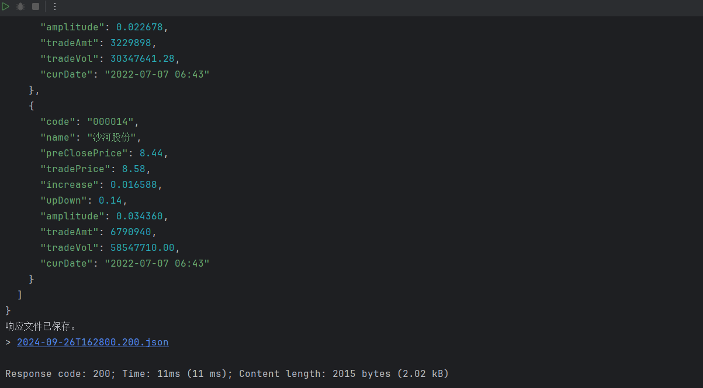

# 一、项目整体环境搭建

## 1. 数据库环境

- 大盘和板块相关表

  

  

- 个股相关表

  

- 权限相关表

  

- 日志表

  

> 注意事项
>
> 1）表与表之间的关系尽量通过业务逻辑维护，而不是通过使用数据库外键约束，原因如下：
>
> ​	1.性能问题：外键约束会使约束的表之间做级联检查，导致数据库性能降低；
>
> ​	2.并发问题：外键约束的表在事务中需要获取级联表的锁，才能进行写操作，这更容易造成死锁问题；（数据库自身存在死锁检查，当放生死锁时，会自动终端另一方的事务）
>
> ​	3.扩展性问题：数据分库分表时，加大了拆分的难度；
>
> 2）**docker容器中的数据库注意时区问题**；
>
> 启动并配置docker的mysql容器
>
> ```bash
> docker run -d \
>     --restart=always \
>     -p 3306:3306 \
>     --name mysql \
>     -v /tmp/mysql/data:/var/lib/mysql \
>     -e MYSQL_ROOT_PASSWORD=root \
>     -e TZ=Asia/Shanghai \
>     --network mynetwork \
>     mysql:latest \
>     --character-set-server=utf8mb4 \
>     --collation-server=utf8mb4_unicode_ci \
>     --default-time_zone='+8:00'
> 
> docker run -d \
>     --restart=always \
>     -p 3306:3306 \
>     --name mysql \
>     -v /tmp/mysql/data:/var/lib/mysql \
>     -e MYSQL_ROOT_PASSWORD=root \
>     -e TZ=Asia/Shanghai \
>     mysql:latest \
>     --character-set-server=utf8mb4 \
>     --collation-server=utf8mb4_unicode_ci \
>     --default-time_zone='+8:00'
> 
> ```
>
> 1. **`docker run`**：
>    - 启动一个新的 Docker 容器。
>
> 2. **`--restart=always`**：
>    - 该选项用于配置容器自动重启策略。`always` 表示无论容器是否崩溃、Docker 是否重启，容器都会自动重启，确保 MySQL 服务的高可用性。
>
> 3. **`-p 3306:3306`**：
>    - 将主机的 **3306** 端口映射到容器的 **3306** 端口，这是 MySQL 的默认端口。
>    - 主机可以通过访问 `localhost:3306` 来与容器中的 MySQL 数据库进行通信。
>
> 4. **`--name mysql`**：
>    - 设置容器的名称为 `mysql`，便于管理和操作容器。
>
> 5. **`-v /tmp/mysql/data:/var/lib/mysql`**：
>    - 将主机目录 `/tmp/mysql/data` 挂载到容器的 `/var/lib/mysql` 目录中。
>    - `/var/lib/mysql` 是 MySQL 的默认数据目录，这样 MySQL 的数据将持久化在主机上，即使容器重启或删除，数据仍然存在。
>
> 6. **`-e MYSQL_ROOT_PASSWORD=root`**：
>    - 通过环境变量 `MYSQL_ROOT_PASSWORD` 设置 MySQL 数据库的 root 用户密码为 `root`。
>
> 7. **`-e TZ=Asia/Shanghai`**：
>    - 设置容器的时区为 **Asia/Shanghai**，以确保 MySQL 的时间与中国上海的时区同步。
>
> 8. **`-d mysql:5.7.25`**：
>    - 以守护进程模式（后台）启动容器，使用 MySQL 的 `5.7.25` 版本镜像。
>
> 9. **`--character-set-server=utf8mb4`**：
>    - 配置 MySQL 使用 `utf8mb4` 作为服务器的默认字符集。
>    - `utf8mb4` 是 MySQL 支持的完整 UTF-8 字符集，支持存储 Emoji 等特殊字符。
>
> 10. **`--collation-server=utf8mb4_unicode_ci`**：
>     - 配置 MySQL 使用 `utf8mb4_unicode_ci` 作为服务器的默认排序规则，确保字符按照 Unicode 规则进行排序和比较。
>
> 11. **`--default-time_zone='+8:00'`**：
>     - 设置 MySQL 的默认时区为东八区（`+8:00`），与中国标准时间保持一致。
> 12. --network mynetwork \要放在容器参数前
>
> 该命令运行了一个 MySQL 5.7.25 容器，设置了字符集、时区、密码等配置，并通过主机与容器的数据目录绑定来实现数据持久化。容器将自动在系统重启时启动，并通过映射的端口允许外部访问。

配置好环境之后，由于我们暂时不太关系数据库中的信息，所以直接使用预先构建好的mysql脚本，初始化数据库中的数据。

## 2. 后端环境搭建

后端工程工程结构：

拥有两个主要功能：采集和展示，那其中两个有公共部分，也就是持久层部分和数据库的查询与写入，都使用到了与股票相关的实体对象。那么我们将其抽象出一个公共部分，作为一个模块。三个工程由一个父工程管理。


构建过程中的注意：

1. 更改maven的setting.xml
2. 更改字符编码UTF-8
3. 父工程不需要代码，删去src
4. lombok插件版本问题需要注意，如果没生效那么@Data注解将失效

### 父工程构建

首先构建父工程：

基于maven构建stock_parent 父工程：

父工程在 Maven 多模块项目中扮演着非常关键的角色，主要负责统一管理子模块的版本、依赖、构建配置和其他共享元素。以下是父工程的核心功能和组成部分的详细解释：

1. **聚合子模块**

父工程通过 `<modules>` 标签聚合了多个子模块。这使得整个项目可以作为一个单一的实体来构建和管理，而不是独立管理每个子模块。例如，当在父项目目录下执行 `mvn clean install` 命令时，Maven 会递归地在所有子模块上执行这些命令。

```xml
<modules>
    <module>stock_common</module>
    <module>stock_backend</module>
    <module>stock_job</module>
</modules>
```

2. **版本管理**

父工程通过 `<dependencyManagement>` 部分定义了项目中所有依赖的版本号。这样，子模块在声明依赖时不需要指定版本号，保证了整个项目依赖的一致性和可管理性。当需要更新依赖版本时，只需在父项目中修改，所有子模块将自动使用新的版本。

```xml
<dependencyManagement>
    <dependencies>
        <dependency>
            <groupId>org.springframework.boot</groupId>
            <artifactId>spring-boot-starter-parent</artifactId>
            <version>${spring-boot.version}</version>
            <type>pom</type>
            <scope>import</scope>
        </dependency>
        <!-- 其他依赖管理 -->
    </dependencies>
</dependencyManagement>
```

3. **插件管理**

与依赖管理类似，父工程还可以用 `<pluginManagement>` 来统一管理 Maven 插件的版本和配置。这确保了构建过程的一致性，避免了因插件配置不一致而导致的构建问题。

```xml
<pluginManagement>
    <plugins>
        <plugin>
            <groupId>org.springframework.boot</groupId>
            <artifactId>spring-boot-maven-plugin</artifactId>
            <version>${spring-boot.version}</version>
            <!-- 配置详情 -->
        </plugin>
        <!-- 其他插件管理 -->
    </plugins>
</pluginManagement>
```

4. **属性管理**

父工程通常还包括一系列 `<properties>`，这些属性定义了整个项目构建中使用的通用属性，如编码方式、Java 编译版本等。

```xml
<properties>
    <project.build.sourceEncoding>UTF-8</project.build.sourceEncoding>
    <maven.compiler.source>8</maven.compiler.source>
    <maven.compiler.target>8</maven.compiler.target>
    <!-- 其他属性 -->
</properties>
```

5. **统一构建配置**

父工程还可以定义统一的构建配置，如资源文件的处理、编译器配置等，这些都通过 `<build>` 标签进行设置。

```xml
<build>
    <!-- 其他构建相关配置 -->
</build>
```

使用父工程的好处

- **简化依赖管理**：通过在父工程中集中管理依赖，可以避免子模块间的版本冲突，易于依赖的升级和维护。
- **统一构建过程**：父工程提供了一个统一的构建配置，使得所有子模块能够以一致的方式进行构建。
- **提高可维护性**：父工程作为项目结构的核心，提高了整个项目的组织性和可维护性。

使用 Maven 的父工程结构，可以显著提升大型项目的管理效率和降低维护复杂度。

### Common工程构建

common工程主要负责抽象出采集端和展示端的公共功能部分，暂时来说就是对数据库的操作，即DAO层。那么其暂时目录如下：


主要有三个部分：

- mapper：定义DAO层向外提供的接口方法
  - 

- pojo.entity：和数据库中资源对应的类，需要有getter、setter，这里用注解@Date构建（插件：lombok）
- mapper的xml资源：对应mapper提供接口方法的具体sql实现
  - 

### Backend工程构建

backend工程是应用与用户交互的主要模块，其应该担任控制层和服务层（持久层由common担任）。控制层即处理来自用户的请求，找到对应处理请求的控制器，并与服务层配合。服务层处理具体的业务请求，调用DAO层。


具体到目录中：

- controller下对应控制器

- service下构建接口以及具体实现

- resources下的application.yml：配置文件

- VO：Value Object（值对象）

  - **值对象** 是用于表示某种数据的对象，通常用于展示层（View Layer），封装了与前端进行交互的数据结构。`VO` 是一种只携带数据的对象，主要用于传递数据。

  典型特点：

  - 不包含业务逻辑。
  - 一般用于表示层（比如前端 UI），以便将数据呈现给用户。
  - 可以是数据库查询结果的封装，也可以是经过业务逻辑处理后的数据。

  具体到该项目中，就是返回和请求的数据格式，比如说一些响应码，以及数据封装格式。

## 3. 前端环境搭建

前端开发环境主要注意几个点：

- npm的版本问题
- npm的镜像源问题

前端工程依赖安装与启动：

~~~shell
npm install # 若安装依赖过慢，可安装cnpm并下载安装依赖
~~~


~~~shell
npm run dev # 启动工程
~~~


浏览器跨域问题：

- 只要请求的协议、端口、ip域名不一致，浏览器就拒绝访问对应的资源；
- 浏览器的同源策略：访问安全问题；

在stock_front_admin\src\settings.js文件下配置跨域：

        proxy: {// 跨域请求配置
            "/api": {
                secure: false,// 关闭安全检测，默认请求 https
                //target: "http://192.168.188.131:8091",
                target: "http://localhost:8091",
                changeOrigin: true,
                // pathRewrite: {"^/api" : ""},
            }
        },

# 二、项目总体流程讲解

当请求发生时，Spring Boot 与 MyBatis 各个部分会紧密配合完成从请求到数据返回的整个过程。下面我会详细讲解每一层是如何协作的，并加入 **`sysUserMapper.xml`** 作为 MyBatis SQL 配置文件的一部分。

## 整体流程概述

当一个 HTTP 请求发送到 `UserController` 时，Spring Boot 处理这个请求，通过控制器层 (`UserController`) 传递请求到服务层 (`UserService`)，再由服务层调用数据访问层 (`SysUserMapper`)，最终查询数据库中的 `sys_user` 表。数据库查询结果会通过 MyBatis 自动映射为 `SysUser` 对象，并逐层返回，最终作为 JSON 响应返回给客户端。

## 详细的请求处理过程：

### 1. **客户端发起请求**

客户端向服务器发起 HTTP 请求，目标 URL 是 `/api/user/{userName}`，请求方法是 `GET`。例如，用户请求：

```http
GET /api/user/john
```

### 2. **控制器（UserController）处理请求**

当请求到达服务器时，Spring Boot 的 **DispatcherServlet** 会首先拦截请求，并根据请求的 URL 将其转发到对应的控制器方法中。

```java
@GetMapping(value = "/user/{userName}", produces = MediaType.APPLICATION_JSON_VALUE)
public SysUser getUserByUserName(@PathVariable("userName") String name) {
    return userService.getUserByUserName(name);
}
```

**`@GetMapping("/user/{userName}")`** 注解告诉 Spring 框架，该方法会处理类似 `/user/{userName}` 这样的 `GET` 请求，其中 `userName` 是动态路径变量。通过 `@PathVariable`，Spring 将 URL 中的 `userName` 提取并传递给控制器方法 `getUserByUserName()`。

- **输入**：用户请求 `/api/user/john`。
- **输出**：调用 `UserService` 获取指定用户名为 `john` 的用户信息。

### 3. **服务层（UserService 和 UserServiceImpl）调用业务逻辑**

控制器层通过依赖注入（`@Autowired`）调用服务层 `UserService`，然后调用它的实现类 `UserServiceImpl`。

```java
@Override
public SysUser getUserByUserName(String userName) {
    return sysUserMapper.findUserInfoByUserName(userName);
}
```

在 `UserServiceImpl` 中，服务层调用数据访问层的 `SysUserMapper`，执行与数据库的交互操作，获取用户数据。

- **输入**：传入的 `userName`（例如 `john`）。
- **输出**：从 `SysUserMapper` 返回一个 `SysUser` 对象。

### 4. **数据访问层（SysUserMapper）执行数据库查询**

`SysUserMapper` 是一个 MyBatis `Mapper` 接口，定义了数据库查询操作。它负责通过 `sysUserMapper.xml` 文件中的 SQL 语句与数据库交互，并返回结果。

```java
SysUser findUserInfoByUserName(@Param("userName") String userName);
```

`SysUserMapper` 的 `findUserInfoByUserName()` 方法通过 MyBatis 自动与数据库查询逻辑关联，MyBatis 会根据 `sysUserMapper.xml` 文件中的 SQL 语句来执行实际的查询操作。

### 5. **`sysUserMapper.xml`：MyBatis SQL 映射文件**

`sysUserMapper.xml` 是 MyBatis 的映射文件，它为 `SysUserMapper` 接口中的方法定义了具体的 SQL 查询语句。这个文件通常位于 `resources/mapper/` 目录下。

例如，`sysUserMapper.xml` 文件可能如下：

```xml
<?xml version="1.0" encoding="UTF-8" ?>
<!DOCTYPE mapper PUBLIC "-//mybatis.org//DTD Mapper 3.0//EN"
  "http://mybatis.org/dtd/mybatis-3-mapper.dtd">

<mapper namespace="com.async.stock.mapper.SysUserMapper">

    <!-- 查询用户信息 -->
    <select id="findUserInfoByUserName" parameterType="String" resultType="com.async.stock.pojo.entity.SysUser">
        SELECT id, username, password, phone, real_name AS realName, nick_name AS nickName, email,
               status, sex, deleted, create_id AS createId, update_id AS updateId, create_where AS createWhere,
               create_time AS createTime, update_time AS updateTime
        FROM sys_user
        WHERE username = #{userName}
    </select>

</mapper>
```

- **`<mapper namespace="com.async.stock.mapper.SysUserMapper">`**：指定这是与 `SysUserMapper` 接口相关联的 MyBatis 映射文件。
- **`<select>`**：定义 SQL 查询语句，用于从 `sys_user` 表中根据 `username` 查询用户信息。`id="findUserInfoByUserName"` 与 `SysUserMapper` 接口中的方法名一一对应。
- **`#{userName}`**：使用 MyBatis 的参数占位符，将 `userName` 参数绑定到 SQL 查询语句中。

### 6. **数据库查询结果映射为 `SysUser` 对象**

MyBatis 自动将查询结果映射为 `SysUser` 对象。根据 `sysUserMapper.xml` 中定义的 `resultType="com.async.stock.pojo.entity.SysUser"`，查询到的数据会映射到 `SysUser` 对象的字段中，如 `id`, `username`, `realName` 等。

- **输入**：执行 SQL 查询，返回用户数据（例如 `john` 的信息）。
- **输出**：将查询结果映射为 `SysUser` 对象。

### 7. **服务层和控制器层返回结果**

- `SysUserMapper` 将查询到的 `SysUser` 对象返回给 `UserServiceImpl`。
- `UserServiceImpl` 再将 `SysUser` 对象返回给 `UserController`。

### 8. **控制器返回 JSON 响应**

控制器接收到 `SysUser` 对象后，通过 `@RestController` 自动将该对象序列化为 JSON 格式，并返回给客户端。

- **最终结果**：客户端收到返回的 JSON 格式的用户信息：

```json
{
  "id": 1,
  "username": "john",
  "password": "hashed_password",
  "phone": "123456789",
  "realName": "John Doe",
  "nickName": "Johnny",
  "email": "john@example.com",
  "status": 1,
  "sex": 1,
  "deleted": 0,
  "createId": 10,
  "updateId": 12,
  "createWhere": 1,
  "createTime": "2024-01-01T12:00:00",
  "updateTime": "2024-01-10T15:30:00"
}
```

## 代码关系总结：

1. **Controller（控制器层）**：
   - 接收客户端请求。
   - 调用 `UserService` 获取用户信息。
   - 返回序列化后的 JSON 响应。

2. **Service（服务层）**：
   - 处理业务逻辑。
   - 调用 `SysUserMapper` 获取数据库中的用户数据。
   - 返回 `SysUser` 对象。

3. **Mapper（数据访问层）**：
   - 定义数据查询操作，直接与数据库表交互。
   - 通过 MyBatis 映射 SQL 语句到 Java 方法。

4. **`sysUserMapper.xml`（SQL 映射文件）**：
   - 定义具体的 SQL 查询语句，MyBatis 自动执行并将结果映射为 Java 对象。

5. **SysUser（实体类）**：
   - 承载数据库中的用户数据。
   - 作为服务层与控制器层之间传递的载体。
   - 最终被序列化为 JSON 格式返回给客户端。

## 流程总结：

1. **请求接收**：控制器接收到 `GET /user/{userName}` 请求。
2. **服务层调用**：控制器调用服务层 `UserService` 获取用户信息。
3. **数据查询**：服务层通过 MyBatis 的 `SysUserMapper` 调用数据库查询。
4. **SQL 执行**：MyBatis 通过 `sysUserMapper.xml` 中定义的 SQL 语句查询数据库。
5. **结果映射**：查询结果映射为 `SysUser` 实体类对象。
6. **返回结果**：控制器层将 `SysUser` 对象转换为 JSON 并返回给客户端。

整个系统通过 Spring Boot 和 MyBatis 实现了分层架构，各个部分各司其职，保持了良好的解耦性。

# 三、用户登录功能实现-01用户名-密码

同样，我们发送用户登录报文，需要先明确请求和响应报文应该具有的格式：

## 1. 访问接口定义

~~~json
请求接口：/api/login
请求方式：POST
请求数据示例：
   {
       username:'zhangsan',//用户名
       password:'666',//密码
       //code:'1234' //校验码
    }
响应数据：
    {
        "code": 1,//成功1 失败0
        "data": { //data为响应的具体数据，不同的接口，data数据格式可能会不同
                "id":"1237365636208922624",
                "username":"zhangsan",
                "nickName":"xiaozhang",
                "phone":"1886702304"
        }
    }
~~~

那么于是就要在后端项目中封装对应的请求和响应的vo值对象

com.async.stock.vo
                  ├── req  # 请求数据封装类
                  └── resp # 响应数据封装类


> vo对象直接在：**day01\资料\vo导入即可**；

~~~java
package com.async.stock.vo.req;

import lombok.Data;

/**
 * @author by itheima
 * @Date 2021/12/30
 * @Description 登录请求vo
 */
@Data
public class LoginReqVo {
    /**
     * 用户名
     */
    private String username;
    /**
     * 密码
     */
    private String password;
    /**
     * 验证码
     */
    //private String code;
}
~~~

登录响应vo工程导入：day01\资料\LoginRespVo.java

~~~java
package com.async.stock.vo.resp;

import lombok.AllArgsConstructor;
import lombok.Builder;
import lombok.Data;
import lombok.NoArgsConstructor;

/**
 * @author by async
 * @Date 2021/12/24
 * @Description 登录后响应前端的vo
 */
@Data
@NoArgsConstructor
@AllArgsConstructor
@Builder
public class LoginRespVo {
    /**
     * 用户ID
     * 将Long类型数字进行json格式转化时，转成String格式类型,避免精读丢失
     */
    @JsonSerialize(using = ToStringSerializer.class)
    /**
     * 电话
     */
    private String phone;
    /**
     * 用户名
     */
    private String username;
    /**
     * 昵称
     */
    private String nickName;

}
~~~

## 2. 密码加密匹配器

后端数据库中不能直接存储密码明文，而是要存储加密的密码。这里由一个密码加密和校验工具包实现。它的原理是每次加密生成一个随机的salt值，同明文一起加密（其实上是哈希）。然后再验证阶段，将密文中的salt和密码密文提取（所以应该是有单独哈希salt值，因为能提取出两部分）把待验证密码和salt加密（哈希），看是否与密文相同。

引入依赖资源：

~~~xml
<!--密码加密和校验工具包-->
<dependency>
    <groupId>org.springframework.security</groupId>
    <artifactId>spring-security-crypto</artifactId>
</dependency>
~~~

配置密码加密匹配bean：

~~~java
package com.async.stock.config;

import org.springframework.context.annotation.Bean;
import org.springframework.context.annotation.Configuration;
import org.springframework.security.crypto.bcrypt.BCryptPasswordEncoder;
import org.springframework.security.crypto.password.PasswordEncoder;

/**
 * @author by async
 * @Description 定义公共配置类
 */
@Configuration
public class CommonConfig {
    /**
     * 密码加密器
     * BCryptPasswordEncoder方法采用SHA-256对密码进行加密
     * @return
     */
    @Bean
    public PasswordEncoder passwordEncoder(){
        return new BCryptPasswordEncoder();
    }
}
~~~

密码加密测试：

~~~java
@SpringBootTest
public class TestAll {
    @Autowired
    private PasswordEncoder passwordEncoder;
        @Test
    public void testPwd(){
        String pwd="1234";
        //加密  $2a$10$WAWV.QEykot8sHQi6FqqDOAnevkluOZJqZJ5YPxSnVVWqvuhx88Ha
        String encode = passwordEncoder.encode(pwd);
        System.out.println(encode);
        /*
            matches()匹配明文密码和加密后密码是否匹配，如果匹配，返回true，否则false
            just test
         */
        boolean flag = passwordEncoder.matches(pwd, 				          "$2a$10$WAWV.QEykot8sHQi6FqqDOAnevkluOZJqZJ5YPxSnVVWqvuhx88Ha");
        System.out.println(flag);
    }
}    
~~~

## 3 登录接口

### 3.1 控制层

先写面向用户的控制层的对应控制器：

~~~java
package com.async.stock.controller;

import com.itheima.stock.service.UserService;
import com.itheima.stock.vo.req.LoginReqVo;
import com.itheima.stock.vo.resp.LoginRespVo;
import com.itheima.stock.vo.resp.R;
import org.springframework.beans.factory.annotation.Autowired;
import org.springframework.web.bind.annotation.*;

/**
 * @author by async
 * @Date 2021/12/29
 * @Description 定义用户访问层
 */
@RestController
@RequestMapping("/api")
public class UserController {

    @Autowired
    private UserService userService;

    /**
     * 用户登录功能实现
     * @param vo
     * @return
     */
    @PostMapping("/login")
    public R<LoginRespVo> login(@RequestBody LoginReqVo vo){
        R<LoginRespVo> r= this.userService.login(vo);
        return r;
    }
}
~~~

### 3.2 服务层

再写server层中的接口定义：

~~~java
package com.itheima.stock.service;

import com.itheima.stock.vo.req.LoginReqVo;
import com.itheima.stock.vo.resp.LoginRespVo;
import com.itheima.stock.vo.resp.R;

/**
 * @author by itheima
 * @Date 2021/12/30
 * @Description 用户服务
 */
public interface UserService {
    /**
     * 用户登录功能实现
     * @param vo
     * @return
     */
    R<LoginRespVo> login(LoginReqVo vo);
}
~~~

再写登录服务接口的具体实现：

~~~java
package com.async.stock.service.impl;

import com.google.common.base.Strings;
import com.itheima.stock.common.enums.ResponseCode;
import com.itheima.stock.mapper.SysUserMapper;
import com.itheima.stock.pojo.SysUser;
import com.itheima.stock.service.UserService;
import com.itheima.stock.vo.req.LoginReqVo;
import com.itheima.stock.vo.resp.LoginRespVo;
import com.itheima.stock.vo.resp.R;
import org.springframework.beans.BeanUtils;
import org.springframework.beans.factory.annotation.Autowired;
import org.springframework.security.crypto.password.PasswordEncoder;
import org.springframework.stereotype.Service;

/**
 * @author by async
 * @Date 2021/12/30
 * @Description 定义服务接口实现
 */
@Service("userService")
public class UserServiceImpl implements UserService {

    @Autowired
    private SysUserMapper sysUserMapper;

    @Autowired
    private PasswordEncoder passwordEncoder;

    @Override
    public R<LoginRespVo> login(LoginReqVo vo) {
        // 1. 检查请求对象是否为空，并且用户名和密码是否为空字符串
        //    如果有任何一项为空，则返回错误响应，提示数据错误
        if (vo == null || StringUtils.isBlank(vo.getUsername()) || StringUtils.isBlank(vo.getPassword())) {
            return R.error(ResponseCode.DATA_ERROR.getMessage());
        }

        // 2. 根据传入的用户名从数据库中查询用户信息
        //    如果找不到该用户名对应的用户信息，`user` 将为 null
        SysUser user = this.sysUserMapper.findByUserName(vo.getUsername());

        // 3. 判断查询到的用户信息是否为空，如果为空说明用户不存在，直接返回密码错误的提示
        //    如果用户存在，则继续使用 `passwordEncoder` 验证用户传入的明文密码与数据库中存储的加密密码是否匹配
        //    `passwordEncoder.matches` 方法会自动处理加密时使用的随机盐值
        if (user == null || !passwordEncoder.matches(vo.getPassword(), user.getPassword())) {
            return R.error(ResponseCode.SYSTEM_PASSWORD_ERROR.getMessage());
        }

        // 4. 如果用户名和密码验证通过，组装登录成功返回的数据
        LoginRespVo respVo = new LoginRespVo();

        // 5. 使用 `BeanUtils.copyProperties` 方法将 `SysUser` 对象中的属性值复制到 `LoginRespVo` 对象中
        //    注意：两个对象的属性名称和类型必须一致，否则属性值无法正确复制
        BeanUtils.copyProperties(user, respVo);

        // 6. 返回封装了 `LoginRespVo` 的成功响应
        return R.ok(respVo);
    }

}
~~~

### 3.3 DAO层-持久层

定义mapper方法

在stock_common工程中SysUserMapper下定义接口方法：

~~~java
    /**
     * 根据用户名查询用户信息
     * @param username
     * @return
     */
    SysUser findByUserName(@Param("username") String username);
~~~

绑定xml：

~~~xml
    <select id="findByUserName" resultMap="BaseResultMap">
        select <include refid="Base_Column_List"/> from sys_user where
        username=#{username}
    </select>
~~~

### 3.4 Postman测试


# 四、用户登录功能实现-02（验证码、Session）

## 1.1 原理知识： Session-Cookie

### 1. **传统 Session-Cookie 机制的基本概念**

在传统的 **Session-Cookie 机制** 中，**Session** 和 **Cookie** 扮演了不同的角色，它们相互配合实现了用户状态的管理。

#### 1.1 Cookie

**Cookie** 是由服务器生成，并保存在客户端（通常是浏览器）的一小段数据。主要用于在客户端和服务器之间存储少量的状态信息。Cookie 有以下几个特点：

- **作用范围**：存储在客户端的浏览器中，自动随请求发送给服务器。
- **生命周期**：可以设置 Cookie 的有效期。会话级 Cookie 在浏览器关闭时失效，而持久化 Cookie 会根据设置的过期时间决定有效期。
- **数据量限制**：每个 Cookie 的大小限制通常为 4KB。

#### 1.2 Session

**Session** 是一种服务器端的用户会话管理机制，用于存储与用户会话相关的信息。服务器在用户登录或第一次请求时生成一个唯一的 **SessionId**，用于标识用户的会话。Session 的特点：

- **作用范围**：存储在服务器端，由服务器管理。
- **生命周期**：Session 通常在用户会话结束（如浏览器关闭）或设定的过期时间到达时失效。
- **数据量限制**：Session 存储在服务器上，没有太严格的数据大小限制。

### 2. **Session-Cookie 机制的工作原理**

- **Cookie 负责存储会话标识符**：当用户第一次访问网站时，服务器生成一个唯一的 `SessionId`，并将该 `SessionId` 通过 HTTP 响应的 Cookie 传递给浏览器。浏览器将 `SessionId` 保存到客户端的 Cookie 中。
  
- **Session 负责存储会话数据**：服务器端为每个用户创建一个 Session，服务器将用户的相关信息（如登录状态、用户信息等）存储在该 Session 中，使用 `SessionId` 作为唯一标识符。

- **会话期间的数据传递**：
  - 之后每次用户请求时，浏览器会自动携带 Cookie 中的 `SessionId` 发送给服务器。
  - 服务器接收到 `SessionId` 后，可以在服务器的 Session 中找到该用户的会话数据，从而继续处理用户的请求。

### 3. **Session 和 Cookie 的区别**

| **区别点**     | **Session**                                               | **Cookie**                                                   |
| -------------- | --------------------------------------------------------- | ------------------------------------------------------------ |
| **存储位置**   | Session 存储在 **服务器端**。                             | Cookie 存储在 **客户端（浏览器）**。                         |
| **作用对象**   | 用于存储用户的 **会话数据**，通常是敏感信息，如用户状态。 | 用于存储 **小数据**，如会话标识符（`SessionId`）、偏好设置等。 |
| **生命周期**   | 由服务器端控制，通常在会话结束或达到超时时间时失效。      | 可以设置过期时间，持久化的 Cookie 可在浏览器关闭后继续有效。 |
| **安全性**     | 更加安全，因为数据存储在服务器端，不暴露给客户端。        | 安全性较低，所有数据存储在客户端，容易被用户篡改。           |
| **数据存储量** | 数据存储在服务器上，**不受浏览器限制**。                  | 受限于浏览器，通常每个 Cookie 限制在 **4KB** 大小以内。      |
| **使用场景**   | 适合存储敏感的、较大数据量的会话信息，如用户登录状态。    | 适合存储一些非敏感信息，如页面偏好设置或 SessionId。         |

### 4. **Session 和 Cookie 的配合**

- **Cookie 存储 `SessionId`**：Cookie 的主要作用是保存 `SessionId`，并在后续的请求中发送给服务器。它就像用户身份的凭证，告诉服务器这是谁的会话。
  
- **Session 存储会话数据**：服务器端的 Session 存储了与用户会话相关的所有数据，如登录状态、用户信息、购物车等，使用 `SessionId` 作为标识符来区分不同的会话。

### 5. **Session 和 Cookie 的配合流程**

1. **首次请求**：
   - 用户首次访问网站时，服务器生成一个 `SessionId`，并通过 Cookie 将其发送到客户端。
   - 同时，服务器在内部创建一个 Session，并将 `SessionId` 与会话数据关联。

2. **后续请求**：
   - 用户再次请求时，浏览器会自动携带 Cookie 中存储的 `SessionId`。
   - 服务器根据 `SessionId` 找到对应的 Session，读取会话数据，继续为用户提供服务。

单体架构基于session-cookie机制实现验证码流程：


### 6. **总结：Session 和 Cookie 的关系与区别**

- **Cookie** 是一种存储在客户端的小型数据，它负责在客户端和服务器之间传递会话标识符。
- **Session** 是存储在服务器端的，用于保存用户会话数据。通过 `SessionId` 标识不同的用户会话。
- **两者的配合**：Cookie 用于保存会话标识符 `SessionId`，Session 用于存储实际的会话数据。Session 依赖于 Cookie 中的 `SessionId` 来识别用户的会话。

在实际使用中，Session 更适合处理敏感数据，而 Cookie 适合处理轻量级的数据和传递 `SessionId` 这类非敏感信息。

## 1.2 原理知识：跨域和集群环境下存在的问题

在前后端分离架构中，传统的 **Session-Cookie 机制** 会面临一些新的问题，主要体现在 **跨域请求、集群环境下的 Session 共享** 和 **安全性问题**。下面详细解释这些问题及其对前后端分离架构的影响：

### 1. **跨域请求中的 Session-Cookie 问题**

#### 1.1 什么是跨域？

在前后端分离的架构中，前端应用和后端服务通常部署在不同的域名、端口或协议下，这就会引发 **跨域请求** 问题。例如：
- 前端在 `http://frontend.com`，后端在 `http://api.backend.com`。
- 用户在前端发起请求时，浏览器会判断这是跨域请求。

#### 1.2 跨域情况下 Cookie 的限制

**问题**：传统的 `Session-Cookie` 机制在跨域情况下表现不好，尤其是 **Cookie 的自动发送**。

- **SameSite 属性**：为了防止跨站请求伪造（CSRF）攻击，现代浏览器对 Cookie 的跨域行为进行了限制。默认情况下，Cookie 的 `SameSite` 属性是 `Lax` 或 `Strict`，这意味着：
  - `Strict`：完全禁止跨站点请求携带 Cookie。
  - `Lax`：只有在某些安全的 GET 请求中允许 Cookie 携带，而对于敏感操作（如 POST、PUT 请求）则禁止。
  
- **问题表现**：
  - 当前端与后端不在同一个域时（跨域），用户请求后端 API 时，浏览器可能不会自动发送 Cookie。
  - 由于 Cookie 中包含 `SessionId`，如果浏览器不发送 Cookie，那么后端就无法识别用户的 Session，导致会话失效，用户需要重新登录。

#### 1.3 跨域请求的解决方法

**解决方案**：
- **CORS**（跨域资源共享）：允许后端通过设置 CORS（Cross-Origin Resource Sharing）来解决跨域问题，后端需要明确配置允许的源、方法、头部以及是否允许携带 Cookie。
- **SessionId 放在请求头或 URL 中**：一种解决方法是通过将 `SessionId` 显式放入 HTTP 请求的自定义头部或 URL 参数中，而不是依赖浏览器自动携带的 Cookie。

### 2. **集群环境下的 Session 共享问题**

#### 2.1 单点 Session 问题

传统的 Session 是存储在服务器的内存中的，如果后端应用扩展为多个实例（如在不同的服务器节点上部署），Session 的存储会出现问题。这种情况被称为 **Session 单点问题**。

**问题表现**：
- 在负载均衡的场景下，用户每次请求可能会被路由到不同的服务器实例。
- 由于每个服务器实例的 Session 是存储在各自的内存中，某个实例上创建的 Session 在其他实例上是不可见的，导致用户状态丢失，强制用户重新登录。

#### 2.2 集群环境下的 Session 共享问题

**集群环境中，Session 的共享问题** 是指多个服务器节点需要共享同一个用户的 Session 数据，但因为 Session 存储在各自服务器的内存中，无法在不同节点间自动同步。

**解决方案**：
- **Session 复制**：服务器节点之间复制 Session 数据，但会增加网络和同步的开销，且不够高效。
- **Session 粘性（Sticky Session）**：通过负载均衡器确保同一个用户的请求始终路由到同一个服务器节点。但这种方法并不适用于动态扩容或节点故障的情况。
- **外部 Session 存储**：将 Session 存储移到 **外部存储**，如 Redis、数据库等，使得多个服务器节点可以共享 Session 数据。Redis 是目前常见的外部 Session 存储解决方案，具备高效的分布式数据存储能力。

### 3. **安全性问题**

#### 3.1 Cookie 安全问题

在前后端分离架构下，Cookie 存在以下潜在的安全问题：

- **Cookie 劫持**：因为 Cookie 是保存在客户端的，攻击者可以通过各种手段（如 XSS 攻击）窃取用户的 Cookie。
- **跨站脚本攻击（XSS）**：攻击者通过注入恶意脚本来窃取用户的 Cookie 或 Session 信息，从而获取用户的身份。
- **跨站请求伪造（CSRF）**：攻击者通过伪造用户的请求，利用用户的 SessionId 执行恶意操作。

**解决方案**：
- **HttpOnly 和 Secure 属性**：可以通过设置 Cookie 的 `HttpOnly` 属性来防止 JavaScript 访问 Cookie，从而减少 XSS 风险；通过设置 `Secure` 属性使 Cookie 只能通过 HTTPS 传输，防止网络中间人攻击。
- **SameSite 属性**：设置 Cookie 的 `SameSite` 属性，防止 CSRF 攻击。`SameSite=Strict` 可以防止跨站点请求携带 Cookie。
  
#### 3.2 Session 固定攻击（Session Fixation）

在前后端分离中，攻击者可能会通过特定的手段，强迫用户使用一个已知的 `SessionId`，从而实施攻击。这种攻击称为 **Session 固定攻击**。

**解决方案**：
- 在用户登录成功后，重新生成一个新的 `SessionId`，防止攻击者利用之前已知的 `SessionId`。

### 4. **Session 生命周期管理**

传统的 Session 通常具有一定的生命周期，比如 30 分钟过期。但在前后端分离架构中，前端应用可能会向多个不同的后端服务发送请求，导致 Session 生命周期的管理复杂化。

- **问题表现**：如果后端使用默认的 Session 机制，且每个后端服务的 Session 彼此独立管理，可能会出现一个服务的 Session 失效，而另一个服务的 Session 仍然有效的情况，导致用户体验不一致。

**解决方案**：
- 使用统一的 **Session 共享机制**，如 Redis 统一存储 Session，并设置全局的 Session 生命周期管理规则。
  
### 5. **总结：前后端分离下 Session-Cookie 机制存在的问题**

1. **跨域请求导致 Cookie 无法自动携带**：前后端分离时，由于浏览器的跨域安全限制，Session-Cookie 机制在不同域之间难以正常工作。
2. **Session 共享问题**：在集群环境中，每个服务器节点的 Session 无法共享，导致用户状态丢失，需要引入 Redis 或数据库等外部存储机制来解决。
3. **安全性问题**：需要额外注意 Cookie 的安全性，避免 CSRF、XSS、Session 固定攻击等常见的 Web 安全问题。
4. **生命周期管理问题**：前后端分离时，多个后端服务的 Session 生命周期需要统一管理，避免用户体验不一致。

为了适应前后端分离的架构，常见的解决方案包括引入 **Token（如 JWT）** 替代传统的 `SessionId`，或者使用 Redis 等外部存储来模拟传统的 `Session` 机制，从而更好地适应分布式和跨域场景。

## 1.3 原理知识：SessionID唯一性解决方案——雪花算法

```java
package com.itheima.stock.utils;

import java.lang.management.ManagementFactory;
import java.net.InetAddress;
import java.net.NetworkInterface;

/**
 * 分布式自增长ID实现，底层基于Twitter的Snowflake算法。
 * 64位ID的结构包括：
 * - 符号位(1位)：始终为0，表示正数。
 * - 时间戳(42位)：表示当前时间戳。
 * - 数据中心ID(5位)：表示不同的数据中心。
 * - 机器ID(5位)：表示同一数据中心内不同的机器。
 * - 序列号(12位)：表示同一毫秒内生成的序列号。
 * @author itheima
 */
public class IdWorker {
    // 时间起始标记点，作为基准，一般取系统的最近时间，作为生成ID的基准
    private final static long twepoch = 1288834974657L;
    
    // 机器ID位数，最大支持32台机器
    private final static long workerIdBits = 5L;
    
    // 数据中心ID位数，最大支持32个数据中心
    private final static long datacenterIdBits = 5L;
    
    // 机器ID最大值
    private final static long maxWorkerId = -1L ^ (-1L << workerIdBits);
    
    // 数据中心ID最大值
    private final static long maxDatacenterId = -1L ^ (-1L << datacenterIdBits);
    
    // 毫秒内自增位数，最大支持每毫秒4096个ID
    private final static long sequenceBits = 12L;
    
    // 机器ID向左移12位
    private final static long workerIdShift = sequenceBits;
    
    // 数据中心ID左移17位（5+12）
    private final static long datacenterIdShift = sequenceBits + workerIdBits;
    
    // 时间戳左移22位（5+5+12）
    private final static long timestampLeftShift = sequenceBits + workerIdBits + datacenterIdBits;

    // 序列号掩码，确保序列号在范围内循环
    private final static long sequenceMask = -1L ^ (-1L << sequenceBits);
    
    // 上次生成ID的时间戳
    private static long lastTimestamp = -1L;
    
    // 当前毫秒内的序列号
    private long sequence = 0L;
    
    // 机器ID
    private final long workerId;
    
    // 数据中心ID
    private final long datacenterId;

    /**
     * 构造函数：根据机器ID和数据中心ID创建实例
     */
    public IdWorker(){
        this.datacenterId = getDatacenterId(maxDatacenterId);
        this.workerId = getMaxWorkerId(datacenterId, maxWorkerId);
    }

    /**
     * 参数化构造函数：手动指定机器ID和数据中心ID
     * @param workerId 工作机器ID
     * @param datacenterId 数据中心ID
     */
    public IdWorker(long workerId, long datacenterId) {
        // 检查workerId是否超出最大范围
        if (workerId > maxWorkerId || workerId < 0) {
            throw new IllegalArgumentException(String.format("worker Id can't be greater than %d or less than 0", maxWorkerId));
        }
        // 检查datacenterId是否超出最大范围
        if (datacenterId > maxDatacenterId || datacenterId < 0) {
            throw new IllegalArgumentException(String.format("datacenter Id can't be greater than %d or less than 0", maxDatacenterId));
        }
        this.workerId = workerId;
        this.datacenterId = datacenterId;
    }

    /**
     * 获取下一个唯一ID，使用 synchronized 确保线程安全
     * @return 唯一ID
     */
    public synchronized long nextId() {
        long timestamp = timeGen();
        
        // 如果当前时间小于上次生成ID的时间，表示系统时钟回退，抛出异常
        if (timestamp < lastTimestamp) {
            throw new RuntimeException(String.format("Clock moved backwards. Refusing to generate id for %d milliseconds", lastTimestamp - timestamp));
        }

        // 如果在同一毫秒内，序列号自增
        if (lastTimestamp == timestamp) {
            sequence = (sequence + 1) & sequenceMask;
            
            // 序列号溢出，等待下一毫秒
            if (sequence == 0) {
                timestamp = tilNextMillis(lastTimestamp);
            }
        } else {
            // 如果是新的一毫秒，序列号归零
            sequence = 0L;
        }

        // 更新上次生成ID的时间戳
        lastTimestamp = timestamp;
        
        // 组合ID：时间戳、数据中心ID、机器ID和序列号
        long nextId = ((timestamp - twepoch) << timestampLeftShift)
                    | (datacenterId << datacenterIdShift)
                    | (workerId << workerIdShift)
                    | sequence;

        return nextId;
    }

    /**
     * 如果当前时间戳小于或等于上次生成的时间戳，等待到下一毫秒
     * @param lastTimestamp 上一次生成ID的时间戳
     * @return 下一毫秒的时间戳
     */
    private long tilNextMillis(final long lastTimestamp) {
        long timestamp = this.timeGen();
        while (timestamp <= lastTimestamp) {
            timestamp = this.timeGen();
        }
        return timestamp;
    }

    /**
     * 获取当前系统时间（毫秒）
     * @return 当前时间戳
     */
    private long timeGen() {
        return System.currentTimeMillis();
    }

    /**
     * 获取最大机器ID
     * 通过MAC地址和JVM PID来生成唯一的机器ID
     * @param datacenterId 数据中心ID
     * @param maxWorkerId 最大机器ID
     * @return 机器ID
     */
    protected static long getMaxWorkerId(long datacenterId, long maxWorkerId) {
        StringBuffer mpid = new StringBuffer();
        mpid.append(datacenterId);
        String name = ManagementFactory.getRuntimeMXBean().getName();
        if (!name.isEmpty()) {
            mpid.append(name.split("@")[0]);
        }
        return (mpid.toString().hashCode() & 0xffff) % (maxWorkerId + 1);
    }

    /**
     * 获取数据中心ID
     * 通过机器的MAC地址生成数据中心ID
     * @param maxDatacenterId 最大数据中心ID
     * @return 数据中心ID
     */
    protected static long getDatacenterId(long maxDatacenterId) {
        long id = 0L;
        try {
            InetAddress ip = InetAddress.getLocalHost();
            NetworkInterface network = NetworkInterface.getByInetAddress(ip);
            if (network == null) {
                id = 1L;
            } else {
                byte[] mac = network.getHardwareAddress();
                id = ((0x000000FF & (long) mac[mac.length - 1])
                    | (0x0000FF00 & (((long) mac[mac.length - 2]) << 8))) >> 6;
                id = id % (maxDatacenterId + 1);
            }
        } catch (Exception e) {
            System.out.println("getDatacenterId: " + e.getMessage());
        }
        return id;
    }
}
```

代码中的解释：

1. **生成的唯一ID结构**：
   - 通过 **符号位(1位) + 时间戳(42位) + 数据中心ID(5位) + 机器ID(5位) + 序列号(12位)** 组合生成 64 位唯一ID。
   - 时间戳确保有序性，数据中心ID和机器ID确保分布式下的唯一性，序列号确保同一毫秒内的不同ID。

2. **时间戳和序列号的处理**：
   - 如果两次生成ID的时间在同一毫秒内，序列号自增，最大支持每毫秒 4096 个不同的ID。
   - 如果超过4096个，则等待下一毫秒。

3. **生成机器ID和数据中心ID**：
   - 通过 MAC 地址和 JVM 的 PID 来生成唯一的机器ID和数据中心ID，避免同一局域网内机器ID的冲突。


这段 **雪花算法 (Snowflake)** 的实现中有几个值得注意的亮点和关键设计点，帮助确保在分布式环境下生成高效、全局唯一的 ID。以下是一些需要特别注意的关键点：

### 1. **基于时间戳生成唯一 ID**
   - 雪花算法的核心是使用 42 位的时间戳，确保生成的 ID 是有序的。时间戳部分以毫秒为单位，每秒可生成上百万个唯一的 ID。通过时间戳，可以使 ID 基本按生成顺序排列，具备时间顺序性。
   - 该算法确保了在同一时间段内，生成的 ID 是不同的，解决了分布式环境下多个节点同时生成 ID 可能导致冲突的问题。

   **亮点**：
   - **有序性**：基于时间戳生成的 ID 在时间上是递增的，有利于某些需要按顺序存储数据的场景（如数据库）。
   - **高性能**：每秒生成上百万个 ID，适合高并发场景。

### 2. **分布式的唯一性**
   - 雪花算法通过 **数据中心ID (datacenterId)** 和 **机器ID (workerId)** 的组合，确保在分布式系统的多个节点上生成的 ID 也是唯一的。
   - 数据中心 ID 和机器 ID 各占 5 位，总共支持 32 个数据中心和每个数据中心下的 32 台机器。这在中小型分布式系统中是足够的。

   **亮点**：
   - **分布式环境下的唯一性**：通过数据中心 ID 和机器 ID 的划分，即使在大规模分布式系统中，不同节点之间生成的 ID 也不会冲突。
   - **灵活扩展**：最大支持 32 个数据中心和每个数据中心 32 台机器，足够覆盖大多数分布式场景。

### 3. **毫秒内高并发支持**
   - 雪花算法在同一毫秒内生成多个 ID 时，通过 **序列号 (sequence)** 来确保唯一性。在同一毫秒内，最多可以生成 4096 个不同的 ID。
   - 如果当前毫秒内的序列号达到上限，系统会等待到下一毫秒，确保生成的 ID 不会重复。

   **亮点**：
   - **高并发支持**：同一毫秒内最多支持 4096 个并发请求生成不同 ID，足以满足大部分高并发场景。
   - **时间等待机制**：如果序列号超出范围，会等待下一毫秒继续生成 ID，避免冲突。

### 4. **时间回拨处理**
   - 在分布式系统中，系统时间可能会出现回拨现象（即当前时间小于上一次生成 ID 时的时间）。为了避免回拨导致生成的 ID 不合法，雪花算法做了专门的处理：当检测到时间回拨时，直接抛出异常，停止生成 ID。

   **亮点**：
   - **时间回拨安全性**：系统时间发生回拨时，系统会拒绝生成新的 ID，并抛出异常，避免生成重复的 ID。
   - **防止 ID 冲突**：时间回拨问题如果不处理，可能会导致生成的 ID 重复，影响系统的正常运行。通过这个设计，可以有效防止该问题。

### 5. **基于 MAC 地址和 JVM PID 生成的机器 ID**
   - 机器 ID 的生成是基于当前机器的 **MAC 地址** 和 JVM 的 **进程 ID**，这样可以确保即使是不同机器生成的机器 ID 也是唯一的。通过哈希值处理 MAC 地址和 PID，确保机器 ID 在集群中不会重复。

   **亮点**：
   - **唯一性保证**：通过 MAC 地址和 JVM 进程 ID 的组合生成机器 ID，确保同一个数据中心下不同机器的 ID 不会冲突。
   - **跨平台兼容性**：该算法可以运行在不同的平台上，确保每台机器生成唯一的机器 ID。

### 6. **线程安全性**
   - 由于 `nextId()` 方法使用了 `synchronized` 关键字，确保在多线程并发环境下，生成的 ID 仍然是唯一且正确的。每次生成 ID 的过程中，操作都被同步，防止线程间的竞争条件。

   **亮点**：
   - **线程安全**：多线程环境下，不同线程并发调用生成 ID 时，可以确保生成的 ID 是唯一且有序的。
   - **并发效率**：虽然使用了 `synchronized` 锁，但由于生成 ID 的逻辑非常轻量，因此性能仍然很高。

### 7. **快速时间计算**
   - 雪花算法的核心时间操作是基于 `System.currentTimeMillis()`，每次生成 ID 时都会获取当前的时间戳。这种操作非常轻量，因此即使在高并发场景下，时间获取和 ID 生成的性能仍然保持很高。

   **亮点**：
   - **快速时间计算**：使用轻量级的系统时间函数来获取当前时间，保证时间计算的高效性。
   - **低开销**：生成 ID 的时间复杂度非常低，每次生成 ID 都是快速、轻量的操作。

### 总结

雪花算法的设计非常精妙，能够解决分布式系统中的 **全局唯一 ID 生成问题**。其中一些亮点和需要注意的点包括：

1. **基于时间戳的有序性**，适合需要按照时间顺序生成数据 ID 的场景。
2. **分布式的唯一性**，通过数据中心 ID 和机器 ID，确保在分布式系统中的多个节点上生成的 ID 不会重复。
3. **支持毫秒级高并发**，同一毫秒内最多支持 4096 个 ID 生成请求，满足高并发业务需求。
4. **时间回拨的安全处理**，防止生成的 ID 因系统时间回拨而出现重复。
5. **基于 MAC 地址和 JVM PID 生成机器 ID**，保证不同机器生成的机器 ID 不冲突。
6. **线程安全的同步操作**，保证多线程环境下生成的 ID 唯一。

这些设计使得雪花算法成为分布式系统中生成唯一 ID 的高效、可靠解决方案，同时还具备良好的扩展性。

## 1.4 原理知识：JWT

是的，除了使用 Redis 存储 `SessionId` 外，还有一种非常流行且实用的方式是使用 **JWT (JSON Web Token)** 来管理用户的会话和身份验证。与传统的 `SessionId` 存储方式不同，JWT 是一种无状态的认证机制，能够在前后端分离的架构中很好地解决会话管理问题。

### 什么是 JWT？

**JWT** (JSON Web Token) 是一种开放标准（RFC 7519），用于在各方之间传递经过签名的 JSON 对象，以便于验证和安全信息交换。它的工作原理是通过服务器生成一个 **Token**，并将其返回给客户端。客户端在后续请求中携带这个 Token，服务器通过验证 Token 来识别用户的身份。

### JWT 的结构

JWT 通常由三个部分组成，使用 `.` 分隔：

```
Header.Payload.Signature
```

- **Header（头部）**：头部通常包括两部分：类型（JWT）和签名算法（如 HMAC SHA256 或 RSA）。
  ```json
  {
    "alg": "HS256",  // 算法类型
    "typ": "JWT"     // Token 类型
  }
  ```

- **Payload（负载）**：负载部分包含了 **声明（claims）**，即实际传递的数据。这些声明通常包括用户信息以及其他相关数据。常见的标准字段有：
  
  - `iss` (Issuer)：Token 的发行者
  - `sub` (Subject)：Token 面向的用户
  - `iat` (Issued At)：Token 的签发时间
  - `exp` (Expiration Time)：Token 的过期时间
  - 还可以自定义字段，如用户 ID、角色等信息：
  ```json
  {
    "sub": "1234567890",
    "name": "John Doe",
    "admin": true
  }
  ```
  
- **Signature（签名）**：签名部分用于确保 Token 的完整性和安全性，防止 Token 被篡改。签名的生成方式如下：
  
  ```
  HMACSHA256(
    base64UrlEncode(header) + "." + base64UrlEncode(payload),
    secret
  )
  ```
  
  签名使用指定的算法（如 HS256）和一个私钥对头部和负载进行哈希运算，生成签名。服务器可以使用这个签名来验证 Token 的合法性。

### JWT 的工作原理

JWT 是一种无状态的认证方式，通常的工作流程如下：

1. **用户登录**：用户在前端提交用户名和密码。
2. **服务器验证用户身份**：服务器验证用户名和密码是否正确。
3. **生成 JWT Token**：验证成功后，服务器生成一个 JWT，其中包含了用户的身份信息，并返回给前端。
4. **前端保存 Token**：前端通常会将 Token 保存在 **浏览器的 localStorage 或 sessionStorage** 中。
5. **前端每次请求时携带 Token**：前端在每次向后端发送请求时，将 Token 放在 **HTTP 请求头** 中，通常是 `Authorization` 头中，格式如下：
   ```
   Authorization: Bearer <token>
   ```
6. **服务器验证 Token**：服务器接收到请求后，通过解密和验证 Token 的签名来确认用户的身份。Token 中的用户信息如 `userId` 可以直接从 Token 的 `Payload` 中解析出来。
7. **继续处理请求**：如果 Token 合法且未过期，服务器会继续处理请求并返回数据。

### 使用 JWT 的好处

相比传统的 `Session-Cookie` 机制，JWT 具有以下优势：

#### 1. **无状态**

JWT 是无状态的，服务器不需要存储任何会话数据。Token 包含了所有验证所需的信息，服务器只需要验证 Token 的有效性即可。这样就解决了传统 `Session-Cookie` 机制下的 **Session 共享问题**，即使在分布式系统中，也无需担心不同服务器节点之间的 `Session` 同步问题。

#### 2. **跨域支持**

由于 JWT 不依赖 Cookie，可以通过 HTTP 请求头携带，因此在前后端分离架构中非常适合，能够避免 **跨域 Cookie 问题**。跨域请求可以通过设置 `Authorization` 头携带 Token，无需依赖浏览器的 Cookie 机制。

#### 3. **更高的安全性**

JWT 是经过签名的，服务器可以通过签名验证 Token 是否被篡改。如果使用 **非对称加密算法**（如 RSA），可以实现更加安全的 Token 验证，确保数据传输过程中的完整性。

#### 4. **Token 自带用户信息**

JWT 的 `Payload` 部分可以携带用户的身份信息（如用户 ID、权限等），这样服务器可以通过解码 Token，直接获取用户信息，而不需要额外的数据库查询。这种方式可以减轻服务器的压力，提高性能。

#### 5. **过期机制**

JWT 中的 `exp` 字段可以设置过期时间，当 Token 过期时，客户端需要重新获取一个新的 Token。通常的做法是：
- 在 Token 过期前，客户端通过调用刷新 Token 的 API 获取一个新的 Token。
- 一旦 Token 过期，客户端需要重新登录获取新的 Token。

### 使用 JWT 可能遇到的问题

尽管 JWT 有很多优势，但也存在一些需要注意的问题：

#### 1. **Token 体积较大**
由于 JWT 包含了用户信息和签名，它的体积通常要比传统的 `SessionId` 大很多。特别是当需要在 `Payload` 中存储较多信息时，Token 的大小会进一步增加。过大的 Token 可能会影响带宽和性能。

#### 2. **Token 的泄露风险**
JWT 一旦被泄露，攻击者就可以伪装成合法用户。因此，需要特别注意 Token 的安全存储和传输。常见的做法包括：
- **HTTPS 加密传输**：保证 Token 在传输过程中不被窃取。
- **HttpOnly 和 Secure**：如果将 Token 存储在 Cookie 中，可以设置 `HttpOnly` 和 `Secure` 属性，避免 XSS 攻击。
- **短有效期**：为了减少 Token 泄露后的影响，通常 Token 的有效期较短，配合刷新 Token 的机制使用。

#### 3. **无法手动使 Token 失效**
与 Session 不同，JWT 是无状态的，服务器不存储 Token。如果用户登出或者 Token 被滥用，服务器无法主动让 Token 失效。通常的解决办法是：
- 设置短期有效的 Token，并通过 **刷新 Token** 来延长登录状态。
- 对于需要强制失效的情况，可以维护一个 **黑名单**，将被吊销的 Token 记录在服务器中，每次验证时检查该 Token 是否在黑名单中。

### JWT 解决方案的适用场景

- **前后端分离的应用**：由于 Token 可以通过 HTTP 请求头传递，不依赖浏览器的 Cookie，因此特别适合前后端分离的架构。
- **移动端应用**：JWT 可以很方便地在移动端应用中使用，避免了传统的 Cookie 机制，能够跨平台传递 Token。
- **分布式系统**：由于 JWT 是无状态的，它不依赖于服务器存储会话数据，因此特别适合分布式系统，无需担心会话共享问题。

### 总结

**JWT (JSON Web Token)** 提供了一种灵活、安全、无状态的认证机制，特别适合 **前后端分离**、**移动端应用** 以及 **分布式系统** 的场景。相比传统的 Session-Cookie 机制，JWT 更加轻量、跨域支持更好、扩展性更强。同时，使用 JWT 时也需要注意 **Token 泄露** 和 **无法手动失效** 等安全问题，结合短期有效期和 HTTPS 等安全策略，可以构建更加安全和高效的认证系统。

## 1. 本方案Session跨域与集群解决方案：redis实现

我们可使用分布式缓存redis模拟session机制，实现验证码的生成和校验功能，核心流程如下：


> 注意事项：需要保证SessionId的唯一性，否则可能会出现用户输入了正确的校验码，但是依旧可能会校验失败的问题；

功能描述：验证码生成功能  

请求路径：/api/captcha
请求参数：无
请求方式：get
响应数据格式：

```json
{
    "code": 1,
    "data": {
        "imageData": "iVBORw0KGgoAAAANSUh...省略...AAAPoAAAAoCAYAAADX=", //base64格式图片
        "sessionId": "1479063316897845248" //保存在redis中验证码对应的key，模拟sessioinId
    }
}
```

> 说明：前端图片验证码以base64数据格式展示(**点击图片查看源码**)：
>
> 

### Redis方案

#### 1. 前后端分离状态识别问题

##### 1.1 前后端分离存在的问题

在单体架构中，验证码验证的流程通常基于 **Session-Cookie** 机制。这种架构下：

- 浏览器首次访问 `/api/captcha` 接口时，服务器生成 `SessionId`，并将验证码存储在 `Session` 中，同时将 `SessionId` 通过 Cookie 响应给客户端。
- 之后，浏览器在发起登录请求时，会携带 Cookie 中的 `SessionId`，服务器根据 `SessionId` 来检索相应的 `Session`，并从中取出验证码进行匹配。

**问题：**

在前后端分离的架构中，浏览器和服务器的交互可能会出现跨域问题，导致请求无法携带 Cookie，而 Session 机制依赖于 Cookie 传递 `SessionId`，因此会出现 **Session 失效** 的情况。

另外，在后端服务扩展为集群时，还需要解决 **Session 共享** 的问题，以避免用户每次访问不同的服务器时，无法访问到之前存储的 `Session` 数据。

##### 1.2 解决 Session 和 Cookie 失效问题

为了解决上述问题，我们可以采用以下方法：

1. **Cookie 失效问题**：
   - 服务器可以生成一个唯一的 `SessionId`，并将 `SessionId` 作为 Redis 的键，将验证码作为对应的值存储在 Redis 中（Redis 替代传统的 Session 机制）。
   - 后端通过响应将 `SessionId` 返回给前端，前端在后续请求中将 `SessionId` 作为参数传递。

2. **Session 过期失效问题**：
   - 借助 Redis 的过期失效机制，设置 `SessionId` 的过期时间，以模拟传统 `Session` 的过期行为。

#### 2. 验证码功能流程分析

我们可以使用 **Redis** 来模拟传统的 `Session` 机制，实现验证码的生成和校验。核心流程如下：

1. **首次访问** `/api/captcha` 接口：
   - 服务器生成一个唯一的 `SessionId` 和随机验证码。
   - 将 `SessionId` 作为键，验证码作为值存储在 Redis 中。
   - 服务器响应将 `SessionId` 返回给前端。

2. **前端携带 `SessionId` 进行验证码验证**：
   - 在登录时，前端发送请求携带 `SessionId` 和用户输入的验证码。
   - 服务器根据 `SessionId` 从 Redis 中查找存储的验证码。
   - 验证用户输入的验证码是否与存储的验证码匹配。

3. **Redis 过期机制**：
   - 设置 Redis 键值对的过期时间，以确保验证码在一段时间后自动失效，模拟 `Session` 的过期行为。

##### 注意事项：

- **确保 `SessionId` 的唯一性**：如果 `SessionId` 不唯一，可能会出现用户输入正确的验证码但校验失败的情况，因此每个 `SessionId` 必须唯一，以便精确匹配用户的验证码。

#### 3. 流程图解析

两张图展示了验证码登录功能的具体实现：

1. ****（基于 Redis 的模拟 Session 机制）：
   - 浏览器首次访问 `/api/captcha`，服务器生成 `SessionId` 并存储验证码在 Redis 中，返回 `SessionId` 给前端。
   - 登录时，浏览器发送带有 `SessionId` 的请求，服务器从 Redis 中检索验证码并验证。

这两种方式都有效实现了验证码的生成和校验，但在前后端分离架构下，第二种基于 Redis 的方案更适合，能够有效解决跨域和集群环境下的 `Session` 共享问题。


### Redis在docker部署问题

这个部分踩了很多坑，主要需要注意的就是redis在docker上的配置文件问题，并且需要赋予权限

步骤：

1. 下镜像
2. 配置文件
3. 启动
4. 需要注意要和mysql同一个网络
5. spring响应要配置文件

#### 1.配置文件redis.conf需要调整的点

- bind 127.0.0.1 # 这行要注释掉

- 解除本地连接限制 protected-mode no # 默认yes，如果设置为yes，则只允许在本机的回环连接，其他机器无法连接。
-  daemonize no # 默认no 为不守护进程模式，docker部署不需要改为yes，docker run -d本身就是后台启动，不然会冲突
- requirepass 123456 # 设置密码
- appendonly yes # 持久化

### 2.redis的docker启动命令

```
docker run -d \
​    -p 6379:6379 \
​    --name myredis \
​    -v /docker/redis/redis.conf:/etc/redis/redis.conf \
​    -v /docker/redis/data:/data \
​    --restart=always \ 
​    redis:6.2.5 \
​    redis-server /etc/redis/redis.conf 
```

### 3.spring配置文件

在stock_backend工程引入redis相关依赖：

~~~xml
<!--redis场景依赖-->
<dependency>
    <groupId>org.springframework.boot</groupId>
    <artifactId>spring-boot-starter-data-redis</artifactId>
</dependency>
<!-- redis创建连接池，默认不会创建连接池 -->
<dependency>
    <groupId>org.apache.commons</groupId>
    <artifactId>commons-pool2</artifactId>
</dependency>
~~~

定义application-cache.yml文件专门配置缓存信息：

~~~yaml
spring:
  # 配置缓存
  redis:
    host: 192.168.188.130
    port: 6379
    database: 0 #Redis数据库索引（默认为0）
    lettuce:
      pool:
        max-active: 8 # 连接池最大连接数（使用负值表示没有限制）
        max-wait: -1ms # 连接池最大阻塞等待时间（使用负值表示没有限制）
        max-idle: 8 # 连接池中的最大空闲连接
        min-idle: 1  # 连接池中的最小空闲连接
    timeout: PT10S # 连接超时时间
~~~

> 说明：由于application主配置文件在后续会写入很多其它配置信息，这会导致主配置臃肿难以维护，所以我们把不同的信息独立配置，这样就降低了维护成本；

在主配置文件中激活配置：

~~~yaml
spring.profiles.active=cache
~~~

自定义RedisTemplate序列化：

~~~java
@Configuration
public class RedisCacheConfig {
    /**
     * 配置redisTemplate bean，自定义数据的序列化的方式
     * @param redisConnectionFactory 连接redis的工厂，底层有场景依赖启动时，自动加载
     * @return
     */
    @Bean
    public RedisTemplate redisTemplate(@Autowired RedisConnectionFactory redisConnectionFactory){
        //1.构建RedisTemplate模板对象
        RedisTemplate<String, Object> template = new RedisTemplate<>();
        template.setConnectionFactory(redisConnectionFactory);
        //2.为不同的数据结构设置不同的序列化方案
        //设置key序列化方式
        template.setKeySerializer(new StringRedisSerializer());
        //设置value序列化方式
        template.setValueSerializer(new Jackson2JsonRedisSerializer<>(Object.class));
        //设置hash中field字段序列化方式
        template.setHashKeySerializer(new StringRedisSerializer());
        //设置hash中value的序列化方式
        template.setHashValueSerializer(new Jackson2JsonRedisSerializer<>(Object.class));
        //5.初始化参数设置
        template.afterPropertiesSet();
        return template;
    }
}
~~~

测试redis基础环境：

~~~java
package com.async.stock;

import org.junit.jupiter.api.Test;
import org.springframework.beans.factory.annotation.Autowired;
import org.springframework.boot.test.context.SpringBootTest;
import org.springframework.data.redis.core.RedisTemplate;

/**
 * @author by itheima
 * @Date 2021/12/30
 * @Description
 */
@SpringBootTest
public class TestRedis {

    @Autowired
    private RedisTemplate<String,String> redisTemplate;

    @Test
    public void test01(){
        //存入值
        redisTemplate.opsForValue().set("myname","zhangsan");
        //获取值
        String myname = redisTemplate.opsForValue().get("myname");
        System.out.println(myname);
    }   
}
~~~

效果：


## 2. session一致性算法：雪花算法

### 2.1 雪花算法介绍

- 后台生成SessionId需要保证全局唯一，我们可借鉴SnowFlake（雪花算法）来实现；

- 什么是雪花算法？

  - 雪花算法是Twitter公司内部为分布式环境下生成唯一ID的一种算法解决方案，底层会帮助我们生成一个64位(比特位)的long类型的Id；

    

### 2.2 导入雪花算法工具类

各种开发语言都有对雪花算法的实现，我们直接在stock_common工程中引入已写好的工具类即可：

~~~java
package com.async.stock.utils;

import java.lang.management.ManagementFactory;
import java.net.InetAddress;
import java.net.NetworkInterface;

/**
 * 分布式自增长ID实现，底层基于Twitter的Snowflake
 * 64位ID (42(时间戳)+5(机房ID)+5(机器ID)+12(序列号-同毫秒内重复累加))
 * @author itheima
 */
public class IdWorker {
    // 时间起始标记点，作为基准，一般取系统的最近时间（一旦确定不能变动）
    private final static long twepoch = 1288834974657L;
    // 机器标识位数
    private final static long workerIdBits = 5L;
    // 数据中心标识位数
    private final static long datacenterIdBits = 5L;
    // 机器ID最大值
    private final static long maxWorkerId = -1L ^ (-1L << workerIdBits);
    // 数据中心ID最大值
    private final static long maxDatacenterId = -1L ^ (-1L << datacenterIdBits);
    // 毫秒内自增位
    private final static long sequenceBits = 12L;
    // 机器ID偏左移12位
    private final static long workerIdShift = sequenceBits;
    // 数据中心ID左移17位
    private final static long datacenterIdShift = sequenceBits + workerIdBits;
    // 时间毫秒左移22位
    private final static long timestampLeftShift = sequenceBits + workerIdBits + datacenterIdBits;

    private final static long sequenceMask = -1L ^ (-1L << sequenceBits);
    /* 上次生产id时间戳 */
    private static long lastTimestamp = -1L;
    //同毫秒并发控制
    private long sequence = 0L;
	//机器ID
    private final long workerId;
    //机房ID
    private final long datacenterId;

    public IdWorker(){
        this.datacenterId = getDatacenterId(maxDatacenterId);
        this.workerId = getMaxWorkerId(datacenterId, maxWorkerId);
    }
    /**
     * @param workerId
     *            工作机器ID
     * @param datacenterId
     *            序列号
     */
    public IdWorker(long workerId, long datacenterId) {
        if (workerId > maxWorkerId || workerId < 0) {
            throw new IllegalArgumentException(String.format("worker Id can't be greater than %d or less than 0", maxWorkerId));
        }
        if (datacenterId > maxDatacenterId || datacenterId < 0) {
            throw new IllegalArgumentException(String.format("datacenter Id can't be greater than %d or less than 0", maxDatacenterId));
        }
        this.workerId = workerId;
        this.datacenterId = datacenterId;
    }
    /**
     * 获取下一个ID
     *
     * @return
     */
    public synchronized long nextId() {
        long timestamp = timeGen();
        if (timestamp < lastTimestamp) {
            throw new RuntimeException(String.format("Clock moved backwards.  Refusing to generate id for %d milliseconds", lastTimestamp - timestamp));
        }

        if (lastTimestamp == timestamp) {
            // 当前毫秒内，则+1
            sequence = (sequence + 1) & sequenceMask;
            if (sequence == 0) {
                // 当前毫秒内计数满了，则等待下一秒
                timestamp = tilNextMillis(lastTimestamp);
            }
        } else {
            sequence = 0L;
        }
        lastTimestamp = timestamp;
        // ID偏移组合生成最终的ID，并返回ID
        long nextId = ((timestamp - twepoch) << timestampLeftShift)
                | (datacenterId << datacenterIdShift)
                | (workerId << workerIdShift) | sequence;

        return nextId;
    }

    private long tilNextMillis(final long lastTimestamp) {
        long timestamp = this.timeGen();
        while (timestamp <= lastTimestamp) {
            timestamp = this.timeGen();
        }
        return timestamp;
    }

    private long timeGen() {
        return System.currentTimeMillis();
    }

    /**
     * <p>
     * 获取 maxWorkerId
     * </p>
     */
    protected static long getMaxWorkerId(long datacenterId, long maxWorkerId) {
        StringBuffer mpid = new StringBuffer();
        mpid.append(datacenterId);
        String name = ManagementFactory.getRuntimeMXBean().getName();
        if (!name.isEmpty()) {
            /*
             * GET jvmPid
             */
            mpid.append(name.split("@")[0]);
        }
        /*
         * MAC + PID 的 hashcode 获取16个低位
         */
        return (mpid.toString().hashCode() & 0xffff) % (maxWorkerId + 1);
    }

    /**
     * <p>
     * 数据标识id部分
     * </p>
     */
    protected static long getDatacenterId(long maxDatacenterId) {
        long id = 0L;
        try {
            InetAddress ip = InetAddress.getLocalHost();
            NetworkInterface network = NetworkInterface.getByInetAddress(ip);
            if (network == null) {
                id = 1L;
            } else {
                byte[] mac = network.getHardwareAddress();
                id = ((0x000000FF & (long) mac[mac.length - 1])
                        | (0x0000FF00 & (((long) mac[mac.length - 2]) << 8))) >> 6;
                id = id % (maxDatacenterId + 1);
            }
        } catch (Exception e) {
            System.out.println(" getDatacenterId: " + e.getMessage());
        }
        return id;
    }
}
~~~

效果：


在stock_backend工程配置ID生成器bean对象：

~~~java
package com.async.stock.config;

import com.itheima.stock.utils.IdWorker;
import org.springframework.context.annotation.Bean;
import org.springframework.context.annotation.Configuration;
import org.springframework.security.crypto.bcrypt.BCryptPasswordEncoder;
import org.springframework.security.crypto.password.PasswordEncoder;

/**
 * @author by itheima
 * @Date 2021/12/30
 * @Description 定义公共配置类
 */
@Configuration
public class CommonConfig {
    
    /**
     * 配置id生成器bean
     * @return
     */
    @Bean
    public IdWorker idWorker(){
        //基于运维人员对机房和机器的编号规划自行约定
        return new IdWorker(1l,2l);
    }
	......
}
~~~

## 3. 验证码功能实现

### 3.1 控制层

在UserController接口定义访问方法：

~~~java
    /**
     * 生成登录校验码的访问接口
     * @return
     */
    @GetMapping("/captcha")
    public R<Map> getCaptchaCode(){
        return userService.getCaptchaCode();
    }
~~~

### 3.2 服务层定义生成验证码服务

在UserService服务接口：

~~~java
    /**
     * 登录校验码生成服务方法
     * @return
     */
    R<Map> getCaptchaCode();
~~~

在stock_backend工程引入图片验证码生成工具包：

这个阿里镜像没有，需要自己本地安装maven依赖

~~~xml
<!--hutool万能工具包-->
<dependency>
  <groupId>cn.hutool</groupId>
  <artifactId>hutool-all</artifactId>
</dependency>
~~~

实现验证码功能：

~~~java
    @Autowired
    private RedisTemplate redisTemplate;
	/**
     * 分布式环境保证生成id唯一
     */
    @Autowired
    private IdWorker idWorker;  

    /**
     * 登录校验吗方法实现
     * @return
     */
    @Override
    public R<Map> getCaptchaCode() {
        //参数分别是宽、高、验证码长度、干扰线数量
        LineCaptcha captcha = CaptchaUtil.createLineCaptcha(250, 40, 4, 5);
        //设置背景颜色清灰
        captcha.setBackground(Color.lightGray);
        //自定义校验码生成方式
//        captcha.setGenerator(new CodeGenerator() {
//            @Override
//            public String generate() {
//                return RandomStringUtils.randomNumeric(4);
//            }
//            @Override
//            public boolean verify(String code, String userInputCode) {
//                return code.equalsIgnoreCase(userInputCode);
//            }
//        });
        //获取图片中的验证码，默认生成的校验码包含文字和数字，长度为4
        String checkCode = captcha.getCode();
        log.info("生成校验码:{}",checkCode);
        //生成sessionId
        String sessionId = String.valueOf(idWorker.nextId());
        //将sessionId和校验码保存在redis下，并设置缓存中数据存活时间一分钟
        redisTemplate.opsForValue().set(StockConstant.CHECK_PREFIX +sessionId,checkCode,1, TimeUnit.MINUTES);
        //组装响应数据
        HashMap<String, String> info = new HashMap<>();
        info.put("sessionId",sessionId);
        info.put("imageData",captcha.getImageBase64());//获取base64格式的图片数据
        //设置响应数据格式
        return R.ok(info);
    }
~~~

### 3.3 定义常量类

项目中一些业务经常会使用一些常量字段，开发者一般会将这些业务相关的常量信息封装到一个常量类中统一维护；

> 举例：在redis中为了方便维护用户登录校验码信息，我们可为key配置一个业务前缀，比如CK:12312323->6677,这样后期开发和运维人员就会很方便的查找出以CK开头的验证码信息了；

作为公共的常量信息类，我们就将它封装到stock_common工程下即可：

```java
package com.itheima.stock.constant;

/**
 * @author by itheima
 * @Description 常量类信息封装
 */
public class StockConstant {

    /**
     * 定义校验码的前缀
     */
    public static final String CHECK_PREFIX="CK:";

    /**
     * http请求头携带Token信息key
     */
    public static final String TOKEN_HEADER = "authorization";

    /**
     * 缓存股票相关信息的cacheNames命名前缀
     */
    public static final String STOCK="stock";
}
```

### 3.4 访问测试

postman:http://127.0.0.1:8091/api/captcha


页面效果：


## 4、完善验证码登录功能

把sessionID和验证码加入用户名密码的登录功能

### 4.1 完善登录请求VO

LoginReqVo添加rkey属性：

~~~java
package com.itheima.stock.vo.req;

import lombok.Data;

/**
 * @author by itheima
 * @Date 2021/12/30
 * @Description 登录请求vo
 */
@Data
public class LoginReqVo {
	//.....

    /**
     * 保存redis随机码的key，也就是sessionId
     */
    private String code; // 如果使用验证码登录，可以解开这个字段，用于接收验证码
    private String sessionId; //保存redis随机码的key，也就是sessionId
    //这个之后用得到，private String rkey; // 用于安全验证的随机密钥，比如用于防止重放攻击
}

~~~

### 4.2 完善登录验证码逻辑

添加校验码校验功能：

~~~java
    /**
     * 用户登录功能
     * @param reqVo
     * @return
     */
    /**
     * 用户登录功能
     * @param vo
     * @return
     */
    @Override
    public R<LoginRespVo> login(LoginReqVo vo) {
        //1.校验参数的合法性
        if (vo==null || StringUtils.isBlank(vo.getUsername()) || StringUtils.isBlank(vo.getPassword())) {
            return R.error(ResponseCode.DATA_ERROR);
        }
        //2.校验验证码和sessionId是否有效
        if (StringUtils.isBlank(vo.getCode()) || StringUtils.isBlank(vo.getSessionId())){
            return R.error(ResponseCode.DATA_ERROR);
        }
        //3.根据Rkey从redis中获取缓存的校验码
        String rCode= (String) redisTemplate.opsForValue().get(StockConstant.CHECK_PREFIX+vo.getSessionId());
        //判断获取的验证码是否存在，以及是否与输入的验证码相同
        if (StringUtils.isBlank(rCode) || ! rCode.equalsIgnoreCase(vo.getCode())) {
            //验证码输入有误
            return R.error(ResponseCode.CHECK_CODE_ERROR);
        }
        //4.根据账户名称去数据库查询获取用户信息
        SysUser dbUser = sysUserMapper.findByUserName(vo.getUsername());
        //5.判断数据库用户是否存在
        if (dbUser==null) {
            return R.error(ResponseCode.ACCOUNT_NOT_EXISTS);
        }
        //6.如果存在，则获取密文密码，然后传入的明文进行匹配,判断是否匹配成功
        if (!passwordEncoder.matches(vo.getPassword(),dbUser.getPassword())) {
            return R.error(ResponseCode.USERNAME_OR_PASSWORD_ERROR);
        }
//        测试
//        String pwd= vo.getPassword();
//        String encode = passwordEncoder.encode(pwd);

//        dbUser.getPassword()
//        if (!passwordEncoder.matches(vo.getPassword(),encode)) {
//            return R.error(ResponseCode.USERNAME_OR_PASSWORD_ERROR);
//        }
        //7.正常响应
        LoginRespVo respVo = new LoginRespVo();
        BeanUtils.copyProperties(dbUser,respVo);
        return R.ok(respVo);
    }
~~~

### 4.3 登录测试联调

页面登录效果：


# 五、接口文档管理工具

## 1. swagger

Swagger 是一个规范和完整的Web API框架，用于生成、描述、调用和可视化 RESTful 风格的 Web 服务。

功能主要包含以下几点:

A. 使得前后端分离开发更加方便，有利于团队协作;

B. 接口文档在线自动生成，降低后端开发人员编写接口文档的负担;

C. 接口功能测试;

使用Swagger只需要按照它的规范去定义接口及接口相关的信息，再通过Swagger衍生出来的一系列项目和工具，就可以做到生成各种格式的接口文档，以及在线接口调试页面等等;

### 1.0 项目集成swagger流程

 - 引入swagger依赖；
 - 定义swagger配置类；
   - swagger扫描管理的web资源路径；
   - 配置项目文档标题、描述、版本等信息、官网地址等信息；
 - 通过swagger注解给指定资源添加描述信息；
 - 项目启动，访问并测试在线资源；

### 1.1 swagger本地安装maven依赖问题

直接在一个文件夹里指定pom和jar

```sh
mvn install:install-file -Dfile=H:\Java\JAR\swagger-ui\springfox-swagger2-ui-3.0.0.jar -Dpackaging=jar -DpomFile=H:\Java\JAR\swagger-ui\pom.xml
```

### 1.2 swagger-ui.html 404问题

swagger3.0.0需要更新依赖项

```xml
        <dependency>
            <groupId>io.springfox</groupId>
            <artifactId>springfox-boot-starter</artifactId>
            <version>3.0.0</version>
        </dependency>
```

并且弃用了***@EnableSwagger2注解***

`@EnableSwagger2`

默认访问路径更改至：/swagger-ui/index.html

### 1.3 swagger配置

导入依赖：

```xml
        <!--引入swagger依赖-->
        <dependency>
            <groupId>io.springfox</groupId>
            <artifactId>springfox-swagger2</artifactId>
            <version>3.0.0</version>
        </dependency>
        <dependency>
            <groupId>io.springfox</groupId>
            <artifactId>springfox-boot-starter</artifactId>
            <version>3.0.0</version>
        </dependency>
```

在stock_backend工程config包定义swagger配置类：

```java
package com.async.stock.config;

//import com.github.xiaoymin.knife4j.spring.annotations.EnableKnife4j;
import com.github.xiaoymin.knife4j.spring.annotations.EnableKnife4j;
import org.springframework.context.annotation.Bean;
import org.springframework.context.annotation.Configuration;
import org.springframework.context.annotation.Import;
//import springfox.bean.validators.configuration.BeanValidatorPluginsConfiguration;
import springfox.bean.validators.configuration.BeanValidatorPluginsConfiguration;
import springfox.documentation.builders.ApiInfoBuilder;
import springfox.documentation.builders.PathSelectors;
import springfox.documentation.builders.RequestHandlerSelectors;
import springfox.documentation.service.ApiInfo;
import springfox.documentation.service.Contact;
import springfox.documentation.spi.DocumentationType;
import springfox.documentation.spring.web.plugins.Docket;
import springfox.documentation.swagger2.annotations.EnableSwagger2;
/**
 * @author : async
 * @date : 2024/9/25 11:27
 * @description : 定义swagger配置类
 */
@Configuration
@EnableKnife4j
@Import(BeanValidatorPluginsConfiguration.class)
public class SwaggerConfiguration {
    @Bean
    public Docket buildDocket() {
        //构建在线API概要对象
        return new Docket(DocumentationType.SWAGGER_2)
                .apiInfo(buildApiInfo())
                .select()
                // 要扫描的API(Controller)基础包
                .apis(RequestHandlerSelectors.basePackage("com.async.stock.controller"))
                .paths(PathSelectors.any())
                .build();
    }
    private ApiInfo buildApiInfo() {
        //网站联系方式
        Contact contact = new Contact("async","https://www.baidu.com/","jianbin.woo@gmail.com");
        return new ApiInfoBuilder()
                .title("今日指数-在线接口API文档")//文档标题
                .description("这是一个方便前后端开发人员快速了解开发接口需求的在线接口API文档")//文档描述信息
                .contact(contact)//站点联系人相关信息
                .version("1.0.0")//文档版本
                .build();
    }
}
```

其中需要注意更改的是扫描包路径：

                // 要扫描的API(Controller)基础包
                .apis(RequestHandlerSelectors.basePackage("com.async.stock.controller"))

这两个注解是下一个工具的：

`@EnableKnife4j`
`@Import(BeanValidatorPluginsConfiguration.class)`

### 1.4 swagger用法

- swagger相关注解介绍

  | 注解               | 位置                 | 说明                                                         |
  | ------------------ | -------------------- | ------------------------------------------------------------ |
  | @Api               | 类                   | 加载Controller类上,表示对类的说明                            |
  | @ApiModel          | 类(通常是实体类)     | 描述实体类的作用，通常表示接口接收参数的实体对象             |
  | @ApiModelProperty  | 属性                 | 描述实体类的属性，（用对象接收参数时，描述对象的一个字段）   |
  | @ApiOperation      | 方法                 | 说明方法的用途、作用                                         |
  | @ApiImplicitParams | 方法                 | 表示一组参数说明                                             |
  | @ApiImplicitParam  | 方法                 | 用在@ApiImplicitParams注解中，指定一个请求参数的各个方面的属性 |
  | @ApiParam          | 方法入参或者方法之上 | 单个参数的描述信息，描述form表单、url参数                    |

  @ApiImplicitParam注解详解：

  | 属性         | 取值   | 作用                                                |
  | ------------ | ------ | --------------------------------------------------- |
  | paramType    |        | 查询参数类型                                        |
  |              | path   | 以地址的形式（rest风格）提交数据                    |
  |              | query  | 直接跟参数完成自动映射赋值(/add/user?name=zhangsan) |
  |              | body   | 以流的形式提交 仅支持POST                           |
  |              | header | 参数在request headers 里边提交                      |
  |              | form   | 以form表单的形式提交 仅支持POST                     |
  | dataType     |        | 参数的数据类型 只作为标志说明，并没有实际验证       |
  |              | Long   |                                                     |
  |              | String |                                                     |
  | name         |        | 接收参数名(方法入参的名称)                          |
  | value        |        | 接收参数的意义描述（描述信息）                      |
  | required     |        | 参数是否必填                                        |
  |              | true   | 必填                                                |
  |              | false  | 非必填                                              |
  | defaultValue |        | 默认值                                              |

> 其它注解：
>
> @ApiResponse：HTTP响应其中1个描述  
>
> @ApiResponses：HTTP响应整体描述  
>
> @ApiIgnore：使用该注解忽略这个API  
>
> @ApiError ：发生错误返回的信息 

例子（具体见代码）：

```java
/**
 * 根据用户名查询用户信息
 * @param userName
 * @return
 */
@GetMapping("/{userName}")
@ApiOperation(value = "根据用户名查询用户信息",notes = "用户信息查询",response = SysUser.class)
@ApiImplicitParam(paramType = "path",name = "userName",value = "用户名",required = true)
public SysUser getUserByUserName(@PathVariable("userName") String userName){
    return userService.getUserByUserName(userName);
}
```

访问/swagger-ui/index.html效果如图所示，能够进行接口测试以及接口、对象信息查看等。


## 2. knife4j

knife4j是为Java MVC框架集成Swagger生成Api文档的增强解决方案,前身是swagger-bootstrap-ui,取名kni4j是希望它能像一把匕首一样小巧,轻量,并且功能强悍!

gitee地址：https://gitee.com/xiaoym/knife4j

官方文档：https://doc.xiaominfo.com/

效果演示：http://knife4j.xiaominfo.com/doc.html

**核心功能**

该UI增强包主要包括两大核心功能：文档说明 和 在线调试

- 文档说明：根据Swagger的规范说明，详细列出接口文档的说明，包括接口地址、类型、请求示例、请求参数、响应示例、响应参数、响应码等信息，使用swagger-bootstrap-ui能根据该文档说明，对该接口的使用情况一目了然。
- 在线调试：提供在线接口联调的强大功能，自动解析当前接口参数,同时包含表单验证，调用参数可返回接口响应内容、headers、Curl请求命令实例、响应时间、响应状态码等信息，帮助开发者在线调试，而不必通过其他测试工具测试接口是否正确,简介、强大。
- 个性化配置：通过个性化ui配置项，可自定义UI的相关显示信息
- 离线文档：根据标准规范，生成的在线markdown离线文档，开发者可以进行拷贝生成markdown接口文档，通过其他第三方markdown转换工具转换成html或pdf，这样也可以放弃swagger2markdown组件
- 接口排序：自1.8.5后，ui支持了接口排序功能，例如一个注册功能主要包含了多个步骤,可以根据swagger-bootstrap-ui提供的接口排序规则实现接口的排序，step化接口操作，方便其他开发者进行接口对接

### 1.1 swagger集成knife4j

- 导入依赖

```xml
<!--knife4j的依赖-->
<dependency>
    <groupId>com.github.xiaoymin</groupId>
    <artifactId>knife4j-spring-boot-starter</artifactId>
    <version>3.0.3</version>
</dependency>
<!--支持接口参数校验处理-->
<dependency>
    <groupId>org.springframework.boot</groupId>
    <artifactId>spring-boot-starter-validation</artifactId>
</dependency>
```

- 在swagger配置类添加knife4j配置：

~~~java
@Configuration
@EnableKnife4j
@Import(BeanValidatorPluginsConfiguration.class)
public class SwaggerConfiguration {
     //.....其它不变......
}
~~~

`@EnableKnife4j`  该注解是`knife4j`提供的增强注解,Ui提供了例如动态参数、参数过滤、接口排序等增强功能,如果你想使用这些增强功能就必须加该注解，否则可以不用加

### 1.2 访问在线文档

访问路径为：http://localhost:8091/doc.html


可以更加清晰地了解项目接口，以及进行接口测试、文档导出等功能。

## 3. Yapi

是一个团队协作的接口管理工具，利用mogodb持久化（可以docker部署）以达到团队成员共享文档，以及可以配合swagger做到动态同步更新。

Yapi 是高效、易用、功能强大的 api 管理平台，旨在为开发、产品、测试人员提供更优雅的接口管理服务。可以帮助开发者轻松创建、发布、维护 API，YApi 还为用户提供了优秀的交互体验，开发人员只需利用平台提供的接口数据写入工具以及简单的点击操作就可以实现接口的管理。

YApi让接口开发更简单高效，让接口的管理更具可读性、可维护性，让团队协作更合理。 


# 六、大盘模块——国内大盘指数功能

## 1. 请求响应格式分析及实体类封装

### 1.1国内大盘指数业务分析

#### 1.1.1 页面原型效果

查询A股大盘最新的数据：


> 国内大盘数据包含：大盘代码、大盘名称、开盘点、最新点、前收盘点、交易量、交易金额、涨跌值、涨幅、振幅、当前日期

#### 1.1.2 相关表结构分析

大盘指数包含国内和国外的大盘数据，目前我们先完成国内大盘信数据的展示功能；

国内股票大盘数据详情表设计如下：


> 注意事项：
>
> 数据库字段类型decimal—>java中的BigDecimal
>
> 数据库字段类型bigint—> java中的Long类型

#### 1.1.3 A股大盘指数接口说明

功能说明：

- 获取最新国内A股大盘信息（仅包含上证和深证大盘数据）;
- 查询时间点不在正常股票交易时间内，则显示最近时间点的交易信息;
  - 比如:当前查询时间点是周一上午8点整，因为当天尚未开盘，则显示上周五最新的数据，也就是收盘时数据；

请求路径：/api/quot/index/all
请求方式：GET
参数：无

响应数据格式：

```json
{
    "code": 1,
    "data": [
        {
            "code": "sh000001",//大盘编码
            "name": "上证指数",//指数名称
            "openPoint": 3267.81,//开盘点
            "curPoint": 3236.70,//当前点
            "preClosePoint": 3283.43,//前收盘点
            "tradeAmt": 160591,//交易量
            "tradeVol": 1741099,//交易金额
            "upDown": -46.73,//涨跌值
            "rose": -0.01.42,//涨幅
            "amplitude": 0.0164,//振幅
            "curTime": "2022-01-02 01:32"//当前时间
        },
      	{......}
    ]
}
```

> A股大盘开盘周期：周一至周五，每天上午9:30到11:30和下午13:00到15:00；

#### 1.1.4 响应结果实体类封装

我们约定从数据库查询的数据如果来自多张表或者单表的部分字段，则封装到domain实体类下；

domain、pojo、entity、vo类等实体类作为公共资源都维护在stock_common工程下；

```java
package com.async.stock.pojo.domain;

import com.fasterxml.jackson.annotation.JsonFormat;
import io.swagger.annotations.ApiModel;
import io.swagger.annotations.ApiModelProperty;
import lombok.Data;

import java.math.BigDecimal;
import java.util.Date;

/**
 * @author by async
 * @Date 2024/9/25
 * @Description 定义封装多内大盘数据的实体类
 */
@Data
@ApiModel(description = "大盘信息类")
public class InnerMarketDomain {
    /**
     * 大盘编码
     */
    @ApiModelProperty(value = "大盘编码")
    private String code;
    /**
     * 大盘名称
     */
    @ApiModelProperty(value = "大盘名称")
    private String name;
    /**
     * 开盘点
     */
    @ApiModelProperty(value = "开盘点")
    private BigDecimal openPoint;
    /**
     * 当前点
     */
    @ApiModelProperty(value = "当前点")
    private BigDecimal curPoint;
    /**
     * 前收盘点
     */
    @ApiModelProperty(value = "前收盘点")
    private BigDecimal preClosePoint;
    /**
     * 交易量
     */
    @ApiModelProperty(value = "交易量")
    private Long tradeAmt;
    /**
     * 交易金额
     */
    @ApiModelProperty(value = "交易金额")
    private Long tradeVol;
    /**
     * 涨跌值
     */
    @ApiModelProperty(value = "涨跌值")
    private BigDecimal upDown;
    /**
     * 涨幅
     */
    @ApiModelProperty(value = "涨幅")
    private BigDecimal rose;

    /**
     * 振幅
     */
    @ApiModelProperty(value = "振幅")
    private BigDecimal amplitude;
    /**
     * 当前时间
     */
    @ApiModelProperty(value = "当前时间")
    @JsonFormat(pattern = "yyyy-MM-dd HH:mm")
    private Date curTime;
}
```

### 1.2 国内大盘功能实现准备

#### 1.2.1 股票交易时间工具类封装

项目中经常需要查询股票最近的一次交易时间点，而大盘的开盘时间又分为不同的时间段，这给我们的逻辑判断增加了复杂度，而且项目中股票是每分钟采集一次，时间需要精确到分钟，综上，我们需要在stock_common工程下维护一个公共的时间工具类：

```java
package com.async.stock.utils;

import io.swagger.annotations.Api;
import io.swagger.annotations.ApiOperation;
import org.joda.time.DateTime;
import org.joda.time.format.DateTimeFormat;

/**
 * 使用Joda-Time库处理股票交易日期和时间的实用工具类。
 */
@Api(tags = "日期时间工具")
public class DateTimeUtil {

    @ApiOperation(value = "获取给定日期之前的最后一个有效交易日")
    public static DateTime getPreviousTradingDay(DateTime dateTime) {
        int weekNum = dateTime.dayOfWeek().get();
        DateTime preDateTime = null;
        if (weekNum == 1) {
            // 如果是周一，则T-1为周五
            preDateTime = dateTime.minusDays(3);
        } else if (weekNum == 7) {
            // 如果是周日，则T-1为周五
            preDateTime = dateTime.minusDays(2);
        } else {
            preDateTime = dateTime.minusDays(1);
        }
        return getDateTimeWithoutSecond(preDateTime);
    }

    @ApiOperation(value = "判断指定日期是否为工作日")
    public static boolean isWorkDay(DateTime dateTime) {
        int weekNum = dateTime.dayOfWeek().get();
        return weekNum >= 1 && weekNum <= 5;
    }

    @ApiOperation(value = "获取指定日期的前一天日期")
    public static DateTime getPreDateTime(DateTime dateTime) {
        return dateTime.minusDays(1);
    }

    @ApiOperation(value = "将日期对象转换为字符串")
    public static String parseToString(DateTime dateTime, String pattern) {
        return dateTime.toString(DateTimeFormat.forPattern(pattern));
    }

    @ApiOperation(value = "获取股票日期格式的字符串")
    public static String parseToString4Stock(DateTime dateTime) {
        return parseToString(dateTime, "yyyyMMddHHmmss");
    }

    @ApiOperation(value = "获取指定日期的收盘时间")
    public static DateTime getCloseDate(DateTime dateTime) {
        return dateTime.withHourOfDay(14).withMinuteOfHour(58).withSecondOfMinute(0).withMillisOfSecond(0);
    }

    @ApiOperation(value = "获取指定日期的开盘时间")
    public static DateTime getOpenDate(DateTime dateTime) {
        return dateTime.withHourOfDay(9).withMinuteOfHour(30).withSecondOfMinute(0).withMillisOfSecond(0);
    }

    @ApiOperation(value = "获取最接近的有效股票交易时间，精确到分钟")
    public static DateTime getLastDate4Stock(DateTime target) {
        if (isWorkDay(target)) {
            if (target.isBefore(getOpenDate(target))) {
                target = getCloseDate(getPreviousTradingDay(target));
            } else if (isMarketOffTime(target)) {
                target = target.withHourOfDay(11).withMinuteOfHour(28).withSecondOfMinute(0).withMillisOfSecond(0);
            } else if (target.isAfter(getCloseDate(target))) {
                target = getCloseDate(target);
            }
        } else {
            target = getCloseDate(getPreviousTradingDay(target));
        }
        return getDateTimeWithoutSecond(target);
    }

    @ApiOperation(value = "判断当前时间是否在股市午休时间内")
    public static boolean isMarketOffTime(DateTime target) {
        DateTime start = target.withHourOfDay(11).withMinuteOfHour(28).withSecondOfMinute(0).withMillisOfSecond(0);
        DateTime end = target.withHourOfDay(13).withMinuteOfHour(0).withSecondOfMinute(0).withMillisOfSecond(0);
        return target.isAfter(start) && target.isBefore(end);
    }

    @ApiOperation(value = "将日期的秒和毫秒数归零")
    public static DateTime getDateTimeWithoutSecond(DateTime dateTime) {
        return dateTime.withSecondOfMinute(0).withMillisOfSecond(0);
    }
}
```

#### 1.2.2 常量数据封装

股票常用的公共参数非常多，我们可以在stock_common下把他们封装到一个Value Object(vo)对象下，并通过Spring为调用方动态赋值；

本小节我们把股票大盘编码信息配置到StockInfoConfig实体类下：

```java
package com.async.stock.pojo.domain;

import io.swagger.annotations.ApiModel;
import io.swagger.annotations.ApiModelProperty;
import lombok.Data;
import org.springframework.boot.context.properties.ConfigurationProperties;
import org.springframework.stereotype.Component;

import java.util.List;

/**
 * 用于配置和存储股市信息的类，包括A股和外盘的ID集合。（application-stock.yml中的对象属性）
 */
//固定前缀
@ConfigurationProperties(prefix = "stock")
//@Component //直接加入IOC容器，但是不是每个工程都会用到，所以不太合适。
//所以选择在CommonConfig中开启对改对象的加载：@EnableConfigurationProperties(StockInfoConfig.class)
@Data
@ApiModel(description = "存储从配置文件加载的股市信息")
public class StockInfoConfig {
    @ApiModelProperty(value = "A股大盘的ID集合", notes = "存储所有A股市场的主要股票ID")
    private List<String> inner; // A股大盘ID集合

    @ApiModelProperty(value = "外盘ID集合", notes = "存储所有国外市场的主要股票ID")
    private List<String> outer; // 外盘ID集合
}
```

在调用方stock_backend工程下定义application-stock.yml文件，并配置A股大盘和外盘的编码数据：

```yaml
# 配置股票相关的参数
stock:
  inner: # A股
    - sh000001 # 上证ID
    - sz399001 #  深证ID
  outer: # 外盘
    - int_dji # 道琼斯
    - int_nasdaq # 纳斯达克
    - int_hangseng # 恒生
    - int_nikkei # 日经指数
    - b_FSSTI # 新加坡
```

同时在主配置文件application.yml中激活该配置：

```yaml
spring:
   profiles:
   		active: stock
```

> 说明：将股票相关的配置文件独立出来，方便后期维护，且避免产生臃肿的主配置文件；

在公共配置类中加载实体VO对象：

```java
@EnableConfigurationProperties(StockInfoConfig.class)
@Configuration
public class CommonConfig {
	//省略N行
}
```

## 2. 国内大盘指数SQL调优

### 原代码分析

原始的SQL查询是设计来获取上证指数（sh000001）和深证成指（sz399001）的最新交易数据。这里的关键点是它使用`LIMIT 2`来获取最新的两条记录。此查询的目的是在非交易时间显示最近的交易信息，这在市场闭市后依旧能提供最后的交易数据非常有用。

```sql
SELECT 
    smi.market_code AS code,
    smi.market_name AS name,
    smi.open_point AS openPoint,
    smi.cur_point AS curPoint,
    smi.pre_close_point AS preClosePoint,
    smi.trade_amount AS tradeAmt,
    smi.trade_volume AS tradeVol,
    smi.cur_point-smi.pre_close_point AS upDown,
    (smi.cur_point-smi.pre_close_point)/smi.pre_close_point AS rose,
    (smi.max_point-smi.min_point)/smi.pre_close_point AS amplitude,
    smi.cur_time AS curTime
FROM stock_market_index_info AS smi
WHERE smi.market_code IN ('sh000001','sz399001')
ORDER BY smi.cur_time DESC LIMIT 2;
```

#### 存在的问题
- **全表扫描**：如果表中包含大量数据，此查询可能非常低效，因为它需要扫描整个表来找到最新的两条记录。
- **数据冗余**：如果多次执行，每次都会处理大量重复数据。

### 改进后的代码

改进的查询通过具体化查询时间来优化性能，即直接指定查询的时间点（例如`'2021-12-28 09:31:00'`），这样可以极大地减少查询所涉及的数据量，提高查询效率。

```sql
SELECT 
    smi.market_code AS code,
    smi.market_name AS name,
    smi.open_point AS openPoint,
    smi.cur_point AS curPoint,
    smi.pre_close_point AS preClosePoint,
    smi.trade_amount AS tradeAmt,
    smi.trade_volume AS tradeVol,
    smi.cur_point-smi.pre_close_point AS upDown,
    (smi.cur_point-smi.pre_close_point)/smi.pre_close_point AS rose,
    (smi.max_point-smi.min_point)/smi.pre_close_point AS amplitude,
    smi.cur_time AS curTime
FROM stock_market_index_info AS smi
WHERE smi.market_code IN ('sh000001','sz399001')
AND smi.cur_time ='2021-12-28 09:31:00';
```

#### 改进的优点
- **性能提升**：通过减少查询范围（即通过时间过滤），可以更快地检索数据。
- **减少资源消耗**：限定时间可以减少数据库的工作负荷，因为它不必扫描整个表格。
- **准确性提高**：指定时间查询确保数据的准确性，避免因时间漂移引起的数据错误。

### 结论

改进的查询策略通过将查询焦点限定在具体时间点，有效地解决了全表扫描和数据处理效率低下的问题。这种方法尤其适合处理大量数据的情况，能够确保系统资源的合理使用并提高响应速度。在实际应用中，应根据实际业务需求和数据更新频率来适当调整查询策略。

## 3. 控制层

首先在controller上写相应的StockController：

```java
package com.async.stock.controller;

import cn.hutool.db.PageResult;
import com.async.stock.pojo.domain.InnerMarketDomain;
//import com.async.stock.pojo.domain.StockUpdownDomain;
import com.async.stock.service.StockService;
import com.async.stock.vo.resp.R;
import io.swagger.annotations.Api;
import io.swagger.annotations.ApiImplicitParam;
import io.swagger.annotations.ApiImplicitParams;
import io.swagger.annotations.ApiOperation;
import org.springframework.beans.factory.annotation.Autowired;
import org.springframework.web.bind.annotation.GetMapping;
import org.springframework.web.bind.annotation.RequestMapping;
import org.springframework.web.bind.annotation.RequestParam;
import org.springframework.web.bind.annotation.RestController;

import javax.servlet.http.HttpServletResponse;
import java.util.List;
import java.util.Map;

/**
 * @author : async
 * @date : 2024/9/25 17:28
 * @description : 定义关于股票数据查询的接口bean
 */
@RestController
@RequestMapping("/api/quot")
@Api(tags = "股票查询相关接口")
public class StockController {

    @Autowired
    private StockService stockService;

    /**
     * 查询最新的国内大盘信息
     *
     * @return
     */
    @ApiOperation("查询最新的国内大盘信息")
    @GetMapping("/index/all")
    public R<List<InnerMarketDomain>> getInnerIndexAll() {
        return stockService.getInnerIndexAll();
    }

}
```

其中：

```java
@Autowired
private StockService stockService;
```

尚未定义，所以接下来下服务层

## 4. 服务层

服务层先创建一个接口StockService：

```java
package com.async.stock.service;

import com.async.stock.pojo.domain.InnerMarketDomain;
import com.async.stock.vo.resp.R;

import javax.servlet.http.HttpServletResponse;
import java.util.List;
import java.util.Map;

/**
 * @author : async
 * @date : 2024/9/25 17:33
 * @description :
 */
public interface StockService {
    /**
     * 查询最新的国内大盘信息
     * @return
     */
    R<List<InnerMarketDomain>> getInnerIndexAll();

}
```

然后创建一个实例：

```java
package com.async.stock.service.impl;

//import com.alibaba.excel.EasyExcel;
import com.async.stock.mapper.StockMarketIndexInfoMapper;
import com.async.stock.mapper.StockRtInfoMapper;
import com.async.stock.pojo.domain.InnerMarketDomain;
import com.async.stock.pojo.domain.StockInfoConfig;
import com.async.stock.service.StockService;
import com.async.stock.utils.DateTimeUtil;
import com.async.stock.vo.resp.R;
import com.fasterxml.jackson.databind.ObjectMapper;
import com.github.pagehelper.PageHelper;
import com.github.pagehelper.PageInfo;
import lombok.extern.slf4j.Slf4j;
import org.joda.time.DateTime;
import org.joda.time.format.DateTimeFormat;
import org.springframework.beans.factory.annotation.Autowired;
import org.springframework.stereotype.Service;
import org.springframework.util.CollectionUtils;

import javax.servlet.http.HttpServletResponse;
import java.net.URLEncoder;
import java.util.Date;
import java.util.HashMap;
import java.util.List;
import java.util.Map;

/**
 * @author : asycn
 * @date : 2024/9/25 17:34
 * @description : 定义股票查询实现
 */
@Service
@Slf4j
public class StockServiceImpl implements StockService {
    
    //实体类
    @Autowired
    private StockInfoConfig stockInfoConfig;
    
    //Mapper
    @Autowired
    private StockMarketIndexInfoMapper stockMarketIndexInfoMapper;


    @Override
    public R<List<InnerMarketDomain>> getInnerIndexAll() {
        //1.获取国内A股大盘的id集合
        List<String> inners = stockInfoConfig.getInner();
        //2.获取最近股票交易日期
        Date lastDate = DateTimeUtil.getLastDate4Stock(DateTime.now()).toDate();
        //TODO mock测试数据，后期数据通过第三方接口动态获取实时数据 可删除
        lastDate=DateTime.parse("2022-01-02 09:32:00", DateTimeFormat.forPattern("yyyy-MM-dd HH:mm:ss")).toDate();
        //3.将获取的java Date传入接口
        List<InnerMarketDomain> list= stockMarketIndexInfoMapper.getMarketInfo(inners,lastDate);
        //4.返回查询结果
        return R.ok(list);
    }

}
```

目前以下mapper还未写：

```java
//Mapper
@Autowired
private StockMarketIndexInfoMapper stockMarketIndexInfoMapper;
```

## 5. 持久层

mapper下定义接口方法和xml：StockMarketIndexInfoMapper.java

```
/**
 * 根据大盘的id和时间查询大盘信息
 * @param marketIds 大盘id集合
 * @param timePoint 当前时间点（默认精确到分钟）
 * @return
 */
List<InnerMarketDomain> getMarketInfo(@Param("marketIds") List<String> marketIds, @Param("timePoint") Date timePoint);
```

根据sql语句编写相应xml，要理解如何将具体的 SQL 查询转化为带有动态元素的 MyBatis XML 查询。这里是两个 SQL 查询的对应转换和解释：

### 5.1 原始 SQL 查询
这个查询是用于获取特定时间点的国内大盘的数据信息。

```sql
SELECT 
    smi.market_code AS code,
    smi.market_name AS name,
    smi.open_point AS openPoint,
    smi.cur_point AS curPoint,
    smi.pre_close_point AS preClosePoint,
    smi.trade_amount AS tradeAmt,
    smi.trade_volume AS tradeVol,
    smi.cur_point-smi.pre_close_point AS upDown,
    (smi.cur_point-smi.pre_close_point)/smi.pre_close_point AS rose,
    (smi.max_point-smi.min_point)/smi.pre_close_point AS amplitude,
    smi.cur_time AS curTime
FROM stock_market_index_info AS smi
WHERE smi.market_code IN ('sh000001','sz399001')
AND smi.cur_time ='2021-12-28 09:31:00';
```

### 5.2 MyBatis XML 映射文件中的动态 SQL 版本
这个版本使用了 MyBatis 的 `<foreach>` 标签来动态构造 IN 子句，允许在运行时传入一个包含市场代码的集合。同时，使用 `${timePoint}` 来动态传入查询的具体时间点。

```xml
<!-- 查询指定市场代码和时间点的股票市场信息 -->
<select id="getMarketInfo" resultType="com.async.stock.pojo.domain.InnerMarketDomain">
    <!-- 选择所需的市场信息字段 -->
    select
    smi.market_code as code,            <!-- 市场代码 -->
    smi.market_name as name,            <!-- 市场名称 -->
    smi.open_point as openPoint,        <!-- 开盘点数 -->
    smi.cur_point as curPoint,          <!-- 当前点数 -->
    smi.pre_close_point as preClosePrice,<!-- 前一日收盘点数 -->
    smi.trade_amount as tradeAmt,       <!-- 交易金额 -->
    smi.trade_volume as tradeVol,       <!-- 交易量 -->
    smi.cur_point-smi.pre_close_point as upDown, <!-- 涨跌点数 -->
    (smi.cur_point-smi.pre_close_point)/smi.pre_close_point as rose, <!-- 涨跌幅 -->
    (smi.max_point-smi.min_point)/smi.pre_close_point as amplitude,  <!-- 振幅 -->
    smi.cur_time as curTime             <!-- 当前时间 -->
    from stock_market_index_info as smi    <!-- 来自股票市场指数信息表 -->
    where smi.market_code in
    <!-- 使用 foreach 循环来构造 IN 子句，动态包含多个市场代码 -->
    <foreach collection="marketIds" item="marketId" open="(" separator="," close=")">
        #{marketId}
    </foreach>
    and smi.cur_time=#{timePoint}          <!-- 并指定查询的具体时间点 -->
</select>
```

### 5.3 解释和步骤

1. **使用 `<select>` 标签定义查询**：
   - `id="getMarketInfo"` 是这个查询的唯一标识。
   - `resultType="com.async.stock.pojo.domain.InnerMarketDomain"` 指定了这个查询返回的结果将映射到哪个 Java 类型。

2. **选择语句中使用动态 SQL**：
   - `<foreach>` 标签用于动态构建 IN 子句，允许传入一个或多个市场代码。
   - `collection="marketIds"` 指定了要迭代的集合。
   - `item="marketId"` 为当前迭代项的别名。
   - `open="("`, `separator=","`, `close=")"` 定义了 IN 子句的开头、分隔符和结尾。

3. **动态数据绑定**：
   - `#{marketId}` 和 `#{timePoint}` 是参数占位符，它们在查询执行时将被实际的值替换。

通过这种方式，你可以在运行时传递参数（如市场代码列表和时间点），使得查询更加灵活和可配置。这在处理用户输入或根据不同条件构建复杂查询时非常有用。

## 6. 测试

接口测试

- postman:http://127.0.0.1:8091/api/quot/index/all


- 页面最终显示效果：


# 七、大盘模块——板块指数功能实现

## 1. 业务分析（请求、响应格式分析及实体类封装）

### 1.1 功能原型效果


### 1.2 板块表数据分析

 stock_block_rt_info板块表分析：


>  说明：板块表涵盖了业务所需的所有字段数据;

### 1.3 国内板块接口说明

需求说明: 查询沪深两市最新的板块行情数据，并按照交易金额降序排序展示前10条记录
请求URL: /api/quot/sector/all
请求方式: GET
请求参数: 无

接口响应数据格式：

~~~json
{
    "code": 1,
    "data": [
        {
            "companyNum": 247,//公司数量
            "tradeAmt": 5065110316,//交易量
            "code": "new_dzxx",//板块编码
            "avgPrice": 14.571,//平均价格
            "name": "电子信息",//板块名称
            "curDate": "2021-12-30 09:50:10",//当前日期
            "tradeVol": 60511659145,//交易总金额
            "updownRate": 0.196//涨幅
        },
		//省略.......   
    ]
}
~~~

### 1.4 查询实体封装

实体类StockBlockDomain维护到stock_common工程下：

~~~java
package com.async.stock.pojo.domain;

import com.fasterxml.jackson.annotation.JsonFormat;
import io.swagger.annotations.ApiModel;
import io.swagger.annotations.ApiModelProperty;
import lombok.AllArgsConstructor;
import lombok.Builder;
import lombok.Data;
import lombok.NoArgsConstructor;

import java.math.BigDecimal;
import java.util.Date;

/**
 * 股票板块 domain
 */
@Data
@NoArgsConstructor
@AllArgsConstructor
@Builder
@ApiModel(description = "股票板块信息") // Describes the model for Swagger UI
public class StockBlockDomain {
    /**
     * 公司数量
     */
    @ApiModelProperty(value = "公司数量", example = "100") // Describes the property for Swagger UI
    private Integer companyNum;

    /**
     * 交易量
     */
    @ApiModelProperty(value = "交易量", example = "1500")
    private Long tradeAmt;

    /**
     * 板块编码
     */
    @ApiModelProperty(value = "板块编码", example = "XJH123")
    private String code;

    /**
     * 平均价
     */
    @ApiModelProperty(value = "平均价格", example = "25.75")
    private BigDecimal avgPrice;

    /**
     * 板块名称
     */
    @ApiModelProperty(value = "板块名称", example = "科技板块")
    private String name;

    /**
     * 当前日期
     */
    @JsonFormat(pattern = "yyyy-MM-dd HH:mm")
    @ApiModelProperty(value = "当前日期", example = "2022-02-28 15:30")
    private Date curDate;

    /**
     * 交易金额
     */
    @ApiModelProperty(value = "交易金额", example = "100000.50")
    private BigDecimal tradeVol;

    /**
     * 涨跌率
     */
    @ApiModelProperty(value = "涨跌率", example = "0.05")
    private BigDecimal updownRate;
}

~~~

## 2. SQL调优

在这个例子中，我们有两种方案来实现查询最新板块数据信息的功能，但每个方案有其优缺点，特别是在性能和查询效率上。让我们分别讨论这两个方案：

### 方案 1：简单排序并取前 10 条记录

这个方案直接对`stock_block_rt_info`表进行排序并限制结果为前 10 条。这种方法简单直接，代码如下：

```sql
select
    sbr.company_num  as companyNum,
    sbr.trade_amount as tradeAmt,
    sbr.label        as code,
    sbr.avg_price    as avgPrice,
    sbr.block_name   as name,
    sbr.cur_time     as curDate,
    sbr.trade_volume as tradeVol,
    sbr.updown_rate  as updownRate
from stock_block_rt_info as sbr
order by sbr.cur_time desc, sbr.trade_volume desc
    limit 10
```

#### 弊端：
- **全表排序**：这个查询在没有特定条件限制下对整个表进行排序，这对性能是一个很大的挑战，特别是当表中的数据量很大时。
- **性能开销**：因为它需要在内存或磁盘上进行大量数据的排序操作，这会显著增加CPU和磁盘I/O的负载。

### 方案 2：推荐的优化查询

为了优化性能，第二个方案专注于查询最新交易时间的数据，并且只对这些数据进行排序和提取前 10 条记录。这种方法利用了业务逻辑的特性——即只关心最新的数据。代码如下：

```sql
select
    sbr.company_num  as companyNum,
    sbr.trade_amount as tradeAmt,
    sbr.label        as code,
    sbr.avg_price    as avgPrice,
    sbr.block_name   as name,
    sbr.cur_time     as curDate,
    sbr.trade_volume as tradeVol,
    sbr.updown_rate  as updownRate
from stock_block_rt_info as sbr
where sbr.cur_time='2021-12-21 14:30:00'
order by sbr.trade_volume desc
    limit 10
```

#### 优点：
- **降低性能开销**：通过直接过滤到一个具体的时间点，查询仅在一个小数据集上操作，从而显著降低了需要处理的数据量。
- **索引支持**：如果`cur_time`字段上有索引，这个查询可以快速执行，因为数据库能够迅速定位到具体时间点的数据，然后进行有限的排序操作。

#### 结论：

方案 2 明显更适合性能敏感的应用，特别是在数据集大和查询频繁的情况下。通过合理使用索引和限制查询的数据范围，可以显著提高查询效率和系统整体性能。这样的优化是数据库设计和应用开发中常见且有效的策略。

## 3. 控制层

controller：

```java
/**
 *需求说明: 获取沪深两市板块最新数据，以交易总金额降序查询，取前10条数据
 * @return
 */
@ApiOperation("获取沪深两市板块最新数据，以交易总金额降序查询，取前10条数据")
@GetMapping("/sector/all")
public R<List<StockBlockDomain>> sectorAll(){
    return stockService.sectorAllLimit();
}
```

此处stockService已有，但是未定义sectorAllLimit()方法

## 4. 服务层

服务层接口：

```java
/**
 * 需求说明: 获取沪深两市板块最新数据，以交易总金额降序查询，取前10条数据
 * @return
 */
R<List<StockBlockDomain>> sectorAllLimit();
```

服务层实例：

```java
@Autowired
private StockBlockRtInfoMapper stockBlockRtInfoMapper;
/**
 *需求说明: 沪深两市板块分时行情数据查询，以交易时间和交易总金额降序查询，取前10条数据
 * @return
 */
@Override
public R<List<StockBlockDomain>> sectorAllLimit() {

    //获取股票最新交易时间点
    Date lastDate = DateTimeUtil.getLastDate4Stock(DateTime.now()).toDate();
    //TODO mock数据,后续删除
    lastDate=DateTime.parse("2021-12-21 14:30:00", DateTimeFormat.forPattern("yyyy-MM-dd HH:mm:ss")).toDate();
    //1.调用mapper接口获取数据
    List<StockBlockDomain> infos=stockBlockRtInfoMapper.sectorAllLimit(lastDate);
    //2.组装数据
    if (CollectionUtils.isEmpty(infos)) {
        return R.error(ResponseCode.NO_RESPONSE_DATA.getMessage());
    }
    return R.ok(infos);
}
```

此时缺少相应mapper：

```java
//1.调用mapper接口获取数据
List<StockBlockDomain> infos=stockBlockRtInfoMapper.sectorAllLimit(lastDate);
```

## 5. 控制层

mapper接口方法：

~~~java
    /**
     * 沪深两市板块分时行情数据查询，以交易时间和交易总金额降序查询，取前10条数据
     * @param timePoint 指定时间点
     * @return
     */
    List<StockBlockDomain> sectorAllLimit(@Param("timePoint") Date timePoint);
~~~

定义mapper接口xml：

~~~xml
    <select id="sectorAllLimit" resultType="com.async.stock.pojo.domain.StockBlockDomain">
        select
            sbr.company_num  as companyNum,
            sbr.trade_amount as tradeAmt,
            sbr.label        as code,
            sbr.avg_price    as avgPrice,
            sbr.block_name   as name,
            sbr.cur_time     as curDate,
            sbr.trade_volume as tradeVol,
            sbr.updown_rate  as updownRate
        from stock_block_rt_info as sbr
        where sbr.cur_time=#{timePoint}
        order by sbr.trade_volume desc
            limit 10
    </select>
~~~

## 6. 测试

http://127.0.0.1:8091/api/quot/sector/all


前端页面：


# 八、股票涨幅模块

## 1. 涨幅表更多数据功能

### 1.1 业务分析

#### 原型效果


#### 功能分析

功能描述：分页查询最新股票交易时间点下沪深两市个股行情数据，并根据涨幅降序排序展示

服务路径：/api/quot/stock/all
服务方法：GET
请求参数：

| 参数说明 | 参数名称 | 是否必须 | 数据类型 | 备注       |
| :------- | -------- | -------- | -------- | ---------- |
| 当前页   | page     | false    | Integer  | 默认值：1  |
| 每页大小 | pageSize | false    | Integer  | 默认值：20 |

响应数据格式：

~~~json
{
    "code": 1,
    "data": {
        "totalRows": 46750,//总行数
        "totalPages": 4675,//总页数
        "pageNum": 2,//当前页
        "pageSize": 10,//每页大小
        "size": 10,//当前页大小
        "rows": [
            {
                "tradeAmt": 4594802,//交易量
                "preClosePrice": 18.78,//前收盘价
                "amplitude": 0.059638,//振幅
                "code": "000004",//股票编码
                "name": "国华网安",//股票名称
                "curDate": "2021-12-30 10:20",//当前日期
                "tradeVol": 4594802,//交易金额
                "increase": 0.039936,//涨跌
                "upDown": 0.75,//涨幅
                "tradePrice": 19.53//当前价格
            },
           //省略......
        ]
    }
}
~~~

> 说明：
>
> 1.利用已经配置好的PageHelper分页插件；
>
> 2.相关参数：
>
> ​	涨跌：当前价-前收盘价
> ​	涨幅：（当前价-前收盘价）/ 前收盘价 * 100%
> ​	振幅：（最高成交价-最低成交价）/ 前收盘价 * 100%

### 1.2 实体类封装

#### 响应实体类

在stock_common工程下封装查询行记录数据：StockBlockDomain

```java
package com.async.stock.pojo.domain;

import com.fasterxml.jackson.annotation.JsonFormat;
import io.swagger.annotations.ApiModel;
import io.swagger.annotations.ApiModelProperty;
import lombok.AllArgsConstructor;
import lombok.Builder;
import lombok.Data;
import lombok.NoArgsConstructor;

import java.math.BigDecimal;
import java.util.Date;

/**
 * 股票板块 domain
 */
@Data
@NoArgsConstructor
@AllArgsConstructor
@Builder
@ApiModel(description = "股票板块信息") // Describes the model for Swagger UI
public class StockBlockDomain {
    /**
     * 公司数量
     */
    @ApiModelProperty(value = "公司数量", example = "100") // Describes the property for Swagger UI
    private Integer companyNum;

    /**
     * 交易量
     */
    @ApiModelProperty(value = "交易量", example = "1500")
    private Long tradeAmt;

    /**
     * 板块编码
     */
    @ApiModelProperty(value = "板块编码", example = "XJH123")
    private String code;

    /**
     * 平均价
     */
    @ApiModelProperty(value = "平均价格", example = "25.75")
    private BigDecimal avgPrice;

    /**
     * 板块名称
     */
    @ApiModelProperty(value = "板块名称", example = "科技板块")
    private String name;

    /**
     * 当前日期
     */
    @JsonFormat(pattern = "yyyy-MM-dd HH:mm")
    @ApiModelProperty(value = "当前日期", example = "2022-02-28 15:30")
    private Date curDate;

    /**
     * 交易金额
     */
    @ApiModelProperty(value = "交易金额", example = "100000.50")
    private BigDecimal tradeVol;

    /**
     * 涨跌率
     */
    @ApiModelProperty(value = "涨跌率", example = "0.05")
    private BigDecimal updownRate;
}
```

#### 分页实体类

分页实体类是前端响应对象，我们维护到stock_backend工程下即可；

分页实体对象的数据来自分页PageInfo对象，所以我们在构造器中传入PageInfo直接转化即可：

~~~java
package com.itheima.stock.vo.resp;

import com.github.pagehelper.PageInfo;
import lombok.Data;
import java.io.Serializable;
import java.util.List;

/**
 * 分页工具类
 */
@Data
public class PageResult<T> implements Serializable {
    /**
     * 总记录数
     */
    private Long totalRows;

    /**
     * 总页数
     */
    private Integer totalPages;

    /**
     * 当前第几页
     */
    private Integer pageNum;
    /**
     * 每页记录数
     */
    private Integer pageSize;
    /**
     * 当前页记录数
     */
    private Integer size;
    /**
     * 结果集
     */
    private List<T> rows;

    /**
     * 分页数据组装
     * @param pageInfo
     * @return
     */
    public PageResult(PageInfo<T> pageInfo) {
        totalRows = pageInfo.getTotal();
        totalPages = pageInfo.getPages();
        pageNum = pageInfo.getPageNum();
        pageSize = pageInfo.getPageSize();
        size = pageInfo.getSize();
        rows = pageInfo.getList();
    }
}
~~~

> 分页实体类维护到stock_backend下vo/resp下即可；
>

### 1.3 控制层

服务层接口

```java
    /**
     * 分页查询股票最新数据，并按照涨幅排序查询
     * @param page
     * @param pageSize
     * @return
     */
@ApiOperation("分页降序查询最新的个股涨幅排数据")
@ApiImplicitParams({
        @ApiImplicitParam(name = "page", value = "当前页", required = false, dataType = "Integer", paramType = "query"),
        @ApiImplicitParam(name = "pageSize", value = "每页大小", required = false, dataType = "Integer", paramType = "query")
})
@GetMapping("/stock/all")
public R<PageResult<StockUpdownDomain>> getPageStockInfos(
        @RequestParam(value = "page", required = false, defaultValue = "1") Integer page,
        @RequestParam(value = "pageSize", required = false, defaultValue = "20") Integer pageSize) {
    return stockService.getPageStockInfos(page, pageSize);
}
```

此时`getPageStockInfos(page, pageSize)`尚未定义（服务层定义）

### 1.4 服务层

#### 服务层接口

```java
/**
 * 分页降序查询最新的个股涨幅排数据
 * @param page 当前页
 * @param pageSize 每页大小
 * @return
 */
R<PageResult<StockUpdownDomain>> getPageStockInfos(Integer page, Integer pageSize);
```

#### 服务层实现

```java
/**
 * 分页降序查询最新的个股涨幅排数据
 * @param page 当前页
 * @param pageSize 每页大小
 * @return
 */
@Override
public R<PageResult<StockUpdownDomain>> getPageStockInfos(Integer page, Integer pageSize) {
    //1.获取最新的股票交易时间
    Date lastDate = DateTimeUtil.getLastDate4Stock(DateTime.now()).toDate();
    //TODO 伪造数据，后续删除
    lastDate=DateTime.parse("2022-07-07 14:43:00", DateTimeFormat.forPattern("yyyy-MM-dd HH:mm:ss")).toDate();
    //2.设置分页参数
    PageHelper.startPage(page,pageSize);
    //3.调用mapper查询数据
    List<StockUpdownDomain> infos=stockRtInfoMapper.getStockUpDownInfos(lastDate);
    //判断数据是否为空
    if (CollectionUtils.isEmpty(infos)) {
        return R.error(ResponseCode.NO_RESPONSE_DATA);
    }
    //3.组装数据
    //转化成PageInfo对象
    //PageInfo<StockUpdownDomain> pageInfo = new PageInfo<>(infos);
    //利用infos初始化分页对象
    PageResult<StockUpdownDomain> pageResult = new PageResult<>(new PageInfo<>(infos));
    //4.响应数据
    return R.ok(pageResult);
}
```

此时`stockRtInfoMapper.getStockUpDownInfos(lastDate)`尚未定义


### 1.5 sql分析

#### 方式1：全表数据根据时间和涨幅降序排序

```sql
select 
    sri.trade_amount as tradeAmt,
    sri.pre_close_price as preClosePrice,
    (sri.max_price - sri.min_price) / sri.pre_close_price as amplitude,
    sri.stock_code as code,
    sri.stock_name as name,
    sri.cur_time as curDate,
    sri.trade_volume as tradeVol,
    (sri.cur_price - sri.pre_close_price) as upDown,
    (sri.cur_price - sri.pre_close_price) / sri.pre_close_price as increase,
    sri.cur_price as tradePrice
from stock_rt_info as sri 
order by sri.cur_time desc, upDown desc
```

**问题分析**:

- **全表排序**：此查询需要全表扫描来排序数据，这在大数据集上非常耗时和资源密集。
- **索引缺失**：如果没有适当的索引支持`cur_time`和`upDown`字段的排序，数据库将进行全表扫描，这在性能上是不可取的。

#### 方式2：先根据最新股票交易时间点走索引查询，然后再根据涨幅排序

```sql
select 
    sri.trade_amount as tradeAmt,
    sri.pre_close_price as preClosePrice,
    (sri.max_price - sri.min_price) / sri.pre_close_price as amplitude,
    sri.stock_code as code,
    sri.stock_name as name,
    sri.cur_time as curDate,
    sri.trade_volume as tradeVol,
    (sri.cur_price - sri.pre_close_price) as upDown,
    (sri.cur_price - sri.pre_close_price) / sri.pre_close_price as increase,
    sri.cur_price as tradePrice
from stock_rt_info as sri 
where sri.cur_time = '2021-12-30 09:42:00'
order by upDown desc
```

**优化点**:

- **索引使用**：这种方法假定`cur_time`字段已经被索引，因此可以直接利用索引来快速过滤出特定时间点的数据，从而避免全表扫描。
- **减少数据排序范围**：通过先过滤出特定时间点的数据，然后只对这些数据进行排序，大大减少了排序操作的数据量。

**进一步优化建议**:

1. **确认索引**：确保`cur_time`和`upDown`字段上存在索引，如果没有，应考虑添加。对`upDown`进行排序时，如果数据量大，也可能需要索引。
2. **分析执行计划**：执行这些查询之前，查看它们的执行计划，确认是否有效使用了索引。
3. **分区表**：如果`stock_rt_info`表数据量非常大，可以考虑分区策略，例如按日期分区，这样查询特定时间的数据时可以更快。
4. **定期维护**：定期更新统计信息和重建索引，确保查询性能最优。

通过实现方式2的策略，并结合上述优化建议，你可以显著提高SQL查询的效率，特别是在处理大规模数据时。

### 1.6 持久层

#### mapper接口

```java
    /**
     * 根据指定的时间点查询股票数据
     * @param timePoint
     * @return
     */
    List<StockUpdownDomain> getStockUpDownInfos(@Param("timePoint") Date timePoint);
```

#### mapper.xml

```xml
<select id="getStockUpDownInfos" resultType="com.async.stock.pojo.domain.StockUpdownDomain">
    select
        sri.trade_amount as tradeAmt,
        sri.pre_close_price as preClosePrice,
        (sri.max_price-sri.min_price)/sri.pre_close_price as amplitude,
        sri.stock_code as code,
        sri.stock_name as  name,
        sri.cur_time as curDate,
        sri.trade_volume as tradeVol,
        sri.cur_price-sri.pre_close_price as increase,
        (sri.cur_price-sri.pre_close_price) /pre_close_price as upDown,
        sri.cur_price as tradePrice
    from stock_rt_info as   sri
    where sri.cur_time=#{timePoint}
    order by upDown desc
</select>
```

### 1.7 测试

```
GET http://localhost:8091/api/quot/sector/all?page=3&pageSize=10
```


前端页面：


## 2. 涨幅表大厅页面展示功能

### 2.1 业务分析

#### 2.1.1 涨幅榜原型效果


#### 2.1.2 股票表结构分析

表：stock_rt_info流水表：


#### 2.1.3 涨幅榜功能分析

功能描述：统计沪深两市个股最新交易数据，并按涨幅降序排序查询前4条数据 
服务路径：/api/quot/stock/increase
服务方法：GET
前端请求频率：每分钟
请求参数：无

响应数据格式：

```json
{
    "code": 1,
    "data": [
        {
            "code": "000004",//股票编码
            "name": "国华网安",//股票名称
            "preClosePrice": 18.78,//前收盘价
            "tradePrice": 19.53//当前价格
             "tradeAmt": 4594802,//交易量
            "tradeVol": 4594802,//交易金额
            "increase": 0.039936,//涨跌
            "upDown": 0.75,//涨幅
            "amplitude": 0.059638,//振幅
            "curDate": "2021-12-30 10:30",//当前日期
        },
       //省略......
    ]
}
```


#### 2.1.4 sql分析

```sql
select 
	sri.stock_code as code,
	sri.stock_name as name,
	sri.pre_close_price as preClosePrice,
	sri.cur_price as tradePrice,
	sri.trade_amount as tradeAmt,
	sri.trade_volume as tradeVol，
	(sri.cur_price- sri.pre_close_price)/sri.pre_close_price as increase,
	(sri.cur_price-sri.pre_close_price) as upDown,
	(sri.max_price- sri.min_price)/sri.pre_close_price as amplitude,
		sri.cur_time   as curDate
from stock_rt_info as sri 
where sri.cur_time='2021-12-30 09:42:00'
order by upDown desc
```

#### 2.1.5 封装实体类

直接使用已有的StockBlockDomain，因为数据都一样，只是顺序不同。


### 3. 控制器层

```java
@ApiOperation("按照涨幅查询最新的4条个股涨幅数据")
@GetMapping("/stock/increase")
public R<PageResult<StockUpdownDomain>> getNewestStockInfos() {
    return stockService.getNewestStockInfos();
}
```

### 4. 服务层

#### 服务接口

```java
/**
 * 查询最新4条个股涨幅数据，按涨幅降序
 * @return
 */
R<List<StockUpdownDomain>> getNewestStockInfos();
```

#### 服务实现

```java
@Override
public R<List<StockUpdownDomain>> getNewestStockInfos() {
    //1.获取最新的股票交易时间
    Date lastDate = DateTimeUtil.getLastDate4Stock(DateTime.now()).toDate();
    //TODO 伪造数据，后续删除
    lastDate=DateTime.parse("2022-07-07 14:43:00", DateTimeFormat.forPattern("yyyy-MM-dd HH:mm:ss")).toDate();
    //2.调用mapper查询数据
    List<StockUpdownDomain> infos=stockRtInfoMapper.getNewestStockUpDownInfos(lastDate);
    //判断数据是否为空
    if (CollectionUtils.isEmpty(infos)) {
        return R.error(ResponseCode.NO_RESPONSE_DATA);
    }
    //3.响应数据
    return R.ok(infos);
}
```

### 5. 持久层

#### mapper接口

```java
List<StockUpdownDomain> getNewestStockUpDownInfos(Date lastDate);
```

#### mapper.xml

```xml
<select id="getNewestStockUpDownInfos" resultType="com.async.stock.pojo.domain.StockUpdownDomain">
    select
        sri.stock_code as code,
        sri.stock_name as name,
        sri.pre_close_price as preClosePrice,
        sri.cur_price as tradePrice,
        sri.trade_amount as tradeAmt,
        sri.trade_volume as tradeVol,
        (sri.cur_price- sri.pre_close_price)/sri.pre_close_price as increase,
            (sri.cur_price-sri.pre_close_price) as upDown,
        (sri.max_price- sri.min_price)/sri.pre_close_price as amplitude,
        sri.cur_time   as curDate
    from stock_rt_info as sri
    where sri.cur_time=#{timePoint}
    order by upDown desc
</select>
```

### 6. test

```
GET http://localhost:8091/api/quot/stock/increase
```




## 3. 个股涨停跌停数据统计功能

### 3.1 涨跌停数据统计业务分析

#### 3.1.1 涨跌停原型效果


> 说明：
>
> A股市场有涨幅±10%限制；
>
> 股票是否涨停和跌停并不以我们的统计结果为基准，而是由证券交易所来确定，可能真实情况是涨幅超过10%或者低于-10%；

#### 3.1.2 涨停跌停接口说明

功能描述：统计沪深两市T日(当前股票交易日)每分钟达到涨跌停股票的数据 

​		   注意：如果不在股票的交易日内，则统计最近的股票交易日下的数据

服务路径：/api/quot/stock/updown/count
服务方法：GET
前端请求频率：每分钟
请求参数：无

响应数据格式：

~~~json
{
    "code": 1,
    "data": {
        "upList": [
            {
                "count": 1,//涨停数量
                "time": "202112311412"//当天分时
            },
           {
                "count": 3,//涨停数量
                "time": "202112311413"//当天分时
            },
          	//省略......
        ],
        "downList": [
            {
                "count": 2,//跌停数量
                "time": "202112310925"//当天分时
            },
			//省略......
        ]
    }
}
~~~

>  总之，业务要求获取最新交易日下每分钟达到涨跌停数股票的数量；
>
>  关于SQL日期函数，详见SQL日期函数.md

### 3.1.3 T日涨跌停统计SQL分析

~~~sql
# 1.以统计当前股票交易日下，每分钟对应的涨停数量为例
# 思考：涨停与涨幅有关，但是我们的股票流水表中没有涨幅的数据，需要自己去就是那
# 1.先统计指定日期下（开盘时间点到最新时间点）涨幅达到涨停的数据
# 查询后的条件过滤，使用关键字：having
select
    (sri.cur_price-sri.pre_close_price)/sri.pre_close_price as ud,
    sri.cur_time as time
from stock_rt_info sri
where sri.cur_time BETWEEN '2022-01-06 09:30:00' and '2022-01-06 14:25:00'
having ud>=0.1;

# 2.将上述结果作为一张表，然后根据time时间分组，统计出每分钟对应的数量，而这个数量就是涨停的数量
select
   tmp.time,
   count(*) as count
from () as tmp
group by tmp.time;
# 填充sql
select
   tmp.time,
    count(*) as count
from (select
    (sri.cur_price-sri.pre_close_price)/sri.pre_close_price as ud,
    sri.cur_time as time
from stock_rt_info sri
where sri.cur_time BETWEEN '2022-01-06 09:30:00' and '2022-01-06 14:25:00'
having ud>=0.1) as tmp
group by tmp.time
order by tmp.time asc;

# 跌停
select
    date_format(tmp.time,'%Y%m%d%H%i') as time ,
    count(*) as count
from (select
    (sri.cur_price-sri.pre_close_price)/sri.pre_close_price as ud,
    sri.cur_time as time
from stock_rt_info sri
where sri.cur_time BETWEEN '2022-01-06 09:30:00' and '2022-01-06 14:25:00'
having ud<=-0.1) as tmp
group by tmp.time
order by tmp.time asc;
~~~

在涨跌停统计SQL分析中，涉及的SQL语句主要包括两部分：涨停统计和跌停统计。这些SQL语句的目的是从实时股票数据中抽取特定条件下的数据并进行聚合统计。下面我将详细解释每个部分的SQL语句。

#### 涨停统计SQL解释

```sql
select
    date_format(tmp.time, '%Y%m%d%H%i') as time,
    count(*) as count
from (
    select
        (sri.cur_price - sri.pre_close_price) / sri.pre_close_price as ud,
        sri.cur_time as time
    from stock_rt_info sri
    where sri.cur_time BETWEEN '2022-01-06 09:30:00' and '2022-01-06 14:25:00'
    having ud >= 0.1
) as tmp
group by tmp.time
order by tmp.time asc;
```

##### 子查询部分

- **字段选择**：计算每一条股票数据的涨幅 `ud`，使用当前价格 `cur_price` 减去前一交易日的收盘价格 `pre_close_price`，再除以 `pre_close_price` 得到涨幅百分比。
- **时间筛选**：选择交易时间在指定日期（如2022年1月6日的开盘至收盘时间）之间的数据。
- **条件过滤**：使用 `having` 子句过滤出涨幅达到或超过10%的数据记录。

##### 主查询部分

- **分组统计**：对子查询的结果按照时间 `time` 分组，并计算每个时间点对应的记录数（即涨停股票的数量）。
- **时间格式化**：使用 `date_format` 函数格式化时间显示，以便更清晰地显示数据。
- **排序**：结果按时间升序排序，确保数据的时序性和可读性。

#### 跌停统计SQL解释

```sql
select
    date_format(tmp.time, '%Y%m%d%H%i') as time,
    count(*) as count
from (
    select
        (sri.cur_price - sri.pre_close_price) / sri.pre_close_price as ud,
        sri.cur_time as time
    from stock_rt_info sri
    where sri.cur_time BETWEEN '2022-01-06 09:30:00' and '2022-01-06 14:25:00'
    having ud <= -0.1
) as tmp
group by tmp.time
order by tmp.time asc;
```

此SQL结构与涨停统计类似，只是条件过滤的标准不同：

- **条件过滤**：使用 `having` 子句过滤出跌幅达到或低于-10%的数据记录。

这两个查询的目的都是以尽可能高效的方式从大量股票数据中提取关键信息，同时通过聚合和格式化，将数据准备好以便进行进一步的分析或可视化展示。

### 3.1.4 查询数据组装思路

- 涨跌停数据包含了涨停统计数据和跌停统计数据，而每个数据组中的元素又仅仅包含时间和数量，这些数据是高度聚合得出的结果，所以我们可以把每组数据封装到map下，数据类型为：Map<String,List<Map>>
- 涨停统计SQL和跌停统计的SQL除了条件外，结构是一致的，我们可定义一个flag标识，mapper中传入时，0代表涨停，1代表跌停；


### 3.2 控制层

~~~java
    /**
     * 统计最新交易日下股票每分钟涨跌停的数量
     * @return
     */
    @GetMapping("/stock/updown/count")
    public R<Map> getStockUpdownCount(){
        return stockService.getStockUpdownCount();
    }
~~~

### 3.3 服务层

服务接口定义：

~~~java
    /**
     * 统计最新交易日下股票在各个时间点涨跌停的数量
     * @return
     */
    R<Map<String, List>> getStockUpDownCount();
~~~

方法实现：

~~~java
    /**
     * 统计最新交易日下股票在各个时间点涨跌停的数量
     * @return
     */
    @Override
    public R<Map<String, List>> getStockUpDownCount() {
        //1.获取最新的股票交易时间范围：开盘到最新交易时间点
        //统计最新交易时间，就是先获取最新交易时间点，然后再根据这个交易时间点获取开盘时间和收盘时间
        //1.1 获取最新交易时间点，就是截止截止时间
        DateTime endDateTime = DateTimeUtil.getLastDate4Stock(DateTime.now());
        Date endTime = endDateTime.toDate();
        //假数据 todo
        endTime=DateTime.parse("2022-01-06 14:25:00", DateTimeFormat.forPattern("yyyy-MM-dd HH:mm:ss")).toDate();
        //1.2 获取开始时间
        Date startTime = DateTimeUtil.getOpenDate(endDateTime).toDate();
        //TODO 假数据
        startTime=DateTime.parse("2022-01-06 09:30:00", DateTimeFormat.forPattern("yyyy-MM-dd HH:mm:ss")).toDate();
        //2.定义flag标识 1：涨停 0：跌停
        //3.分别统计涨停和跌停数据的集合
        //3.1 统计涨停
        List<Map> upList=stockRtInfoMapper.getStockUpDownCount(startTime,endTime,1);
        //3.2 统计跌停
        List<Map> downList=stockRtInfoMapper.getStockUpDownCount(startTime,endTime,0);
        //4.组装数据
        Map<String,List> infos=new HashMap();
        infos.put("upList",upList);
        infos.put("downList",downList);
        //5.响应
        return R.ok(infos);
    }
~~~

### 3.4 持久层

Mapper接口定义：

~~~java
    /**
     * 查询指定时间范围内每分钟涨停或者跌停的数量
     * @param startTime 开始时间
     * @param endTime 结束时间 一般开始时间和结束时间在同一天
     * @param flag 约定:1->涨停 0:->跌停
     * @return
     */
    @MapKey("time")
    List<Map> getStockUpDownCount(@Param("openTime") Date startTime, @Param("curTime") Date endTime, @Param("flag") int flag);

~~~

xml定义：

~~~xml
    <select id="getStockUpDownCount" resultType="map">
        select
        date_format(tmp.time,'%Y%m%d%H%i') as time ,
        count(*) as count
        from (select
        (sri.cur_price-sri.pre_close_price)/sri.pre_close_price as ud,
        sri.cur_time as time
        from stock_rt_info sri
        where sri.cur_time BETWEEN #{openTime} and #{curTime}
        having ud
        <if test="flag==1">
            >=0.1
        </if>
        <if test="flag==0">
            &lt;=-0.1
        </if>
        )
        as tmp
        group by tmp.time
        order by tmp.time asc
    </select>
~~~

### 3.5 测试

```
GET http://localhost:8091/api/quot/stock/updown/count
```


