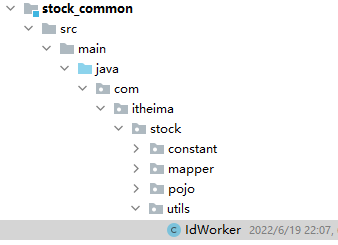
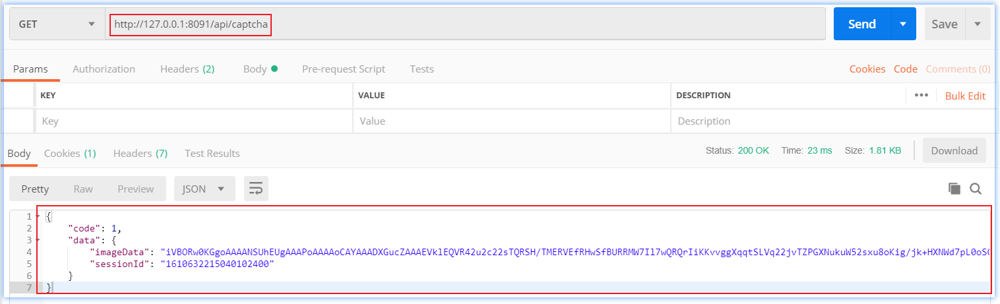
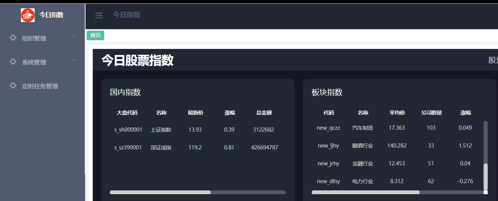
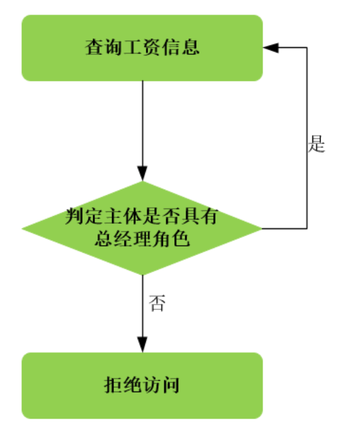
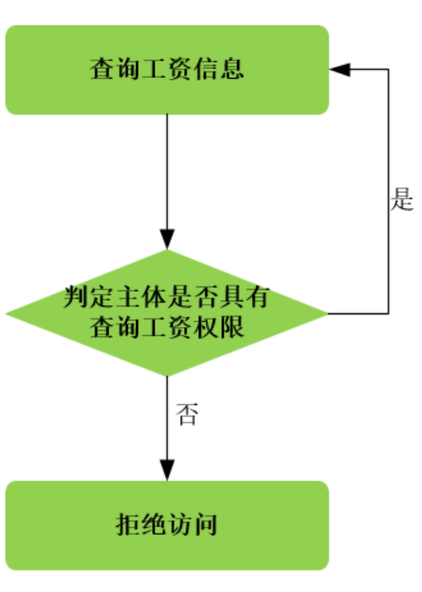
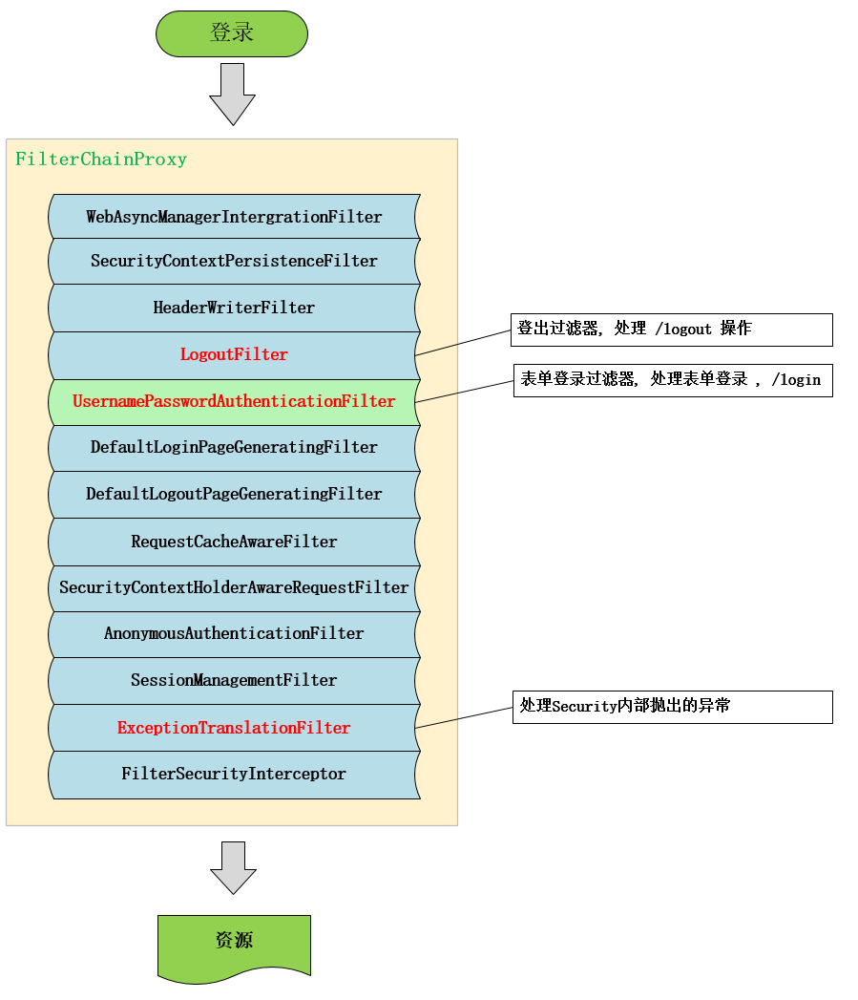

# 用户登录及权限验证模块

## 用户简单登录功能实现——用户名-密码

### 1. 访问接口定义

我们发送用户登录报文，需要先明确请求和响应报文应该具有的格式：

~~~json
请求接口：/api/login
请求方式：POST
请求数据示例：
   {
       username:'zhangsan',//用户名
       password:'666',//密码
       //code:'1234' //校验码
    }
响应数据：
    {
        "code": 1,//成功1 失败0
        "data": { //data为响应的具体数据，不同的接口，data数据格式可能会不同
                "id":"1237365636208922624",
                "username":"zhangsan",
                "nickName":"xiaozhang",
                "phone":"1886702304"
        }
    }
~~~

那么于是就要在后端项目中封装对应的请求和响应的vo值对象

com.async.stock.vo
                  ├── req  # 请求数据封装类
                  └── resp # 响应数据封装类


vo对象：

~~~java
package com.async.stock.vo.req;

import lombok.Data;

/**
 * @author by async
 * @Date 2024/10/03
 * @Description 登录请求vo
 */
@Data
public class LoginReqVo {
    /**
     * 用户名
     */
    private String username;
    /**
     * 密码
     */
    private String password;
    /**
     * 验证码
     */
    //private String code;
}
~~~

登录响应vo：

~~~java
package com.async.stock.vo.resp;

import lombok.AllArgsConstructor;
import lombok.Builder;
import lombok.Data;
import lombok.NoArgsConstructor;

/**
 * @author by async
 * @Date 2024/10/03
 * @Description 登录后响应前端的vo
 */
@Data
@NoArgsConstructor
@AllArgsConstructor
@Builder
public class LoginRespVo {
    /**
     * 用户ID
     * 将Long类型数字进行json格式转化时，转成String格式类型,避免精读丢失
     */
    @JsonSerialize(using = ToStringSerializer.class)
    /**
     * 电话
     */
    private String phone;
    /**
     * 用户名
     */
    private String username;
    /**
     * 昵称
     */
    private String nickName;

}
~~~

### 2. 密码加密匹配器

后端数据库中不能直接存储密码明文，而是要存储加密的密码。这里由一个密码加密和校验工具包实现。它的原理是每次加密生成一个随机的salt值，同明文一起加密（其实上是哈希）。然后再验证阶段，将密文中的salt和密码密文提取（所以应该是有单独哈希salt值，因为能提取出两部分）把待验证密码和salt加密（哈希），看是否与密文相同。

> 详见有关Bcrypt算法的讲解

引入依赖资源：

~~~xml
<!--密码加密和校验工具包-->
<dependency>
    <groupId>org.springframework.security</groupId>
    <artifactId>spring-security-crypto</artifactId>
</dependency>
~~~

配置密码加密匹配bean：

~~~java
package com.async.stock.config;

import org.springframework.context.annotation.Bean;
import org.springframework.context.annotation.Configuration;
import org.springframework.security.crypto.bcrypt.BCryptPasswordEncoder;
import org.springframework.security.crypto.password.PasswordEncoder;

/**
 * @author by async
 * @Description 定义公共配置类
 */
@Configuration
public class CommonConfig {
    /**
     * 密码加密器
     * BCryptPasswordEncoder方法采用SHA-256对密码进行加密
     * @return
     */
    @Bean
    public PasswordEncoder passwordEncoder(){
        return new BCryptPasswordEncoder();
    }
}
~~~

密码加密测试：

~~~java
@SpringBootTest
public class TestAll {
    @Autowired
    private PasswordEncoder passwordEncoder;
        @Test
    public void testPwd(){
        String pwd="1234";
        //加密  $2a$10$WAWV.QEykot8sHQi6FqqDOAnevkluOZJqZJ5YPxSnVVWqvuhx88Ha
        String encode = passwordEncoder.encode(pwd);
        System.out.println(encode);
        /*
            matches()匹配明文密码和加密后密码是否匹配，如果匹配，返回true，否则false
            just test
         */
        boolean flag = passwordEncoder.matches(pwd, 				          "$2a$10$WAWV.QEykot8sHQi6FqqDOAnevkluOZJqZJ5YPxSnVVWqvuhx88Ha");
        System.out.println(flag);
    }
}    
~~~


### 3. 登录接口

#### 3.1 控制层

先写面向用户的控制层的对应控制器：

~~~java
package com.async.stock.controller;

import com.async.stock.service.UserService;
import com.async.stock.vo.req.LoginReqVo;
import com.async.stock.vo.resp.LoginRespVo;
import com.async.stock.vo.resp.R;
import org.springframework.beans.factory.annotation.Autowired;
import org.springframework.web.bind.annotation.*;

/**
 * @author by async
 * @Date 2024/10/04
 * @Description 定义用户访问层
 */
@RestController
@RequestMapping("/api")
public class UserController {

    @Autowired
    private UserService userService;

    /**
     * 用户登录功能实现
     * @param vo
     * @return
     */
    @PostMapping("/login") 
    // @PostMapping注解用于映射HTTP的POST请求到该方法。此处将路径 "/login" 的POST请求映射到 login 方法。
    // 当客户端发送POST请求到 "/login" 时，这个方法会被调用来处理请求。
    public R<LoginRespVo> login(@RequestBody LoginReqVo vo) {
        // R<LoginRespVo> 表示方法返回一个泛型为 LoginRespVo 类型的 R 对象。
        // R 是一个封装了响应结果的类，LoginRespVo 是登录请求的响应数据对象，可能包含登录后的Token等信息。

        // @RequestBody 注解用于将HTTP请求体中的JSON数据转换为LoginReqVo对象。
        // LoginReqVo 封装了客户端发送的登录数据（如用户名和密码），通过 vo 参数传递给方法。

        R<LoginRespVo> r = this.userService.login(vo); 
        // 调用 userService 的 login 方法，传入 vo 对象。userService 负责处理具体的登录业务逻辑（如验证用户名、密码等）。
        // login 方法返回一个 R<LoginRespVo> 对象，封装了登录的结果（成功或失败的状态、信息等）。

        return r; 
        // 返回 R 对象，该对象将作为响应返回给客户端，包含登录的处理结果。
    }
}
~~~

#### 3.2 服务层

再写server层中的接口定义：

~~~java
package com.async.stock.service;

import com.async.stock.vo.req.LoginReqVo;
import com.async.stock.vo.resp.LoginRespVo;
import com.async.stock.vo.resp.R;

/**
 * @author by itheima
 * @Date 2021/12/30
 * @Description 用户服务
 */
public interface UserService {
    /**
     * 用户登录功能实现
     * @param vo
     * @return
     */
    R<LoginRespVo> login(LoginReqVo vo);
}
~~~

再写登录服务接口的具体实现：

~~~java
package com.async.stock.service.impl;

import com.google.common.base.Strings;
import com.async.stock.common.enums.ResponseCode;
import com.async.stock.mapper.SysUserMapper;
import com.async.stock.pojo.SysUser;
import com.async.stock.service.UserService;
import com.async.stock.vo.req.LoginReqVo;
import com.async.stock.vo.resp.LoginRespVo;
import com.async.stock.vo.resp.R;
import org.springframework.beans.BeanUtils;
import org.springframework.beans.factory.annotation.Autowired;
import org.springframework.security.crypto.password.PasswordEncoder;
import org.springframework.stereotype.Service;

/**
 * @author by async
 * @Date 2024/10/04
 * @Description 定义服务接口实现
 */
@Service("userService")
public class UserServiceImpl implements UserService {

    @Autowired
    private SysUserMapper sysUserMapper;

    @Autowired
    private PasswordEncoder passwordEncoder;

    @Override
    public R<LoginRespVo> login(LoginReqVo vo) {
        // 1. 检查请求对象是否为空，并且用户名和密码是否为空字符串
        //    如果有任何一项为空，则返回错误响应，提示数据错误
        if (vo == null || StringUtils.isBlank(vo.getUsername()) || StringUtils.isBlank(vo.getPassword())) {
            // 检查 vo 对象是否为 null，以及 vo 中的用户名和密码是否为空或仅包含空白字符
            // StringUtils.isBlank() 是一个工具方法，用于检查字符串是否为 null、空字符串或仅包含空白字符
            return R.error(ResponseCode.DATA_ERROR.getMessage());
            // 如果上面的条件成立，则返回一个错误响应
            // R.error() 是 R 类中的静态方法，通常用于生成一个表示错误的标准响应对象
            // ResponseCode.DATA_ERROR 是一个枚举，表示数据错误类型
            // getMessage() 用于获取数据错误的消息，比如 "数据错误"
        }

        // 2. 根据传入的用户名从数据库中查询用户信息
        //    如果找不到该用户名对应的用户信息，`user` 将为 null
        SysUser user = this.sysUserMapper.findByUserName(vo.getUsername());

        // 3. 判断查询到的用户信息是否为空，如果为空说明用户不存在，直接返回密码错误的提示
        //    如果用户存在，则继续使用 `passwordEncoder` 验证用户传入的明文密码与数据库中存储的加密密码是否匹配
        //    `passwordEncoder.matches` 方法会自动处理加密时使用的随机盐值
        if (user == null || !passwordEncoder.matches(vo.getPassword(), user.getPassword())) {
            return R.error(ResponseCode.SYSTEM_PASSWORD_ERROR.getMessage());
        }

        // 4. 如果用户名和密码验证通过，组装登录成功返回的数据
        LoginRespVo respVo = new LoginRespVo();

        // 5. 使用 `BeanUtils.copyProperties` 方法将 `SysUser` 对象中的属性值复制到 `LoginRespVo` 对象中
        //    注意：两个对象的属性名称和类型必须一致，否则属性值无法正确复制
        BeanUtils.copyProperties(user, respVo);

        // 6. 返回封装了 `LoginRespVo` 的成功响应
        return R.ok(respVo);
    }

}
~~~

#### 3.3 DAO层-持久层

定义mapper方法

在stock_common工程中SysUserMapper下定义接口方法：

~~~java
    /**
     * 根据用户名查询用户信息
     * @param username
     * @return
     */
    SysUser findByUserName(@Param("username") String username);
~~~

绑定xml：

~~~xml
    <select id="findByUserName" resultMap="BaseResultMap">
        <!-- resultMap用于指定MyBatis如何将查询结果映射为Java对象。BaseResultMap是一个已经预定义好的ResultMap，用于将SQL查询结果与SysUser类中的属性进行映射。 -->
        select <include refid="Base_Column_List"/> from sys_user where
        <!-- 使用 <include> 标签引入一个预定义的 SQL 片段，refid="Base_Column_List" 引用了已定义的字段列表 -->
    	<!-- 该字段列表通常包含 sys_user 表中的所有列，这样可以避免重复编写列名 -->
        username=#{username}
    </select>
~~~

#### 3.4 Postman测试


## 密码匹配器——Bcrypt算法

Bcrypt 是一种用于密码散列的加密算法，它由 Niels Provos 和 David Mazières 在 1999 年设计。Bcrypt 特别设计用于保护密码的存储，其核心目的是使破解密码的尝试变得极其困难。这是通过使用盐（salt）和重复工作因子（work factor，也称为成本因子）来增加散列过程的复杂性和时间成本来实现的。

### Bcrypt 的工作原理：

1. **盐（Salt）**:
   - Bcrypt 算法在密码散列过程中使用一个随机生成的盐（salt）。盐是一个随机值，与密码一起散列，以防止同一密码在每次散列时都生成相同的结果。这有助于抵御彩虹表攻击，彩虹表是预先计算好的散列值表。

2. **成本因子（Cost Factor）**:
   - Bcrypt 允许你设置一个成本因子（一个整数），它基本上决定了散列函数的运行时间和复杂性。成本因子越高，生成散列和验证密码的过程越慢。这增加了暴力破解攻击的难度，因为每个密码猜测的计算成本都更高。

3. **算法结构**:
   - Bcrypt 基于 Blowfish 对称块加密算法构建，它将盐、成本因子和密码结合起来生成一个散列值。最终的散列包括算法的版本、成本因子、使用的盐和散列本身。

### 使用 Bcrypt 的好处：

- **防止彩虹表攻击**：由于每个密码散列都使用了唯一的盐，即使是相同的密码也会产生不同的散列结果。
- **自适应**：随着硬件性能的提升，可以通过增加成本因子来增加散列的复杂性，从而使算法适应未来的威胁。
- **抵御暴力攻击**：由于散列的计算成本很高，暴力破解攻击变得不可行。

### 示例（Java 中的使用）：

在 Java 中，你可以使用 `BCryptPasswordEncoder` 类，它是 Spring Security 框架提供的，用于在应用程序中实现 Bcrypt 散列和验证。

```java
import org.springframework.security.crypto.bcrypt.BCryptPasswordEncoder;

public class BcryptExample {
    public static void main(String[] args) {
        BCryptPasswordEncoder encoder = new BCryptPasswordEncoder();
        
        // 加密密码
        String rawPassword = "password123";
        String encodedPassword = encoder.encode(rawPassword);
        System.out.println("Encoded Password: " + encodedPassword);
        
        // 验证密码
        boolean isMatch = encoder.matches(rawPassword, encodedPassword);
        System.out.println("Password match: " + isMatch);
    }
}
```

这个例子展示了如何使用 BCrypt 生成密码的散列值，并如何验证输入密码是否与存储的散列值匹配。

总的来说，Bcrypt 是一种强大的密码散列机制，非常适合保护用户密码等敏感数据，确保应用程序的安全性。

### 盐值的作用和处理方式

在 BCrypt 哈希过程中，盐值（salt）本身不需要经过哈希处理。盐值的目的是为了添加到密码上，增加密码的复杂度和唯一性，从而防止彩虹表攻击和提高破解难度。盐值是明文存储在哈希字符串中的，这样在验证密码时可以直接提取并使用。

1. **作用**：
   - 盐值通过确保即使两个用户具有相同的密码，他们的哈希值也将不同，从而提供额外的安全性。
   - 盐值使得每次对相同密码的哈希都是唯一的，因此即使攻击者得到了哈希值，也不能简单地通过查找预生成的哈希值（彩虹表）来找到原密码。

2. **处理方式**：
   - 在生成哈希时，首先生成一个随机的盐值。
   - 这个盐值与用户的密码明文结合，然后整体进行哈希运算。
   - 盐值以明文形式与结果哈希值一起存储，通常是作为哈希字符串的一部分直接前置在哈希值之前。

3. **存储和使用**：
   - 存储的哈希字符串通常包含几个部分：标识哈希类型的前缀、成本因子、盐值和实际的哈希值。
   - 在密码验证时，从存储的哈希字符串中直接提取盐值，然后将其与提供的密码明文一起使用相同的哈希算法重新计算哈希。
   - 如果重新计算的哈希值与存储的哈希值匹配，则密码验证成功。

### 结论

因此，盐值在 BCrypt 中不需要被哈希处理，它是作为密码哈希过程的一部分而直接使用的，并以明文形式存储以便将来的密码验证可以重用相同的盐值。这样的设计确保了盐值的目的——提高密码存储的安全性——得以实现，而不会降低系统的验证效率。


## 加密中Pepper是什么？

**Pepper** 是一个在密码存储安全性中使用的概念，它类似于 **salt**，但有几个关键的区别。Pepper 通常用于增强存储密码的哈希值的安全性，使得即使在数据库被泄露的情况下，攻击者也更难破解密码。以下是 pepper 的一些基本特点：

### 1. 定义和用途

Pepper 是一个固定的值，用于密码哈希过程中与用户的密码和可能的盐值一起使用。它的主要目的是为了增加密码哈希过程的复杂度和安全性。

### 2. 存储和管理

不同于盐值，pepper 不是随机生成的，也不是为每个用户密码存储一个唯一值。它通常是一个系统级的密钥，存储在应用程序配置中，或者硬编码在程序中。Pepper 通常不会存储在数据库中，这意味着即使数据库被完全泄露，没有访问应用程序的内部，攻击者也无法获取 pepper 的值。

### 3. 安全性增强

Pepper 的使用增加了所谓的 "工作因子"，即破解密码所需的计算复杂度。它在与盐值一起使用时，可以有效地阻止使用彩虹表和其他预计算攻击方法破解密码。

### 4. 应用方式

在实际应用中，pepper 可以在哈希密码前与用户的密码（和盐值）一起加入到哈希函数中。例如，如果使用 SHA-256 哈希函数，哈希过程可能是将用户密码、盐值和 pepper 连接后再进行哈希。

### 5. 验证密码

当需要验证用户输入的密码时，系统会取得相同的 pepper 和盐值，将它们与输入的密码按相同的方法组合，然后进行哈希处理。如果结果与数据库中存储的哈希值相匹配，则认证成功。

### 6. 安全性讨论

虽然 pepper 提供了额外的安全保障，但它的安全性依赖于 pepper 的保密性。如果 pepper 被泄露，那么其提供的所有额外安全性都将丧失。因此，保护好应用程序的配置和源代码是非常重要的。

Pepper 是密码存储策略中的一个高级特性，不是所有系统都需要或实现它，但对于提高存储密码的安全性，尤其是在对安全要求非常高的环境中，它是一个非常有价值的添加。

## Session-Cookie机制

### 1. **传统 Session-Cookie 机制的基本概念**

在传统的 **Session-Cookie 机制** 中，**Session** 和 **Cookie** 扮演了不同的角色，它们相互配合实现了用户状态的管理。

#### 1.1 Cookie

**Cookie** 是由服务器生成，并保存在客户端（通常是浏览器）的一小段数据。主要用于在客户端和服务器之间存储少量的状态信息。Cookie 有以下几个特点：

- **作用范围**：存储在客户端的浏览器中，自动随请求发送给服务器。
- **生命周期**：可以设置 Cookie 的有效期。会话级 Cookie 在浏览器关闭时失效，而持久化 Cookie 会根据设置的过期时间决定有效期。
- **数据量限制**：每个 Cookie 的大小限制通常为 4KB。

#### 1.2 Session

**Session** 是一种服务器端的用户会话管理机制，用于存储与用户会话相关的信息。服务器在用户登录或第一次请求时生成一个唯一的 **SessionId**，用于标识用户的会话。Session 的特点：

- **作用范围**：存储在服务器端，由服务器管理。
- **生命周期**：Session 通常在用户会话结束（如浏览器关闭）或设定的过期时间到达时失效。
- **数据量限制**：Session 存储在服务器上，没有太严格的数据大小限制。

### 2. **Session-Cookie 机制的工作原理**

- **Cookie 负责存储会话标识符**：当用户第一次访问网站时，服务器生成一个唯一的 `SessionId`，并将该 `SessionId` 通过 HTTP 响应的 Cookie 传递给浏览器。浏览器将 `SessionId` 保存到客户端的 Cookie 中。

- **Session 负责存储会话数据**：服务器端为每个用户创建一个 Session，服务器将用户的相关信息（如登录状态、用户信息等）存储在该 Session 中，使用 `SessionId` 作为唯一标识符。

- **会话期间的数据传递**：
  - 之后每次用户请求时，浏览器会自动携带 Cookie 中的 `SessionId` 发送给服务器。
  - 服务器接收到 `SessionId` 后，可以在服务器的 Session 中找到该用户的会话数据，从而继续处理用户的请求。

### 3. **Session 和 Cookie 的区别**

| **区别点**     | **Session**                                               | **Cookie**                                                   |
| -------------- | --------------------------------------------------------- | ------------------------------------------------------------ |
| **存储位置**   | Session 存储在 **服务器端**。                             | Cookie 存储在 **客户端（浏览器）**。                         |
| **作用对象**   | 用于存储用户的 **会话数据**，通常是敏感信息，如用户状态。 | 用于存储 **小数据**，如会话标识符（`SessionId`）、偏好设置等。 |
| **生命周期**   | 由服务器端控制，通常在会话结束或达到超时时间时失效。      | 可以设置过期时间，持久化的 Cookie 可在浏览器关闭后继续有效。 |
| **安全性**     | 更加安全，因为数据存储在服务器端，不暴露给客户端。        | 安全性较低，所有数据存储在客户端，容易被用户篡改。           |
| **数据存储量** | 数据存储在服务器上，**不受浏览器限制**。                  | 受限于浏览器，通常每个 Cookie 限制在 **4KB** 大小以内。      |
| **使用场景**   | 适合存储敏感的、较大数据量的会话信息，如用户登录状态。    | 适合存储一些非敏感信息，如页面偏好设置或 SessionId。         |

### 4. **Session 和 Cookie 的配合**

- **Cookie 存储 `SessionId`**：Cookie 的主要作用是保存 `SessionId`，并在后续的请求中发送给服务器。它就像用户身份的凭证，告诉服务器这是谁的会话。

- **Session 存储会话数据**：服务器端的 Session 存储了与用户会话相关的所有数据，如登录状态、用户信息、购物车等，使用 `SessionId` 作为标识符来区分不同的会话。

### 5. **Session 和 Cookie 的配合流程**

1. **首次请求**：
   - 用户首次访问网站时，服务器生成一个 `SessionId`，并通过 Cookie 将其发送到客户端。
   - 同时，服务器在内部创建一个 Session，并将 `SessionId` 与会话数据关联。

2. **后续请求**：
   - 用户再次请求时，浏览器会自动携带 Cookie 中存储的 `SessionId`。
   - 服务器根据 `SessionId` 找到对应的 Session，读取会话数据，继续为用户提供服务。

单体架构基于session-cookie机制实现验证码流程：


### 6. **总结：Session 和 Cookie 的关系与区别**

- **Cookie** 是一种存储在客户端的小型数据，它负责在客户端和服务器之间传递会话标识符。
- **Session** 是存储在服务器端的，用于保存用户会话数据。通过 `SessionId` 标识不同的用户会话。
- **两者的配合**：Cookie 用于保存会话标识符 `SessionId`，Session 用于存储实际的会话数据。Session 依赖于 Cookie 中的 `SessionId` 来识别用户的会话。

在实际使用中，Session 更适合处理敏感数据，而 Cookie 适合处理轻量级的数据和传递 `SessionId` 这类非敏感信息。

## Session-Cookies机制在跨域和集群环境下存在的问题

在前后端分离架构中，传统的 **Session-Cookie 机制** 会面临一些新的问题，主要体现在 **跨域请求、集群环境下的 Session 共享** 和 **安全性问题**。下面详细解释这些问题及其对前后端分离架构的影响：

### 1. **跨域请求中的 Session-Cookie 问题**

#### 1.1 什么是跨域？

在前后端分离的架构中，前端应用和后端服务通常部署在不同的域名、端口或协议下，这就会引发 **跨域请求** 问题。例如：

- 前端在 `http://frontend.com`，后端在 `http://api.backend.com`。
- 用户在前端发起请求时，浏览器会判断这是跨域请求。

#### 1.2 跨域情况下 Cookie 的限制

**问题**：传统的 `Session-Cookie` 机制在跨域情况下表现不好，尤其是 **Cookie 的自动发送**。

- **SameSite 属性**：为了防止跨站请求伪造（CSRF）攻击，现代浏览器对 Cookie 的跨域行为进行了限制。默认情况下，Cookie 的 `SameSite` 属性是 `Lax` 或 `Strict`，这意味着：
  - `Strict`：完全禁止跨站点请求携带 Cookie。
  - `Lax`：只有在某些安全的 GET 请求中允许 Cookie 携带，而对于敏感操作（如 POST、PUT 请求）则禁止。

- **问题表现**：
  - 当前端与后端不在同一个域时（跨域），用户请求后端 API 时，浏览器可能不会自动发送 Cookie。
  - 由于 Cookie 中包含 `SessionId`，如果浏览器不发送 Cookie，那么后端就无法识别用户的 Session，导致会话失效，用户需要重新登录。

#### 1.3 跨域请求的解决方法

**解决方案**：

- **CORS**（跨域资源共享）：允许后端通过设置 CORS（Cross-Origin Resource Sharing）来解决跨域问题，后端需要明确配置允许的源、方法、头部以及是否允许携带 Cookie。
- **SessionId 放在请求头或 URL 中**：一种解决方法是通过将 `SessionId` 显式放入 HTTP 请求的自定义头部或 URL 参数中，而不是依赖浏览器自动携带的 Cookie。

### 2. **集群环境下的 Session 共享问题**

#### 2.1 单点 Session 问题

传统的 Session 是存储在服务器的内存中的，如果后端应用扩展为多个实例（如在不同的服务器节点上部署），Session 的存储会出现问题。这种情况被称为 **Session 单点问题**。

**问题表现**：

- 在负载均衡的场景下，用户每次请求可能会被路由到不同的服务器实例。
- 由于每个服务器实例的 Session 是存储在各自的内存中，某个实例上创建的 Session 在其他实例上是不可见的，导致用户状态丢失，强制用户重新登录。

#### 2.2 集群环境下的 Session 共享问题

**集群环境中，Session 的共享问题** 是指多个服务器节点需要共享同一个用户的 Session 数据，但因为 Session 存储在各自服务器的内存中，无法在不同节点间自动同步。

**解决方案**：

- **Session 复制**：服务器节点之间复制 Session 数据，但会增加网络和同步的开销，且不够高效。
- **Session 粘性（Sticky Session）**：通过负载均衡器确保同一个用户的请求始终路由到同一个服务器节点。但这种方法并不适用于动态扩容或节点故障的情况。
- **外部 Session 存储**：将 Session 存储移到 **外部存储**，如 Redis、数据库等，使得多个服务器节点可以共享 Session 数据。Redis 是目前常见的外部 Session 存储解决方案，具备高效的分布式数据存储能力。

### 3. **安全性问题**

#### 3.1 Cookie 安全问题

在前后端分离架构下，Cookie 存在以下潜在的安全问题：

- **Cookie 劫持**：因为 Cookie 是保存在客户端的，攻击者可以通过各种手段（如 XSS 攻击）窃取用户的 Cookie。
- **跨站脚本攻击（XSS）**：攻击者通过注入恶意脚本来窃取用户的 Cookie 或 Session 信息，从而获取用户的身份。
- **跨站请求伪造（CSRF）**：攻击者通过伪造用户的请求，利用用户的 SessionId 执行恶意操作。

**解决方案**：

- **HttpOnly 和 Secure 属性**：可以通过设置 Cookie 的 `HttpOnly` 属性来防止 JavaScript 访问 Cookie，从而减少 XSS 风险；通过设置 `Secure` 属性使 Cookie 只能通过 HTTPS 传输，防止网络中间人攻击。
- **SameSite 属性**：设置 Cookie 的 `SameSite` 属性，防止 CSRF 攻击。`SameSite=Strict` 可以防止跨站点请求携带 Cookie。

#### 3.2 Session 固定攻击（Session Fixation）

在前后端分离中，攻击者可能会通过特定的手段，强迫用户使用一个已知的 `SessionId`，从而实施攻击。这种攻击称为 **Session 固定攻击**。

**解决方案**：

- 在用户登录成功后，重新生成一个新的 `SessionId`，防止攻击者利用之前已知的 `SessionId`。

### 4. **Session 生命周期管理**

传统的 Session 通常具有一定的生命周期，比如 30 分钟过期。但在前后端分离架构中，前端应用可能会向多个不同的后端服务发送请求，导致 Session 生命周期的管理复杂化。

- **问题表现**：如果后端使用默认的 Session 机制，且每个后端服务的 Session 彼此独立管理，可能会出现一个服务的 Session 失效，而另一个服务的 Session 仍然有效的情况，导致用户体验不一致。

**解决方案**：

- 使用统一的 **Session 共享机制**，如 Redis 统一存储 Session，并设置全局的 Session 生命周期管理规则。

### 5. **总结：前后端分离下 Session-Cookie 机制存在的问题**

1. **跨域请求导致 Cookie 无法自动携带**：前后端分离时，由于浏览器的跨域安全限制，Session-Cookie 机制在不同域之间难以正常工作。
2. **Session 共享问题**：在集群环境中，每个服务器节点的 Session 无法共享，导致用户状态丢失，需要引入 Redis 或数据库等外部存储机制来解决。
3. **安全性问题**：需要额外注意 Cookie 的安全性，避免 CSRF、XSS、Session 固定攻击等常见的 Web 安全问题。
4. **生命周期管理问题**：前后端分离时，多个后端服务的 Session 生命周期需要统一管理，避免用户体验不一致。

为了适应前后端分离的架构，常见的解决方案包括引入 **Token（如 JWT）** 替代传统的 `SessionId`，或者使用 Redis 等外部存储来模拟传统的 `Session` 机制，从而更好地适应分布式和跨域场景。

## SessionID唯一性解决方案——雪花算法

```java
package com.async.stock.utils;

import java.lang.management.ManagementFactory;
import java.net.InetAddress;
import java.net.NetworkInterface;

/**
 * 分布式自增长ID实现，底层基于Twitter的Snowflake算法。
 * 64位ID的结构包括：
 * - 符号位(1位)：始终为0，表示正数。
 * - 时间戳(42位)：表示当前时间戳。
 * - 数据中心ID(5位)：表示不同的数据中心。
 * - 机器ID(5位)：表示同一数据中心内不同的机器。
 * - 序列号(12位)：表示同一毫秒内生成的序列号。
 * @author itheima
 */
public class IdWorker {
    // 时间起始标记点，作为基准，一般取系统的最近时间，作为生成ID的基准
    private final static long twepoch = 1288834974657L;
    
    // 机器ID位数，最大支持32台机器
    private final static long workerIdBits = 5L;
    
    // 数据中心ID位数，最大支持32个数据中心
    private final static long datacenterIdBits = 5L;
    
    // 机器ID最大值
    private final static long maxWorkerId = -1L ^ (-1L << workerIdBits);
    
    // 数据中心ID最大值
    private final static long maxDatacenterId = -1L ^ (-1L << datacenterIdBits);
    
    // 毫秒内自增位数，最大支持每毫秒4096个ID
    private final static long sequenceBits = 12L;
    
    // 机器ID向左移12位
    private final static long workerIdShift = sequenceBits;
    
    // 数据中心ID左移17位（5+12）
    private final static long datacenterIdShift = sequenceBits + workerIdBits;
    
    // 时间戳左移22位（5+5+12）
    private final static long timestampLeftShift = sequenceBits + workerIdBits + datacenterIdBits;

    // 序列号掩码，确保序列号在范围内循环
    private final static long sequenceMask = -1L ^ (-1L << sequenceBits);
    
    // 上次生成ID的时间戳
    private static long lastTimestamp = -1L;
    
    // 当前毫秒内的序列号
    private long sequence = 0L;
    
    // 机器ID
    private final long workerId;
    
    // 数据中心ID
    private final long datacenterId;

    /**
     * 构造函数：根据机器ID和数据中心ID创建实例
     */
    public IdWorker(){
        this.datacenterId = getDatacenterId(maxDatacenterId);
        this.workerId = getMaxWorkerId(datacenterId, maxWorkerId);
    }

    /**
     * 参数化构造函数：手动指定机器ID和数据中心ID
     * @param workerId 工作机器ID
     * @param datacenterId 数据中心ID
     */
    public IdWorker(long workerId, long datacenterId) {
        // 检查workerId是否超出最大范围
        if (workerId > maxWorkerId || workerId < 0) {
            throw new IllegalArgumentException(String.format("worker Id can't be greater than %d or less than 0", maxWorkerId));
        }
        // 检查datacenterId是否超出最大范围
        if (datacenterId > maxDatacenterId || datacenterId < 0) {
            throw new IllegalArgumentException(String.format("datacenter Id can't be greater than %d or less than 0", maxDatacenterId));
        }
        this.workerId = workerId;
        this.datacenterId = datacenterId;
    }

    /**
     * 获取下一个唯一ID，使用 synchronized 确保线程安全
     * @return 唯一ID
     */
    public synchronized long nextId() {
        long timestamp = timeGen();
        
        // 如果当前时间小于上次生成ID的时间，表示系统时钟回退，抛出异常
        if (timestamp < lastTimestamp) {
            throw new RuntimeException(String.format("Clock moved backwards. Refusing to generate id for %d milliseconds", lastTimestamp - timestamp));
        }

        // 如果在同一毫秒内，序列号自增
        if (lastTimestamp == timestamp) {
            sequence = (sequence + 1) & sequenceMask;
            
            // 序列号溢出，等待下一毫秒
            if (sequence == 0) {
                timestamp = tilNextMillis(lastTimestamp);
            }
        } else {
            // 如果是新的一毫秒，序列号归零
            sequence = 0L;
        }

        // 更新上次生成ID的时间戳
        lastTimestamp = timestamp;
        
        // 组合ID：时间戳、数据中心ID、机器ID和序列号
        long nextId = ((timestamp - twepoch) << timestampLeftShift)
                    | (datacenterId << datacenterIdShift)
                    | (workerId << workerIdShift)
                    | sequence;

        return nextId;
    }

    /**
     * 如果当前时间戳小于或等于上次生成的时间戳，等待到下一毫秒
     * @param lastTimestamp 上一次生成ID的时间戳
     * @return 下一毫秒的时间戳
     */
    private long tilNextMillis(final long lastTimestamp) {
        long timestamp = this.timeGen();
        while (timestamp <= lastTimestamp) {
            timestamp = this.timeGen();
        }
        return timestamp;
    }

    /**
     * 获取当前系统时间（毫秒）
     * @return 当前时间戳
     */
    private long timeGen() {
        return System.currentTimeMillis();
    }

    /**
     * 获取最大机器ID
     * 通过MAC地址和JVM PID来生成唯一的机器ID
     * @param datacenterId 数据中心ID
     * @param maxWorkerId 最大机器ID
     * @return 机器ID
     */
    protected static long getMaxWorkerId(long datacenterId, long maxWorkerId) {
        StringBuffer mpid = new StringBuffer();
        mpid.append(datacenterId);
        String name = ManagementFactory.getRuntimeMXBean().getName();
        if (!name.isEmpty()) {
            mpid.append(name.split("@")[0]);
        }
        return (mpid.toString().hashCode() & 0xffff) % (maxWorkerId + 1);
    }

    /**
     * 获取数据中心ID
     * 通过机器的MAC地址生成数据中心ID
     * @param maxDatacenterId 最大数据中心ID
     * @return 数据中心ID
     */
    protected static long getDatacenterId(long maxDatacenterId) {
        long id = 0L;
        try {
            InetAddress ip = InetAddress.getLocalHost();
            NetworkInterface network = NetworkInterface.getByInetAddress(ip);
            if (network == null) {
                id = 1L;
            } else {
                byte[] mac = network.getHardwareAddress();
                id = ((0x000000FF & (long) mac[mac.length - 1])
                    | (0x0000FF00 & (((long) mac[mac.length - 2]) << 8))) >> 6;
                id = id % (maxDatacenterId + 1);
            }
        } catch (Exception e) {
            System.out.println("getDatacenterId: " + e.getMessage());
        }
        return id;
    }
}
```

代码中的解释：

1. **生成的唯一ID结构**：
   - 通过 **符号位(1位) + 时间戳(42位) + 数据中心ID(5位) + 机器ID(5位) + 序列号(12位)** 组合生成 64 位唯一ID。
   - 时间戳确保有序性，数据中心ID和机器ID确保分布式下的唯一性，序列号确保同一毫秒内的不同ID。

2. **时间戳和序列号的处理**：
   - 如果两次生成ID的时间在同一毫秒内，序列号自增，最大支持每毫秒 4096 个不同的ID。
   - 如果超过4096个，则等待下一毫秒。

3. **生成机器ID和数据中心ID**：
   - 通过 MAC 地址和 JVM 的 PID 来生成唯一的机器ID和数据中心ID，避免同一局域网内机器ID的冲突。


这段 **雪花算法 (Snowflake)** 的实现中有几个值得注意的亮点和关键设计点，帮助确保在分布式环境下生成高效、全局唯一的 ID。以下是一些需要特别注意的关键点：

### 1. **基于时间戳生成唯一 ID**

   - 雪花算法的核心是使用 42 位的时间戳，确保生成的 ID 是有序的。时间戳部分以毫秒为单位，每秒可生成上百万个唯一的 ID。通过时间戳，可以使 ID 基本按生成顺序排列，具备时间顺序性。
   - 该算法确保了在同一时间段内，生成的 ID 是不同的，解决了分布式环境下多个节点同时生成 ID 可能导致冲突的问题。

   **亮点**：

   - **有序性**：基于时间戳生成的 ID 在时间上是递增的，有利于某些需要按顺序存储数据的场景（如数据库）。
   - **高性能**：每秒生成上百万个 ID，适合高并发场景。

### 2. **分布式的唯一性**

   - 雪花算法通过 **数据中心ID (datacenterId)** 和 **机器ID (workerId)** 的组合，确保在分布式系统的多个节点上生成的 ID 也是唯一的。
   - 数据中心 ID 和机器 ID 各占 5 位，总共支持 32 个数据中心和每个数据中心下的 32 台机器。这在中小型分布式系统中是足够的。

   **亮点**：

   - **分布式环境下的唯一性**：通过数据中心 ID 和机器 ID 的划分，即使在大规模分布式系统中，不同节点之间生成的 ID 也不会冲突。
   - **灵活扩展**：最大支持 32 个数据中心和每个数据中心 32 台机器，足够覆盖大多数分布式场景。

### 3. **毫秒内高并发支持**

   - 雪花算法在同一毫秒内生成多个 ID 时，通过 **序列号 (sequence)** 来确保唯一性。在同一毫秒内，最多可以生成 4096 个不同的 ID。
   - 如果当前毫秒内的序列号达到上限，系统会等待到下一毫秒，确保生成的 ID 不会重复。

   **亮点**：

   - **高并发支持**：同一毫秒内最多支持 4096 个并发请求生成不同 ID，足以满足大部分高并发场景。
   - **时间等待机制**：如果序列号超出范围，会等待下一毫秒继续生成 ID，避免冲突。

### 4. **时间回拨处理**

   - 在分布式系统中，系统时间可能会出现回拨现象（即当前时间小于上一次生成 ID 时的时间）。为了避免回拨导致生成的 ID 不合法，雪花算法做了专门的处理：当检测到时间回拨时，直接抛出异常，停止生成 ID。

   **亮点**：

   - **时间回拨安全性**：系统时间发生回拨时，系统会拒绝生成新的 ID，并抛出异常，避免生成重复的 ID。
   - **防止 ID 冲突**：时间回拨问题如果不处理，可能会导致生成的 ID 重复，影响系统的正常运行。通过这个设计，可以有效防止该问题。

### 5. **基于 MAC 地址和 JVM PID 生成的机器 ID**

   - 机器 ID 的生成是基于当前机器的 **MAC 地址** 和 JVM 的 **进程 ID**，这样可以确保即使是不同机器生成的机器 ID 也是唯一的。通过哈希值处理 MAC 地址和 PID，确保机器 ID 在集群中不会重复。

   **亮点**：

   - **唯一性保证**：通过 MAC 地址和 JVM 进程 ID 的组合生成机器 ID，确保同一个数据中心下不同机器的 ID 不会冲突。
   - **跨平台兼容性**：该算法可以运行在不同的平台上，确保每台机器生成唯一的机器 ID。

### 6. **线程安全性**

   - 由于 `nextId()` 方法使用了 `synchronized` 关键字，确保在多线程并发环境下，生成的 ID 仍然是唯一且正确的。每次生成 ID 的过程中，操作都被同步，防止线程间的竞争条件。

   **亮点**：

   - **线程安全**：多线程环境下，不同线程并发调用生成 ID 时，可以确保生成的 ID 是唯一且有序的。
   - **并发效率**：虽然使用了 `synchronized` 锁，但由于生成 ID 的逻辑非常轻量，因此性能仍然很高。

### 7. **快速时间计算**

   - 雪花算法的核心时间操作是基于 `System.currentTimeMillis()`，每次生成 ID 时都会获取当前的时间戳。这种操作非常轻量，因此即使在高并发场景下，时间获取和 ID 生成的性能仍然保持很高。

   **亮点**：

   - **快速时间计算**：使用轻量级的系统时间函数来获取当前时间，保证时间计算的高效性。
   - **低开销**：生成 ID 的时间复杂度非常低，每次生成 ID 都是快速、轻量的操作。

### 总结

雪花算法的设计非常精妙，能够解决分布式系统中的 **全局唯一 ID 生成问题**。其中一些亮点和需要注意的点包括：

1. **基于时间戳的有序性**，适合需要按照时间顺序生成数据 ID 的场景。
2. **分布式的唯一性**，通过数据中心 ID 和机器 ID，确保在分布式系统中的多个节点上生成的 ID 不会重复。
3. **支持毫秒级高并发**，同一毫秒内最多支持 4096 个 ID 生成请求，满足高并发业务需求。
4. **时间回拨的安全处理**，防止生成的 ID 因系统时间回拨而出现重复。
5. **基于 MAC 地址和 JVM PID 生成机器 ID**，保证不同机器生成的机器 ID 不冲突。
6. **线程安全的同步操作**，保证多线程环境下生成的 ID 唯一。

这些设计使得雪花算法成为分布式系统中生成唯一 ID 的高效、可靠解决方案，同时还具备良好的扩展性。

## 用户简单登录功能实现——验证码-Session

### 1. Session跨域与集群解决方案：Redis实现

我们可使用分布式缓存redis模拟session机制，实现验证码的生成和校验功能，核心流程如下：


> 注意事项：需要保证SessionId的唯一性，否则可能会出现用户输入了正确的校验码，但是依旧可能会校验失败的问题；

功能描述：验证码生成功能  

请求路径：/api/captcha 
请求参数：无
请求方式：get
响应数据格式：

```json
{
    "code": 1,
    "data": {
        "imageData": "iVBORw0KGgoAAAANSUh...省略...AAAPoAAAAoCAYAAADX=", //base64格式图片
        "sessionId": "1479063316897845248" //保存在redis中验证码对应的key，模拟sessioinId
    }
}
```

> 说明：前端图片验证码以base64数据格式展示(**点击图片查看源码**)：
>
> 

#### 1. 前后端分离状态识别问题

#### 1.1 前后端分离存在的问题

在单体架构中，验证码验证的流程通常基于 **Session-Cookie** 机制。这种架构下：

- 浏览器首次访问 `/api/captcha` 接口时，服务器生成 `SessionId`，并将验证码存储在 `Session` 中，同时将 `SessionId` 通过 Cookie 响应给客户端。
- 之后，浏览器在发起登录请求时，会携带 Cookie 中的 `SessionId`，服务器根据 `SessionId` 来检索相应的 `Session`，并从中取出验证码进行匹配。

**问题：**

在前后端分离的架构中，浏览器和服务器的交互可能会出现跨域问题，导致请求无法携带 Cookie，而 Session 机制依赖于 Cookie 传递 `SessionId`，因此会出现 **Session 失效** 的情况。

另外，在后端服务扩展为集群时，还需要解决 **Session 共享** 的问题，以避免用户每次访问不同的服务器时，无法访问到之前存储的 `Session` 数据。

##### 1.2 解决 Session 和 Cookie 失效问题

为了解决上述问题，我们可以采用以下方法：

1. **Cookie 失效问题**：
   - 服务器可以生成一个唯一的 `SessionId`，并将 `SessionId` 作为 Redis 的键，将验证码作为对应的值存储在 Redis 中（Redis 替代传统的 Session 机制）。
   - 后端通过响应将 `SessionId` 返回给前端，前端在后续请求中将 `SessionId` 作为参数传递。

2. **Session 过期失效问题**：
   - 借助 Redis 的过期失效机制，设置 `SessionId` 的过期时间，以模拟传统 `Session` 的过期行为。

#### 2. 验证码功能流程分析

我们可以使用 **Redis** 来模拟传统的 `Session` 机制，实现验证码的生成和校验。核心流程如下：

1. **首次访问** `/api/captcha` 接口：
   - 服务器生成一个唯一的 `SessionId` 和随机验证码。
   - 将 `SessionId` 作为键，验证码作为值存储在 Redis 中。
   - 服务器响应将 `SessionId` 返回给前端。

2. **前端携带 `SessionId` 进行验证码验证**：
   - 在登录时，前端发送请求携带 `SessionId` 和用户输入的验证码。
   - 服务器根据 `SessionId` 从 Redis 中查找存储的验证码。
   - 验证用户输入的验证码是否与存储的验证码匹配。

3. **Redis 过期机制**：
   - 设置 Redis 键值对的过期时间，以确保验证码在一段时间后自动失效，模拟 `Session` 的过期行为。

注意事项：

- **确保 `SessionId` 的唯一性**：如果 `SessionId` 不唯一，可能会出现用户输入正确的验证码但校验失败的情况，因此每个 `SessionId` 必须唯一，以便精确匹配用户的验证码。

#### 3. 流程图解析

两张图展示了验证码登录功能的具体实现：

1. ****（基于 Redis 的模拟 Session 机制）：
   - 浏览器首次访问 `/api/captcha`，服务器生成 `SessionId` 并存储验证码在 Redis 中，返回 `SessionId` 给前端。
   - 登录时，浏览器发送带有 `SessionId` 的请求，服务器从 Redis 中检索验证码并验证。

这两种方式都有效实现了验证码的生成和校验，但在前后端分离架构下，第二种基于 Redis 的方案更适合，能够有效解决跨域和集群环境下的 `Session` 共享问题。

#### 4. Redis在docker部署问题

这个部分踩了很多坑，主要需要注意的就是redis在docker上的配置文件问题，并且需要赋予权限

步骤：

1. 下镜像
2. 配置文件
3. 启动
4. 需要注意要和mysql同一个网络
5. spring响应要配置文件

##### 4.1 配置文件redis.conf需要调整的点

- bind 127.0.0.1 # 这行要注释掉

- 解除本地连接限制 protected-mode no # 默认yes，如果设置为yes，则只允许在本机的回环连接，其他机器无法连接。
- daemonize no # 默认no 为不守护进程模式，docker部署不需要改为yes，docker run -d本身就是后台启动，不然会冲突
- requirepass 123456 # 设置密码
- appendonly yes # 持久化

##### 4.2 redis的docker启动命令

```
docker run -d \
​    -p 6379:6379 \
​    --name myredis \
​    -v /docker/redis/redis.conf:/etc/redis/redis.conf \
​    -v /docker/redis/data:/data \
​    --restart=always \ 
​    redis:6.2.5 \
​    redis-server /etc/redis/redis.conf 
```

##### 4.3 spring配置文件

在stock_backend工程引入redis相关依赖：

~~~xml
<!--redis场景依赖-->
<dependency>
    <groupId>org.springframework.boot</groupId>
    <artifactId>spring-boot-starter-data-redis</artifactId>
</dependency>
<!-- redis创建连接池，默认不会创建连接池 -->
<dependency>
    <groupId>org.apache.commons</groupId>
    <artifactId>commons-pool2</artifactId>
</dependency>
~~~

定义application-cache.yml文件专门配置缓存信息：

~~~yaml
spring:
  # 配置缓存
  redis:
    host: 192.168.188.130
    port: 6379
    database: 0 #Redis数据库索引（默认为0）
    lettuce:
      pool:
        max-active: 8 # 连接池最大连接数（使用负值表示没有限制）
        max-wait: -1ms # 连接池最大阻塞等待时间（使用负值表示没有限制）
        max-idle: 8 # 连接池中的最大空闲连接
        min-idle: 1  # 连接池中的最小空闲连接
    timeout: PT10S # 连接超时时间
~~~

> 说明：由于application主配置文件在后续会写入很多其它配置信息，这会导致主配置臃肿难以维护，所以我们把不同的信息独立配置，这样就降低了维护成本；

在主配置文件中激活配置：

~~~yaml
spring.profiles.active=cache
~~~

自定义RedisTemplate序列化：

~~~java
@Configuration
public class RedisCacheConfig {
    /**
     * 配置redisTemplate bean，自定义数据的序列化的方式
     * @param redisConnectionFactory 连接redis的工厂，底层有场景依赖启动时，自动加载
     * @return
     */
    @Bean
    public RedisTemplate redisTemplate(@Autowired RedisConnectionFactory redisConnectionFactory){
        //1.构建RedisTemplate模板对象
        RedisTemplate<String, Object> template = new RedisTemplate<>();
        template.setConnectionFactory(redisConnectionFactory);
        //2.为不同的数据结构设置不同的序列化方案
        //设置key序列化方式
        template.setKeySerializer(new StringRedisSerializer());
        //设置value序列化方式
        template.setValueSerializer(new Jackson2JsonRedisSerializer<>(Object.class));
        //设置hash中field字段序列化方式
        template.setHashKeySerializer(new StringRedisSerializer());
        //设置hash中value的序列化方式
        template.setHashValueSerializer(new Jackson2JsonRedisSerializer<>(Object.class));
        //5.初始化参数设置
        template.afterPropertiesSet();
        return template;
    }
}
~~~

测试redis基础环境：

~~~java
package com.async.stock;

import org.junit.jupiter.api.Test;
import org.springframework.beans.factory.annotation.Autowired;
import org.springframework.boot.test.context.SpringBootTest;
import org.springframework.data.redis.core.RedisTemplate;

/**
 * @author by itheima
 * @Date 2021/12/30
 * @Description
 */
@SpringBootTest
public class TestRedis {

    @Autowired
    private RedisTemplate<String,String> redisTemplate;

    @Test
    public void test01(){
        //存入值
        redisTemplate.opsForValue().set("myname","zhangsan");
        //获取值
        String myname = redisTemplate.opsForValue().get("myname");
        System.out.println(myname);
    }   
}
~~~

效果：


### 2. session一致性算法：雪花算法

#### 2.1 雪花算法介绍

- 后台生成SessionId需要保证全局唯一，我们可借鉴SnowFlake（雪花算法）来实现；

- 什么是雪花算法？

  - 雪花算法是Twitter公司内部为分布式环境下生成唯一ID的一种算法解决方案，底层会帮助我们生成一个64位(比特位)的long类型的Id；

    

#### 2.2 导入雪花算法工具类

各种开发语言都有对雪花算法的实现，我们直接在stock_common工程中引入已写好的工具类即可：

~~~java
package com.async.stock.utils;

import java.lang.management.ManagementFactory;
import java.net.InetAddress;
import java.net.NetworkInterface;

/**
 * 分布式自增长ID实现，底层基于Twitter的Snowflake
 * 64位ID (42(时间戳)+5(机房ID)+5(机器ID)+12(序列号-同毫秒内重复累加))
 * @author itheima
 */
public class IdWorker {
    // 时间起始标记点，作为基准，一般取系统的最近时间（一旦确定不能变动）
    private final static long twepoch = 1288834974657L;
    // 机器标识位数
    private final static long workerIdBits = 5L;
    // 数据中心标识位数
    private final static long datacenterIdBits = 5L;
    // 机器ID最大值
    private final static long maxWorkerId = -1L ^ (-1L << workerIdBits);
    // 数据中心ID最大值
    private final static long maxDatacenterId = -1L ^ (-1L << datacenterIdBits);
    // 毫秒内自增位
    private final static long sequenceBits = 12L;
    // 机器ID偏左移12位
    private final static long workerIdShift = sequenceBits;
    // 数据中心ID左移17位
    private final static long datacenterIdShift = sequenceBits + workerIdBits;
    // 时间毫秒左移22位
    private final static long timestampLeftShift = sequenceBits + workerIdBits + datacenterIdBits;

    private final static long sequenceMask = -1L ^ (-1L << sequenceBits);
    /* 上次生产id时间戳 */
    private static long lastTimestamp = -1L;
    //同毫秒并发控制
    private long sequence = 0L;
	//机器ID
    private final long workerId;
    //机房ID
    private final long datacenterId;

    public IdWorker(){
        this.datacenterId = getDatacenterId(maxDatacenterId);
        this.workerId = getMaxWorkerId(datacenterId, maxWorkerId);
    }
    /**
     * @param workerId
     *            工作机器ID
     * @param datacenterId
     *            序列号
     */
    public IdWorker(long workerId, long datacenterId) {
        if (workerId > maxWorkerId || workerId < 0) {
            throw new IllegalArgumentException(String.format("worker Id can't be greater than %d or less than 0", maxWorkerId));
        }
        if (datacenterId > maxDatacenterId || datacenterId < 0) {
            throw new IllegalArgumentException(String.format("datacenter Id can't be greater than %d or less than 0", maxDatacenterId));
        }
        this.workerId = workerId;
        this.datacenterId = datacenterId;
    }
    /**
     * 获取下一个ID
     *
     * @return
     */
    public synchronized long nextId() {
        long timestamp = timeGen();
        if (timestamp < lastTimestamp) {
            throw new RuntimeException(String.format("Clock moved backwards.  Refusing to generate id for %d milliseconds", lastTimestamp - timestamp));
        }

        if (lastTimestamp == timestamp) {
            // 当前毫秒内，则+1
            sequence = (sequence + 1) & sequenceMask;
            if (sequence == 0) {
                // 当前毫秒内计数满了，则等待下一秒
                timestamp = tilNextMillis(lastTimestamp);
            }
        } else {
            sequence = 0L;
        }
        lastTimestamp = timestamp;
        // ID偏移组合生成最终的ID，并返回ID
        long nextId = ((timestamp - twepoch) << timestampLeftShift)
                | (datacenterId << datacenterIdShift)
                | (workerId << workerIdShift) | sequence;

        return nextId;
    }

    private long tilNextMillis(final long lastTimestamp) {
        long timestamp = this.timeGen();
        while (timestamp <= lastTimestamp) {
            timestamp = this.timeGen();
        }
        return timestamp;
    }

    private long timeGen() {
        return System.currentTimeMillis();
    }

    /**
     * <p>
     * 获取 maxWorkerId
     * </p>
     */
    protected static long getMaxWorkerId(long datacenterId, long maxWorkerId) {
        StringBuffer mpid = new StringBuffer();
        mpid.append(datacenterId);
        String name = ManagementFactory.getRuntimeMXBean().getName();
        if (!name.isEmpty()) {
            /*
             * GET jvmPid
             */
            mpid.append(name.split("@")[0]);
        }
        /*
         * MAC + PID 的 hashcode 获取16个低位
         */
        return (mpid.toString().hashCode() & 0xffff) % (maxWorkerId + 1);
    }

    /**
     * <p>
     * 数据标识id部分
     * </p>
     */
    protected static long getDatacenterId(long maxDatacenterId) {
        long id = 0L;
        try {
            InetAddress ip = InetAddress.getLocalHost();
            NetworkInterface network = NetworkInterface.getByInetAddress(ip);
            if (network == null) {
                id = 1L;
            } else {
                byte[] mac = network.getHardwareAddress();
                id = ((0x000000FF & (long) mac[mac.length - 1])
                        | (0x0000FF00 & (((long) mac[mac.length - 2]) << 8))) >> 6;
                id = id % (maxDatacenterId + 1);
            }
        } catch (Exception e) {
            System.out.println(" getDatacenterId: " + e.getMessage());
        }
        return id;
    }
}
~~~

效果：




在stock_backend工程配置ID生成器bean对象：

~~~java
package com.async.stock.config;

import com.async.stock.utils.IdWorker;
import org.springframework.context.annotation.Bean;
import org.springframework.context.annotation.Configuration;
import org.springframework.security.crypto.bcrypt.BCryptPasswordEncoder;
import org.springframework.security.crypto.password.PasswordEncoder;

/**
 * @author by async
 * @Date 2024/10/04
 * @Description 定义公共配置类
 */
@Configuration
public class CommonConfig {
    
    /**
     * 配置id生成器bean
     * @return
     */
    @Bean
    public IdWorker idWorker(){
        //基于运维人员对机房和机器的编号规划自行约定
        return new IdWorker(1l,2l);
    }
	......
}
~~~

### 3. 验证码功能实现

#### 3.1 控制层

在UserController接口定义访问方法：

~~~java
    /**
     * 生成登录校验码的访问接口
     * @return
     */
    @GetMapping("/captcha")
    public R<Map> getCaptchaCode(){
        return userService.getCaptchaCode();
    }
~~~

#### 3.2 服务层定义生成验证码服务

在UserService服务接口：

~~~java
    /**
     * 登录校验码生成服务方法
     * @return
     */
    R<Map> getCaptchaCode();
~~~

在stock_backend工程引入图片验证码生成工具包：

这个阿里镜像没有，需要自己本地安装maven依赖

~~~xml
<!--hutool万能工具包-->
<dependency>
  <groupId>cn.hutool</groupId>
  <artifactId>hutool-all</artifactId>
</dependency>
~~~

实现验证码功能：

~~~java
    @Autowired
    private RedisTemplate redisTemplate;
	/**
     * 分布式环境保证生成id唯一
     */
    @Autowired
    private IdWorker idWorker;  

    /**
     * 登录校验吗方法实现
     * @return
     */
    @Override
    public R<Map> getCaptchaCode() {
        //参数分别是宽、高、验证码长度、干扰线数量
        LineCaptcha captcha = CaptchaUtil.createLineCaptcha(250, 40, 4, 5);
        //设置背景颜色清灰
        captcha.setBackground(Color.lightGray);
        //自定义校验码生成方式
//        captcha.setGenerator(new CodeGenerator() {
//            @Override
//            public String generate() {
//                return RandomStringUtils.randomNumeric(4);
//            }
//            @Override
//            public boolean verify(String code, String userInputCode) {
//                return code.equalsIgnoreCase(userInputCode);
//            }
//        });
        //获取图片中的验证码，默认生成的校验码包含文字和数字，长度为4
        String checkCode = captcha.getCode();
        log.info("生成校验码:{}",checkCode);
        //生成sessionId
        String sessionId = String.valueOf(idWorker.nextId());
        //将sessionId和校验码保存在redis下，并设置缓存中数据存活时间一分钟
        redisTemplate.opsForValue().set(StockConstant.CHECK_PREFIX +sessionId,checkCode,1, TimeUnit.MINUTES);
        //组装响应数据
        HashMap<String, String> info = new HashMap<>();
        info.put("sessionId",sessionId);
        info.put("imageData",captcha.getImageBase64());//获取base64格式的图片数据
        //设置响应数据格式
        return R.ok(info);
    }
~~~

#### 3.3 定义常量类

项目中一些业务经常会使用一些常量字段，开发者一般会将这些业务相关的常量信息封装到一个常量类中统一维护；

> 举例：在redis中为了方便维护用户登录校验码信息，我们可为key配置一个业务前缀，比如CK:12312323->6677,这样后期开发和运维人员就会很方便的查找出以CK开头的验证码信息了；

作为公共的常量信息类，我们就将它封装到stock_common工程下即可：

```java
package com.async.stock.constant;

/**
 * @author by async
 * @Description 常量类信息封装
 */
public class StockConstant {

    /**
     * 定义校验码的前缀
     */
    public static final String CHECK_PREFIX="CK:";

    /**
     * http请求头携带Token信息key
     */
    public static final String TOKEN_HEADER = "authorization";

    /**
     * 缓存股票相关信息的cacheNames命名前缀
     */
    public static final String STOCK="stock";
}
```

#### 3.4 访问测试

postman:http://127.0.0.1:8091/api/captcha



页面效果：


### 4、完善验证码登录功能

把sessionID和验证码加入用户名密码的登录功能

#### 4.1 完善登录请求VO

LoginReqVo添加rkey属性：

~~~java
package com.async.stock.vo.req;

import lombok.Data;

/**
 * @author by async
 * @Date 2024/10/04
 * @Description 登录请求vo
 */
@Data
public class LoginReqVo {
	//.....

    /**
     * 保存redis随机码的key，也就是sessionId
     */
    private String code; // 如果使用验证码登录，可以解开这个字段，用于接收验证码
    private String sessionId; //保存redis随机码的key，也就是sessionId
}

~~~

#### 4.2 完善登录验证码逻辑

添加校验码校验功能：

~~~java
    /**
     * 用户登录功能
     * @param reqVo
     * @return
     */
    /**
     * 用户登录功能
     * @param vo
     * @return
     */
    @Override
    public R<LoginRespVo> login(LoginReqVo vo) {
        //1.校验参数的合法性
        if (vo==null || StringUtils.isBlank(vo.getUsername()) || StringUtils.isBlank(vo.getPassword())) {
            return R.error(ResponseCode.DATA_ERROR);
        }
        //2.校验验证码和sessionId是否有效
        if (StringUtils.isBlank(vo.getCode()) || StringUtils.isBlank(vo.getSessionId())){
            return R.error(ResponseCode.DATA_ERROR);
        }
        //3.根据Rkey从redis中获取缓存的校验码
        String rCode= (String) redisTemplate.opsForValue().get(StockConstant.CHECK_PREFIX+vo.getSessionId());
        //判断获取的验证码是否存在，以及是否与输入的验证码相同
        if (StringUtils.isBlank(rCode) || ! rCode.equalsIgnoreCase(vo.getCode())) {
            //验证码输入有误
            return R.error(ResponseCode.CHECK_CODE_ERROR);
        }
        //4.根据账户名称去数据库查询获取用户信息
        SysUser dbUser = sysUserMapper.findByUserName(vo.getUsername());
        //5.判断数据库用户是否存在
        if (dbUser==null) {
            return R.error(ResponseCode.ACCOUNT_NOT_EXISTS);
        }
        //6.如果存在，则获取密文密码，然后传入的明文进行匹配,判断是否匹配成功
        if (!passwordEncoder.matches(vo.getPassword(),dbUser.getPassword())) {
            return R.error(ResponseCode.USERNAME_OR_PASSWORD_ERROR);
        }
//        测试
//        String pwd= vo.getPassword();
//        String encode = passwordEncoder.encode(pwd);

//        dbUser.getPassword()
//        if (!passwordEncoder.matches(vo.getPassword(),encode)) {
//            return R.error(ResponseCode.USERNAME_OR_PASSWORD_ERROR);
//        }
        //7.正常响应
        LoginRespVo respVo = new LoginRespVo();
        BeanUtils.copyProperties(dbUser,respVo);
        return R.ok(respVo);
    }
~~~

#### 4.3 登录测试联调

页面登录效果：




## JWT机制

是的，除了使用 Redis 存储 `SessionId` 外，还有一种非常流行且实用的方式是使用 **JWT (JSON Web Token)** 来管理用户的会话和身份验证。与传统的 `SessionId` 存储方式不同，JWT 是一种无状态的认证机制，能够在前后端分离的架构中很好地解决会话管理问题。

### 什么是 JWT？

**JWT** (JSON Web Token) 是一种开放标准（RFC 7519），用于在各方之间传递经过签名的 JSON 对象，以便于验证和安全信息交换。它的工作原理是通过服务器生成一个 **Token**，并将其返回给客户端。客户端在后续请求中携带这个 Token，服务器通过验证 Token 来识别用户的身份。

### JWT 的结构

JWT 通常由三个部分组成，使用 `.` 分隔：

```
Header.Payload.Signature
```

- **Header（头部）**：头部通常包括两部分：类型（JWT）和签名算法（如 HMAC SHA256 或 RSA）。

  ```json
  {
    "alg": "HS256",  // 算法类型
    "typ": "JWT"     // Token 类型
  }
  ```

- **Payload（负载）**：负载部分包含了 **声明（claims）**，即实际传递的数据。这些声明通常包括用户信息以及其他相关数据。常见的标准字段有：

  - `iss` (Issuer)：Token 的发行者
  - `sub` (Subject)：Token 面向的用户
  - `iat` (Issued At)：Token 的签发时间
  - `exp` (Expiration Time)：Token 的过期时间
  - 还可以自定义字段，如用户 ID、角色等信息：

  ```json
  {
    "sub": "1234567890",
    "name": "John Doe",
    "admin": true
  }
  ```

- **Signature（签名）**：签名部分用于确保 Token 的完整性和安全性，防止 Token 被篡改。签名的生成方式如下：

  ```
  HMACSHA256(
    base64UrlEncode(header) + "." + base64UrlEncode(payload),
    secret
  )
  ```

  签名使用指定的算法（如 HS256）和一个私钥对头部和负载进行哈希运算，生成签名。服务器可以使用这个签名来验证 Token 的合法性。

### JWT 的工作原理

JWT 是一种无状态的认证方式，通常的工作流程如下：

1. **用户登录**：用户在前端提交用户名和密码。

2. **服务器验证用户身份**：服务器验证用户名和密码是否正确。

3. **生成 JWT Token**：验证成功后，服务器生成一个 JWT，其中包含了用户的身份信息，并返回给前端。

4. **前端保存 Token**：前端通常会将 Token 保存在 **浏览器的 localStorage 或 sessionStorage** 中。

5. **前端每次请求时携带 Token**：前端在每次向后端发送请求时，将 Token 放在 **HTTP 请求头** 中，通常是 `Authorization` 头中，格式如下：

   ```
   Authorization: Bearer <token>
   ```

6. **服务器验证 Token**：服务器接收到请求后，通过解密和验证 Token 的签名来确认用户的身份。Token 中的用户信息如 `userId` 可以直接从 Token 的 `Payload` 中解析出来。

7. **继续处理请求**：如果 Token 合法且未过期，服务器会继续处理请求并返回数据。

### 使用 JWT 的好处

相比传统的 `Session-Cookie` 机制，JWT 具有以下优势：

#### 1. **无状态**

JWT 是无状态的，服务器不需要存储任何会话数据。Token 包含了所有验证所需的信息，服务器只需要验证 Token 的有效性即可。这样就解决了传统 `Session-Cookie` 机制下的 **Session 共享问题**，即使在分布式系统中，也无需担心不同服务器节点之间的 `Session` 同步问题。

#### 2. **跨域支持**

由于 JWT 不依赖 Cookie，可以通过 HTTP 请求头携带，因此在前后端分离架构中非常适合，能够避免 **跨域 Cookie 问题**。跨域请求可以通过设置 `Authorization` 头携带 Token，无需依赖浏览器的 Cookie 机制。

#### 3. **更高的安全性**

JWT 是经过签名的，服务器可以通过签名验证 Token 是否被篡改。如果使用 **非对称加密算法**（如 RSA），可以实现更加安全的 Token 验证，确保数据传输过程中的完整性。

#### 4. **Token 自带用户信息**

JWT 的 `Payload` 部分可以携带用户的身份信息（如用户 ID、权限等），这样服务器可以通过解码 Token，直接获取用户信息，而不需要额外的数据库查询。这种方式可以减轻服务器的压力，提高性能。

#### 5. **过期机制**

JWT 中的 `exp` 字段可以设置过期时间，当 Token 过期时，客户端需要重新获取一个新的 Token。通常的做法是：

- 在 Token 过期前，客户端通过调用刷新 Token 的 API 获取一个新的 Token。
- 一旦 Token 过期，客户端需要重新登录获取新的 Token。

### 使用 JWT 可能遇到的问题

尽管 JWT 有很多优势，但也存在一些需要注意的问题：

#### 1. **Token 体积较大**

由于 JWT 包含了用户信息和签名，它的体积通常要比传统的 `SessionId` 大很多。特别是当需要在 `Payload` 中存储较多信息时，Token 的大小会进一步增加。过大的 Token 可能会影响带宽和性能。

#### 2. **Token 的泄露风险**

JWT 一旦被泄露，攻击者就可以伪装成合法用户。因此，需要特别注意 Token 的安全存储和传输。常见的做法包括：

- **HTTPS 加密传输**：保证 Token 在传输过程中不被窃取。
- **HttpOnly 和 Secure**：如果将 Token 存储在 Cookie 中，可以设置 `HttpOnly` 和 `Secure` 属性，避免 XSS 攻击。
- **短有效期**：为了减少 Token 泄露后的影响，通常 Token 的有效期较短，配合刷新 Token 的机制使用。

#### 3. **无法手动使 Token 失效**

与 Session 不同，JWT 是无状态的，服务器不存储 Token。如果用户登出或者 Token 被滥用，服务器无法主动让 Token 失效。通常的解决办法是：

- 设置短期有效的 Token，并通过 **刷新 Token** 来延长登录状态。
- 对于需要强制失效的情况，可以维护一个 **黑名单**，将被吊销的 Token 记录在服务器中，每次验证时检查该 Token 是否在黑名单中。

### JWT 解决方案的适用场景

- **前后端分离的应用**：由于 Token 可以通过 HTTP 请求头传递，不依赖浏览器的 Cookie，因此特别适合前后端分离的架构。
- **移动端应用**：JWT 可以很方便地在移动端应用中使用，避免了传统的 Cookie 机制，能够跨平台传递 Token。
- **分布式系统**：由于 JWT 是无状态的，它不依赖于服务器存储会话数据，因此特别适合分布式系统，无需担心会话共享问题。

### jwt令牌无状态认证

JSON Web Token（JWT-字符串）是一个非常轻巧的规范。这个规范允许我们使用JWT在用户和服务器之间传递安全可靠的信息。

**认证过程: **

A. 依然是用户登录系统；

B. 服务端验证，并通过指定的算法生成令牌返回给客户端;

C. 客户端拿到返回的 Token，存储到 local storage/session Storate/Cookie中；

D. 下次客户端再次发起请求，将 Token 附加到 header 中；

E. 服务端获取 header 中的 Token ，通过相同的算法对 Token 进行验证，如果验证结果相同，则说明这个请求是正常的，没有被篡改。这个过程可以完全不涉及到查询 Redis 或其他存储；


**优点**

A. 使用 json 作为数据传输，有广泛的通用型，并且体积小，便于传输；

B. 不需要在服务器端保存相关信息，节省内存资源的开销；

C. jwt 载荷部分可以存储业务相关的信息（非敏感的），例如用户信息、角色等；

### Jwt不是无状态吗？那么Hmac算法里的secret值不是也要存储在客户端吗？

确实，JWT（JSON Web Token）本身被设计为无状态的，意味着服务端不需要保存任何会话数据。然而，为了验证JWT的签名有效性，服务端确实需要知道用于签名的密钥。这在使用对称加密算法如HMAC（Hash-based Message Authentication Code）时尤其明显。在HMAC中，相同的密钥用于生成和验证令牌的签名。

#### 为何需要密钥？

1. **验证签名**：JWT的签名部分是通过对header和payload进行加密生成的，确保令牌在传输过程中未被篡改。服务端在接收到JWT后，会用相同的密钥重新生成签名，然后与令牌中提供的签名进行比较。如果两者相同，则验证成功，令牌未被篡改。

2. **安全性考虑**：虽然JWT的payload和header都是Base64编码的，这种编码是可逆的，任何拿到JWT的人都可以解码看到里面的内容。因此，敏感信息绝对不应该在JWT的payload或header中明文存储。签名确保了JWT的完整性，但密钥的安全性是至关重要的。

#### 如何处理密钥？

- **密钥存储**：对于使用HMAC算法的JWT，密钥必须在服务端安全存储，通常是在环境变量中或使用专门的密钥管理系统存储。这个密钥必须被严格保密，任何泄露都可能允许攻击者伪造有效的JWT。

- **密钥访问**：只有需要生成或验证JWT的服务组件应该能访问这个密钥。最小权限原则可以减少密钥被不当访问的风险。

#### 无状态的含义

尽管密钥需要保存在服务器上，JWT被认为是无状态的，因为服务端不需要保存任何关于用户的状态信息。所有必要的信息都存储在JWT本身，并且每次请求都会发送JWT。这与传统的会话管理不同，后者通常需要在服务端存储大量会话数据。JWT的无状态性质使得它非常适合构建可扩展的大规模应用，因为不需要同步或存储用户会话信息。

综上，虽然服务端确实需要保存密钥来验证JWT，这个过程并不违背JWT的无状态设计原则。无状态指的是服务端不需要存储用户的状态信息，而不是说服务端不存储任何数据。密钥管理对于维护JWT的安全性来说是非常关键的一环。

### 总结

**JWT (JSON Web Token)** 提供了一种灵活、安全、无状态的认证机制，特别适合 **前后端分离**、**移动端应用** 以及 **分布式系统** 的场景。相比传统的 Session-Cookie 机制，JWT 更加轻量、跨域支持更好、扩展性更强。同时，使用 JWT 时也需要注意 **Token 泄露** 和 **无法手动失效** 等安全问题，结合短期有效期和 HTTPS 等安全策略，可以构建更加安全和高效的认证系统。


##  集群环境下JWT与Session搭配统一缓存两种方案实现登录会话机制的对比

在集群环境中，使用 **JWT（JSON Web Token）** 与 **Session 机制配合缓存** 各有其优缺点，选择哪种机制更好需要根据具体的场景、需求和架构来决定。以下是对两种方式的详细对比和分析：

### 一、JWT 在集群环境下的优势和劣势

#### **优势：**
1. **无状态**：
   - JWT 是无状态的，一旦生成后，服务器不需要存储它的状态。每个请求携带 JWT，服务器只需要验证其签名即可。这种无状态机制使得 JWT 非常适合分布式或集群环境。
   - 在集群环境中，各个节点都可以独立验证 JWT，而不需要依赖共享的会话存储。

2. **扩展性好**：
   - 由于 JWT 是无状态的，所以不需要在服务器之间同步会话信息。集群中的各个节点可以独立处理请求，而不需要担心会话一致性问题，这使得系统容易水平扩展。

3. **跨域认证**：
   - JWT 适用于前后端分离的系统和微服务架构。不同的服务之间可以共享同一个 JWT 来认证用户，而不依赖于某个特定的服务器或缓存机制。
   - 在微服务中，JWT 可以方便地在各个服务之间传递，而无需每个服务都去访问一个中央会话存储。

4. **更灵活的客户端存储**：
   - 客户端可以自由存储 JWT（如 `localStorage` 或 `sessionStorage` 中）。相比于传统的 session 机制，它不会占用服务器端的存储资源，减轻了服务器的负担。

#### **劣势：**
1. **无法撤销或过早失效**：
   - JWT 是无状态的，这意味着一旦生成并签发，除非在服务器端有一个额外的机制（如黑名单），否则无法使其失效。如果 JWT 被泄露，攻击者可以在 Token 过期前持续使用它。
   - 解决方案通常是使用**短期的访问令牌和长期的刷新令牌**组合，但这增加了实现的复杂度。

2. **令牌体积较大**：
   - JWT 中包含了用户信息和签名，通常比 Session ID 大很多。如果在频繁的 API 调用中不断携带 JWT，尤其是在移动网络中，可能会导致性能下降。

3. **敏感信息泄露风险**：
   - 如果不小心泄露了 JWT，攻击者可以利用它在 Token 过期之前进行身份冒充。因此，在使用 JWT 时，需要格外注意 Token 的安全存储与传输（如使用 HTTPS 和 HttpOnly cookie）。

### 二、Session 机制配合缓存的优势和劣势

#### **优势：**
1. **状态管理**：
   - Session 机制是有状态的，服务器会维护每个用户的会话信息。在集群环境中，可以使用缓存系统（如 Redis）来集中管理用户的 Session 数据，从而实现会话共享。
   - 每次请求时，服务器根据 Session ID 查找对应的会话数据，并且可以随时修改或销毁会话。

2. **会话可控**：
   - 使用 Session 机制，服务器可以精确控制会话的生命周期。当用户主动登出时，服务器可以立即删除用户的会话数据，确保用户无法继续使用会话。
   - 即使在 Token 过期前，服务器也可以手动销毁会话，适用于更严格的安全需求场景。

3. **存储扩展性**：
   - 配合缓存（如 Redis）时，Session 数据可以集中存储在一个高速缓存系统中，多个集群节点都可以访问共享的 Session 数据，从而实现会话共享和状态同步。

#### **劣势：**
1. **依赖集中式存储**：
   - Session 机制依赖于服务器端存储会话数据。在集群环境中，如果不使用集中式缓存（如 Redis），可能需要通过 Sticky Session（会话粘滞）来保证用户的请求始终落到同一个服务器上。这增加了负载均衡的复杂性，并且不适合大规模扩展。
   - 使用集中式缓存可以解决会话同步问题，但也引入了额外的复杂性，缓存系统本身也可能成为性能瓶颈或单点故障。

2. **扩展性问题**：
   - 虽然可以通过缓存来解决会话共享问题，但相比于 JWT 的无状态架构，Session 机制需要额外的集中式存储或同步机制，这在系统扩展到更大规模时可能会影响性能。

3. **性能问题**：
   - 每次请求都需要通过 Session ID 在缓存中查找会话数据，虽然缓存系统（如 Redis）非常快，但这仍然增加了服务器的请求处理开销，尤其是在高并发场景下。

### 三、JWT 和 Session 机制配合缓存的对比

| 比较点       | JWT                                  | Session 机制配合缓存                        |
| ------------ | ------------------------------------ | ------------------------------------------- |
| **状态管理** | 无状态，每次请求都携带令牌           | 有状态，服务器端维护会话数据                |
| **扩展性**   | 非常容易扩展，适合分布式和微服务架构 | 需要缓存或粘性会话机制，增加复杂性          |
| **存储开销** | 客户端存储，无需服务器存储           | 服务器端存储会话数据，占用存储资源          |
| **安全性**   | 令牌泄露后，无法撤销，除非有额外机制 | 可以随时销毁会话，更加灵活                  |
| **性能**     | 每次请求携带较大令牌，可能影响性能   | 通过缓存查找 Session ID，稍有开销           |
| **适用场景** | 前后端分离、微服务架构、移动端应用   | 传统 Web 应用、集群环境下需要会话共享的场景 |

### 四、如何选择？

#### **选择 JWT 的场景：**
- 如果你的系统是**前后端分离**架构，或者是一个**微服务系统**，每个服务之间需要共享身份认证信息而不依赖集中式存储，那么使用 JWT 是更加合适的选择。JWT 的无状态特性和灵活性使其非常适合这种场景。
  
- **移动应用**中，JWT 也非常受欢迎，因为它可以跨平台使用，并且客户端可以轻松保存和发送令牌。

- 在**高并发的场景**下，JWT 因为其无状态的特点，可以减少服务器存储和会话同步的开销。

#### **选择 Session 机制配合缓存的场景：**
- 如果你有一个**传统的 Web 应用**，用户的登录状态和会话信息非常重要，且需要更强的控制能力（如强制用户登出、即时销毁会话），那么使用 Session 机制会更加适合。使用 Redis 等缓存解决方案可以很好地解决会话共享和同步问题。

- 在需要**精确控制会话生命周期**的场景下，Session 机制可以更加灵活。服务器可以根据业务需求随时更新、销毁会话数据，而 JWT 则需要额外的机制来实现。

### 五、混合使用策略

在一些复杂场景中，可以采用 **JWT 和 Session 混合使用** 的策略：
- 使用 **JWT 进行身份认证**，但是在服务端配合**刷新令牌机制**，并将刷新令牌和用户状态信息存储在缓存（如 Redis）中。
- JWT 主要用于跨服务之间的认证和授权，而会话数据（如用户偏好、购物车等）则可以通过 Redis 等缓存存储管理，保持较强的会话控制能力。

### 总结

- **JWT** 适合无状态的、高扩展性的分布式系统或微服务架构。它在前后端分离和移动应用中有显著优势，但需要通过短期令牌和刷新机制来缓解安全性问题。
- **Session 机制配合缓存** 适合需要精确控制会话和状态的应用，尤其是传统的 Web 应用或需要严格的会话管理的业务场景。

根据业务需求和系统架构的特点，选择适合的身份认证机制，或者结合两者的优势，进行混合使用，从而最大化系统的安全性、性能和扩展性。

## JWT刷新令牌方案解决Token管理撤销问题

### JWT 配合刷新令牌机制方案详解

**JWT（JSON Web Token）** 是无状态的、轻量级的身份认证方案，在前后端分离和微服务架构中应用广泛。由于 JWT 是无状态的，无法主动撤销或修改已签发的令牌，一旦令牌被泄露，攻击者可以在令牌过期之前使用它。因此，业界通常引入 **刷新令牌（Refresh Token）** 机制来解决这一问题。

刷新令牌机制可以确保在 **访问令牌（Access Token）** 短期失效后，用户无需重新登录，通过刷新令牌获取新的访问令牌，从而提升用户体验并增强安全性。下面将详细讲解 JWT 配合刷新令牌的完整方案。

---

### 一、基本概念

1. **访问令牌（Access Token）**：
   - 有效时间较短（通常 15 分钟到 1 小时），用于身份认证。
   - 每次访问受保护的资源时，客户端会在请求头中携带访问令牌，服务器通过验证该令牌的签名和有效期来确定用户身份。
   - 由于访问令牌有效期较短，即使被泄露，攻击者可以利用的时间也有限。

2. **刷新令牌（Refresh Token）**：
   - 有效时间较长（通常 7 天到 30 天），用于获取新的访问令牌。
   - 刷新令牌只用于请求新的访问令牌，并不会每次都携带在请求中，因而泄露的风险较小。
   - 刷新令牌可以存储在服务器端，也可以存储在客户端，但通常需要更多的保护措施（如 HttpOnly Cookie）。

---

### 二、JWT 配合刷新令牌的工作流程

#### 1. **用户登录获取令牌**

用户在登录时，服务器验证用户身份（如用户名和密码），验证通过后生成两个令牌：
- 一个短期的访问令牌（Access Token），用于访问 API。
- 一个长期的刷新令牌（Refresh Token），用于在访问令牌过期后获取新的访问令牌。

```java
@PostMapping("/login")
public ResponseEntity<?> login(@RequestBody LoginRequest loginRequest) {
    // 验证用户名和密码
    String username = loginRequest.getUsername();
    if (authenticate(username, loginRequest.getPassword())) {
        // 生成访问令牌和刷新令牌
        String accessToken = jwtUtil.generateAccessToken(username);
        String refreshToken = jwtUtil.generateRefreshToken(username);

        // 返回令牌给客户端
        return ResponseEntity.ok(new JwtResponse(accessToken, refreshToken));
    } else {
        return ResponseEntity.status(HttpStatus.UNAUTHORIZED).body("Invalid credentials");
    }
}
```

- **访问令牌**（通常 15 分钟有效）返回给客户端，并由客户端存储，用于每次 API 调用。
- **刷新令牌**（如 7 天或 30 天有效）返回给客户端，用于在访问令牌失效后请求新的访问令牌。

#### 2. **访问令牌验证**

客户端在请求受保护的资源时，需要在 HTTP 请求头中携带访问令牌：

```http
GET /api/protected HTTP/1.1
Authorization: Bearer <access_token>
```

服务器验证该令牌的有效性和签名，决定是否允许用户访问资源：

```java
@Override
protected void doFilterInternal(HttpServletRequest request, HttpServletResponse response, FilterChain chain)
        throws ServletException, IOException {
    String token = extractJwtFromRequest(request);
    if (StringUtils.hasText(token) && jwtUtil.validateToken(token)) {
        String username = jwtUtil.getUsernameFromToken(token);
        UserDetails userDetails = userDetailsService.loadUserByUsername(username);
        UsernamePasswordAuthenticationToken authentication =
                new UsernamePasswordAuthenticationToken(userDetails, null, userDetails.getAuthorities());
        SecurityContextHolder.getContext().setAuthentication(authentication);
    }
    chain.doFilter(request, response);
}
```

#### 3. **令牌过期时使用刷新令牌**

当访问令牌过期时，客户端收到 HTTP 401 错误响应。此时，客户端需要通过刷新令牌来获取新的访问令牌：

```java
@PostMapping("/refresh-token")
public ResponseEntity<?> refreshToken(@RequestBody Map<String, String> tokenRequest) {
    String refreshToken = tokenRequest.get("refreshToken");

    // 验证刷新令牌
    if (!jwtUtil.validateToken(refreshToken)) {
        return ResponseEntity.status(HttpStatus.UNAUTHORIZED).body("Invalid refresh token");
    }

    String username = jwtUtil.getUsernameFromToken(refreshToken);
    String newAccessToken = jwtUtil.generateAccessToken(username);

    // 返回新的访问令牌
    return ResponseEntity.ok(new HashMap<String, String>() {{
        put("accessToken", newAccessToken);
    }});
}
```

在这个例子中，服务器会通过以下步骤验证并处理刷新令牌：
1. 验证刷新令牌是否有效。
2. 从刷新令牌中提取用户名等信息。
3. 生成一个新的访问令牌并返回给客户端。

#### 4. **刷新令牌失效机制**

刷新令牌的失效机制可以通过以下几种方式实现：
- **服务器端存储刷新令牌状态**：当刷新令牌签发时，可以将其存储在服务器端（如数据库或 Redis），并在用户登出或刷新令牌过期时将其标记为失效。
- **黑名单机制**：可以通过维护一个黑名单，当用户主动登出或某个刷新令牌失效时，将其加入黑名单，后续的请求如果携带在黑名单中的刷新令牌，服务器可以拒绝该请求。
- **刷新令牌的生命周期控制**：在设计时，刷新令牌的有效期通常会比访问令牌长，但也是有限的。用户在刷新令牌过期后需要重新登录。

例如，服务器端保存刷新令牌的实现方式：

```java
// 验证刷新令牌是否在有效状态
public boolean isRefreshTokenValid(String refreshToken) {
    return tokenRepository.isTokenActive(refreshToken);
}

// 使刷新令牌失效
public void invalidateRefreshToken(String refreshToken) {
    tokenRepository.markTokenAsInactive(refreshToken);
}
```

---

### 三、JWT + 刷新令牌的安全考虑

1. **使用 HTTPS**：
   - 由于 JWT 是基于 Base64 编码的，虽然签名可以保证令牌的完整性，但令牌中的信息是明文的，攻击者可以直接读取。因此，所有携带 JWT 和刷新令牌的请求应通过 HTTPS 传输，以防止中间人攻击（MITM）。

2. **保护刷新令牌**：
   - 刷新令牌的生命周期较长，安全性比访问令牌更为重要。可以将刷新令牌保存在 **HttpOnly Cookie** 中，防止它被 JavaScript 代码读取，从而防范 XSS 攻击。

3. **短期访问令牌**：
   - 访问令牌应尽量设置较短的有效期（如 15 分钟到 1 小时），即使被泄露，攻击者利用的窗口也会较短。
   - 配合短期的访问令牌和较长的刷新令牌，可以有效平衡安全性与用户体验。

4. **防止刷新令牌被滥用**：
   - 每次生成新的访问令牌时，可以根据策略生成新的刷新令牌，并废弃旧的刷新令牌。
   - 通过服务器端存储刷新令牌或黑名单机制，可以防止被撤销或失效的刷新令牌被滥用。

5. **IP 或设备绑定**：
   - 刷新令牌可以绑定到特定的 IP 地址或设备，这样即使刷新令牌被泄露，攻击者也无法在其他设备或 IP 地址上使用它。

---

### 四、刷新令牌机制的优势

1. **增强安全性**：
   - 短期的访问令牌和长期的刷新令牌结合，减少了单个令牌被滥用的风险。即使访问令牌泄露，攻击者也只能在短时间内使用它。
   - 刷新令牌通常存储在 HttpOnly Cookie 中，防止其被 JavaScript 访问，进一步提升安全性。

2. **提升用户体验**：
   - 用户只需要在初次登录时输入凭据，访问令牌过期后可以通过刷新令牌自动获取新的访问令牌，避免频繁重新登录。
   - 刷新令牌可以提供无缝的会话续期功能，增强用户体验。

3. **适用于分布式架构**：
   - JWT 本身是无状态的，服务器不需要存储访问令牌的状态，非常适合分布式系统和微服务架构。
   - 刷新令牌可以通过集中的存储（如 Redis 或数据库）管理，使得多节点系统可以共享刷新令牌状态。

---

### 五、刷新令牌机制的缺点和注意事项

1. **刷新令牌的存储和管理**：
   - 刷新令牌需要更强的保护，通常建议使用服务器端存储刷新令牌或通过黑名单机制管理失效的令牌。这增加

了系统的复杂性。

2. **滥用风险**：
   - 虽然刷新令牌安全性较高，但一旦被泄露，攻击者可以通过它生成新的访问令牌。因此，定期更新刷新令牌并结合其他机制（如 IP 绑定、设备绑定）防止其滥用。

3. **令牌同步问题**：
   - 如果刷新令牌被更新，客户端需要同步保存新的刷新令牌，否则可能会导致刷新失败。

---

### 总结

使用 **JWT 配合刷新令牌机制** 是一种有效的身份认证和授权方案，特别适合无状态的分布式系统和微服务架构。通过短期访问令牌和长期刷新令牌的结合，可以增强系统的安全性，并提供无缝的用户体验。然而，这种方案需要额外的安全机制（如 HTTPS、HttpOnly Cookie、黑名单等）来保护令牌，确保其不会被滥用。

在实际应用中，合理设计访问令牌的生命周期、刷新令牌的管理机制，以及对敏感数据的保护措施，将帮助你构建一个安全且可扩展的身份认证体系。

## 刷新令牌方案是否违背了JWT无状态的初衷？

你提出的问题很关键。**JWT 的初衷是无状态**，即在使用 JWT 的典型场景中，服务端不需要保存用户的认证状态或会话信息，所有的信息都通过 JWT 本身携带，服务器只需验证令牌的签名即可。这使得 JWT 特别适合无状态的分布式架构和微服务场景。

但是，在引入 **刷新令牌（Refresh Token）机制** 时，服务端通常会涉及一些状态数据的存储，尤其是为了增强安全性。这的确看起来与 JWT 无状态的初衷有所冲突，但实际上这是为了平衡安全性与灵活性的需求。

### 刷新令牌机制为何需要存储状态？

当引入刷新令牌时，服务端可能需要存储或维护某种形式的状态来管理刷新令牌的生命周期和安全性，主要原因包括：

1. **令牌的撤销或失效管理**：
   - JWT 是无状态的，一旦签发，服务端无法主动使某个 JWT 失效（除非使用黑名单机制）。但是为了增强安全性，特别是在用户登出时或当发现令牌被泄露时，通常需要有一种机制来使刷新令牌或访问令牌失效。
   - 为此，服务端需要保存刷新令牌的状态（如保存当前有效的刷新令牌列表或使用黑名单存储已撤销的令牌）。

2. **用户登出管理**：
   - 如果用户主动登出，服务端需要撤销或删除该用户的刷新令牌，防止其被继续使用。这就需要在服务器上保存刷新令牌的状态，以便可以管理和撤销。

3. **多次刷新令牌时的冲突处理**：
   - 如果允许用户获取新的刷新令牌，有时服务端需要管理刷新令牌的版本或有效性，以防止多个设备或不同的请求对刷新令牌的并发使用导致安全隐患。

4. **限制刷新令牌的使用次数**：
   - 为了增强安全性，服务端可能会限制每个刷新令牌的使用次数（如只能使用一次），这就需要服务器对每个刷新令牌的使用情况进行存储和跟踪。

### 刷新令牌机制中的状态存储如何影响 JWT 的无状态特性？

在引入刷新令牌机制后，虽然服务端需要存储某种形式的状态，但这种状态存储只限于**刷新令牌**的管理，而不影响 **JWT 访问令牌** 的无状态特性。具体来说：

- **访问令牌依然是无状态的**：在大多数请求中，用户携带访问令牌（Access Token），服务器仍然不需要存储用户的任何会话信息。服务器只需要验证 JWT 的签名和有效期即可，这完全符合 JWT 无状态认证的初衷。

- **刷新令牌需要状态存储，但有限**：刷新令牌虽然涉及状态管理，但其生命周期较长，只有当访问令牌过期或用户登出时才会涉及刷新令牌的使用。相比于每个请求都需要服务器存储状态的 Session 机制，JWT 结合刷新令牌机制减少了服务器的状态管理。

### 解决方案：如何最大化保留 JWT 的无状态特性

为了最大化利用 JWT 的无状态特性，减少服务端存储状态的压力，以下几种方案可以帮助在安全性和无状态特性之间取得平衡：

#### 1. **短期访问令牌 + 长期刷新令牌**：
   - 保持访问令牌的有效期非常短（如 15 分钟），并结合长期刷新令牌。即使刷新令牌需要状态管理，日常 API 请求依然完全基于无状态的访问令牌。
   - 这样做可以在绝大多数情况下保持无状态的优势，只有在令牌过期或登出时需要涉及服务器状态。

#### 2. **仅在必要时存储刷新令牌状态**：
   - 服务端只在某些关键操作（如登出、异常检测、刷新）时管理刷新令牌的状态。通过使用 Redis 等分布式缓存存储刷新令牌，可以有效避免传统会话机制带来的大规模状态存储。
   - 另外，可以采取刷新令牌过期即自动失效的机制，减少服务器的状态存储负担。

#### 3. **黑名单机制**：
   - 你可以只在极少数情况下存储被撤销的令牌（如用户登出、账户被禁用等），通过维护一个“黑名单”机制来管理失效的令牌。这样，服务器只需存储小部分被撤销的令牌，而无需存储所有令牌的状态。
   - 对于访问令牌，依然保持无状态，只有当访问令牌被列入黑名单时，才会阻止该令牌的使用。

#### 4. **IP 或设备绑定的刷新令牌**：
   - 可以在刷新令牌中引入 IP 地址或设备信息，当令牌在不同 IP 或设备上使用时，要求用户重新登录。这种机制减少了存储需求，因为每个设备上的刷新令牌使用是独立的，降低了刷新令牌滥用的可能性。

#### 5. **使用其他认证方式代替刷新令牌管理**：
   - 如果需要彻底保持无状态，你可以考虑其他方法来替代刷新令牌的管理。例如，OAuth 2.0 的 `Authorization Code` 授权方式在进行敏感操作时引导用户重新授权而不依赖于长时间存储的刷新令牌。

### 总结

**JWT 的初衷是无状态的**，而引入刷新令牌机制后确实引入了一定的状态管理，但这种状态管理主要是为了增强安全性并应对 JWT 的一些天然不足（如无法主动撤销、无法主动失效）。尽管刷新令牌需要在服务端保存状态，但这种状态是有限的，且大多数请求仍然可以保持无状态。

在现代应用中，**无状态的访问令牌 + 有状态的刷新令牌**是一个常见且有效的解决方案，尤其是在安全性要求较高的场景下。为了保持 JWT 的无状态特性，应该尽量将状态管理限制在刷新令牌的生命周期中，并通过短期访问令牌、黑名单机制等手段来减少状态存储的需求。

## 权限数据模型

在权限管理系统中，授权的基本结构通常涉及几个核心概念：主体（Subject）、资源（Resource）和权限（Permission）。这些构成了授权数据模型的基础。以下是这些概念的整合和更详细的介绍，包括它们在没有合并和合并后的不同模型设计中的表现。

### 未合并的权限数据模型

在未合并权限和资源之前的模型中，权限和资源通常是独立管理的：

1. **主体（Subject）**:
   - 表示可以请求访问资源的用户或用户组。
   - 示例字段：用户ID、账号、密码等。

2. **资源（Resource）**:
   - 代表系统中需要受到保护的对象，例如数据、文件、服务或UI组件。
   - 示例字段：资源ID、资源名称、访问地址等。

3. **权限（Permission）**:
   - 描述了主体对资源可以执行的操作类型，如读取、写入或修改。
   - 示例字段：权限ID、权限描述等。
   - 通常与资源通过一个关系表进行连接，指明哪些权限适用于哪些资源。

4. **主体与权限的关系**:
   - 这通常通过角色（一组权限）来间接实现，或者直接将用户与权限关联。

### 权限与资源合并后的模型

在一些场景下，为了简化模型和提高查询效率，可以将权限和资源合并为一个单一的实体。这样做通常在权限和资源关系相对简单且稳定的系统中较为常见。

- **合并后的权限**:
  - 包括资源信息的权限实体。
  - 示例字段：权限ID、权限标识、权限名称、资源名称、资源访问地址等。
  - 这种模型减少了多表连接查询的需要，使得权限检查更直接且性能更优。

### 优点与缺点

- **未合并模型**:
  - **优点**：高度灵活和可扩展，适合需求复杂和频繁变动的系统。
  - **缺点**：查询和维护更复杂，需要多表关联，可能影响性能。

- **合并后的模型**:
  - **优点**：简化了数据库结构，减少了查询时的连接，提高了性能。
  - **缺点**：灵活性降低，每当资源信息需要更新时，可能需要更新大量的权限记录。

### 选择哪种模型？

选择使用哪种模型通常取决于系统的具体需求：

- 如果系统需要处理复杂的权限逻辑或频繁变更的资源管理，使用未合并的模型可能更合适。
- 如果系统的权限规则相对简单且资源不常变动，合并权限和资源可能会更有效率。

通过理解这两种模型的优缺点和适用场景，可以更好地设计出适合具体业务需求的权限管理系统。


## RBAC权限模型

### 1 介绍

​	如何实现授权？业界通常基于RBAC模型（Role-Based Access Control -> 基于角色的访问控制）实现授权。 RBAC认为授权实际就是who,what,how三者之间的关系(3W)，即who对what进行how的操作。

### 2 基于角色访问控制

RBAC基于角色的访问控制（Role-Based Access Control）是按角色进行授权，比如：主体的角色为总经理可以查询企业运营报表，查询员工工资信息等，访问控制流程如下： 



根据上图中的判断逻辑，授权代码可表示如下： 

```java
if(主体.hasRole("总经理角色标识")){
    //查询工资 
}else{
    //权限不足
}
```

如果上图中查询工资所需要的角色变化为总经理和部门经理，此时就需要修改判断逻辑为“判断用户的角色是否是 总经理或部门经理”，修改代码如下： 

```java
if(主体.hasRole("总经理角色标识") || 主体.hasRole("部门经理角色标识")){ 
	//查询工资 
}else{
    //权限不足
}
```

根据上边的例子发现，当需要修改角色的权限时就需要修改授权的相关代码，系统可扩展性差。 

### 3 基于资源访问控制

RBAC基于资源的访问控制(Resource-Based Access Control)是按资源(或权限)进行授权。



同样是上面的需求，这时候我们的代码变成了

```java
if(Subject.hasPermission("查询员工工资的权限标识")){
	// 查询员工工资
}
```

优点：

系统设计时定义好查询工资的权限标识，即使查询工资所需要的角色变化为总经理和部门经理也不需要修授权代码，**系统可扩展性强**。

## 常见认证方式

认证(登录)几乎是任何一个系统的标配，web 系统、APP、PC客户端等都需要注册、登录、授权。 

### 1 Cookie-Session

​	早期互联网以 web 为主，客户端是浏览器，所以 Cookie-Session 方式最那时候最常用的方式，直到现在，一些 web 网站依然用这种方式做认证；

**认证过程大致如下：**

A. 用户输入用户名、密码或者用短信验证码方式登录系统；

B. 服务端验证后，创建一个 Session 记录用户登录信息 ，并且将 SessionID 存到 cookie，响应回浏览器；

C. 下次客户端再发起请求，自动带上 cookie 信息，服务端通过 cookie 获取 Session 信息进行校验；


**弊端**

- 只能在 web 场景下使用，如果是 APP 中，不能使用 cookie 的情况下就不能用了；
- 即使能在 web 场景下使用，也要考虑跨域问题，因为 cookie 不能跨域；（域名或者ip一致，端口号一致，协议要一致）
- cookie 存在 CSRF（跨站请求伪造）的风险；
- 如果是分布式服务，需要考虑 Session 同步（同步）问题；
- session-cookie机制是有状态的方式（后端保存主题的用户信息-浪费后端服务器内存）


### 2 jwt令牌无状态认证

JSON Web Token（JWT-字符串）是一个非常轻巧的规范。这个规范允许我们使用JWT在用户和服务器之间传递安全可靠的信息。

**认证过程: **

A. 依然是用户登录系统；

B. 服务端验证，并通过指定的算法生成令牌返回给客户端;

C. 客户端拿到返回的 Token，存储到 local storage/session Storate/Cookie中；

D. 下次客户端再次发起请求，将 Token 附加到 header 中；

E. 服务端获取 header 中的 Token ，通过相同的算法对 Token 进行验证，如果验证结果相同，则说明这个请求是正常的，没有被篡改。这个过程可以完全不涉及到查询 Redis 或其他存储；


**优点**

A. 使用 json 作为数据传输，有广泛的通用型，并且体积小，便于传输；

B. 不需要在服务器端保存相关信息，节省内存资源的开销；

C. jwt 载荷部分可以存储业务相关的信息（非敏感的），例如用户信息、角色等；

> 关于Jwt的详细内容，前面有讲过。

### 补充：Jwt不是无状态吗？那么Hmac算法里的secret值不是也要存储在客户端吗？

确实，JWT（JSON Web Token）本身被设计为无状态的，意味着服务端不需要保存任何会话数据。然而，为了验证JWT的签名有效性，服务端确实需要知道用于签名的密钥。这在使用对称加密算法如HMAC（Hash-based Message Authentication Code）时尤其明显。在HMAC中，相同的密钥用于生成和验证令牌的签名。

#### 为何需要密钥？

1. **验证签名**：JWT的签名部分是通过对header和payload进行加密生成的，确保令牌在传输过程中未被篡改。服务端在接收到JWT后，会用相同的密钥重新生成签名，然后与令牌中提供的签名进行比较。如果两者相同，则验证成功，令牌未被篡改。

2. **安全性考虑**：虽然JWT的payload和header都是Base64编码的，这种编码是可逆的，任何拿到JWT的人都可以解码看到里面的内容。因此，敏感信息绝对不应该在JWT的payload或header中明文存储。签名确保了JWT的完整性，但密钥的安全性是至关重要的。

#### 如何处理密钥？

- **密钥存储**：对于使用HMAC算法的JWT，密钥必须在服务端安全存储，通常是在环境变量中或使用专门的密钥管理系统存储。这个密钥必须被严格保密，任何泄露都可能允许攻击者伪造有效的JWT。

- **密钥访问**：只有需要生成或验证JWT的服务组件应该能访问这个密钥。最小权限原则可以减少密钥被不当访问的风险。

#### 无状态的含义

尽管密钥需要保存在服务器上，JWT被认为是无状态的，因为服务端不需要保存任何关于用户的状态信息。所有必要的信息都存储在JWT本身，并且每次请求都会发送JWT。这与传统的会话管理不同，后者通常需要在服务端存储大量会话数据。JWT的无状态性质使得它非常适合构建可扩展的大规模应用，因为不需要同步或存储用户会话信息。

综上，虽然服务端确实需要保存密钥来验证JWT，这个过程并不违背JWT的无状态设计原则。无状态指的是服务端不需要存储用户的状态信息，而不是说服务端不存储任何数据。密钥管理对于维护JWT的安全性来说是非常关键的一环。

### 常见技术实现

| 技术               | 概述                                                         |
| ------------------ | ------------------------------------------------------------ |
| Apache Shiro       | Apache旗下的一款安全框架                                     |
| **SpringSecurity** | Spring家族的一部分, Spring体系中提供的安全框架, 包含认证、授权两个大的部分 |
| CAS                | CAS是一个单点登录(SSO)服务，开始是由耶鲁大学的一个组织开发，后来归到apereo去管 |
| 自行实现           | 自行通过业务代码实现（基于filter过滤器或者springmvc拦截器+AOP）, 实现繁琐, 代码量大 |

## Spring Security自定义配置

### Spring Security 自定义授权配置（基于编码方式）

在 Spring Security 中，自定义授权的目的是根据不同用户的角色或权限，来控制其访问资源的能力。我们将详细讲解基于编码方式定义授权配置的方式，这是最常见的一种方式，适合初学者理解 Spring Security 的基本概念。

#### 1. 定义 `SecurityConfig` 配置类

Spring Security 通过定义配置类来控制认证和授权。你需要创建一个类，继承 `WebSecurityConfigurerAdapter`，并在里面进行配置。这个类用于告诉 Spring Security 应该如何保护应用程序的资源。

```java
@Configuration
@EnableWebSecurity
public class SecurityConfig extends WebSecurityConfigurerAdapter {
```

- `@Configuration`：告诉 Spring 这个类是一个配置类，会像其他的 Spring 配置类一样被扫描和加载。
- `@EnableWebSecurity`：开启 Spring Security 的安全功能，使得所有的请求都会被安全机制所保护。

#### 2. 配置用户详情服务 (`UserDetailsService`)

Spring Security 通过 `UserDetailsService` 来管理用户信息。在这个例子中，我们使用内存中的用户数据。

```java
@Bean
@Override
public UserDetailsService userDetailsService() {
    InMemoryUserDetailsManager inMemoryUserDetailsManager = new InMemoryUserDetailsManager();
    inMemoryUserDetailsManager.createUser(User.withUsername("itcast")
        .password("{noop}123456")
        .authorities("P1", "ROLE_ADMIN")
        .build());
    inMemoryUserDetailsManager.createUser(User.withUsername("itheima")
        .password("{noop}123456")
        .authorities("O1", "ROLE_SELLER")
        .build());
    return inMemoryUserDetailsManager;
}
```

- `InMemoryUserDetailsManager`：这是一个用于存储内存中的用户信息的实现。
- `createUser`：创建用户，其中用户名为 `itcast` 和 `itheima`，密码为 `123456`。
- `{noop}`：用于表示密码没有加密。你可以使用加密算法（例如 `{bcrypt}`）来加密密码。
- `authorities`：定义用户的权限和角色，`P1` 和 `O1` 是权限，`ROLE_ADMIN` 和 `ROLE_SELLER` 是角色。

#### 3. 配置 HTTP 安全 (`HttpSecurity`)

在这里，我们配置 Spring Security 如何保护资源。

```java
@Override
protected void configure(HttpSecurity http) throws Exception {
    http.formLogin() // 开启表单登录
        .and()
        .logout() // 开启默认的登出功能，访问 /logout 可以登出
        .permitAll() // 允许所有用户访问登出功能
        .and()
        .csrf().disable() // 关闭 CSRF 防护
        .authorizeRequests() // 启用授权
        .antMatchers("/register").permitAll() // 允许所有用户访问 /register 页面
        .antMatchers("/hello").hasAuthority("P5") // 只有具有 P5 权限的用户才能访问 /hello
        .antMatchers("/say").hasRole("ADMIN") // 只有具有 ADMIN 角色的用户才能访问 /say
        .anyRequest().authenticated(); // 其他所有请求都需要认证
}
```

- `formLogin()`：启用 Spring Security 提供的默认表单登录功能。
- `logout()`：启用登出功能，默认情况下 `/logout` 就是登出的路径。
- `csrf().disable()`：关闭 CSRF 防护。CSRF 是一种跨站请求伪造的攻击，这里为了简单起见我们关闭了它。
- `authorizeRequests()`：开始配置授权规则。
- `antMatchers()`：指定路径和访问规则：
  - `/register`：允许所有用户访问。
  - `/hello`：只有具有 `P5` 权限的用户才能访问。
  - `/say`：只有具有 `ADMIN` 角色的用户才能访问。
  - `anyRequest().authenticated()`：其他所有请求都需要用户登录才能访问。

#### 4. 运行机制

- 当用户访问某个受保护的资源时，Spring Security 会首先检查用户是否已经登录。如果未登录，Spring Security 会自动跳转到登录页面。
- 登录成功后，Spring Security 会验证用户的角色和权限，确定是否允许用户访问指定的资源。

### 小结

- **用户信息**：通过 `InMemoryUserDetailsManager` 管理，在实际项目中可以替换为数据库用户管理。
- **权限控制**：通过 `.antMatchers()` 配置访问路径和所需权限/角色。
- **登录/登出**：使用 Spring Security 提供的默认表单登录/登出功能。

这种基于编码的授权方式清晰、简单，适合初学者了解 Spring Security 的工作流程。如果你有更多的用户或权限管理需求，可以进一步扩展此配置。

### Spring Security 基于注解的授权配置

基于注解的授权配置在 Spring Security 中提供了更细粒度的控制，使得权限控制可以直接在方法级别进行定义。这种方式提供了高度的灵活性，使得权限的管理和代码的维护变得更为集中和明确。

#### 1. 开启注解支持

首先，需要在 Spring Security 配置类中开启方法安全注解的支持，这是通过在配置类上添加 `@EnableGlobalMethodSecurity` 注解并设置 `prePostEnabled = true` 来实现的。

```java
@Configuration
@EnableWebSecurity
@EnableGlobalMethodSecurity(prePostEnabled = true) // 开启方法安全注解支持
public class SecurityConfig extends WebSecurityConfigurerAdapter {
    // 用户详情和HTTP安全配置略...
}
```

- `@EnableGlobalMethodSecurity(prePostEnabled = true)`：允许我们在方法上使用安全相关的注解，如 `@PreAuthorize`、`@PostAuthorize` 等。

#### 2. 定义资源访问的授权注解

在控制器或服务层的方法上，我们可以使用 Spring Security 提供的注解来定义谁可以访问该方法。这些注解包括但不限于：

- `@PreAuthorize`：在方法执行之前进行权限验证。
- `@PostAuthorize`：在方法执行之后进行权限验证。
- `@Secured`：Spring Security 的另一种简单权限注解，与 `@PreAuthorize` 类似但功能更简单。

```java
@RestController
public class MyController {

    @PreAuthorize("hasAuthority('P5')")
    @GetMapping("/hello")
    public String hello() {
        return "Hello, you have P5 authority!";
    }

    @PreAuthorize("hasRole('ADMIN')")
    @GetMapping("/say")
    public String say() {
        return "Hello, you are an ADMIN!";
    }

    @PermitAll
    @GetMapping("/register")
    public String register() {
        return "Registration open for all";
    }
}
```

- `@PreAuthorize("hasAuthority('P5')")`：只有拥有 `P5` 权限的用户才能访问 `hello()` 方法。
- `@PreAuthorize("hasRole('ADMIN')")`：只有拥有 `ADMIN` 角色的用户才能访问 `say()` 方法。
- `@PermitAll`：允许所有用户（包括未经认证的用户）访问 `register()` 方法。

#### 3. 配置 HTTP 安全以支持注解

虽然方法上已经定义了安全注解，我们依然需要在 `HttpSecurity` 配置中适当放宽或指定某些安全设置，以确保注解能正常工作。

```java
@Override
protected void configure(HttpSecurity http) throws Exception {
    http
        .formLogin()
        .and()
        .logout().permitAll()
        .and()
        .csrf().disable()
        .authorizeRequests()
        .antMatchers("/css/**", "/js/**").permitAll()
        .anyRequest().authenticated(); // 其他所有请求都需要认证
}
```

- 这里我们对静态资源（如 CSS 和 JS 文件）使用 `.permitAll()` 方法来允许无条件访问。
- 对于其他所有请求，我们要求用户必须认证后才能访问，但具体的访问控制是通过方法上的注解来定义的。

### 小结

基于注解的授权方式在 Spring Security 中提供了非常强大和灵活的权限控制机制。通过在方法级别直接定义权限规则，开发者可以更加明确地控制每个操作的安全需求，同时保持配置的集中化和简洁性。这种方法特别适合在中大型项目中使用，其中权限控制需求复杂且频繁变动。


## @PostAuthorize使用场景

使用 `@PostAuthorize` 注解来在方法执行之后进行权限验证的场景较为特殊，但在一些复杂的安全需求中它非常有用。这种方式可以基于方法的执行结果来做出安全决策。下面列举一些使用 `@PostAuthorize` 的场景：

### 1. 验证返回值

`@PostAuthorize` 允许访问方法返回的对象，你可以根据返回的结果来决定是否授权。这种方式适合于操作完成后，需要根据操作结果来进行安全校验的场景。

**示例：**

```java
@PostAuthorize("returnObject.owner == authentication.name")
public Document getDocument(Long id) {
    return documentRepository.findById(id);
}
```

在这个示例中，只有当文档的拥有者（owner）是当前认证用户时，用户才有权限查看该文档。这意味着方法执行完成后，会检查返回的 `Document` 对象的 `owner` 属性是否与当前认证用户的用户名匹配。

### 2. 根据执行结果进行安全日志记录或处理

在某些情况下，你可能需要根据方法的执行结果来进行一些后续的安全日志记录或者执行一些安全相关的操作。

**示例：**

```java
@PostAuthorize("hasRole('ADMIN') or returnObject.type == 'PUBLIC'")
public File getFile(Long id) {
    return fileRepository.findById(id);
}
```

这里，方法会在执行后检查：如果返回的文件类型是公开的，或者用户拥有管理员权限，那么访问是被允许的。这可以用来限制对敏感或私有文件的访问，同时允许公开文件被任何人访问。

### 3. 条件复杂的后处理

在一些业务流程中，可能需要在方法执行后根据多个条件来判断用户的访问权限，这些条件可能包括方法返回值、方法参数和用户的身份信息。

**示例：**

```java
@PostAuthorize("hasRole('ADMIN') or (returnObject.status == 'COMPLETED' and #id == principal.userId)")
public Process getProcess(Long id) {
    return processRepository.findById(id);
}
```

这个示例中，只有在以下情况之一成立时，用户才能访问返回的流程对象：用户是管理员；或者该流程的状态是“已完成”且流程ID与用户的ID匹配。

### 总结

`@PostAuthorize` 提供了一种强大的机制，允许在方法执行后根据实际的执行结果来做出访问控制决策。这种方法的使用虽然不如 `@PreAuthorize` 那样常见，但在需要对方法的输出结果进行安全控制的场景中非常有用。


## 动态加载用户权限实现

在Spring Security中，通过动态加载用户权限实现细粒度的访问控制非常常见。这通常涉及到从数据库动态查询用户信息，包括用户的用户名、密码和权限（角色）。以下详细介绍如何配置和实现这一过程。

### 1 密码加密处理

首先，我们在Spring Security配置类中设置用户详细信息服务，以使用加密的密码。在这个例子中，我们使用了内存存储的方式来演示，但实际生产中会从数据库动态读取用户信息。

```java
@Configuration
@EnableWebSecurity
public class SecurityConfig extends WebSecurityConfigurerAdapter {

    // 配置Bean来设置用户详细信息服务
    @Bean
    public UserDetailsService userDetailsService() {
        InMemoryUserDetailsManager manager = new InMemoryUserDetailsManager();
        manager.createUser(User.withUsername("itcast")
                               .password("$2a$10$qcKkkvsoClF9tO8c9wlR/ebgU8VM39GP5ZUdsts.XSPDmE40l.BP2")
                               .authorities("P1", "ROLE_ADMIN").build());
        manager.createUser(User.withUsername("itheima")
                               .password("$2a$10$qcKkkvsoClF9tO8c9wlR/ebgU8VM39GP5ZUdsts.XSPDmE40l.BP2")
                               .authorities("O1", "ROLE_SELLER").build());
        return manager;
    }
}
```

### 2 动态查询用户

在实际应用中，用户的认证信息通常存储在数据库中。我们需要配置数据库连接和MyBatis来查询用户数据。

上述的案例中, 用户名密码都是在代码中写死的, 现在实际项目中, 是需要动态从数据库查询;简易的数据库表如下: 

```sql
create database security_demo default charset=utf8mb4;
use security_demo;

CREATE TABLE `tb_user` (
  `id` int(11) NOT NULL AUTO_INCREMENT,
  `username` varchar(100) DEFAULT NULL,
  `password` varchar(100) DEFAULT NULL,
  `roles` varchar(100) DEFAULT NULL,
  PRIMARY KEY (`id`)
) ENGINE=InnoDB DEFAULT CHARSET=utf8mb4;

INSERT INTO `tb_user` VALUES (1, 'itcast', '$2a$10$f43iK9zKD9unmgLao1jqI.VluZ.Rr/XijizVEA73HeOu9xswaUBXC', 'ROLE_ADMIN,P5');
INSERT INTO `tb_user` VALUES (2, 'itheima', '$2a$10$f43iK9zKD9unmgLao1jqI.VluZ.Rr/XijizVEA73HeOu9xswaUBXC', 'ROLE_SELLER,P7,ROLE_ADMIN');
```


**A. 添加依赖（pom.xml）**

确保你的项目中加入了MyBatis和数据库连接的相关依赖。

```xml
<dependency>
  <groupId>org.mybatis.spring.boot</groupId>
  <artifactId>mybatis-spring-boot-starter</artifactId>
  <version>2.1.4</version>
</dependency>
<dependency>
  <groupId>mysql</groupId>
  <artifactId>mysql-connector-java</artifactId>
</dependency>
```

**B. 配置数据库连接（application.yml）**

```yaml
spring:
  application:
    name: security_test
  datasource:
    driver-class-name: com.mysql.cj.jdbc.Driver
    url: jdbc:mysql://192.168.188.130:3306/security_demo?serverTimezone=UTC
    username: root
    password: root
  mybatis:
    mapper-locations: classpath:mapper/*xml
    type-aliases-package: com.itheima.security.pojo
```

**C. 实体类和Mapper配置**

定义用户实体类和MyBatis的Mapper接口。

```java
@Data
@NoArgsConstructor
@AllArgsConstructor
@Builder
public class TbUser implements Serializable {
    private Integer id;
    private String username;
    private String password;
    private String roles;
}

@Mapper
public interface TbUserMapper {
    TbUser findByUserName(@Param("userName") String userName);
}
```

**D. 自定义UserDetailsService**

实现 `UserDetailsService` 接口，使用MyBatis从数据库查询用户信息。

```java
@Component
public class UserDetailsServiceImpl implements UserDetailsService {
    @Autowired
    private TbUserMapper tbUserMapper;

    @Override
    public UserDetails loadUserByUsername(String userName) throws UsernameNotFoundException {
        TbUser user = tbUserMapper.findByUserName(userName);
        if (user == null) {
            throw new UsernameNotFoundException("用户不存在");
        }
        List<GrantedAuthority> authorities = AuthorityUtils.commaSeparatedStringToAuthorityList(user.getRoles());
        return new User(user.getUsername(), user.getPassword(), authorities);
    }
}
```

这样配置后，Spring Security将能够在用户登录时动态地从数据库中检索用户信息，并根据存储的加密密码和用户的输入进行匹配验证。


## 认证原理分析

在Spring Security中，认证过程是通过一系列精心设计的过滤器链（filter chain）来处理的。每个过滤器都有特定的职责，它们协同工作以确保请求的安全性。让我们详细分析下这个认证过程：



### **过滤器链**

Spring Security 初始化时，会创建一个特殊的Servlet过滤器，名为 `SpringSecurityFilterChain`。这不是一个实际的过滤器，而是一个由多个实际安全过滤器组成的代理，这些过滤器共同构成了一个执行链。

让我们再深入一些来详细解释Spring Security中各个过滤器的作用以及整个认证流程的具体细节，帮助你更好地理解这个复杂的框架。

### **Spring Security核心过滤器详解**

Spring Security的安全机制主要通过一系列的过滤器实现，这些过滤器组合成一个过滤器链。下面是一些关键过滤器及其作用的详细说明：

#### **1. SecurityContextPersistenceFilter**

- **职责**: 维护安全上下文`SecurityContext`。它确保每个请求都能够加载和存储`SecurityContext`，这是关于当前用户认证状态的信息。
- **工作流程**: 在请求开始时，从HTTP session中获取`SecurityContext`，并将其存储在`SecurityContextHolder`中，使得后续的过滤器或者应用中的其他部分能够访问。请求结束时，它再将可能被更新的`SecurityContext`保存回session，并从`SecurityContextHolder`中清除。

#### **2. UsernamePasswordAuthenticationFilter**

- **职责**: 处理基于表单的登录请求。
- **工作流程**: 拦截POST请求，尤其是那些包含用户名和密码的请求。从请求中提取用户名和密码，创建一个`UsernamePasswordAuthenticationToken`，这是一个`Authentication`接口的实现。然后，将这个token传递给`AuthenticationManager`来进行认证。

#### **3. FilterSecurityInterceptor**

- **职责**: 访问控制，确保用户对所请求资源的访问权限。
- **工作流程**: 在过滤器链的最末端调用，根据安全元数据（例如配置的URL权限规则）以及`Authentication`对象（包含用户的认证信息和权限）来决定是否允许访问请求的资源。

#### **4. ExceptionTranslationFilter**

- **职责**: 异常处理，处理访问资源时发生的安全相关异常。
- **工作流程**: 捕获过滤器链中抛出的`AuthenticationException`（认证异常）和`AccessDeniedException`（授权异常）。根据异常类型，它可以决定是重定向到登录页面，还是向用户显示访问拒绝消息。

### **认证管理器（AuthenticationManager）**

- **核心组件**: `AuthenticationManager`是Spring Security认证机制的中心，它管理着认证过程。
- **工作流程**: `AuthenticationManager`接收一个`Authentication`对象（如`UsernamePasswordAuthenticationToken`），然后使用配置的`UserDetailsService`来加载用户详情，并使用`PasswordEncoder`验证密码是否正确。如果认证成功，它会返回一个已填充好权限的`Authentication`对象，表示已认证的用户。

### **如何适应不同的认证需求？**

- **自定义UserDetailsService**: 开发者可以通过实现自己的`UserDetailsService`来定义如何从数据库或其他地方加载用户信息。
- **自定义PasswordEncoder**: 根据安全需求，开发者可以选择合适的密码编码器，例如BCryptPasswordEncoder，以提供强大的密码安全性。

通过这种方式，Spring Security提供了一套既强大又灵活的安全框架，可以通过配置和扩展来满足不同应用的安全需求。理解这些核心组件和流程对于有效地使用Spring Security至关重要。希望这种详细的解释能帮助你更好地理解Spring Security的工作机制。

### **核心代码分析**

`UsernamePasswordAuthenticationFilter` 是处理用户名和密码提交的核心。它的 `attemptAuthentication` 方法如下所述：

```java
public Authentication attemptAuthentication(HttpServletRequest request, HttpServletResponse response) throws AuthenticationException {
    // 首先检查是否是POST请求，因为身份验证只支持POST方法
    if (this.postOnly && !request.getMethod().equals("POST")) {
        // 如果不是POST请求，抛出异常
        throw new AuthenticationServiceException("Authentication method not supported: " + request.getMethod());
    } else {
        // 从请求中获取用户名，默认表单输入字段名为username
        String username = this.obtainUsername(request);
        // 从请求中获取密码，默认表单输入字段名为password
        String password = this.obtainPassword(request);

        // 如果用户名为空，则置为空字符串，避免后续处理出现空指针异常
        if (username == null) {
            username = "";
        }

        // 如果密码为空，也置为空字符串
        if (password == null) {
            password = "";
        }

        // 去除用户名前后的空白字符
        username = username.trim();

        // 创建一个UsernamePasswordAuthenticationToken实例，这是一个Authentication实现类
        // 这个token将包含用户提交的用户名和密码
        UsernamePasswordAuthenticationToken authRequest = new UsernamePasswordAuthenticationToken(username, password);

        // 将请求的详细信息（如session、IP等）设置到认证请求中
        this.setDetails(request, authRequest);

        // 调用AuthenticationManager的authenticate方法进行实际的认证操作
        // authenticate方法将会调用配置好的UserDetailsService以及密码加密器等来验证用户名和密码的正确性
        return this.getAuthenticationManager().authenticate(authRequest);
    }
}

```

代码功能说明：

- **方法作用**：该方法主要用于处理用户的登录请求，验证用户提供的用户名和密码。
- **检查请求方法**：只接受POST方法提交的数据，保证安全性。
- **用户名和密码处理**：从请求中获取用户名和密码，并对空值进行处理，避免空指针异常。
- **创建认证Token**：使用获取到的用户名和密码创建一个`UsernamePasswordAuthenticationToken`对象，此对象将被用于身份验证。
- **设置详细信息**：将请求的一些详细信息设置到认证请求中，比如IP地址、Session信息等。
- **认证过程**：通过`AuthenticationManager`的`authenticate`方法，调用配置的`UserDetailsService`和密码校验逻辑来验证用户身份。

*关键步骤解析**:

- **获取用户名和密码**：从请求中提取用户名和密码。
- **创建认证令牌**：使用提取的用户名和密码创建 `UsernamePasswordAuthenticationToken`。
- **提交认证请求**：调用 `AuthenticationManager` 的 `authenticate` 方法对令牌进行认证。
- **认证管理器**：它将使用配置的 `UserDetailsService` 来加载用户详细信息，并与提交的认证令牌进行比对。

### **总结**

通过上述过滤器的协作，Spring Security 提供了一个强大而灵活的安全框架，可以处理各种认证和授权需求。过滤器链的配置可以根据具体需求进行调整，这提供了极大的灵活性来适应不同的安全策略。


## SecurityContextPersistenceFilter

`SecurityContextPersistenceFilter` 在 Spring Security 过滤器链中的作用主要是管理安全上下文（Security Context）的存储和加载。这个过滤器确保每个请求都能在处理的开始时加载正确的认证信息（如当前用户），并在请求结束时清理并保存这些信息，以保持状态的一致性和安全性。

### 具体职责和作用包括：

1. **加载安全上下文**：
   - 在请求开始之前，`SecurityContextPersistenceFilter`从预定义的存储（通常是HTTP Session）中加载`SecurityContext`。
   - 这个操作确保了一旦用户登录，他们的认证状态（如用户名、角色等信息）可以在整个会话期间保持，并且在每个请求中都可用。

2. **维护请求间的安全状态**：
   - 通过在请求处理的开始加载并在结束后保存`SecurityContext`，该过滤器帮助维护了用户的安全状态，这对于无状态的HTTP协议来说尤其重要。
   - 这种机制支持了基于会话的用户认证状态的持久化，避免了每次请求都需要重新认证的不便。

3. **清理安全上下文**：
   - 请求处理完成后，过滤器将清除线程局部变量中的`SecurityContext`，这是为了防止后续请求错误地使用先前请求的用户认证信息。
   - 这个清理操作是保护用户会话不被其他用户或其他请求误用的重要安全措施。

4. **安全上下文的保存**：
   - 在请求结束时，如果`SecurityContext`被更新（如用户的权限信息在请求期间被修改），过滤器会将更新后的`SecurityContext`保存回其存储位置。

### 为何重要？

- **保护用户数据**：通过确保每个请求都能访问到正确的用户认证信息，而这些信息在请求结束时又被清除，`SecurityContextPersistenceFilter`有效地保护了用户数据不被后续的请求误用。
- **支持无状态交互**：尽管HTTP是无状态的，但该过滤器允许Spring Security在用户会话中维护状态，从而支持复杂的安全交互，而无需重新认证。

这个过滤器是连接用户会话安全状态和每个请求处理的桥梁，是确保Spring Security能够在Web应用中平滑、安全运作的关键组件。

## Spring Security 内置认证过滤器的核心流程

Spring Security 内置认证过滤器的核心流程是基于过滤器链（Filter Chain）的机制来处理 HTTP 请求，核心的认证过滤器之一是 `UsernamePasswordAuthenticationFilter`，它负责处理登录请求并执行身份验证。以下是 Spring Security 内置认证过滤器的核心流程，我们可以自定义认证过滤器


### 1. **请求进入过滤器链**
   Spring Security 的所有安全操作都通过过滤器链进行，当客户端发送请求时，这个请求会依次经过多个过滤器，其中之一是用于身份认证的过滤器，如 `UsernamePasswordAuthenticationFilter`。

### 2. **处理认证请求（UsernamePasswordAuthenticationFilter）**
   `UsernamePasswordAuthenticationFilter` 是处理基于用户名和密码登录请求的过滤器，通常监听的默认路径为 `/login`，并且请求方法为 POST。

   - **拦截认证请求**：当过滤器拦截到一个登录请求（如 POST 请求到 `/login`），它会尝试从请求中提取用户名和密码。
   
   - **创建认证请求对象**：从请求中提取用户名和密码后，过滤器会将这些信息封装为一个 `UsernamePasswordAuthenticationToken` 对象，这个对象是 Spring Security 的标准认证凭证，包含用户的身份信息（用户名）和凭证（密码）。

### 3. **调用认证管理器 (AuthenticationManager)**
   - 一旦 `UsernamePasswordAuthenticationToken` 对象被创建，过滤器会将该对象传递给 `AuthenticationManager` 来进行认证。
   
   - **`AuthenticationManager` 认证逻辑**：
     - `AuthenticationManager` 是 Spring Security 的核心接口，用于处理身份认证。默认的实现是 `ProviderManager`。
     - `ProviderManager` 内部维护了多个 `AuthenticationProvider`，其中一个常用的是 `DaoAuthenticationProvider`，它用于处理基于数据库的认证。
     - 认证管理器会将认证凭证交给 `AuthenticationProvider` 进行认证。

### 4. **认证流程 (AuthenticationProvider)**
   - **验证用户名和密码**：在 `DaoAuthenticationProvider` 中，通常会通过 `UserDetailsService` 来加载用户信息。这个服务会从数据库或其他存储中获取用户的详细信息（如用户名、加密密码、权限等）。
   
   - **密码匹配**：加载用户信息后，`DaoAuthenticationProvider` 会使用 `PasswordEncoder` 对请求中的密码进行编码，并与存储的密码进行匹配，判断密码是否正确。
   
   - **返回认证结果**：如果认证成功，`AuthenticationProvider` 会返回一个完整的 `Authentication` 对象，其中包含认证成功的详细信息（如用户信息、权限等）。

### 5. **认证成功或失败的处理**
   - **认证成功**：如果认证成功，过滤器会调用 `successfulAuthentication()` 方法。常见的处理逻辑包括：
     - 将用户信息存储到 `SecurityContext` 中。
     - 创建并返回一个 `Session` 或生成一个 `JWT` 令牌，供后续请求使用。
     - 重定向到登录成功后的页面或返回成功信息。

   - **认证失败**：如果认证失败，过滤器会调用 `unsuccessfulAuthentication()` 方法。常见的处理逻辑包括：
     - 返回 401 未授权状态码。
     - 给客户端返回错误信息，如用户名或密码不正确。

### 6. **后续请求的处理**
   - 一旦用户成功认证，Spring Security 会在 `SecurityContext` 中保存用户的认证信息（`Authentication` 对象）。后续请求中，Spring Security 会通过 `SecurityContextHolder` 自动获取当前用户的认证信息。
   
   - 对于已认证的用户，过滤器链中的其他安全过滤器（如授权过滤器）会基于用户的角色和权限来决定是否允许访问特定资源。

### 核心流程总结：
1. 请求经过过滤器链，进入 `UsernamePasswordAuthenticationFilter`。
2. 过滤器提取登录信息（用户名和密码），创建 `UsernamePasswordAuthenticationToken`。
3. 认证管理器（`AuthenticationManager`）通过认证提供者（`AuthenticationProvider`）进行认证。
4. 认证成功则调用 `successfulAuthentication()`，否则调用 `unsuccessfulAuthentication()`。
5. 认证成功后，用户认证信息保存在 `SecurityContext` 中，供后续请求使用。

通过这种机制，Spring Security 能够高效、灵活地处理用户身份验证，并确保安全请求的授权。


## 自定义过滤链基本实现

### 1. SpringSecurity内置认证流程

通过研究SpringSecurity内置基于form表单认证的UsernamePasswordAuthenticationFilter过滤器，我们可以仿照自定义认证过滤器：


内置认证过滤器的核心流程：


核心流程梳理如下：

- 认证过滤器(UsernamePasswordAuthentionFilter)接收form表单提交的账户、密码信息，并封装成UsernamePasswordAuthenticationToken认证凭对象；
- 认证过滤器调用认证管理器AuthenticationManager进行认证处理；
- 认证管理器通过调用用户详情服务获取用户详情UserDetails；
- 认证管理器通过密码匹配器PasswordEncoder进行匹配，如果密码一致，则将用户相关的权限信息一并封装到Authentication认证对象中；
- 认证过滤器将Authentication认证过滤器放到认证上下文，方便请求从上下文获取认证信息；

### 2. 自定义Security认证过滤器

​	SpringSecurity内置的认证过滤器是基于post请求且为form表单的方式获取认证数据的，那如何接收前端Json异步提交的数据据实现认证操作呢？

​	显然，我们可仿照UsernamePasswordAuthentionFilter类自定义一个过滤器并实现认证过滤逻辑；

#### 2.1 自定义认证过滤器

​	UsernamePasswordAuthentionFilter过滤器继承了模板认证过滤器AbstractAuthenticationProcessingFilter抽象类，我们也可仿照实现：

~~~java
package com.itheima.security.security_test.config;

import com.fasterxml.jackson.databind.ObjectMapper;
import org.springframework.http.MediaType;
import org.springframework.security.authentication.UsernamePasswordAuthenticationToken;
import org.springframework.security.core.Authentication;
import org.springframework.security.core.AuthenticationException;
import org.springframework.security.web.authentication.AbstractAuthenticationProcessingFilter;

import javax.servlet.FilterChain;
import javax.servlet.ServletException;
import javax.servlet.ServletInputStream;
import javax.servlet.http.HttpServletRequest;
import javax.servlet.http.HttpServletResponse;
import java.awt.*;
import java.io.IOException;
import java.util.HashMap;

/**
 * 自定义的用户名和密码认证过滤器，继承自 Spring Security 的 AbstractAuthenticationProcessingFilter 类
 * 该过滤器支持处理前端以 JSON 格式提交的用户名和密码来进行身份认证
 */
public class MyUserNamePasswordAuthenticationFilter extends AbstractAuthenticationProcessingFilter {

    /**
     * 构造函数
     * @param defaultFilterProcessesUrl 自定义的登录 URL 地址，定义过滤器将处理的请求路径
     * 通过调用父类 AbstractAuthenticationProcessingFilter 的构造函数来初始化过滤器，设置默认的认证路径
     */
    public MyUserNamePasswordAuthenticationFilter(String defaultFilterProcessesUrl) {
        super(defaultFilterProcessesUrl);  // 调用父类的构造函数，传入登录请求路径
    }

    /**
     * 该方法用于处理认证请求，提取用户名和密码并提交给认证管理器进行验证
     * @param request  HTTP 请求对象，包含登录信息
     * @param response HTTP 响应对象，返回结果给客户端
     * @return 返回认证对象（Authentication），表示认证信息
     * @throws AuthenticationException 当认证过程中出现异常时抛出
     * @throws IOException 输入/输出异常
     * @throws ServletException Servlet 异常
     */
    @Override
    public Authentication attemptAuthentication(HttpServletRequest request, HttpServletResponse response)
            throws AuthenticationException, IOException, ServletException {
        
        // 判断请求方法是否为 POST，且提交的数据是否为 application/json 格式
        if (!request.getMethod().equals("POST") ||
            ! (request.getContentType().equalsIgnoreCase(MediaType.APPLICATION_JSON_VALUE)
                || request.getContentType().equalsIgnoreCase(MediaType.APPLICATION_JSON_UTF8_VALUE))) {
            // 如果请求不是POST方法或内容类型不是JSON，则抛出认证异常
            throw new AuthenticationServiceException("Authentication method not supported: " + request.getMethod());
        }

        // 从 request 对象中获取传递的数据流
        ServletInputStream in = request.getInputStream();
        
        // 使用 ObjectMapper 将输入流中的 JSON 数据反序列化成 Map 对象
        // 1. 创建 ObjectMapper 对象，这是 Jackson 库中用于处理 JSON 数据的核心类
        // 2. 调用 readValue() 方法，将输入流中的 JSON 数据反序列化为 HashMap<String, String>
        HashMap<String,String> loginInfo = new ObjectMapper().readValue(in, HashMap.class);
        
        // 获取用户名，若用户名不存在则设置为空字符串并进行去除前后空格处理
        String username = loginInfo.get(USER_NAME);
        username = (username != null) ? username : "";  // 如果用户名为空，则赋值为空字符串
        username = username.trim();  // 去除用户名前后空格

        // 获取密码，若密码不存在则设置为空字符串
        String password = loginInfo.get(PASSWORD);
        password = (password != null) ? password : "";  // 如果密码为空，则赋值为空字符串

        // 将用户名和密码封装到 UsernamePasswordAuthenticationToken 对象中，作为认证请求的凭据
        UsernamePasswordAuthenticationToken authRequest = new UsernamePasswordAuthenticationToken(username, password);

        // 调用认证管理器（AuthenticationManager）来进行身份认证，并返回认证结果
        return this.getAuthenticationManager().authenticate(authRequest);
    }

    /**
     * 认证成功时的处理方法
     * @param request  HTTP 请求对象
     * @param response HTTP 响应对象
     * @param chain    过滤器链，继续处理后续的过滤器
     * @param authResult 认证结果，包含用户信息
     * @throws IOException 输入/输出异常
     * @throws ServletException Servlet 异常
     */
    @Override
    protected void successfulAuthentication(HttpServletRequest request,
                                            HttpServletResponse response,
                                            FilterChain chain,
                                            Authentication authResult) throws IOException, ServletException {
        // 认证成功后向客户端返回登录成功信息
        response.getWriter().write("login success 666.....");
    }

    /**
     * 认证失败时的处理方法
     * @param request  HTTP 请求对象
     * @param response HTTP 响应对象
     * @param failed   认证异常对象，包含认证失败的详细信息
     * @throws IOException 输入/输出异常
     * @throws ServletException Servlet 异常
     */
    @Override
    protected void unsuccessfulAuthentication(HttpServletRequest request,
                                              HttpServletResponse response,
                                              AuthenticationException failed) throws IOException, ServletException {
        // 认证失败后向客户端返回失败信息
        response.getWriter().write("login failue 999");
    }
}

~~~

#### 2.2 定义获取用户详情服务bean

通过实现UserDetailsService接口，loadUserByUsername调用获取数据库中用户信息。

~~~java
package com.itheima.service;

import com.itheima.entity.TbUser;
import com.itheima.mapper.TbUserMapper;
import org.springframework.beans.factory.annotation.Autowired;
import org.springframework.security.core.GrantedAuthority;
import org.springframework.security.core.authority.AuthorityUtils;
import org.springframework.security.core.userdetails.User;
import org.springframework.security.core.userdetails.UserDetails;
import org.springframework.security.core.userdetails.UserDetailsService;
import org.springframework.security.core.userdetails.UsernameNotFoundException;
import org.springframework.stereotype.Service;

import java.util.List;

/**
 * @author by itheima
 * @Date 2022/5/23
 * @Description
 */
@Service("userDetailsService")
public class MyUserDetailServiceImpl implements UserDetailsService {

    @Autowired
    private TbUserMapper tbUserMapper;
    /**
     * 使用security当用户认证时，会自动将用户的名称注入到该方法中
     * 然后我们可以自己写逻辑取加载用户的信息，然后组装成UserDetails认证对象
     * @param userName
     * @return 用户的基础信息，包含密码和权限集合，security底层会自动比对前端输入的明文密码
     * @throws UsernameNotFoundException
     */
    @Override
    public UserDetails loadUserByUsername(String userName) throws UsernameNotFoundException {
        //1.根据用户名称获取用户的账户信息
        TbUser dbUser=tbUserMapper.findUserInfoByName(userName);
        //判断该用户是否存在
        if (dbUser==null) {
            throw new UsernameNotFoundException("用户名输入错误！");
        }
        //2.组装UserDetails对象
        //获取当前用户对应的权限集合（自动将以逗号间隔的权限字符串封装到权限集合中）
        List<GrantedAuthority> list = AuthorityUtils.commaSeparatedStringToAuthorityList(dbUser.getRoles());
        /*
            参数1：账户
            参数2：密码
            参数3：权限集合
         */
        User user = new User(dbUser.getUsername(), dbUser.getPassword(), list);
        return user;
    }
}
~~~

#### 2.3 定义SecurityConfig类

配置默认认证过滤器，保证自定义的认证过滤器要在默认的认证过滤器之前；

~~~java
    /**
     * 配置授权策略
     * @param http HttpSecurity对象，用于配置安全策略
     * @throws Exception 异常处理
     */
    @Override
    protected void configure(HttpSecurity http) throws Exception {
        // 禁用跨站请求伪造保护（CSRF），因为默认开启的 CSRF 防护可能会阻止无状态的 API 访问
        http.csrf().disable();

        // 开始配置授权请求
        http.authorizeRequests()
            // 配置 "/authentication/form" 路径的请求不需要认证，允许所有用户访问
            .antMatchers("/authentication/form").permitAll()
            // 其他任何请求都需要进行认证才能访问
            .anyRequest().authenticated();

        // 将自定义的认证过滤器添加到默认的 UsernamePasswordAuthenticationFilter 之前
        // 这样可以确保自定义过滤器的处理优先于默认的认证逻辑
        http
            .addFilterBefore(myUserNamePasswordAuthenticationFilter(), UsernamePasswordAuthenticationFilter.class);
    }

    /**
     * 定义自定义的认证过滤器 Bean，并配置默认登录路径和认证管理器
     * @return 自定义的 MyUserNamePasswordAuthenticationFilter 实例
     * @throws Exception 异常处理
     */
    @Bean
    public MyUserNamePasswordAuthenticationFilter myUserNamePasswordAuthenticationFilter() throws Exception {
        // 创建自定义的认证过滤器实例，并设置默认登录路径为 "/authentication/form"
        MyUserNamePasswordAuthenticationFilter myUserNamePasswordAuthenticationFilter =
                new MyUserNamePasswordAuthenticationFilter("/authentication/form");

        // 将认证管理器（AuthenticationManager）设置到自定义过滤器中，确保其能正常处理认证
        myUserNamePasswordAuthenticationFilter.setAuthenticationManager(authenticationManagerBean());

        // 返回自定义过滤器
        return myUserNamePasswordAuthenticationFilter;
    }
    /*是的，你是对的！`MyUserNamePasswordAuthenticationFilter` 已经在之前的实现中定义过，并且设置了自定义登录路径和关联了 `AuthenticationManager`。这段代码的确是在定义和配置该过滤器，但它的作用是为了将之前实现的自定义过滤器通过 Spring 的配置注入到 Spring Security 的过滤器链中，以便实际处理登录认证请求。

    也就是说，虽然我们已经在之前实现了 `MyUserNamePasswordAuthenticationFilter` 这个类，但为了使它生效并参与 Spring Security 的认证流程，我们需要将其通过 `@Bean` 注册到 Spring 容器中，并通过 `HttpSecurity` 的 `addFilterBefore()` 方法将其插入到 Spring Security 默认的认证过滤器链中。

    ### 总结：
    - **之前的实现**：定义了自定义的 `MyUserNamePasswordAuthenticationFilter` 类，包括如何处理认证请求。
    - **当前这段代码**：将自定义的过滤器注册为 Spring 的 Bean，并配置其与 `AuthenticationManager` 的关联，以便在 Spring Security 的过滤器链中使用。

    因此，这段代码的目的是让之前实现的自定义过滤器能够在实际应用中生效，负责处理指定路径的登录请求。*/

~~~

#### 2.4 自定义认证流程测试


### 3. 基于JWT实现无状态认证

​	JWT是无状态的，所以在服务器端无需存储和维护认证信息，这样会大大减轻服务器的压力，所以我们可在自定义的认证过滤器认证成功后通过successfulAuthentication方法向前端颁发token认证字符串；

#### 3.1 认证成功响应JWT实现

这段代码的核心是通过自定义的认证过滤器，在认证成功后使用 JWT （JSON Web Token） 实现无状态的认证，并将生成的 token 返回给前端。JWT 是一种轻量级的、安全的、无状态的认证方式，使用它可以避免在服务器端保存用户的会话信息，减轻服务器压力。

认证成功后响应 JWT 的流程：

1. **认证成功**：在用户成功通过认证后，系统会生成一个 JWT 令牌，其中包含用户的身份信息以及授权信息。
2. **返回 JWT**：通过 HTTP 响应将生成的 JWT 发送给前端，前端保存这个 token 并在后续的请求中携带它以进行授权。

~~~java
    /**
     * 认证成功后的处理方法
     * @param request  HTTP 请求对象
     * @param response HTTP 响应对象，用于返回 JWT 给前端
     * @param chain    过滤器链
     * @param authResult 认证结果，包含经过认证的用户信息
     * @throws IOException 输入输出异常
     * @throws ServletException Servlet 异常
     */
    @Override
    protected void successfulAuthentication(HttpServletRequest request,
                                            HttpServletResponse response,
                                            FilterChain chain,
                                            Authentication authResult) throws IOException, ServletException {
        // 获取经过认证的用户主体信息 (UserDetails)，此时用户信息已经包含了权限等内容
        UserDetails principal = (UserDetails) authResult.getPrincipal();

        // 提取用户名
        String username = principal.getUsername();

        // 获取认证后的用户权限信息
        // 1. principal 是当前经过认证的用户对象，类型为 UserDetails，它实现了 Spring Security 的 UserDetails 接口
        // 2. getAuthorities() 方法返回该用户的权限集合，权限可以是角色（如 "ROLE_USER", "ROLE_ADMIN"）或具体的操作权限
        // 3. 返回值类型是 Collection<? extends GrantedAuthority>，表示包含若干 GrantedAuthority 对象的集合
        // 4. GrantedAuthority 是 Spring Security 中表示权限的接口，通常由 SimpleGrantedAuthority 类实现，存储权限的字符串表示
        Collection<? extends GrantedAuthority> authorities = principal.getAuthorities();

        // 使用 JwtTokenUtil 工具类生成 JWT Token，包含用户名和权限信息
        // JwtTokenUtil.createToken(username, authorities.toString()) 会根据用户名和权限信息生成一个加密的 JWT
        // 这个 Token 可以用来标识用户身份，在后续请求中可以通过 Token 确认用户的权限
        String token = JwtTokenUtil.createToken(username, authorities.toString());

        // 创建一个 HashMap 用来组装返回给前端的信息，包含用户名和生成的 JWT Token
        HashMap<String, String> info = new HashMap<>();
        info.put("name", username);  // 将用户名放入返回的信息中
        info.put("token", token);    // 将生成的 JWT Token 放入返回的信息中

        // 设置 HTTP 响应内容的格式为 JSON
        response.setContentType(MediaType.APPLICATION_JSON_VALUE);

        // 设置响应的字符编码为 UTF-8，确保 JSON 数据能够正确编码
        response.setCharacterEncoding("utf-8");

        // 使用 ObjectMapper 将组装好的 HashMap 转换成 JSON 字符串，并写入响应中返回给前端
        response.getWriter().write(new ObjectMapper().writeValueAsString(info));
    }

~~~

测试获取认证Token

略

#### 3.2 SpringSecurity基于Jwt实现认证小结


### 4、自定义Security授权过滤

​	上一小结认证成功后向请求方响应了token信息，那么请求方访问其它系统资源时，就需要带着这个token到后台，后台需要一个授权过滤器获取token信息，并解析用户权限信息，将信息封装到UsernamePasswordAuthentionToken对象存入安全上下文，方便请求时安全过滤处理；

#### 4.1 授权流程说明


#### 4.2 授权实现流程

该代码实现了一个自定义的授权过滤器 `AuthenticationFilter`，它会在每个 HTTP 请求时检查请求头中是否携带有效的 JWT 令牌。通过 JWT 令牌验证用户身份，并将用户的权限信息放入 `SecurityContextHolder` 中，以便后续的授权处理。

~~~java
package com.itheima.security.config;

import com.google.gson.Gson;
import com.itheima.security.utils.JwtTokenUtil;
import org.springframework.http.MediaType;
import org.springframework.security.authentication.UsernamePasswordAuthenticationToken;
import org.springframework.security.core.authority.AuthorityUtils;
import org.springframework.security.core.context.SecurityContextHolder;
import org.springframework.web.filter.OncePerRequestFilter;

import javax.servlet.FilterChain;
import javax.servlet.ServletException;
import javax.servlet.http.HttpServletRequest;
import javax.servlet.http.HttpServletResponse;
import java.io.IOException;
import java.util.HashMap;

/**
 * @author by itheima
 * @Date 2022/1/23
 * @Description 权限认证filter
 * 
 * 该过滤器继承自 OncePerRequestFilter，保证在每个请求中只会被执行一次。它的主要职责是检查请求中是否带有 JWT，
 * 如果有 JWT，则验证该 JWT 是否有效并从中提取用户身份和权限信息，将它们放入 Spring Security 的上下文。
 */
public class AuthenticationFilter extends OncePerRequestFilter {

    @Override
    protected void doFilterInternal(HttpServletRequest request,
                                    HttpServletResponse response,
                                    FilterChain filterChain) throws ServletException, IOException {

        // 1. 从 HTTP 请求头中获取携带的 JWT 令牌字符串
        // 注意：如果用户未认证，则 JWT 令牌可能不存在
        String jwtToken = request.getHeader(JwtTokenUtil.TOKEN_HEADER);
        
        // 2. 判断请求中是否携带了 JWT 令牌
        if (StringUtils.isBlank(jwtToken)) {
            // 如果没有 JWT 令牌，说明用户可能尚未认证，跳过当前过滤器，放行请求
            filterChain.doFilter(request, response);
            return;
        }

        // 3. 校验 JWT 令牌的合法性
        Claims claims = JwtTokenUtil.checkJWT(jwtToken);
        if (claims == null) {
            // 如果 JWT 无效或已过期，返回错误提示信息给前端，提示令牌失效，用户需要重新登录
            response.setContentType(MediaType.APPLICATION_JSON_VALUE);
            response.setCharacterEncoding("utf-8");
            response.getWriter().write("jwt token failure!!");
            return;
        }

        // 4. 从合法的 JWT 中提取用户名和权限信息
        // 从 JWT 中获取用户名
        String username = JwtTokenUtil.getUsername(jwtToken);
        
        // 从 JWT 中获取用户的权限信息，通常以数组形式存储
        // 例如：[P5, ROLE_ADMIN]，权限表示用户的角色和权限级别
        String roles = JwtTokenUtil.getUserRole(jwtToken);
        
        // 将权限的数组格式字符串转化为 GrantedAuthority 对象的集合，方便后续的授权处理
        String comStr = StringUtils.strip(roles, "[]"); // 去掉字符串中的方括号
        List<GrantedAuthority> authorityList = AuthorityUtils.commaSeparatedStringToAuthorityList(comStr); // 转为权限对象集合

        // 5. 组装认证成功的票据对象 (UsernamePasswordAuthenticationToken)，用户已认证，密码字段为 null
        UsernamePasswordAuthenticationToken token = new UsernamePasswordAuthenticationToken(username, null, authorityList);

        // 6. 将认证成功的票据对象保存到 Spring Security 的上下文中
        // 这样后续的过滤器可以直接获取用户的身份信息和权限信息，用于权限判断
        SecurityContextHolder.getContext().setAuthentication(token);

        // 7. 放行请求，继续执行后续的过滤器
        filterChain.doFilter(request, response);
    }
}
~~~

`doFilterInternal` 和 `doFilter` 都是与 Java Web 中的 `Filter` 过滤器机制相关的方法，用于在 HTTP 请求和响应的处理流程中执行自定义逻辑。它们主要用于对 HTTP 请求进行预处理（如认证、授权、日志记录等）或对响应进行后处理。

##### 1. **`doFilter` 方法**：

`doFilter` 是 `javax.servlet.Filter` 接口中定义的核心方法。任何实现 `Filter` 接口的类都必须实现 `doFilter` 方法。这个方法允许在请求到达目标资源（如 Servlet、JSP、Controller）之前，或者响应返回客户端之前，进行一些处理。

**`doFilter` 方法签名**：
```java
void doFilter(ServletRequest request, ServletResponse response, FilterChain chain) throws IOException, ServletException;
```

- **参数**：
  - `ServletRequest request`：表示 HTTP 请求对象。
  - `ServletResponse response`：表示 HTTP 响应对象。
  - `FilterChain chain`：用于将请求传递给过滤器链中的下一个过滤器或目标资源。
  
- **作用**：`doFilter` 方法中的逻辑可以在处理请求之前进行预处理，比如权限验证、日志记录等。如果处理完毕后仍然需要继续执行下一个过滤器或目标资源，需要调用 `chain.doFilter(request, response)`。

`doFilter` 典型用法：

```java
public void doFilter(ServletRequest request, ServletResponse response, FilterChain chain) throws IOException, ServletException {
    // 处理请求之前的操作
    System.out.println("Before processing request");
    
    // 传递请求到下一个过滤器或目标资源
    chain.doFilter(request, response);
    
    // 处理响应之后的操作
    System.out.println("After processing response");
}
```

##### 2. **`doFilterInternal` 方法**：

`doFilterInternal` 是 Spring Security 提供的 `OncePerRequestFilter` 类中的一个方法，它是 `OncePerRequestFilter` 中定义的抽象方法，用户必须在自定义过滤器中实现它。

- **Spring Security 中的过滤器机制**：Spring Security 有一系列基于 `Filter` 的安全过滤器（如认证过滤器、授权过滤器等）。`OncePerRequestFilter` 是 Spring 提供的一个抽象类，确保在每个 HTTP 请求中过滤器只执行一次。`doFilterInternal` 是 `OncePerRequestFilter` 中的具体实现方法，用于实现自定义的过滤逻辑。

**`doFilterInternal` 方法签名**：

```java
protected abstract void doFilterInternal(HttpServletRequest request, HttpServletResponse response, FilterChain filterChain) throws ServletException, IOException;
```

- **参数**：
  - `HttpServletRequest request`：HTTP 请求对象。
  - `HttpServletResponse response`：HTTP 响应对象。
  - `FilterChain filterChain`：用于将请求传递给下一个过滤器或目标资源。

- **作用**：`doFilterInternal` 在每次 HTTP 请求时被调用，用于执行过滤器的核心逻辑，如 JWT 验证、用户权限校验等。由于 `OncePerRequestFilter` 确保过滤器只会在每个请求中执行一次，所以 `doFilterInternal` 是执行过滤操作的关键方法。

`doFilterInternal` 典型用法：

```java
@Override
protected void doFilterInternal(HttpServletRequest request, HttpServletResponse response, FilterChain filterChain)
        throws ServletException, IOException {
    // 处理请求之前的逻辑
    String token = request.getHeader("Authorization");

    if (token != null) {
        // 验证 token 的逻辑
        validateToken(token);
    }

    // 继续过滤器链，传递请求给下一个过滤器或资源
    filterChain.doFilter(request, response);
}
```

##### **区别与联系**：

1. **`doFilter`**：
   - 是 `javax.servlet.Filter` 接口的核心方法，任何实现 `Filter` 接口的过滤器都需要实现此方法。
   - 在整个过滤器链中，每个过滤器都可以实现 `doFilter` 方法来执行特定逻辑。
   - 可以用于任何 Web 应用程序中，跟 Spring Security 没有直接关联。

2. **`doFilterInternal`**：
   - 是 Spring Security 中 `OncePerRequestFilter` 类的抽象方法，用于确保过滤器每次请求只执行一次。
   - 只在 Spring Security 框架的过滤器中使用，作为实现自定义认证、授权逻辑的核心方法。
   - `doFilterInternal` 是 `OncePerRequestFilter` 内部的实际过滤逻辑的实现，而 `OncePerRequestFilter` 类通过实现 `Filter` 接口的 `doFilter` 方法确保只执行一次过滤。

**总结**：

- `doFilter` 是 `Filter` 接口的标准方法，用于在过滤器链中传递请求。
- `doFilterInternal` 是 Spring Security 中专门用于处理每次请求中只执行一次过滤器逻辑的方法。

#### 4.3 配置自定义授权过滤器

~~~java
/**
  * 给访问的资源配置权限过滤
  * @param http
  * @throws Exception
  */
@Override
protected void configure(HttpSecurity http) throws Exception {
  http.csrf().disable();//禁用跨站请求伪造
  http.authorizeRequests()//对资源进行认证处理
    .antMatchers("/myLogin").permitAll()//登录路径无需拦截
    .anyRequest().authenticated();  //除了上述资源外，其它资源，只有 认证通过后，才能有权访问
  //添加自定义的认证过滤器：UsernamePasswordAuthenticationFilter是默认的登录认证过滤器，而我们重写了该过滤器，所以访问时，应该先走我们
  //自定义的过滤器
  http.addFilterBefore(myUsernamePasswordAuthenticationFilter(), UsernamePasswordAuthenticationFilter.class);
  //配置授权过滤器，过滤一切资源
  http.addFilterBefore( authenticationFilter(),MyUsernamePasswordAuthenticationFilter.class);
}  

/**
  * 自定义授权过滤器
  * 过滤一切被访问的资源
  * @return
  */
@Bean
public AuthenticationFilter authenticationFilter(){
  AuthenticationFilter filter = new AuthenticationFilter();
  return filter;
}
~~~

访问测试:

​	略

### 5. 自定义权限拒绝处理

​	上一小结当用户未认证访问资源或者认证成功后访问没有权限的资源时，响应给前端的信息不友好，我们可通过自定义权限访问拒绝的处理器来友好提醒用户；

在 Spring Security 中，“匿名用户”和“无权限用户”有着明确的区别，并且对应不同的处理方式。这两种情况分别对应两类用户的访问控制：

1. **匿名用户**：指的是没有登录或未认证的用户。
   - 匿名用户访问受保护的资源时，Spring Security 认为该用户尚未认证，需要登录。
   - 对于匿名用户的处理，通常是通过实现 `AuthenticationEntryPoint` 来处理未认证的用户访问受保护资源的情况。
2. **无权限用户**：指的是已经通过认证（即已经登录）的用户，但没有足够的权限访问某些受保护的资源。
   - 对于无权限用户的处理，Spring Security 会调用 `AccessDeniedHandler`，该处理器用于处理已登录的用户访问没有权限的资源时的响应。

区别在于处理流程：

- **匿名用户**：Spring Security 通过 `AuthenticationEntryPoint` 来处理未认证用户的访问请求。
- **无权限用户**：已通过认证，但没有权限访问资源的用户，Spring Security 通过 `AccessDeniedHandler` 处理。

#### 5.1 自定义认证用户权限拒绝处理器

通过实现AccessDeniedHandler接口实现：

~~~java
    /**
     * 自定义登录认证策略配置授权策略 -1
     * @param http
     * @throws Exception
     */
    @Override
    protected void configure(HttpSecurity http) throws Exception {
		//......
        http.exceptionHandling()
                .accessDeniedHandler(new AccessDeniedHandler() {
                    @Override
                    public void handle(HttpServletRequest request,
                                       HttpServletResponse response,
                                       AccessDeniedException e) throws IOException, ServletException {
                        //认证用户访问资源时权限拒绝处理策略
                        response.getWriter().write("no permission......reject....");
                    }
                });
    }
~~~

效果：


#### 5.2 自定义匿名用户拒绝处理器

同样通过实现AuthenticationEntryPoint接口实现：

~~~java
    /**
     * 自定义登录认证策略配置授权策略 -1
     * @param http
     * @throws Exception
     */
    @Override
    protected void configure(HttpSecurity http) throws Exception {
		//......
				http.exceptionHandling()
                .accessDeniedHandler(new AccessDeniedHandler() {
                    @Override
                    public void handle(HttpServletRequest request,
                                       HttpServletResponse response,
                                       AccessDeniedException e) throws IOException, ServletException {
                        //认证用户访问资源时权限拒绝处理策略
                        response.getWriter().write("no permission......reject....");
                    }
                })
          		.authenticationEntryPoint(new AuthenticationEntryPoint(){
                    @Override
    				public void commence(HttpServletRequest request,
                         HttpServletResponse response,
                         AuthenticationException authException) throws IOException, ServletException {
        				 response.setContentType(MediaType.APPLICATION_JSON_VALUE);
        				 response.setCharacterEncoding("UTF-8");
        				 response.getWriter().write("匿名用户无权访问");
          });
    }
}                                         
~~~

### 6. 自定义认证授权整体流程小结


## 面试题目

### 1. Spring Security

好的，我将每个问题和答案更详细地整理成文档风格的格式：

#### 1. 什么是Spring Security及其在应用中的作用是什么？
Spring Security是一个强大的Java应用安全框架，属于Spring框架的一部分，提供广泛的安全防护和配置功能。它主要用于处理认证（Authentication）和授权（Authorization）两大安全领域。Spring Security通过一系列的过滤器链对进入应用的请求进行拦截，基于配置的安全策略来控制访问。它也支持各种安全防护措施，比如防CSRF、跨域资源共享（CORS）和会话管理等，使得开发者可以专注于业务开发，同时确保应用的安全性。

#### 2. 如何通过Spring Security实现用户认证和授权？
在Spring Security中，**用户认证**是通过实现`AuthenticationManager`接口来完成的，该接口定义了认证的机制。通常情况下，`AuthenticationManager`会使用一个或多个`AuthenticationProvider`来处理不同类型的认证请求。例如，使用`DaoAuthenticationProvider`来进行基于数据库的用户名和密码验证。  
**用户授权**则是通过配置`HttpSecurity`对象实现的，开发者可以在这里定义哪些URL路径需要哪些安全要求。例如，可以设置某些路径只允许特定角色的用户访问。此外，使用方法级安全注解如`@PreAuthorize`，可以对服务层的方法调用进行细粒度的控制。

#### 3. 在使用Spring Security时如何管理和存储用户权限？
在Spring Security中，权限通常与用户的角色相关联，用户的角色和权限信息一般存储在数据库中。通过实现`UserDetailsService`接口，开发者可以自定义从数据库或其他存储系统中加载用户详细信息的逻辑。加载的用户详情包括用户名、密码、是否启用以及用户的权限集合，这些权限在认证过程中被Spring Security使用，以决定用户是否有权进行特定操作。

#### 4. 什么是CSRF攻击，Spring Security如何防护？
CSRF攻击（Cross-Site Request Forgery）利用用户的登录态发起恶意请求。Spring Security通过为每个会话生成一个CSRF令牌，并要求所有的表单提交或者可能改变应用状态的请求携带这个令牌，从而防止CSRF攻击。在Spring Security中，默认启用CSRF防护机制，并在用户每次会话中创建新的CSRF令牌，增强了应用的安全性。

#### 5. 如何在已有的Spring Boot应用程序中添加Spring Security？
要在Spring Boot应用中集成Spring Security，首先需要在项目的依赖管理文件（如pom.xml或build.gradle）中添加Spring Security的依赖。然后创建一个安全配置类，该类需要继承自`WebSecurityConfigurerAdapter`并重写`configure(HttpSecurity http)`方法。在这个方法中，可以定义哪些URL路径是安全的，哪些需要认证。也可以配置自定义的登录和登出页面，以及设置默认的登录成功或失败的行为。

#### 6. 如何在分布式系统中通过Spring Security实现JWT的生成和验证？
在分布式系统中使用JWT（Json Web Tokens）进行状态无关的认证非常常见。在Spring Security中，可以通过集成`jjwt`库来实现JWT的生成和验证。通常，会有一个认证端点，如/login，用户通过这个端点登录后，用户自定义`AuthenticationFilter`，系统生成一个JWT并返回给客户端。之后，客户端将此JWT包含在随后所有请求的Authorization头部中。服务端配置一个JWT令牌解析过滤器来验证这些请求的JWT，确保它们是有效的。

#### 7. 面对认证性能问题时的诊断与优化策略是什么？
诊断Spring Security中的认证性能问题通常从监控开始，查看是否有资源使用瓶颈，如过度的数据库访问或长时间的远程调用。优化策略包括引入用户信息的缓存，减少数据库访问频率，使用更快的身份验证机制，例如缓存常用用户的认证信息或实现基于内存的用户详情存储。同时，可以考虑异步处理一些不影响用户即时体验的认证逻辑。

#### 8. 处理大规模用户访问时的Spring Security最佳实践有哪些？
对于大规模用户访问的应用，确保应用的安全性和性能是至关重要的。一些最佳实践包括：使用HTTPS确保数据传输的安全，利用负载均衡技术分散请求压力，实施强有力的认证和授权机制来保护用户数据。此外，应定期进行安全审计，更新安全策略和配置，移除不必要的权限，以及使用速度更快、扩展性更好的数据库解决方案来存储用户和权限信息，如NoSQL数据库。

#### 9. 如何在Spring Security中实现动态权限加载？
在许多应用场景中，用户的权限可能会根据不同的条件动态变化。在Spring Security中，可以通过自定义`UserDetailsService`来动态加载用户权限。此外，也可以实现`PermissionEvaluator`接口，该接口允许开发者在运行时对用户的权限做更细粒度的评估，例如基于用户的行为、资源状态或其他业务规则来授予权限。

#### 10. Spring Security中的会话管理是如何工作的？
Spring Security提供了丰富的会话管理功能，能够处理多种会话相关的安全问题。例如，它可以限制同一用户的并发登录会话数，自动过期旧的会话或在密码更改后使会话失效。这些功能通过配置`HttpSecurity`的会话管理部分实现，例如使用`maximumSessions()`方法限制会话数，并通过监听`HttpSessionEventPublisher`来管理会话事件。

#### 11. 解释Spring Security的过滤器链是如何工作的？
Spring Security使用一系列的过滤器来处理进入应用的HTTP请求。这些过滤器按照特定的顺序组成一个过滤器链，每个过滤器负责处理不同的安全需求，如认证请求、检查CSRF令牌、处理跨域资源共享（CORS）请求等。这个过滤器链是通过在`WebSecurityConfigurerAdapter`中配置`HttpSecurity`对象来定义的。过滤器链的顺序和包含的过滤器对于确保安全策略正确实施至关重要。

#### 12. 如何在Spring Security中配置自定义登录页面和登录成功或失败的处理逻辑？
自定义用户登录体验是一个常见需求。在Spring Security中，可以通过修改`HttpSecurity`配置来指定登录表单的URL，以及登录成功或失败后的处理逻辑。例如，可以使用`formLogin()`方法配置登录页面的路径，使用`defaultSuccessUrl()`指定登录成功后跳转的URL，以及使用`failureUrl()`设置登录失败后的重定向路径。这些配置提高了用户体验同时保持了灵活性和安全性。

#### 13. Spring Security中的方法级安全是如何配置的？
方法级安全允许开发者控制对特定Java方法的访问。在Spring Security中，可以通过使用`@PreAuthorize`、`@PostAuthorize`、`@Secured`等注解来定义方法调用的安全约束。这些注解可以直接放在需要保护的方法上，指定执行方法所需的权限或角色。要启用方法级安全，需要在配置类上使用`@EnableGlobalMethodSecurity`注解并设置相应的属性，如`prePostEnabled`、`securedEnabled`等。

#### 14. 介绍Spring Security支持的所有认证机制。
Spring Security支持多种认证机制，适应不同的应用场景和需求。包括但不限于基于表单的认证、HTTP基本认证、LDAP认证、OAuth2、OpenID Connect以及使用外部第三方服务如Google、Facebook等的认证。每种认证机制都可以通过实现特定的`AuthenticationProvider`或通过配置`HttpSecurity`来集成到Spring Security框架中。

#### 15. Spring Security如何集成第三方OAuth2提供者？
Spring Security的OAuth2支持使得集成第三方认证服务变得简单。通过使用Spring Security OAuth2客户端库，可以配置应用程序使用如Google、Facebook等服务的OAuth2认证。配置通常涉及注册应用于第三方服务，获取客户端ID和密钥，然后在Spring Security配置中设置这些信息。此外，还需要设置重定向URL，定义用户信息的映射等。这使得开发者可以轻松地添加社交登录功能到他们的应用中。

这些问题和答案提供了对Spring Security框架功能和使用的深入了解，适合于面试高级Java后端开发人员或任何需要在企业级应用中实施复杂安全策略的场合。

好的，这里我将提供更详细的信息和讨论关于Spring Security的过滤器链，以便更深入了解其工作机制和如何自定义以满足特定的安全需求。

#### 16. Spring Security过滤器链的工作原理是什么？
Spring Security的过滤器链是一组在Spring框架中的Servlet过滤器，这些过滤器在HTTP请求到达Spring MVC控制器之前对请求进行安全检查。过滤器链的构成是有序的，每个过滤器负责处理不同的安全相关任务，如认证、授权、CSRF保护、CORS处理等。

**过滤器链的关键组件包括：**
- **SecurityContextPersistenceFilter**：这个过滤器在每次请求开始时从HTTP session中加载SecurityContext（如果存在的话），并在请求结束时将其保存回session。这确保了用户的安全上下文在请求之间持续存在。
- **LogoutFilter**：处理用户的登出请求，从session中清除用户信息，并重定向到配置的URL。
- **UsernamePasswordAuthenticationFilter**：处理基于表单的登录请求，执行用户认证。
- **DefaultLoginPageGeneratingFilter**：如果没有自定义登录页面，该过滤器生成默认的登录页面。
- **BasicAuthenticationFilter**：处理HTTP基本认证。
- **RequestCacheAwareFilter**：用于缓存请求，例如，在认证过程中，如果用户访问受保护的资源，该过滤器将缓存请求并在用户登录后重定向回原请求。
- **SecurityContextHolderAwareRequestFilter**：将HttpServletRequest包装成一个安全意识的请求，以便能够使用Spring Security的安全相关方法。
- **AnonymousAuthenticationFilter**：为没有登录的用户提供一个匿名的SecurityContext。
- **SessionManagementFilter**：管理会话的创建和销毁，应用会话固定保护等。
- **ExceptionTranslationFilter**：捕获安全相关的异常，并根据配置重定向到错误页面或触发重新认证。
- **FilterSecurityInterceptor**：这是最后一个安全过滤器，负责授权过程，根据配置确定是否允许访问某个资源。

#### 17. 如何自定义Spring Security的过滤器链？
自定义过滤器链允许开发者根据特定的应用需求调整过滤器的行为或添加新的过滤器。这通常通过继承`WebSecurityConfigurerAdapter`类并重写其中的`configure(HttpSecurity http)`方法实现。

**自定义过滤器链的步骤包括：**
1. **添加或移除标准过滤器**：可以使用`HttpSecurity`的`addFilter`和`removeFilter`方法来添加自定义过滤器或移除现有的过滤器。
2. **修改过滤器配置**：通过`HttpSecurity`配置各种安全策略，如禁用或启用特定的过滤器（例如，禁用CSRF保护以适应REST API的需求）。
3. **调整过滤器顺序**：可以通过`HttpSecurity`的`addFilterBefore`或`addFilterAfter`方法来指定自定义过滤器的执行顺序。

**自定义过滤器的示例**：
假设你需要在每次请求前后打印日志，可以创建一个自定义过滤器并将其添加到过滤器链中：

```java
public class CustomLoggingFilter extends OncePerRequestFilter {
    @Override
    protected void doFilterInternal(HttpServletRequest request, HttpServletResponse response, FilterChain filterChain)
        throws ServletException, IOException {
        logger.debug("Before request [{}]", request.getRequestURI());
        filterChain.doFilter(request, response);
        logger.debug("After request [{}]", request.getRequestURI());
    }
}
```

然后在配置类中添加此过滤器：

```java
@Override
protected void configure(HttpSecurity http) throws Exception {
    http
        // 添加自定义过滤器，并指定其在UsernamePasswordAuthenticationFilter之前执行
        .addFilterBefore(new CustomLoggingFilter(), UsernamePasswordAuthenticationFilter.class)
        .authorizeRequests()
            .anyRequest().authenticated()
        .and()
        .formLogin()
        .and()
        .httpBasic();
}
```

通过这种方式，开发者可以灵活地调整Spring Security的行为，以适应复杂和多变的安全需求。

### 2. 登录验证模块

好的，这里是更详细、深入的关于登录验证模块的问题，且序号从1开始：

#### 1. 请描述一种你曾经实现过的完整的登录验证流程，涉及前端和后端交互。

- **深入回答期待：** 
  候选人应该描述从用户提交凭据（如用户名和密码）到后端验证的完整流程。  
  - 前端通过表单收集用户输入的数据，并将其通过加密（如HTTPS）发送到后端。
  - 后端接收到数据后，使用安全的散列算法（如BCrypt）对存储在数据库中的密码进行验证。
  - 如果验证通过，后端生成一个会话（如使用JWT或服务器会话），并将其返回给前端。前端会在后续请求中携带这个会话或令牌来进行身份认证。
  - 回答应提到如何确保凭据和会话数据的传输是安全的，如通过HTTPS，并且如何有效防护重放攻击或会话劫持。

#### 2. 你如何在设计登录验证模块时防范常见的安全威胁，如SQL注入、跨站脚本(XSS)和跨站请求伪造(CSRF)？

- **深入回答期待：**
  候选人需要详细解释如何在代码层面和系统设计层面防御这些常见的攻击：
  - **SQL注入**：通过使用预处理语句和参数化查询，防止恶意用户插入不安全的SQL语句。具体实现可以是利用JDBC或Hibernate等ORM工具自动处理参数化查询。
  - **XSS**：对用户输入的数据进行适当的清理或转义，确保在呈现给其他用户的内容中没有插入恶意脚本。此外，可以使用内容安全策略（CSP）来限制页面能够加载的资源，阻止不可信任的脚本执行。
  - **CSRF**：在设计时应确保所有的修改操作（如POST、PUT、DELETE请求）都带有CSRF令牌，并在每次请求时验证该令牌。令牌通常存储在用户的会话中，并通过隐藏的表单字段或者HTTP头传递。

#### 3. 在没有使用Spring Security等框架的情况下，你如何从头实现安全的用户认证和会话管理？

- **深入回答期待：**
  候选人应详细描述如何在没有使用现成框架的情况下从头实现登录验证：
  - **用户认证**：使用散列函数如`BCrypt`、`Argon2`或`PBKDF2`对用户密码进行加密存储。密码验证时，将输入的密码使用相同的散列算法和盐进行处理，然后与数据库中的哈希值比对。
  - **会话管理**：如果使用基于令牌的认证（如JWT），应生成一个令牌并在后续请求中通过`Authorization`头传递该令牌。令牌应包含签名，以确保其完整性和不可篡改。对于传统会话，应通过服务器创建并维护会话ID，并在客户端存储会话ID（如使用HTTP Cookies），且要设置适当的安全标志（如`HttpOnly`和`Secure`）。
  - **会话过期与注销**：会话应设置过期时间（例如30分钟），以减少长时间不活动带来的安全风险。也应提供注销机制，清除服务器端的会话或令牌。

#### 4. 用户密码的存储和验证应该如何处理，才能保证安全？

- **深入回答期待：**
  候选人应展示对密码安全的深刻理解，回答应包括：
  - **密码存储**：使用强大的散列算法（如BCrypt或PBKDF2），并结合独特的盐值。每个用户密码应使用不同的随机生成的盐值，盐值应与密码的散列结果一起存储在数据库中。避免使用传统的散列算法如MD5或SHA-1，因为它们不适合现代计算环境下的密码保护。
  - **密码验证**：在用户登录时，使用相同的算法对输入的密码和存储的盐进行处理，生成的散列值应与数据库中的密码散列值进行比对。
  - **防止密码泄露**：如果系统检测到密码泄露或数据库被攻击，应强制所有用户重置密码。可以定期要求用户更改密码，并确保使用较强的密码策略。

#### 5. 请描述如何设计一个安全且用户友好的忘记密码功能。

- **深入回答期待：**
  一个良好的“忘记密码”功能应该在安全和用户体验之间取得平衡：
  - **发送密码重置令牌**：当用户请求重置密码时，系统生成一个随机的唯一令牌（使用加密安全的随机生成器），并通过电子邮件发送给用户。令牌应有时间限制（例如1小时内有效），并且应存储在数据库中（加密存储）以便在后续验证。
  - **重置密码页面**：用户点击邮件中的链接后，系统应该显示一个安全的密码重置页面。链接中的令牌会与数据库中的令牌进行匹配和验证。
  - **密码重置后步骤**：在用户成功重置密码后，确保销毁旧的令牌，并通知用户其密码已被重置。此外，登录所有已登录的会话，并重新生成会话或JWT。

#### 6. 如何确保登录会话的安全性，尤其是在分布式系统中？

- **深入回答期待：**
  在分布式系统中，管理会话的挑战更多，特别是当多个服务器处理请求时：
  - **HTTPS**：始终通过HTTPS传输会话ID或令牌，防止中间人攻击（MITM）截获会话信息。
  - **基于JWT的无状态会话管理**：使用JWT作为会话令牌，这样系统可以避免在多个服务器之间同步会话状态。JWT可以自包含用户的认证信息和权限，在服务器端通过签名验证其有效性。
  - **分布式会话管理**：如果需要传统的会话管理，考虑使用分布式缓存系统（如Redis）存储会话数据，以便多个服务器能够共享会话状态。
  - **会话超时和失效**：设置合理的会话超时时间（如30分钟），防止用户长时间不活动的会话被恶意利用。可以实现一个单点登录机制，确保同一账户不会在多个地方同时登录。

#### 7. 如何有效地防止暴力破解（Brute Force）攻击？

- **深入回答期待：**
  候选人应展示出对暴力破解的防护能力：
  - **登录尝试次数限制**：实现登录失败次数限制，例如在三次失败后锁定账户，并要求用户通过额外的验证步骤（如CAPTCHA或电子邮件验证）才能解锁账户。
  - **逐步增加延迟**：每次登录失败后，逐步增加登录请求的延迟时间，从而增加暴力破解所需的时间。
  - **IP黑名单**：如果发现来自某个IP地址的可疑活动（如大量的登录失败），可以临时将该IP加入黑名单，拒绝进一步的登录请求。

#### 8. 在设计登录验证模块时，如何确保多设备、多平台之间的用户一致性体验？

- **深入回答期待：**
  在用户使用多个设备（如移动端和桌面端）时，登录验证模块应保证一致性体验：
  - **统一身份认证机制**：确保所有设备上的登录请求使用相同的身份验证机制，如基于OAuth2或JWT的无状态认证，避免在不同设备上产生不一致的验证体验。
  - **跨设备会话同步**：如果需要用户在多个设备上共享登录状态，可以通过同步令牌（如通过刷新令牌机制）实现跨设备的认证状态共享。
  - **单点登录（SSO）**：在企业级应用中，实现SSO能够让用户在一个设备登录后，无需重新登录即可在其他设备或应用中获得访问权限。

